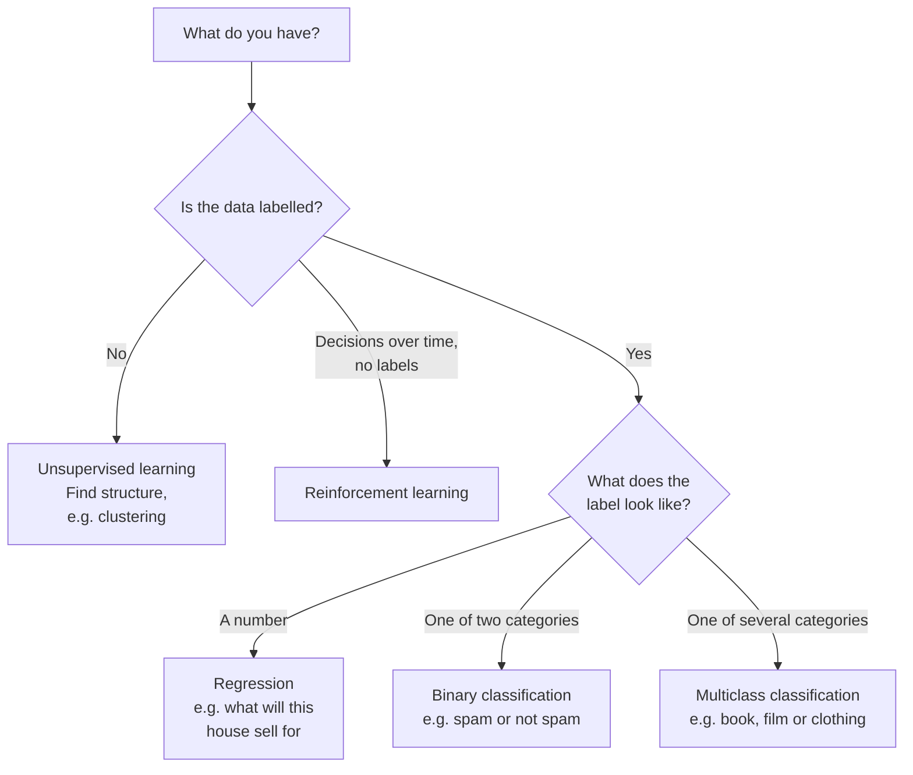
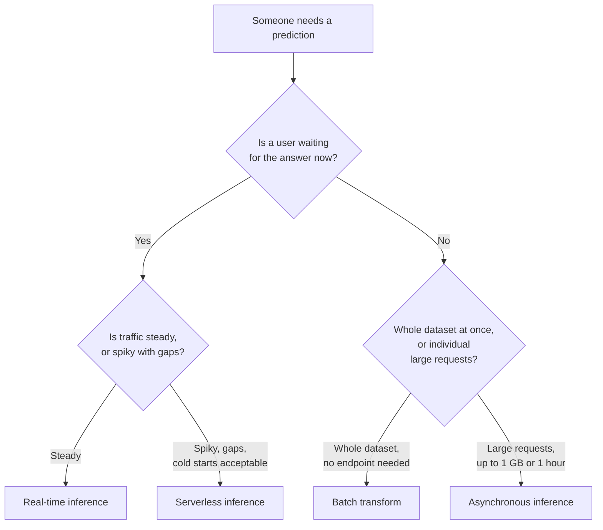
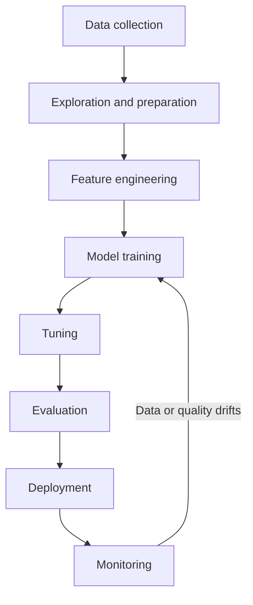

# Domain 1 — Fundamentals of AI and Machine Learning

**20% of the scored exam — around 10 of the 50 questions that count.**

This domain is where the vocabulary gets set. Most of it is straightforward, and then a handful of
questions turn on knowing exactly where one service stops and another begins. Those are the ones
worth your revision time.

---

## What this domain actually asks

Two kinds of question come out of Domain 1. Plain recall — what is a foundation model, what does
overfitting mean, which metric suits which problem. And short scenarios that name a job and ask
which service does it, where every option is a real AWS service doing something genuinely similar.

That second kind is not checking whether you recognise the name. It is checking whether you know
what the service *cannot* do. So for everything below, be able to finish two sentences: "you use it
to ___" and "you cannot use it to ___, that is ___ instead."

---

## The words you have to be exact about

**Start with the nesting.** Artificial intelligence is the broad field. Machine learning is a part
of it. Deep learning is a part of machine learning. Generative AI and agentic AI are built on top.

| Term | What it means | The separator that matters |
|---|---|---|
| **Artificial intelligence (AI)** | The broad field of getting computers to do things that need human-like judgement | The umbrella. Everything below is inside it |
| **Machine learning (ML)** | Algorithms that find patterns in data instead of following rules you wrote | You supply data and a target, not instructions |
| **Deep learning** | Machine learning using neural networks with many layers | A kind of machine learning, not an alternative to it |
| **Neural network** | Layers of connected units that transform input into output | The structure deep learning is built from |
| **Foundation model (FM)** | A large model pre-trained on broad data that can be adapted to many tasks | Pre-trained by someone else, adapted by you |
| **Large language model (LLM)** | A very large deep learning model pre-trained on vast text, built on transformer architecture | One model does many language tasks — answering, summarising, translating |
| **Generative AI** | Models that create content — text, images, audio, code | AWS scopes this to *creating* content |
| **Agentic AI** | Systems where a model plans, uses tools and acts over several steps | The model decides the steps, not you |
| **Algorithm** | The method used to learn from data | The recipe |
| **Model** | The result of running an algorithm over training data | The output of the recipe |
| **Training** | Learning patterns from data | Happens once, or occasionally |
| **Inference** | Using the trained model to get a prediction | Happens constantly, and is what you pay for per request |
| **Computer vision** | A field of AI that lets computers derive meaningful information from digital images, videos and other visual inputs | Defined by the *input* — pixels. Amazon Rekognition is the service, but the term is bigger than any service |
| **Natural language processing (NLP)** | Technology that lets computers interpret, manipulate and comprehend human language | Also defined by the input — language. Amazon Comprehend does NLP; NLP is not "Amazon Comprehend" |

Computer vision and NLP are named in the objectives as terms to *define*, and they are easy to
answer with a service name instead of a definition. The exam can ask either way round.

**Three more you need precisely, because a question tests them directly.**

**Fit** is how well a model's learned pattern matches the problem, and you read it by comparing
prediction error on the training data with prediction error on the evaluation data. Those two
numbers together are the whole diagnosis — which is why the fix follows from the pair, never from
the training number alone.

**Underfitting** is when a model performs poorly on the training data. It never found the
relationship between the inputs and the target at all.

**Overfitting** is when a model performs well on the training data but poorly on new data. It
memorised what it saw and cannot generalise.

| | Accuracy on training data | Accuracy on new data | Fix |
|---|---|---|---|
| **Underfitting** | Poor | Poor | Increase model flexibility |
| **Overfitting** | Good | Poor | Reduce model flexibility |

The signature is the *gap*. Good on training, bad on new data means overfitting. Bad on both means
underfitting. Nothing else produces that split — and in particular, "too much training data" does
not cause it.

**Bias** is a systematic error that pushes results in one direction. **Fairness** is whether the
model treats groups equitably. They are related but not the same word, and Domain 4 goes deeper.

---

## How models learn, and what they predict

**Supervised learning learns from data labelled with the actual answer.** You give it examples
where you already know the outcome, and it generalises to new cases.

**Unsupervised learning** works on unlabelled data and finds structure in it — clustering similar
records together, for example. You do not tell it what the groups are.

**Reinforcement learning** trains a model to make decisions that achieve the best result. It
differs from supervised learning in two ways worth remembering: there is no labelled dataset
prepared in advance, and the result plays out over time rather than being a single prediction.

**The data itself comes in three shapes,** and the exam names them.

| Shape | What it means | Examples |
|---|---|---|
| **Structured** | Has a standardised format or predefined schema, readable by software and people alike | Spreadsheets, SQL databases, financial records |
| **Semi-structured** | No relational or tabular model, but carries self-describing markers such as tags and nesting | JSON, XML, HTML, email |
| **Unstructured** | No set data model, not ordered in advance | Plain text documents, video, audio, images |

Cutting across that, the guide names six more data types and you should be able to place each one.
**Labelled** data has the answer attached; **unlabelled** data does not. **Tabular** data is rows
and columns. **Time-series** data is a sequence of points recorded over an interval, each carrying a
timestamp — the timestamp is what separates it from tabular data holding the same columns.
**Image** data and **text** data are the two unstructured forms the exam names directly, and they
are the inputs that define computer vision and natural language processing respectively.

Most generative AI works on unstructured data; most traditional machine learning works on structured
or tabular data.

Once you know you have labelled data, the label's *type* decides the problem:

Keep the wording straight: **classification predicts which category, regression predicts how much.**
Two categories is binary, more than two is multiclass.

---

## Getting predictions out: four ways

**Choose on two things — the shape of the traffic, and whether an endpoint should still exist
afterwards.** Amazon SageMaker AI gives you four options, and questions here are almost always
about picking between them.

| Option | Built for | Endpoint? | The detail that decides it |
|---|---|---|---|
| **Real-time inference** | Interactive requests needing low latency | Yes, always on | Lowest latency, capacity stays warm |
| **Serverless inference** | Traffic with idle gaps between bursts | Yes, but managed for you | No infrastructure to manage, costs nothing when idle, but you accept cold starts |
| **Asynchronous inference** | Large payloads and long processing | Yes, with a queue | Payloads up to 1 GB, processing up to one hour |
| **Batch transform** | Getting predictions across a whole dataset | **No** | Use it when you do not need a persistent endpoint at all |

The two pairs people mix up:

**Serverless versus real-time.** Both give an endpoint serving single requests. Real-time keeps
capacity warm for the lowest latency. Serverless removes the infrastructure work and stops charging
when idle, at the cost of cold starts. Steady traffic points to real-time; spiky traffic with quiet
gaps points to serverless.

**Asynchronous versus batch transform.** Both handle work nobody is waiting on interactively.
Asynchronous inference queues requests against an endpoint that keeps existing. Batch transform runs
a job over a dataset and needs no endpoint at all.

One extra use for batch transform worth knowing: it can also preprocess a dataset to remove noise
or bias before training, and it can pair each input record with its prediction so results are easier
to interpret.

<b>Self-check — answer before opening</b>

1. Traffic on a deployed endpoint is constant, day and night. Someone proposes moving to serverless
   to cut cost. What is your objection?
2. A team needs to score 40 million stored rows overnight and needs nothing afterwards. Which option,
   and what in that sentence decided it?
3. An 800 MB video needs processing, and the result is wanted in minutes rather than milliseconds.
   Which option, and why not batch transform?

**Answers**

1. Serverless saves money by charging nothing while idle. Constant traffic is never idle, so there is
   nothing to save — and you would add cold starts for no benefit. Steady traffic belongs on a
   provisioned real-time endpoint.
2. Batch transform. "Needs nothing afterwards" is the decider: it is the only option that leaves no
   persistent endpoint behind.
3. Asynchronous inference — it handles payloads up to 1 GB and processing up to an hour through a
   queue. Batch transform is for running across a whole stored dataset, not for one large request
   where someone is waiting on a specific answer.

---

## Which managed service does what

**This is the highest-value table in the domain.** Read the third column harder than the second —
that is where the exam lives.

| Service | Use it to | You cannot use it to | Use this instead |
|---|---|---|---|
| **Amazon Textract** | Get text off a page — typed *and* handwritten — from images and PDFs. Extracts forms and tables. Has dedicated operations for invoices and receipts, and for identity documents | Understand what the text means | Amazon Comprehend |
| **Amazon Comprehend** | Find meaning in text: entities, key phrases, personal information, language, sentiment, targeted sentiment, syntax | Read text out of an image | Amazon Textract |
| **Amazon Transcribe** | Convert speech to text, either live (streaming) or from files in Amazon S3 (batch) | Translate between languages | Amazon Translate |
| **Amazon Translate** | Convert text from one language to another | Improve transcription accuracy | Amazon Transcribe |
| **Amazon Polly** | Convert text into speech | Convert speech into text | Amazon Transcribe |
| **Amazon Lex** | Build conversational interfaces and chatbots | Improve transcription accuracy for specialist terms | Amazon Transcribe |
| **Amazon Rekognition** | Analyse images and video — computer vision with no ML expertise needed. Detects objects, and also printed *and* handwritten text | Extract forms, tables or invoice fields from documents | Amazon Textract |
| **Amazon Personalize** | Generate item recommendations and user segments from your own data | Analyse images, or find meaning in text | Amazon Rekognition, Amazon Comprehend |
| **Amazon Bedrock** | Access foundation models through one interface, to build your own application | Get a finished assistant over your company documents | An assistant service |
| **Amazon SageMaker AI** | Build, train, deploy and monitor your own models | Get managed foundation model access without infrastructure work | Amazon Bedrock |
| **Amazon SageMaker JumpStart** | Get pre-trained and open-source models, including foundation models | Search enterprise content | Amazon Kendra |
| **Amazon Kendra** | Search enterprise content and return specific answers | Provide access to foundation models | Amazon Bedrock, or SageMaker JumpStart for open-source ones |

**Textract and Comprehend is the pair to get right.** Textract reads *the document*. Comprehend reads
*the text*. If a scenario starts with a scanned invoice or a photograph, Textract has to run first,
because Comprehend's standard features take text as input.

One honest caveat: Comprehend's two custom features — custom classification and custom entity
recognition — do accept image, PDF and Word files as input. The general rule still holds for
everything else, so read the question for whether it is asking about a custom model.

**Textract and Rekognition both read text, and that catches people out.** Both detect printed and
handwritten text, so "handwriting" alone does not decide it. What decides it is *what the text is
sitting on*. Textract is for documents — a form, an invoice, an identity document — and it returns
the structure too: fields, tables, key-value pairs. Rekognition is for scenes — text on a shop sign
in a photograph, a caption burned into video — and video is the giveaway, because Textract does not
take video at all. Document goes to Textract; the world goes to Rekognition.

**Amazon Rekognition Custom Labels** is the answer when the objects are specific to one business —
its own logos, its own products, its own characters. Stock Rekognition knows general objects; custom
labels is how you teach it yours.

**Amazon Transcribe has two customisations that sound alike.**

| | What it does | Reach for it when |
|---|---|---|
| **Custom vocabulary** | Gives hints about individual words, such as how they are pronounced | A few specific names or terms are being misheard |
| **Custom language model** | Learns the *context* a word appears in and its relationship to other words | Whole-domain speech is being transcribed badly — medical, legal, scientific |

The phrase that points at a custom language model is "domain-specific speech". A custom language
model trains on up to 2 GB of your text, with an optional 200 MB more for tuning.

<b>Self-check — answer before opening</b>

1. A team wants to pull the totals out of scanned paper invoices and then work out whether the
   supplier's covering note sounds like a complaint. Which services, in which order?
2. A call centre transcribes recordings, but its cardiology terms come out as nonsense. Two options
   are offered: a custom vocabulary in Amazon Transcribe, or a custom language model in Amazon
   Transcribe. Which, and what in the stem decides it?
3. A company wants staff to ask questions of internal human resources documents. A colleague suggests Amazon
   Bedrock. What is the better fit, and why is Bedrock not wrong so much as more work?

**Answers**

1. Amazon Textract first, to get the text and the expense fields off the scanned page. Then Amazon
   Comprehend on that text for sentiment. Comprehend's standard features cannot read the image.
2. The custom language model. Whole-domain speech being mistranscribed is the signal. A custom
   vocabulary would help with a handful of named terms; cardiology is a vocabulary *and* a context.
3. An assistant service pointed at the documents. Amazon Bedrock would work but hands you a model
   and leaves you to build retrieval, permissions and citations yourself. Read for whether the
   scenario wants to build or to have.

**Amazon Q Business** is a fully managed assistant, built on Amazon Bedrock, that answers questions
and generates content from your enterprise data, with citations and respecting each user's
permissions. It is a *finished application*, not a way to reach foundation models directly.

**Amazon Quick** is an AI-powered service for automating tasks, analysing data, building web
applications and conducting research. You work it through natural-language chat, and it uses AI
agents against your connected data sources and applications. It is fully managed — no
infrastructure to provision, no models to host, no ML expertise needed — so it arrives finished.
It is where AWS now points people who want Amazon Q Business-like capability.

**Do not read "Quick" as "the new QuickSight".** Quick *evolved from* QuickSight, and QuickSight
survives inside it as **Amazon Quick Sight**, one feature among several.

| | What it is | Points at it |
|---|---|---|
| **Amazon Quick** | The whole service: chat driving AI agents across automation, analysis, app building and research | Agents taking action across connected applications |
| **Amazon Quick Sight** | One feature inside Quick: interactive dashboards, business intelligence, embedded analytics | Dashboards, reports, embedded analytics |

Existing QuickSight APIs, SDKs and integrations keep working unchanged, so a scenario that mentions
QuickSight APIs is not describing a migration. And note where the exam files it: Amazon Quick is
listed under **Analytics**, not under Machine Learning — which brings us to something you need to
know before you start checking services against the documentation.

---

## When the documentation is ahead of the exam

**A service being closed to new customers does not make it a wrong answer.** This section exists
because being diligent can cost you marks here if nobody warns you.

You should verify things against the AWS documentation — it is the only source that is definitely
current. But do that for some of the services on this exam and you will hit a notice saying the
service is no longer open to new customers. It is easy to conclude the service cannot be the
intended answer. It still is.

Two you will meet in this domain:

| Service | The notice says | Still the right answer for |
|---|---|---|
| **Amazon Q Business** | No longer open to new customers; explore Amazon Quick for similar capability | A managed assistant answering questions over enterprise data |
| **Amazon Kendra** | No longer open to new customers; explore Amazon Bedrock Knowledge Bases for similar capability | Enterprise search and intelligent information retrieval |

Read AWS's own wording carefully. For Amazon SageMaker A2I it says the service "is no longer open to
new customers. Existing customers can continue to use the service as normal." That is not
deprecation and not end-of-life. The service runs, it is documented, and AWS keeps investing in its
security and availability.

**So the rule is: learn what these services do, and do not eliminate an option because a banner says
new customers cannot sign up.** An exam guide is revised on a schedule; the service catalogue changes
continuously. When the two disagree, answer the exam.

---

## Measuring whether a model is any good

**Classification metrics and regression metrics are two separate lists.** Getting the wrong list is
a straightforward way to lose a mark.

| Metric | What it answers | Reach for it when |
|---|---|---|
| **Accuracy** | Of all predictions, how many were right? | Classes are reasonably balanced |
| **Precision** | Of the things I flagged, how many were actually right? | A false alarm is expensive |
| **Recall** | Of the things that were really there, how many did I find? | Missing one is expensive |
| **F1 score** | Precision and recall combined into one number | You need a single figure and care about both |
| **Balanced accuracy** | Accuracy after correcting for class sizes | The data is imbalanced |
| **Mean absolute error, mean squared error, root mean squared error, R2** | How far off the predicted *numbers* were | The model predicts a value, not a category |

Precision and recall are easiest to hold onto as a two-by-two:

| | Model said yes | Model said no |
|---|---|---|
| **Actually yes** | True positive | False negative — a miss |
| **Actually no** | False positive — a false alarm | True negative |

Precision is true positives out of everything the model *flagged*. Recall is true positives out of
everything that was *actually there*. Precision matters when a false positive is costly. Recall
matters when a miss is costly — screening for a disease is the standard example.

**The F1 score is the harmonic mean of precision and recall.** It exists because neither number is
trustworthy alone: label every single case positive and you get perfect recall while being useless.

Three things that catch people:

**Accuracy lies on imbalanced data.** If 1% of email is spam, a model that calls everything
not-spam scores 99% accuracy and catches nothing. Balanced accuracy corrects for this by
normalising each class first.

**The F1 score cannot judge generated text.** It is a classification metric. Evaluating text
generation needs a generation metric — Recall-Oriented Understudy for Gisting Evaluation (ROUGE) or
Bilingual Evaluation Understudy (BLEU). Domain 3 covers those.

**Area Under the Curve is no longer in this objective.** The current guide lists accuracy, precision,
recall and F1 score. Area Under the Curve is still a real metric for binary classifiers, so it can
appear as a wrong answer — just not as the expected one.

**And the exam also asks about business metrics,** which are a separate list from model metrics. A
model can score well and still fail the business. The ones named are **cost per user**, **development
costs**, **customer feedback** and **return on investment (ROI)**. If a stem asks how to demonstrate
value to the business rather than how the model performs, the answer is in this list, not the one
above.

<b>Self-check — answer before opening</b>

1. A fraud model scores 99.7% accuracy. Fraud is 0.3% of transactions. What has probably happened,
   and which metric would show it?
2. A team is asked to prove their summarisation feature works. Someone proposes the F1 score. What is
   wrong, and what should they use?
3. A medical screening model must not miss cases. Which metric do you optimise, and what is the
   danger of optimising only that one?

**Answers**

1. The model has probably learned to call everything legitimate, which scores 99.7% while catching no
   fraud. Balanced accuracy would expose it, as would recall — accuracy alone will not.
2. The F1 score is a classification metric built from precision and recall, and summarisation is text
   generation. They need a generation metric: ROUGE or BLEU.
3. Recall, because recall is about not missing actual positives. The danger is that flagging every
   case gives perfect recall and is useless, so you read it alongside precision — which is exactly
   what the F1 score does.

---

## The lifecycle, and where AWS sits in it

**Know the stages in order, and that monitoring loops back to retraining.**

**AWS groups those stages into six named phases**, and the grouping is worth knowing because it is
where AWS's own vocabulary lives:

| Phase | What sits inside it |
|---|---|
| **Business goal identification** | The problem and the business value, measured against success criteria |
| **ML problem framing** | Turning that into an ML problem: what is observed, what is predicted |
| **Data processing** | Data collection, data preprocessing, feature engineering |
| **Model development** | Model building, training, tuning, evaluation |
| **Model deployment** | Inference and prediction, after the model is trained, tuned, evaluated and validated |
| **Model monitoring** | Verifying the model holds its performance, through early detection and mitigation |

Two things follow from this that the exam can test. The first is that **the pipeline is a cycle, not
a line.** AWS says outright that the phases are "not necessarily sequential" and have feedback loops
running back across them. Retraining is not a tenth stage bolted after monitoring — it is the loop
returning you to data processing and model development. The second is that **the first two phases
are not technical.** A scenario where a team cannot say what business outcome they are measuring has
not failed at modelling; it has skipped business goal identification.

**Monitoring detects; it does not correct.** Keep those apart. Monitoring is what turns a silent
decline into a signal — early detection and mitigation. What answers the decline is retraining on
refreshed data. A question asking which practice would have *caught* a problem and one asking which
would have *fixed* it have different answers, and a question asking for both wants one of each.

Two stages get confused because both add variables to the training data. **Data collection** gathers
and labels raw data from sources. **Feature engineering** selects and transforms the variables you
already have — creating, transforming, extracting and selecting features. Both can increase the
number of variables; only one of them goes and finds new data.

**Parameters versus hyperparameters** is worth separating. Parameters are the values the model
*learns* during training — the weights. Hyperparameters are the settings *you* choose before
training, such as learning rate or number of layers. Tuning means adjusting hyperparameters; it never
means editing parameters by hand.

**Where the services fit.** Amazon SageMaker AI covers the whole pipeline for models you build
yourself. Amazon Bedrock is where you go when you want a pre-trained foundation model instead of
training one. SageMaker JumpStart sits between them, giving you pre-trained and open-source models
to start from — which is also where foundation models come from if the requirement says open source.

**Inside SageMaker AI, the features line up with the phases.** This is the mapping objective 1.3.4
asks for, and it is worth knowing by phase rather than as an alphabetical list:

| Phase | The SageMaker AI feature |
|---|---|
| Data processing | **Ground Truth** builds labelled datasets using human workers alongside ML; **Data Wrangler** imports, analyses, prepares and featurizes — preprocessing and feature engineering |
| — | **Feature Store** keeps features for reuse: its Online Store serves low-latency real-time inference, its Offline Store serves training and batch inference |
| Model development | **Autopilot** builds classification and regression models without ML knowledge; **JumpStart** supplies pre-trained models to fine-tune |
| Deployment | **Model Registry** versions models and carries the approval workflow; **Serverless Endpoints** and **Batch Transform** serve them |
| Monitoring | **Model Monitor** watches models on endpoints for data drift and deviations in model quality |

**Model Building Pipelines** sits across all of it rather than in any one phase — it is the
repeatable-process half of MLOps.

Three more the objective names, all easy to miss because none is about building models:

- **Amazon Q Developer** is a generative-AI conversational assistant for understanding, building,
  extending and operating AWS applications. In an integrated development environment it chats about
  code, completes code inline, generates new code, scans for security vulnerabilities and performs
  upgrades. It is built on Amazon Bedrock. Do not confuse it with **Amazon Q Business**, the
  enterprise-data assistant above — the in-scope list files Amazon Q under *Developer Tools*.
- **Kiro** is an AI-powered development environment for building software from prototype to
  production, running one unified agent harness across its editor, command line, web and mobile
  surfaces. It sits under *Developer Tools* beside Amazon Q, and it is a place you build software,
  not a place you build or serve models.
- **AWS Transform** accelerates transformation of infrastructure, applications and code with an
  agentic AI experience: mainframe modernisation, and VMware and bare-metal server migration to
  Amazon EC2, with no additional charge. **It is listed under Machine Learning in the
  in-scope services, and it is not a machine learning service** — it is agentic AI pointed at
  migration work. That mismatch between the heading and the job is exactly the kind of thing a
  distractor is built from. Read what a service does, not the category it is filed under.

**Two ways to put a model into production.** A **managed application programming interface (API) service** means someone else runs the
model and you call it — Amazon Bedrock is the example, a fully managed service giving access to
foundation models from several providers. A **self-hosted API** means you deploy the model onto an
endpoint you own and operate, which is what a SageMaker AI endpoint is. Managed costs less effort
and gives less control; self-hosted is the reverse. Scenarios mentioning no machine learning
expertise or least operational overhead are pointing at managed.

**Machine learning operations (MLOps)** is the discipline of making all this repeatable rather than
a one-off: a set of practices that automate and simplify machine learning workflows and
deployments. The concepts named are experimentation, repeatable processes, scalable systems,
managing technical debt, achieving production readiness, model monitoring and model re-training.
Two are worth a second look because they are the least obvious. **Technical debt** here is what
accumulates when a workload runs on institutional knowledge rather than written-down process, so
nobody but its author can operate it. **Production readiness** is whether a model has actually been
integrated into production and can be supported there, which is a different question from whether
it scores well. Monitoring closes the loop: live data drifts away from what the model trained on,
and that drift is the trigger to re-train. The exam asks about all of this descriptively; you need
the concepts, not an implementation.

---

## When AI is the wrong answer

**First, where it is the right answer.** Machine learning earns its place when it assists human
decision making at a scale people cannot match, when a solution has to scale beyond manual effort,
or when a repetitive judgement is a candidate for automation. Those three — assisting human
decision making, solution scalability and automation — are the value cases the guide names. The named real-world applications are computer
vision, natural language processing, speech recognition, recommendation systems, fraud detection,
forecasting, knowledge bases and agentic AI. Recognising those as AI use cases is itself examinable.

**Now the other direction. Where a specific outcome is needed instead of a prediction, machine
learning is the wrong tool.** A model gives a likely answer with some error rate. Application
workloads run on deterministic, step-by-step instructions; machine learning lets an algorithm learn
from data instead. Where a rule must hold every time — a tax calculation, a compliance threshold —
the deterministic instruction already answers the requirement, so write the rule. The second
reason to say no is a cost-benefit one: training, hosting and maintaining a model is real ongoing
work, and if the problem is small or the manual process is cheap, the model loses.

**And sometimes the right answer is a traditional model rather than a generative one.** The current
guide added an objective specifically about this. Reach for traditional machine learning when you
need to explain *why* a decision was made, when regulation demands auditability, or when operational
limits rule out a large model. AWS files fraud detection, risk scoring, recommendations, predictive
maintenance, demand forecasting, churn prediction, anomaly detection and medical diagnosis under
traditional machine learning — and reserves generative AI for *creating content*.

The whole exam is about generative AI, which makes "pick the generative option" a tempting reflex.
Read for the constraint first.

---

## Traps worth carrying into the exam

Each of these is a portable rule. The wording will change; the trap will not.

- **A scanned document needs Textract before Comprehend.** Comprehend's standard features take text,
  not images. The exception is Comprehend's two custom features.
- **"Domain-specific speech" means custom language model,** not custom vocabulary. Vocabulary gives
  hints about words; a language model learns context.
- **Translate never touches audio.** If accuracy of transcription is the problem, the answer is in
  Amazon Transcribe.
- **Ask whether an endpoint should exist afterwards.** No endpoint needed means batch transform.
  Endpoint with a queue means asynchronous inference.
- **Serverless is not automatically cheapest.** It wins on spiky traffic with idle gaps. Steady heavy
  traffic is usually cheaper on a provisioned endpoint.
- **High accuracy is not a good model** if the classes are imbalanced. Look for balanced accuracy,
  or precision and recall.
- **Never maximise recall alone.** Flagging everything gives perfect recall and no value. That is
  what the F1 score is for.
- **The F1 score cannot evaluate generated text.** That needs ROUGE or BLEU.
- **Area Under the Curve is a distractor now,** not the expected metric. The list is accuracy,
  precision, recall, F1 score.
- **Amazon Q Business is an assistant, not model access.** Foundation models come from Amazon
  Bedrock; open-source pre-trained models come from SageMaker JumpStart.
- **Good on training, bad on new data is overfitting.** Bad on both is underfitting. Too much
  training data is neither.
- **A foundation model is not always right.** Explainability, regulation or operational limits can
  make a traditional model the correct answer.

---

## 🎯 Test Your Knowledge

Finished this domain? Put your knowledge into practice with the DataCertLab AIF-C01 Practice Tests.

👉 [Practice on Udemy]({{https://www.udemy.com/course/draft/7307777/?referralCode=9F455BD5CACE13156124}})

Learn → Practice → Review → Improve

---

*Sources: the official AWS Certified AI Practitioner exam guide (version 1.1) and current AWS
service documentation, retrieved 12 August 2026.*
