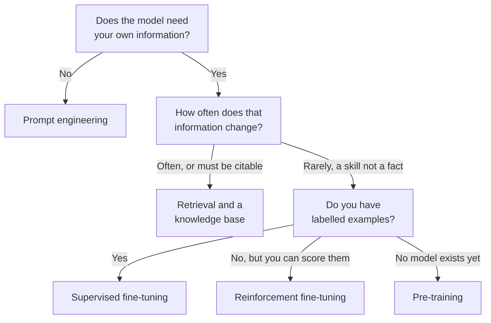
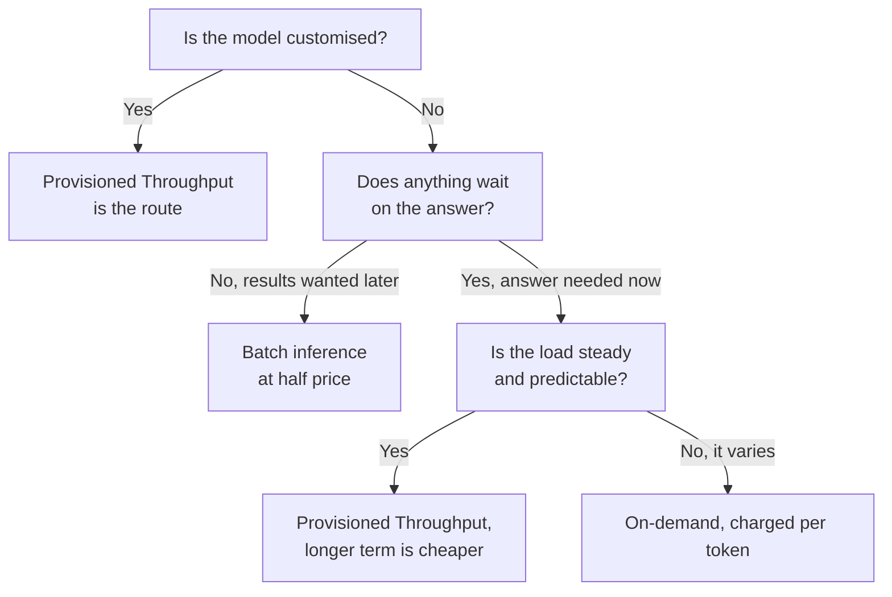

# Domain 2 — Fundamentals of Generative AI
---

*This is updated as per the official AWS exam guide (version 1.1, 30 April 2026)*

---

This domain is 24 percent of the scored exam, second only to Domain 3. It is mostly
vocabulary and service boundaries, and the boundaries are where the marks are.

These notes are ordered by the decision you have to make, not by the order the objectives
are published in. Vocabulary first, then what the technology is actually for, then how to
make it use your own information, and only then which service to reach for — because the
service question cannot be answered until the first three are settled.

---

## What this domain actually asks

Very little of this domain rewards knowing what a service *is*. Almost all of it rewards
knowing what a service *is not*, and which neighbouring service does that instead.

Three habits carry most of the marks:

- When two options are both real AWS offerings, ask which job the scenario is short of.
  Reaching a model, running an agent, writing software and answering business questions are
  four different jobs with four different answers.
- When a scenario mentions your own data, ask how often that data changes. The answer
  decides the technique before any service is named.
- When a scenario mentions money, ask what is being charged for: a request, an hour of
  reserved capacity, or a training run. Three different meters, three different answers.

---

## The words you have to be exact about

These terms turn up in one sentence of nearly every retrieval description, and the exam
separates them deliberately.

A **foundation model** is a large generative model trained on a broad spread of text and
image data, able to do a wide variety of general tasks — answering questions, writing
essays, captioning images — without being built for any one of them.

Three model families sit underneath. A **transformer** is the architecture beneath large
language models: it turns an input sequence into an output sequence, and its self-attention
mechanism weighs the whole sequence at once instead of stepping through it. A **multimodal**
model accepts more than one kind of input — text, image, video — though it may still return
text alone, so input and output modalities are listed separately. A **diffusion** model
generates images by adding noise until only noise is left, then reversing that process under
the direction of a text prompt.

**Amazon Nova** is where that separation stops being abstract. Nova Premier, Pro and Lite are
multimodal — they take text, image and video and return text. Nova Micro is text-only. So "we
need to process screenshots" rules Micro out, and "multimodal" never on its own tells you the
model can *produce* images. It is the same model family with the same name, differing on exactly
the axis the definition warns you about.

**Tokenization** breaks text into tokens, which may be whole words, parts of words, or
single characters. This matters commercially as well as technically: a long or unusual word
becomes several tokens, so a token count never matches a word count, and the bill is counted
in tokens.

**Chunking** breaks a large file into small, discrete pieces so that the material fits
inside the model's **context window** — the amount of input the model can consider at once.
Chunking exists to make things fit. Any saving is a side effect.

An **embedding** transforms a chunk into a vector that represents its semantic meaning. A
**vector store** is the specialised store those vectors live in, built for fast retrieval of
high-dimensional vectors. **Indexing** is the act of inserting embedded chunks into that
store. Three different things: a transformation, a place, and a filing step.

**Prompt engineering** is the practice of carefully crafting prompts so the model produces
the output you want. It changes neither the model nor the data behind it.

**Zero-shot** describes a model performing a task on examples it has never seen, with no
task-specific training data at all. Put worked examples into the prompt instead and you have
**in-context learning** — the name matters because it tells you where the learning lives. The
examples sit in the context window and are gone when the request ends; nothing is written back to
the model. That is why in-context learning is not training, however much it looks like teaching, and
Domain 3 builds the whole zero-shot / single-shot / few-shot spectrum on top of it.

| Term | What it is | Confused with | The separator |
|---|---|---|---|
| Token | A unit of text: word, part-word or character | A word | One word can be several tokens, and tokens are what you pay for |
| Chunking | Splitting files so they fit the context window | Embedding | Chunking makes pieces; embedding converts them |
| Embedding | Turning a chunk into a meaning-carrying vector | Vector store | A step, not a place |
| Vector store | Where those vectors are kept for retrieval | Embedding | A place, not a step |
| Indexing | Inserting embedded chunks into the store | Embedding | Embed and never index, and nothing is findable |

<b>Self-check — the vocabulary</b>

1. A summarisation feature costs more than a word count of its inputs suggests. Why?
2. You have embedded every document and search still returns nothing. What step is missing?
3. Which of these is a place rather than an action: chunking, embedding, indexing, a vector store?
4. A model accepts text and images but answers only in text. What is it, and what does that tell you?

*Answers: 1. Billing is per token, and long or unusual words become several tokens each.
2. Indexing — the vectors exist but were never inserted into the store. 3. The vector store.
4. Multimodal — and that input modalities and output modalities are stated separately, so
multimodal input does not imply multimodal output.*

---

## What generative AI is for, and where it lets you down

Generative AI creates new content and ideas — conversations, stories, images, video, music.
That is the dividing line against everything that retrieves, searches or classifies what
already exists.

The published use cases are worth knowing as a list, because a question will name one:
image, video and audio generation; summarization; AI assistants; translation; code
generation; customer service agents; search; and recommendation engines.

Read that list as a test rather than a catalogue. Each entry produces something that did not
exist before: a summary written from a long thread, a translated passage, working code, a
reply drafted for a customer. When a scenario asks for material to be found, filed, ranked
or counted, it is describing retrieval or classification, and the generative answer is the
wrong family however much the question mentions AI.

The advantages and the disadvantages are two short lists, and this is the single most
reliable trap in the domain: three of the four things people instinctively call advantages
are on the *other* list.

| Advantages | Disadvantages |
|---|---|
| Adaptability — one model covers many tasks | Hallucinations — output unrelated to, or unsupported by, the prompt |
| Responsiveness — answers arrive conversationally | Inaccuracy — being fluent is not being right |
| Conversational capability | Interpretability — the reasoning is hard to explain |
| The ability to generate content | Nondeterminism — the same prompt need not give the same wording twice |

Two of those deserve expanding, because the exam tests the definition rather than the word.

A **hallucination** is output that is inconsistent, factually incorrect, *or unrelated to
the input prompt*. That last clause is the part people miss. A fluent, accurate answer to a
question nobody asked is still a hallucination.

**Interpretability** is whether the reasoning behind an output can be understood and
explained. It is not accuracy. A model can be right and inexplicable, or explainable and
wrong, and regulated scenarios usually care about the second property rather than the first.

---

## Making the model answer from your data

This is the heart of the domain. There are four ways to make a model work with your
information, and they differ in cost, in effort, and — decisively — in how current the
answers stay.

**Prompt engineering** puts the information in the instruction. Cheapest, immediate, limited
by the context window.

**Context engineering** is the wider discipline the four sit inside: designing a system that
assembles, for each request, the best set of information for the model to work from. Prompt
engineering decides what to ask; context engineering decides what to *show*, treating the
context window as a workspace rather than a fixed field. What gets assembled into it is a
list worth knowing — the system prompt, the user query, a user profile, memory, tool
definitions and MCP servers, and knowledge bases. Retrieval is one component of context
engineering, not a synonym for it.

**Retrieval** fetches relevant material when the question is asked and augments the prompt
with it. This is retrieval-augmented generation (RAG). It changes nothing about the model,
which is exactly why it can answer from data that changed a minute ago. A **knowledge base**
is the managed form: when a query arrives it searches your data and the retrieved
information improves the generated response. It can also return citations, so a reader can
check the answer against its source.

**Fine-tuning** trains the model further on your material, adjusting its parameters.
Supervised fine-tuning uses labelled examples that pair an input with the output you want.
Reinforcement fine-tuning replaces those labels with reward functions that score responses,
and the model learns from the scores. Distillation is a third form: it transfers knowledge
from a large teacher model into a smaller, faster, cheaper student.

**Pre-training** builds a foundation model from scratch and is measured in weeks of cluster time. Continued pre-training keeps updating an already-trained model
as a domain evolves.

A knowledge base comes in two forms, and the difference is who runs it. With the managed
form, AWS handles ingestion, indexing, storage and retrieval, and you connect your sources.
With the customer-managed form you build and operate the pipeline yourself, including the
vector store, which buys control at the price of the infrastructure work. A scenario that
says a team has no platform engineers has already chosen between them.

Citations deserve their own line. A knowledge base can return the source alongside the
answer, so a reader can check it. Fine-tuning cannot do this: once material is folded into
the parameters there is nothing left to point at. Whenever a scenario demands that answers
be traceable, auditable or checkable, fine-tuning is eliminated before you compare anything
else.

The foundation model lifecycle runs in a fixed order: data selection, model selection,
pre-training, fine-tuning, evaluation, deployment, feedback. Each stage consumes what the
previous one produced, and evaluation always precedes deployment. The order matters in
questions that ask which stage comes first or which produced the base model: data selection
comes before any model exists, and pre-training is what builds it.

The ladder is also a cost ladder. Prompt engineering costs a few extra tokens. Retrieval
costs a pipeline and some tokens per query. Fine-tuning costs a training run and, afterwards,
reserved capacity to serve the result. Pre-training costs weeks of cluster time. Reach for
the cheapest rung that meets the requirement, and let the requirement — not the technology —
push you up it.

Read it downwards. The first question is whether your own information is needed at all; the
second — how often it changes — decides everything below it.

<b>Self-check — making a model use your data</b>

1. A product catalogue changes daily and the assistant must reflect it. Retrieval or fine-tuning?
2. Every answer must be checkable against a source document. What does that rule out?
3. You want the model to adopt a house style, and you have 500 before-and-after examples. Which technique?

*Answers: 1. Retrieval — fine-tuning would mean retraining daily. 2. Fine-tuning, which folds
the material into the parameters and leaves nothing to cite. 3. Supervised fine-tuning; the
labelled pairs are exactly what it needs.*

---

## The services, and the job each one does

Six offerings are named for this domain. The exam tests the boundaries between them far more
than it tests what any one of them does.

**Amazon Bedrock** is a fully managed service giving secure access to more than a hundred
foundation models from providers including Amazon, Anthropic, DeepSeek, Moonshot AI, MiniMax
and OpenAI. You call a model; you run nothing.

**Amazon SageMaker JumpStart** provides pretrained, open-source models that you can train
and tune further before deploying them yourself. Real control, paid for in operational work.

**Amazon Bedrock AgentCore** is a platform for building, deploying and operating agents at
scale, using any framework and any foundation model, with no infrastructure to manage. Its
runtime is serverless and isolates sessions.

**Strands Agents** is an open-source software development kit (SDK) released by AWS for
building autonomous agents. It is a library you write against, not a service AWS runs for
you — and AgentCore explicitly works with it.

**Kiro** is an AI-powered development environment for building software from prototype to
production, running one agent harness across its editor, command line, web and mobile
surfaces.

**Amazon Quick** is an AI-powered service for automating tasks, analysing data, building web
applications and conducting research, driven through natural language chat. It is fully managed —
no infrastructure to provision, no models to host, no ML expertise required — so it arrives
finished. Business intelligence lives inside it as **Amazon Quick Sight**, the feature that used
to be Amazon QuickSight, rather than being the whole of it.

| Service | Its job | The job it does not do | Which one does that |
|---|---|---|---|
| Amazon Bedrock | Managed access to foundation models | Running agents you have written | AgentCore |
| SageMaker JumpStart | Open models you tune and deploy yourself | Managed model access with nothing to run | Amazon Bedrock |
| AgentCore | Deploying, running and monitoring agents | Being the library you write the agent in | Strands Agents |
| Strands Agents | An open-source library for writing agents | Operating agents in production | AgentCore |
| Kiro | A development environment for building software | Running the agents that software becomes | AgentCore |
| Amazon Quick | Answering business questions and acting on them | Giving you a model to build on | Amazon Bedrock |

The advantages of using these services rather than assembling your own are worth naming as
the guide names them: accessibility, a lower barrier to entry, efficiency,
cost-effectiveness, speed to market, and the ability to meet business objectives. When a scenario
says a team has no specialists and a deadline, it is pointing at that list.

<b>Self-check — the services</b>

1. A team wants to write its own agent in Python and keep the code. Which offering?
2. A team has agents in three different frameworks and wants them run and monitored centrally.
3. Which of these is not a way to reach a foundation model: Bedrock, JumpStart, Amazon Quick?

*Answers: 1. Strands Agents, an open-source library. 2. AgentCore, which works with any
framework. 3. Amazon Quick — it is a finished product, not model access.*

---

## Agents, and when you actually need one

An **agent** is a system that performs tasks autonomously and interacts with its environment
to reach a goal. Autonomy is the test. If the steps are decided in advance, it is a prompt
with extra parts.

The agentic concepts in scope are multi-agent patterns, the Model Context Protocol (MCP) and
its role in connecting agents to external systems, communication between agents, memory
management, tool usage, and workflow orchestration.

Strands Agents supplies built-in coordination patterns — Swarm, Graph and Workflow — for
work split across several agents, and natively supports the Model Context Protocol, which
provides standardised context to large language models.

AgentCore supplies the operational half:

| Capability | What it provides | Confused with |
|---|---|---|
| Runtime | Serverless hosting for agents, with isolated sessions | Memory — one hosts, the other recalls |
| Memory | Short-term recall in a conversation, long-term across sessions | Gateway — recall versus reach |
| Gateway | Turns your interfaces and functions into tools an agent can call | Memory — reach versus recall |
| The platform itself | Building, running and monitoring agents on any framework | Strands Agents — operating versus writing |

The distinction the exam leans on hardest is memory against gateway. If the agent forgets
what was said earlier, that is memory. If the agent cannot reach a system it needs to query,
that is a gateway turning that system into a tool.

The coordination patterns are worth separating too. A swarm lets several agents work the
same problem in parallel. A graph routes work along defined connections between them. A
workflow runs them through an ordered sequence. All three are orchestration — deciding which
agent acts, and when — and orchestration is the word the objectives use.

The harder judgement is whether an agent is warranted at all. Bigger models, longer context
windows and more training data all describe a *model*. Deciding a next step, remembering
across turns and calling a tool describe an *agent*. If a task can be finished by one
well-crafted prompt or a single call, adding planning, memory and tools buys complexity and
nothing else. A question that describes a single, well-specified transformation is usually
testing whether you will over-build.

---

## What it costs, and what moves the bill

Three separate meters run in this domain, and questions turn on knowing which one a scenario
is describing.

**On-demand inference** charges per token, priced per million input tokens and per million
output tokens, with no commitment. Both directions are charged, so a long retrieved context
costs money before the model writes anything.

**Batch inference** is priced fifty percent below on-demand for selected models. You trade
immediacy, not quality: the answers arrive when the job runs.

**Provisioned Throughput** reserves capacity at a fixed hourly cost. It is bought in model
units, where one model unit delivers a set number of input and output tokens per minute. The
hourly price depends on the model, the number of model units, and the commitment term — and
the longer the commitment, the more discounted the hourly rate. What a longer term costs you
is flexibility, since it cannot be cancelled before the term ends.

**A customised model is served with Provisioned Throughput** — that is the rule the
Provisioned Throughput documentation states, and the answer to expect. One exception exists
and it is narrow: a custom model deployment gives on-demand inference, but only in two
Regions and only for a short list of base models. Unless a question puts you inside that
exception, Provisioned Throughput is the answer.

Token-based pricing is not the only axis cost trades against. The guide also names
responsiveness, availability, redundancy, performance and regional coverage. Cross-Region
inference is where several of those meet: it spreads requests across Regions, which buys
availability and the redundancy to absorb an unplanned burst. A geographic profile keeps
processing inside one geography at standard pricing; a global profile may route anywhere for
roughly ten percent less. Routing adds nothing to the bill, but inference profiles do not
support Provisioned Throughput — so guaranteed capacity and the widest regional coverage are
alternatives, not a pair.

Training has its own meter. Customisation is charged on the tokens processed — the tokens in
the training corpus multiplied by the number of passes over it, each pass being an epoch —
plus a monthly storage charge per model. So there are exactly two ways to lower training
cost: fewer tokens, or fewer epochs.

To make a deployed model cheaper to run, distillation produces a smaller student model that
mimics a larger teacher, while quantization reduces the numeric precision of the parameters
and shrinks the model you already have. One replaces the model; the other compresses it.

| Mode | Charged by | Best for |
|---|---|---|
| On-demand | Per token, input and output | Unpredictable traffic, no commitment wanted |
| Batch | Per token at half price | Work where nothing waits on the answer |
| Provisioned Throughput | Per hour, per model unit | Steady load, and serving a customised model |

The first branch is the one people skip. Settle whether the model is customised before
comparing any prices, because that answer removes most of the options.

<b>Self-check — the money</b>

1. A month of tickets is scored overnight, results wanted by morning. Which pricing mode?
2. You have fine-tuned a model and need it served with guaranteed capacity. What must you buy?
3. Name the only two terms in the training cost calculation, where training is charged per token.

*Answers: 1. Batch — nothing waits, so immediacy is a cost with no benefit. 2. Provisioned
Throughput; the on-demand custom model deployment exists but reserves nothing. 3. Tokens in
the training corpus, and number of epochs.*

---

## Choosing a model, and proving it paid

The factors for choosing between models are published: model types, performance
requirements, capabilities, constraints, compliance, cost, latency, and model complexity.
When a scenario names a response budget and a spending cap, it has just told you which
factors to weigh.

Proving the application was worth building is a separate question with a separate
vocabulary. Business value is reported through cross-domain performance, return on
investment, efficiency, conversion rate, average revenue per user, accuracy, and customer
lifetime value. A director asking what the assistant was worth is not asking for a model
score.

The distinction is who the number answers to. Accuracy, hallucination rate and token
throughput answer to the team that built the system: they describe how well it works.
Return on investment, conversion rate, average revenue per user and customer lifetime value
answer to the person paying for it: they describe whether it was worth working. Cross-domain
performance sits between the two, describing how well one model holds up across tasks it was
not tuned for, which is what makes a single model cheaper than several.

Watch for scenarios that state their own criteria. When a stem names a response-time budget
and a monthly spend limit, it has listed the constraints; the answer is the option that
weighs those, not the one that offers the most capable model.

| Factor | What it decides | Where it shows up |
|---|---|---|
| Cost and latency | Which model, and which pricing mode | Return on investment, efficiency |
| Constraints and compliance | Whether a model is usable at all | Risk and audit sign-off |
| Interpretability | Whether a decision can be explained | Regulated approvals |
| Model complexity | Whether distillation or quantization is worth it | Running cost |

---

## What the platform gives you

Beyond the models, the infrastructure contributes four things the guide names: security,
compliance, responsibility and safety. Safety is where that becomes configurable.

The guardrail service provides safeguards that work across foundation models, detecting and
filtering unwanted content and protecting sensitive information in both user input and model
responses. It can be applied during an inference call, or invoked on its own so that text
which never reaches a model is still screened.

| Safeguard | What it catches | The failure it is for |
|---|---|---|
| Content filters | Harmful categories in prompts or responses | Toxic input or output |
| Denied topics | Subjects you have ruled out | Off-limits advice |
| Word filters | Exact words and phrases you specify | Profanity, competitor names |
| Sensitive information filters | Personal details, blocked or masked | Privacy leaks |
| Contextual grounding checks | Answers not supported by the source | Hallucination in retrieval |
| Automated reasoning checks | Claims that break stated logical rules | Unstated assumptions |

Contextual grounding is the one to remember alongside retrieval: grounding an answer in
retrieved documents *reduces* hallucination, it does not remove it, and this check is what
catches the remainder.

---

## Traps worth carrying into the exam

- A token is not a word. Long or unusual words become several, and tokens are the billing unit.
- Chunking exists to fit the context window, not to save money.
- Embedding, indexing and the vector store are a step, a step and a place. Skip indexing and
  nothing is retrievable.
- Retrieval does not retrain. It is the answer whenever the information changes often or the
  answer must carry a citation.
- Accuracy is not an advantage of generative AI. Inaccuracy is a listed disadvantage.
- A hallucination includes an answer that is simply unrelated to the question, however correct.
- Interpretability is not accuracy.
- An open-source library is not a managed service. Strands Agents is written with; AgentCore
  runs what you wrote.
- Memory is what an agent recalls. A gateway is what it can reach.
- A customised model is served with Provisioned Throughput, unless it qualifies for the
  narrow on-demand custom model deployment.
- Context engineering is not prompt engineering. One decides what to ask, the other what to show.
- Longer commitments are cheaper per hour, not dearer. What they cost is flexibility.
- Batch is half price because it waits, not because it is worse.
- Business value is reported in business measures. A model score answers a different question.

---

## 🎯 Test Your Knowledge

Finished this domain? Put your knowledge into practice with the DataCertLab AIF-C01 Practice Tests.

👉 [Practice on Udemy](https://www.udemy.com/course/dcl-aws-certified-ai-practitioner-aif-c01-practice-tests/?referralCode=9F455BD5CACE13156124)
> 💡 **Tip:** Open the link in a new tab to keep these notes open for reference.

Learn → Practice → Review → Improve
