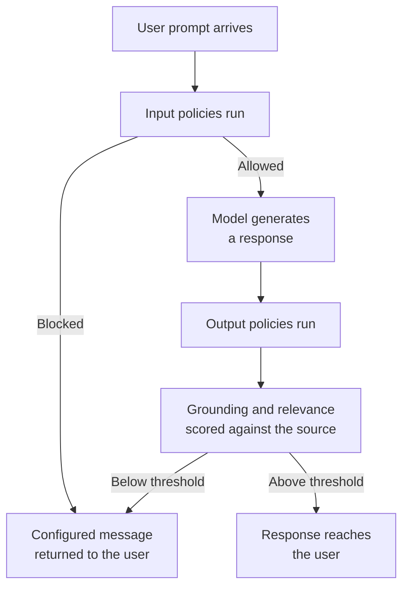
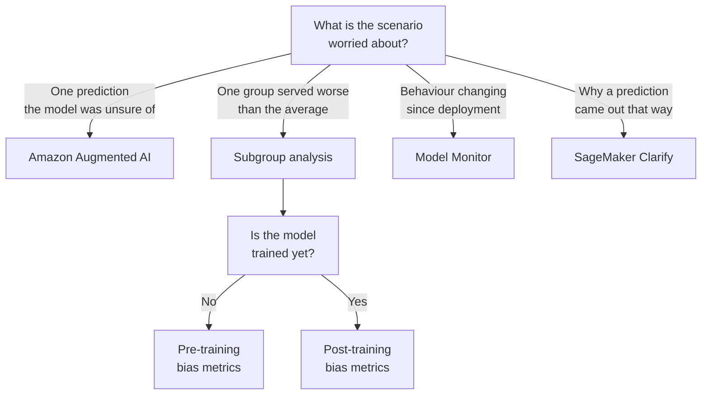

# Domain 4 — Guidelines for Responsible AI

This domain is 14 percent of the scored exam. It is the lightest block by weight and the
heaviest by vocabulary: most questions here are decided by which of two similar-sounding
words the stem happened to use.

These notes are ordered by the decision you actually face, not by the order the objectives
are published in. What am I answerable for, which model do I pick, what can go wrong
legally, is my data right, is my model right, what controls do I put at runtime, how do I
catch what got past them — and only then, what do I disclose and to whom.

---

## What this domain actually asks

Almost nothing here is a mechanism question. The mechanisms are simple. The difficulty is
that the domain runs on pairs of terms that sound interchangeable and are not: transparency
and explainability, word filters and denied topics, a model card and a service card,
grounded and relevant, bias in the fairness sense and bias in the statistical sense.

Three habits carry most of the marks:

- **Read for the noun, not the vibe.** A stem that asks about documenting a model and one
  that asks about explaining a prediction are asking about different artifacts, even though
  both sound like "make the model understandable".
- **Ask what unit the scenario is about.** One prediction, one group of users, or a trend
  over months. That single question separates almost every tool in this domain from every
  other tool in it.
- **Match the source of the wording.** Some options come from the exam guide's own example
  lists and some from AWS's published dimensions. Where the two disagree, the question's
  phrasing tells you which one it is testing.

One warning that applies to the whole domain: several services named here now carry an AWS
notice that they are closed to new customers. That is worth knowing and it never changes
the answer. More on that in the detection section.

---

## The two lists you have to keep straight

There are two lists of responsible-AI terms and candidates merge them constantly.

The **exam guide** names six example features: bias, fairness, inclusivity, robustness,
safety and veracity. **AWS separately publishes eight core dimensions**, which are fairness,
explainability, privacy and security, safety, controllability, veracity and robustness,
governance, and transparency.

They are not the same list. Inclusivity is on the guide's list and is not one of AWS's eight
dimensions. AWS treats veracity and robustness as a single paired dimension where the guide
splits them into two. And three dimensions — explainability, governance and transparency —
appear only on AWS's list, because the guide handles them in its second task statement.

| Term | Where it appears | What it covers |
|---|---|---|
| Fairness | Both | Considering impacts on different groups of stakeholders |
| Safety | Both | Preventing harmful system output and misuse |
| Veracity and robustness | AWS pairs them; the guide splits them | Correct outputs even with unexpected or adversarial inputs |
| Inclusivity | Guide only | Whether the populations the system serves are represented at all |
| Explainability | AWS only | Understanding and evaluating system outputs |
| Transparency | AWS only | Letting stakeholders make informed choices about engaging with the system |
| Privacy and security | AWS only | Appropriately obtaining, using and protecting data and models |
| Controllability | AWS only | Having mechanisms to monitor and steer system behaviour |
| Governance | AWS only | Best practices across the supply chain, including providers and deployers |

Two separations inside these lists earn marks. **Fairness against inclusivity**: fairness is
about outcomes once the system runs, inclusivity is about whether a group was represented
before it ran. A system can treat everyone it sees even-handedly and never have seen a
group. **Safety against veracity**: a model giving dangerous instructions has failed on
safety, a model confidently inventing a fact has failed on veracity.

> **Trap.** Responsible AI is not "stop the model saying harmful things". That is one
> dimension, safety. Questions about who was told what are transparency, and questions about
> accountability across providers and deployers are governance.

<b>Self-check — the two lists</b>

1. Which term is on the exam guide's list of six but not among AWS's eight dimensions?
2. Which two of the guide's six does AWS combine into one dimension?
3. A model performs equally well for every group in its training data, but one community was
   never included in that data. Which feature has failed?
4. Which dimension covers best practices across providers and deployers rather than inside
   your own system?

*Answers: 1. Inclusivity. 2. Veracity and robustness. 3. Inclusivity — fairness is about
outcomes across the groups the system sees. 4. Governance.*

---

## Choosing a model responsibly

The guide frames responsible model selection around **environmental considerations** and
**sustainability**. Sustainability is one of the six pillars of the AWS Well-Architected
Framework, and within it the pillar focuses specifically on environmental sustainability,
aiming to maximise efficiency and reduce waste.

For model choice this reads as: the smallest model that still meets the requirement. Not the
smallest model. A smaller model that fails the task is not a sustainable answer, it is a
failed one.

The documented mechanism for getting one is **model distillation** — transferring knowledge
from a larger, more intelligent *teacher* model into a smaller, faster, cost-efficient
*student* model, whose performance improves for one specific use case. Amazon Bedrock
generates synthetic responses from the teacher and uses them to fine-tune the student.

> **Trap.** Distillation is cheaper to run and not cheaper to build. When Amazon Bedrock
> applies its data synthesis techniques, it calls the teacher model to generate the training
> responses, and those calls are billed at the teacher's on-demand rates. Reusing teacher
> responses already sitting in your invocation logs is the option that avoids that cost.

---

## The legal risks, and telling them apart

The guide names five: **intellectual property infringement** claims, **biased model
outputs**, **loss of customer trust**, **end user risk**, and **hallucinations**. One
incident can raise several at once, so the question's own wording decides which is being
asked about.

| Risk | What it is | The phrase that points at it |
|---|---|---|
| Intellectual property infringement | Generated output or training material infringing protected work | Copyright, licensing, someone else's material |
| Biased model outputs | Systematically different treatment across groups | Demographic, discriminatory, one group worse |
| Loss of customer trust | Users disengaging after visible failures | Reputation, churn, complaints, public incident |
| End user risk | Someone relying on an output and being harmed | Acted on the advice, downstream consequence |
| Hallucinations | Content that is factually inaccurate or unsupported by the source | Fabricated, invented, confidently wrong |

AWS's own operational definition of a hallucination is useful here, because it is narrower
than the everyday one: a response is ungrounded when it is factually inaccurate against the
source **or introduces new information the source does not contain**. Something true in the
world but absent from your source still counts.

> **Trap.** Hallucination and biased output are separate listed risks. Fabrication is not
> bias, and a skewed outcome is not a hallucination.

---

## Datasets, where fairness is won or lost

The guide names four characteristics: **inclusivity**, **diversity**, **curated data
sources** and **balanced datasets**. None of them is a quantity.

That matters because the most common wrong answer in this objective is "collect more data".
More records drawn from the same sources reproduce the same gaps. AWS's own lifecycle
questions ask whether the training data is representative of different groups and whether
biases sit in the labels or features — both questions about *what* the data is.

Balance is judged against the population the system is meant to serve, not as an equal count
per group. And AWS asks one more question that is easy to miss: is the model deployed on a
population it was never trained or evaluated on? That is a coverage failure no amount of
volume reaches.

> **Trap.** A dataset that was representative at launch does not stay that way. AWS asks
> explicitly whether a model encourages feedback loops that produce increasingly unfair
> outcomes — the system's own outputs shape the next round of data.

---

## Bias and variance: the other meaning of bias

This objective uses **bias** in a completely different sense from the two sections above.
Here it sits next to variance and describes a model too simple to capture the pattern. The
guide names four effects: impact on **demographic groups**, **inaccuracy**, **overfitting**
and **underfitting**.

Both fit failures are diagnosed the same way — from the gap between training error and
evaluation error, never from one alone.

| Failure | On training data | On evaluation data | The fix |
|---|---|---|---|
| Underfitting (high bias) | Poor | Poor | Increase flexibility: more expressive features, less regularization |
| Overfitting (high variance) | Strong | Poor | Reduce flexibility: feature selection, more regularization |
| Too little data | Poor | Poor | More training examples, or more passes over what you have |

A model is **underfitting** when it performs poorly on the training data itself, because it
cannot capture the relationship between inputs and targets. It is **overfitting** when it
performs well on training data and badly on evaluation data, because it memorised rather
than generalised.

> **Trap.** Regularization is the lever for both, in opposite directions. More of it treats
> overfitting; less of it treats underfitting. Applying the wrong direction makes the failure
> worse, which is why diagnosis comes first. Note also that poor scores on *both* sets may be
> neither failure — it may simply be too little data.

<b>Self-check — which meaning of bias</b>

1. A model scores 0.94 on training data and 0.61 on held-out data. Which failure?
2. A model scores 0.62 on both. What are the two candidate explanations?
3. A loan model approves one demographic group at half the rate of another. Which sense of
   the word bias is that, and which objective does it belong to?
4. You increase regularization on an underfitting model. What happens?

*Answers: 1. Overfitting. 2. Underfitting, or not enough training data. 3. The fairness
sense — dataset characteristics and responsible-AI features, not the bias-variance
objective. 4. It gets worse; underfitting needs less regularization, not more.*

---

## Guardrails, safeguard by safeguard

**Amazon Bedrock Guardrails** provides configurable safeguards that detect and filter
undesirable content and protect sensitive information in user inputs or model responses. It
is the tool the guide names for this objective, and it is the densest question surface in
the domain.

A guardrail is a container, not a switch. It must hold at least one filter plus the message
shown when something is blocked. It starts as a working draft you iterate on and test before
creating a version. A scenario needing several protections is answered by one guardrail
carrying several policies.

There are six safeguards, and each is chosen by what the thing you are blocking actually is.

| Safeguard | What it matches | The signal in a stem |
|---|---|---|
| Content filters | Six predefined categories: hate, insults, sexual, violence, misconduct, prompt attack | Harmful in general, with a configurable strength |
| Denied topics | A subject area you define, however it is worded | Off-limits *here* — investment advice, medical advice |
| Word filters | A list of words or phrases, by exact match | A specific string: a competitor name, profanity |
| Sensitive information filters | Personally identifiable information (PII) detected probabilistically from context, plus custom patterns | Mask or redact an address, a date of birth |
| Contextual grounding checks | The response against a supplied source and the user's question | Retrieval augmented generation (RAG), unsupported answers |
| Automated Reasoning checks | The response against logical rules you write in plain language | A policy that must hold: inventory, compliance |

Two entity-typing traps live in that table. **Prompt attacks is a category inside content
filters**, not a seventh safeguard — it covers jailbreaks, prompt injections and prompt
leakages. And **word filters against denied topics** is the most-tested pair in the domain:
one configures a string, the other configures a subject.

**Contextual grounding scores two things separately**, and either can fail alone. *Grounding*
asks whether the source supports the response. *Relevance* asks whether the response answers
the question. Given a source saying Paris is the capital of France and Tokyo is the capital
of Japan, answering "the capital of France is Paris" to "what is the capital of Japan?" is
perfectly grounded and entirely irrelevant. Thresholds run from 0 to 0.99 — 1 is invalid,
because it would block everything.

Content filters and denied topics additionally carry a **tier** choice. Nothing else does.

| | Classic tier | Standard tier |
|---|---|---|
| Languages | English, French, Spanish | Extensive language support |
| Denied topic definition | Up to 200 characters | Up to 1,000 characters |
| Prompt leakage detection | Not supported | Supported |
| Code elements | Not covered | Comments, variable names, string literals |

Finally, guardrails are not tied to a generation call. They can be attached to an inference
request by guardrail identifier and version, or invoked through the `ApplyGuardrail`
application programming interface (API) with no model called at all — which is how one sits
in front of a model hosted elsewhere.

> **Trap.** A contextual grounding check needs a response to compare against the source, so
> it runs on **output only** and never screens the incoming prompt. If the requirement is to
> stop something the user is sending in, it is a different policy.

<b>Self-check — picking the safeguard</b>

1. Block any attempt to get tax advice, however the user phrases it. Which safeguard?
2. Block one specific competitor's brand name. Which safeguard?
3. Your assistant answers correctly but from its own knowledge rather than the retrieved
   document. Which safeguard, and does it run on the prompt or the response?
4. Your application handles German and Japanese. Which tier, and for which two policies?
5. You want to screen text in a pipeline stage where no model is invoked. What do you call?

*Answers: 1. Denied topics. 2. Word filters — exact match. 3. Contextual grounding checks,
on the response only. 4. Standard tier, for content filters and denied topics. 5. The
`ApplyGuardrail` operation.*

---

## Finding a problem that got past the controls

The guide names four approaches: analysing **label quality**, **human audits**, **subgroup
analysis**, and **Amazon Augmented AI** (Amazon A2I). Around them sit two SageMaker
capabilities that candidates route to constantly and wrongly.

The separator is the **unit** the scenario is worried about.

| Tool | Unit it works on | What it answers |
|---|---|---|
| Amazon A2I | One prediction | Should a person look at this case? |
| Subgroup analysis | One group | Does performance differ across groups? |
| Label quality analysis | The ground truth | Are the answers we trained against correct? |
| SageMaker Clarify | The model | Why did it predict this, and where is bias? |
| SageMaker Model Monitor | The deployment, over time | Has behaviour drifted from its baseline? |

**Amazon A2I** routes predictions to human reviewers on two triggers: the model could not
reach high confidence, or predictions are being sampled for ongoing audit. Its output can
then be used to incrementally retrain the model — review alone changes nothing.

**SageMaker Clarify** computes bias metrics and feature attributions. Its most-tested split
is *pre-training* against *post-training* bias metrics: pre-training runs on the dataset
alone, before a model exists; post-training additionally needs the model's predictions, and
exposes bias introduced by the algorithm or hyperparameter choices that was never in the
data. Clarify also produces Shapley values, which attribute what a feature contributed, and
partial dependence plots, which show how a prediction would move if one feature changed.

**SageMaker Model Monitor** baselines a deployed model against its training dataset and
raises violations when live behaviour departs from it. It offers four monitoring types: data
quality, model quality, bias drift and feature attribution drift. It works on tabular data
only, and on endpoints hosting a single model.

Note the trap in the first branch. Strong aggregate accuracy is not evidence of fairness — an
aggregate figure averages over exactly the groups a fairness question is asking you to
separate. When a scenario pairs good overall numbers with complaints from one population,
the aggregate is the thing being contradicted, not the evidence.

**Human audits** sit beside the automated metrics rather than beneath them. AWS's own
position is that the choice of bias metric may be guided by social, legal and other
non-technical considerations — which is the judgement no metric can make about itself. AWS
calls fairness a process, to be run at every lifecycle stage from problem formation through
monitoring and feedback, with consensus across product, policy, legal, engineering and the
end users and communities affected.

> **Currency note, and read it carefully.** Amazon A2I, SageMaker Clarify and SageMaker
> Model Monitor each now carry an AWS notice that they are no longer open to new customers.
> Existing customers continue as normal. **This does not change the exam answer.** Amazon
> Augmented AI is named word for word in the current exam guide objective. Pick the tool the
> objective names. A candidate who "corrects" for the notice will mark the right option
> wrong. The same applies to the AWS page carrying the published definitions of overfitting
> and underfitting: the service around it is retired, the definitions are still AWS's.

<b>Self-check — routing to the right tool</b>

1. A scanned form produced a low-confidence extraction. Where does it go?
2. Overall accuracy is 94 percent, but one region reports poor results. What do you run?
3. You want to know whether the algorithm introduced bias the data did not have. Which
   metrics, and what do they need that the other kind does not?
4. A model has been live for six months and predictions look different from launch. Which
   capability, and what is it comparing against?
5. Why is "collect more human reviews" not a fix for a biased model?

*Answers: 1. Amazon A2I. 2. Subgroup analysis — the aggregate is hiding it. 3. Post-training
bias metrics; they need the model's predictions as well as data and labels. 4. Model
Monitor, against a baseline computed from the training dataset. 5. Review does not modify the
model; retraining on the review output does.*

---

## Transparent, explainable, interpretable

Three words, three different things, separated by who the information is for.

| Term | The question it answers | Who it is for |
|---|---|---|
| Transparency | What is this system, what is it for, where should it not be used? | Anyone deciding whether to engage with it |
| Explainability | Why did it produce *this* output? | Someone reviewing or contesting a result |
| Interpretability | Can a person follow the model's own logic directly? | Whoever must audit or defend the method |

AWS defines explainability as understanding and evaluating system outputs, and transparency
as enabling stakeholders to make informed choices about their engagement with an AI system.
A model whose every prediction can be attributed, that nobody was told they were subject to,
is **explainable** and not **transparent**.

Interpretability is the one AWS does not define. Use the guide's own sense: it is a property
of the model, where explainability is a technique applied to one. A shallow decision tree can
be read directly; a deep network needs an attribution method bolted on.

> **Trap.** Feature attribution does not make a complex model transparent. Shapley values
> tell you what a feature contributed to a prediction. They document nothing about the
> model's purpose, its unsuitable uses, its risk rating or its training context.

---

## The artifacts that carry the evidence

The guide names **Amazon SageMaker Model Cards**, **Amazon Bedrock model evaluations**,
**open source models**, data and **licensing**. Two questions separate them: who wrote it,
and is it a record or a measurement.

| Artifact | Who authors it | What it covers | The scenario |
|---|---|---|---|
| SageMaker Model Card | You | Your model: intended and unsuitable uses, risk rating, training details, evaluation results | "Document our loan model for governance" |
| AWS AI Service Card | AWS | An AWS AI service: intended use cases and limitations, responsible design choices, optimization practices | "Understand what this AWS service is for" |
| Bedrock model evaluation | You run it | A measurement of model or knowledge base performance | "Compare how two models answer" |

A **model card** records intended use *and the uses it is not recommended for*, plus the
assumptions made during development — the uses ruled out are part of the artifact, not an
omission. Risk rating is one of unknown, low, medium or high. It integrates with the model
registry, and existing evaluation reports can be uploaded and parsed into it automatically.

An **AI service card** is written by AWS about an AWS service, names the specific release it
applies to, and evolves as the service does. AWS's own recommendation is to assess any
service on your own content for each use case — a published card is where your evaluation
starts, not a substitute for it.

**Amazon Bedrock model evaluations** come in three job types, separated by who does the
scoring: programmatic evaluation producing computed scores, human workers supplying ratings
and preferences, and a judge model — a second model that scores each response and explains
the score. Knowledge base and retrieval evaluation is a further track, and it requires ground
truth in the dataset. Evaluations also work on models and retrieval sources hosted outside
Amazon Bedrock.

On **open source models**: the guide lists open source, data and licensing as three separate
items in one bullet, which is the hint. Visibility into weights is one thing; what the
licence permits and whether the training data is actually described are others.

> **Trap.** Any edit to a model card other than an approval-status update creates a new
> version. That is deliberate — governance value comes from not being able to quietly revise
> history.

<b>Self-check — which artifact</b>

1. You need to record that your model must not be used for hiring decisions. Where?
2. You need to know the limitations AWS documents for one of its own services. Where?
3. Which evaluation job type would you choose when domain expertise matters more than
   throughput?
4. What are the four permitted risk-rating values?
5. Can Bedrock evaluate a model you host yourself?

*Answers: 1. A SageMaker Model Card, in intended uses. 2. That service's AI Service Card.
3. Human workers. 4. Unknown, low, medium, high. 5. Yes — evaluations cover models and
retrieval sources outside Amazon Bedrock.*

---

## The tradeoffs nobody escapes

Objective 4.2.3 exists because these properties pull against each other. Its own example is
to measure **interpretability** and **performance** — measure, not maximise.

| Tradeoff | What you gain | What it costs |
|---|---|---|
| Interpretability against performance | A method you can defend line by line | Often accuracy, on complex problems |
| Disclosure against safety | Outside scrutiny of how the system behaves | Detail that helps someone attack or misuse it |
| Logging against privacy | An audit record of what the system did | Blocked content stored as plain text |

That last row is documented directly rather than argued: blocked guardrail content appears
as plain text in Amazon Bedrock model invocation logs when logging is enabled, which is why
AWS also documents how to switch that logging off. The record that makes behaviour auditable
is the same record that stores what someone tried to submit.

> **Trap.** More disclosure is not automatically more responsible. Each of these rows is a
> decision made against a use case, not a problem to be engineered away.

---

## Designing for the person on the other end

The guide names two principles: **user-feedback mechanisms** and **AI decision
transparency**. Both have the same centre of gravity — the audience is the person the
decision lands on, not the engineer who built the model.

| Principle | What it requires | What fails it |
|---|---|---|
| AI decision transparency | The affected person knows AI was involved and can understand the basis | A notice with no explanation of what drove the outcome |
| User-feedback mechanisms | A route to flag a wrong or unfair result, and something that acts on it | A feedback form nothing reads |
| Explanation fit for its audience | Language the recipient can act on | An attribution chart handed to a customer |

AWS's worked example is lending: explanations may need to reach loan officers, forecasters
and customers. Three audiences, none of them the model's author. Its fairness guidance puts
end users and communities in the list of stakeholders whose collaboration the process
requires, alongside product, policy, legal and engineering.

Amazon A2I shows the other half of the loop in a form the exam can test: human review whose
output feeds back into incremental retraining. Feedback that changes nothing is not a
feedback mechanism.

> **Trap.** Telling users that AI was involved is disclosure, not decision transparency.
> Disclosure with no explanation of the basis and no route to respond is half the principle.

<b>Self-check — human-centered design</b>

1. Who is the audience for an explanation under this objective?
2. A bank displays "this decision used automated processing" and nothing else. What is
   missing?
3. What turns a human review loop into an improvement rather than an observation?
4. Which two principles does the guide name for this objective?

*Answers: 1. The person the decision affects. 2. The basis for the decision, and a route to
respond. 3. Using the review output to retrain the model. 4. User-feedback mechanisms and
AI decision transparency.*

---

## Traps worth carrying into the exam

Domain 4 is decided almost entirely by which of two similar-sounding artifacts or safeguards a
scenario is describing. These are the pairs that decide it.

- **Word filters match your list; denied topics match a described subject.** Sensitive
  information filters work on formats and regex, not on a list you supply.
- **Prompt attack detection is a category inside content filters,** not a separate policy you
  switch on beside them.
- **A guardrail is several policies, not a setting.** Behaviour differs by tier.
- **Contextual grounding checks whether the answer came from the source, not whether it is
  true.** A grounded answer can still be irrelevant, which is why relevance is scored
  separately. It needs the response, so it can never screen a prompt.
- **Never set the grounding threshold to 1.** It blocks everything; the valid range stops at
  0.99.
- **Sustainability is not always the smallest model,** and distillation reduces inference cost
  while adding build cost.
- **More data does not fix fairness,** and a balanced dataset is not one with identical counts
  per group.
- **Bias means different things in different sentences here** — statistical bias in a model,
  social bias in an outcome. Read which one the stem means.
- **Aggregate accuracy never establishes fairness.** Subgroup measurement does.
- **Clarify measures bias and explains predictions; Model Monitor watches production drift;
  A2I puts a human on individual low-confidence predictions.** None of the three fixes a
  biased model.
- **Closed to new customers is not the wrong answer.** Clarify, Model Monitor and A2I are still
  what the exam expects.
- **Transparency is not explainability.** Transparency is disclosure about the system;
  explainability is why this output happened.
- **A Model Card is a record of intended use, written by you, versioned rather than edited.**
  An AI Service Card is AWS's document about an AWS service. Neither explains one prediction.
- **Open source is not transparent** — weights you can download still do not tell you what the
  model was trained on.
- **Telling users AI was involved is not AI decision transparency.** They need the basis for
  the decision and a route to respond.

---

## 🎯 Test Your Knowledge

Finished this domain? Put your knowledge into practice with the DataCertLab AIF-C01 Practice Tests.

👉 [Practice on Udemy]({{UDEMY_COURSE_URL}})

Learn → Practice → Review → Improve

---

*Sources: the official AWS Certified AI Practitioner exam guide (version 1.1) and current AWS
service documentation, retrieved 14 August 2026.*
