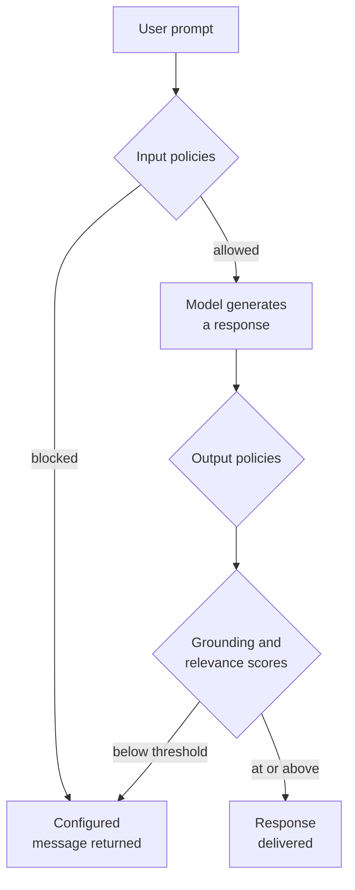
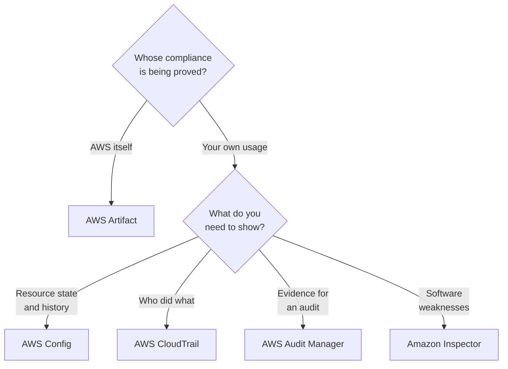

# Domain 5 — Security, Compliance, and Governance for AI Solutions
---

*This is updated as per the official AWS exam guide (version 1.1, 30 April 2026)*

---
This domain is 14 percent of the scored exam. It names more AWS services than any other
block of the guide, and almost every question is decided by knowing which one of two
similar services answers the question the stem actually asked.

These notes are ordered by the decision you face when you build and then have to defend a
generative AI application. Who is answerable, who may call it, what may the agent do, is the
data fit to use, what leaks, what goes wrong at run time, is the answer honest, where did it
come from, what got written down, what can you prove to an auditor, and what does your
organisation have to decide for itself.

---

## What this domain actually asks

Two habits carry most of the marks here.

**Ask what the question is about — the path, the permission, the content, or the record.**
Nearly every confusion in this domain is a service from one of those four groups being
offered as the answer to a question from another. A private network path is not encryption.
A key is not a permission. Discovering stored data is not filtering a prompt. A log of who
called is not a log of what they said.

**Ask whose compliance is being proved.** AWS's, or yours. Half of the governance objective
turns on that single distinction, and the services split cleanly along it.

One warning that applies to the whole domain and never changes an answer: some services here
now carry an AWS notice that they are closed to new customers. Closed to new customers is
not removal from the exam guide, and it is not deprecation. Details are in the compliance
section.

---

## Who is responsible for what

The **AWS shared responsibility model** says AWS is responsible for protecting the
infrastructure that runs all of the services offered in the AWS Cloud. Everything above that
line is yours.

The sentence that decides exam questions is the second one: *customer responsibility will be
determined by the AWS Cloud services that a customer selects*. Choosing a managed service
changes how much configuration work you do. It does not move the line. AWS states what stays
with you in all cases — managing your data including encryption options, classifying your
assets, and using IAM tools to apply the appropriate permissions.

> **Trap.** "It is a managed service, so AWS secures it" is never the answer. If a scenario
> describes leaked data, over-broad access, or an unencrypted bucket, the responsible party
> is the customer no matter how managed the service is.

---

## Four controls people swap for each other

This is the highest-yield table in the domain. Each of these is somebody's wrong answer to
one of the others.

**AWS Identity and Access Management (IAM)** decides who may do what. A policy is an object
that, when associated with an identity or resource, defines their permissions, and AWS
evaluates those policies when a principal makes a request. An **IAM role** is an identity
with permissions that anyone or any service needing it can assume; it has no long-term
credentials such as a password or access keys, and assuming it issues temporary security
credentials for that session. That is why a role, and not an access key, is the answer when
an application needs access to a model.

**Multi-factor authentication (MFA)** proves the caller is who they claim. It requires unique
authentication from a supported mechanism in addition to sign-in credentials. It grants
nothing. The one place it touches authorization is as a policy condition: a statement can
require that the caller be authenticated with a second factor before it takes effect, and
even then the permission comes from the statement.

**AWS Key Management Service (KMS)** manages the keys that protect data at rest. The exam's
angle on it is control. A *customer managed key* is one you create, own and manage, with full
control over its key policy, its rotation and its scheduled deletion. An *AWS managed key* you
can view and audit, but you cannot change its properties, rotate it, change its key policy or
schedule it for deletion. If a requirement names control over rotation or over the key
policy, only a customer managed key satisfies it.

**AWS PrivateLink** decides the path. It privately connects a virtual private cloud (VPC) to
services without an internet gateway, a network address translation device, a public address,
a Direct Connect connection or a Site-to-Site virtual private network connection. For Amazon
Bedrock, you configure a VPC and create an interface endpoint with PrivateLink so that the
data is not available over the internet.

**Encryption in transit** is the fifth thing, and it is not PrivateLink. Amazon Bedrock
requires Transport Layer Security (TLS) 1.2 and recommends 1.3. Traffic can be encrypted and
still cross the public internet; it can take a private path and still need encryption.

| Control | The question it answers | The wrong answer it attracts |
|---|---|---|
| IAM roles, policies, permissions | Who may perform this action? | Encryption, or a key |
| Multi-factor authentication | Is the caller who they claim? | A permission to invoke |
| AWS Key Management Service | Who controls the key protecting stored data? | Who may call the service |
| AWS PrivateLink | Does the traffic leave the AWS network? | Is the traffic encrypted |
| Encryption in transit | Can the traffic be read on the wire? | Does it take a private path |

<b>Self-check — the four controls</b>

1. A compliance rule says your team must be able to rotate the encryption key on demand and
   revoke access to it. Which key type satisfies that?
2. An application must reach a model without traffic traversing the public internet. Which
   feature?
3. Which of these grants no permission at all, ever?
4. A workload running on an instance needs to call a model without an embedded long-term
   credential. What do you give it?

*Answers: 1. A customer managed key. 2. PrivateLink, with an interface endpoint. 3. Multi-factor
authentication. 4. An IAM role, which issues temporary credentials on assumption.*

---

## Securing what an agent is allowed to do

Two AgentCore components sit next to each other and are constantly swapped.

**Amazon Bedrock AgentCore Identity** is identity and credential management for agents. It
provides authentication, authorization and credential management so agents and tools can
reach AWS resources and third-party services on behalf of users, and agent identities are
implemented as workload identities. It establishes *who the agent is*.

**Policy in AgentCore** decides *what that agent may do*. Policies are written in **Cedar**, an
open-source policy language developed by AWS for writing and enforcing authorization
policies. A Cedar policy is a declarative statement that permits or forbids access to gateway
tools, naming a principal, an action, a resource and conditions, and it is evaluated for
every tool invocation request. The policy engine enforces default-deny and forbid-wins
semantics automatically.

The distinction that earns marks is the third column below. A system prompt telling an agent
never to call a tool is a preference the model may or may not honour. A forbid policy is a
decision made outside the model, before the call runs.

| Mechanism | What it settles | Enforced by |
|---|---|---|
| AgentCore Identity | Which identity the agent acts as | The identity service, at authentication |
| Policy in AgentCore | Whether this tool call is allowed | The policy engine, per invocation |
| A system or developer prompt | What the model is asked to prefer | Nothing — the model may ignore it |

> **Trap.** Cedar is not an authentication service. It is a language for expressing
> authorization rules, and it is analysable — the engine validates policies against a schema
> generated from the gateway's own tool definitions, so errors are caught before deployment.

---

## Getting the data right before the model sees it

The guide asks for four practices, and they are four different jobs.

**Data quality** asks whether the data is fit for its purpose. AWS Glue Data Quality measures
and monitors it by evaluating rules and returning a score, which is the percentage of rules
that pass. It has two entry points and the difference matters: rules on the data catalog
evaluate data you already hold, while rules inside extract, transform and load jobs are
*proactive* — they identify and filter out bad data before it is loaded into the data lake.

**Data access control** limits who may read what. AWS Lake Formation manages fine-grained
access control for data lake data in Amazon S3 and its metadata, with policies at the
database, table, column, row and cell levels. Its permissions model *augments* the IAM model
rather than replacing it, using a grant and revoke mechanism.

**Data integrity** asks whether the data is still what it was. That is an access control and
audit question rather than a measurement one: Lake Formation permissions to prevent the
change, and audit logs to show who accessed what, with which service, and when.

**Privacy-enhancing technologies** reduce what can be learned about an individual. The
documented AWS example is Clean Rooms Differential Privacy, which adds a carefully calibrated
amount of noise to query results at run time. Differential privacy allows only aggregated
insights and obfuscates the contribution of any individual's data, which defeats an attacker
who adds or removes one person's records and watches the answer move.

| Practice | The question | The AWS mechanism |
|---|---|---|
| Data quality | Is this data fit to use? | Glue Data Quality rules and score |
| Data access control | Who may read this? | Lake Formation, to cell level |
| Data integrity | Is this still what it was? | Permissions, plus access audit logs |
| Privacy-enhancing technologies | What can be inferred about a person? | Clean Rooms Differential Privacy |

> **Trap.** Redacting fields is not differential privacy. Redaction hides what is visible in a
> record; differential privacy obscures an individual's contribution to an aggregate result.

<b>Self-check — secure data engineering</b>

1. Bad records keep reaching the data lake. Where do you put the quality rules?
2. Analysts must see a table but not two of its columns, and not the rows belonging to other
   regions. Which service?
3. A partner wants aggregate insights without being able to identify any individual. Which
   capability?

*Answers: 1. In the extract, transform and load job, where checks are proactive. 2. Lake
Formation, which reaches column, row and cell level. 3. Clean Rooms Differential Privacy.*

---

## Finding sensitive data, and stopping it

**Amazon Macie** is a data security service that discovers sensitive data using machine
learning and pattern matching. Its subject is data at rest: it keeps an inventory of your
Amazon S3 general purpose buckets and evaluates and monitors them for security and access
control. Its built-in *managed data identifiers* detect many types of personally identifiable
information (PII), financial information and credentials data, and you can add *custom data
identifiers*, which are regular expressions you define.

**Amazon Bedrock Guardrails** sits in the request path instead. Its **sensitive information
filters** detect PII in standard formats, or custom pattern entities, in user inputs and model
responses, and either block or mask them.

Nothing about Macie inspects a prompt. Nothing about Guardrails scans a bucket.

| | Amazon Macie | Guardrails sensitive information filters |
|---|---|---|
| Where the data is | At rest in Amazon S3 | In the prompt or the response |
| What it produces | A finding to review | A blocked or masked interaction |
| Typical stem | "discover where sensitive data is stored" | "prevent it appearing in an answer" |

Inside Guardrails there is a second split worth holding. **Content filters** are about harm:
six predefined categories, which are hate, insults, sexual, violence, misconduct and prompt
attack, each with a configurable strength. **Sensitive information filters** are about privacy.
Both run on prompts and responses; they answer different questions.

**Prompt attack is a category inside content filters, not a policy beside them.** It covers
jailbreaks, prompt injections and prompt leakages. Getting this structural point wrong is a
reliable way to pick a plausible distractor.

Two more mechanics decide questions:

- **Block against Mask.** Block rejects the whole request or response and returns a message
  you configure; the interaction fails. Mask lets it proceed and replaces the value with a
  placeholder naming the type it detected. Summarising a customer transcript needs Mask.
- **ApplyGuardrail.** This operation assesses any text against a configured guardrail
  *without invoking the foundation model*. That is what lets you check a user input before
  performing retrieval, or apply the same guardrail to a model Amazon Bedrock never sees.

| Handling mode | What the user gets | When to choose it |
|---|---|---|
| Block | A configured message; the request fails | Public question answering, no tolerance |
| Mask | The answer, with values replaced by type | Summarising transcripts and case notes |

---

## What goes wrong at run time

The guide lists ten security and privacy considerations. Four of them are where the questions
live.

**Prompt injection** is an adversarial instruction, not a mistake by the model. The documented
patterns are worth recognising by name: ignoring the prompt template, in which the user asks
the model to disregard its instructions; extracting the prompt template, in which the model is
asked to print its own instructions, opening it to further targeted attacks; extracting
conversation history, which may contain sensitive material; and reformatting attacks, where
malicious instructions are written in an encoding such as base64 specifically to slip past
input filters, or the output is reformatted to slip past output filters.

| Technique | What it is aimed at |
|---|---|
| Ignoring the prompt template | The instructions themselves |
| Extracting the prompt template | Reconnaissance for a later attack |
| Extracting conversation history | Sensitive content already in the session |
| Changing the input format | Your input filter |
| Changing the output format | Your output filter |

**Data leakage prevention** is broader than the model reproducing training data, and the
documented AWS leakage paths are administrative:

- Anything you put in a tag or a free-form name field may be used for billing or diagnostic
  logs. AWS recommends never putting confidential information there.
- Content blocked by a guardrail still appears as plain text in model invocation logs, if
  those logs are enabled.
- PII masking does not reach the logs at all. The input field in the log always contains the
  original, unmodified request regardless of guardrail intervention.

**Threat detection and vulnerability management** are two services, not one. Amazon GuardDuty
watches *activity*: it continuously processes AWS CloudTrail management events, flow logs and
name resolution logs, and its AI Protection covers CloudTrail data events from Amazon Bedrock,
Amazon Bedrock AgentCore and Amazon SageMaker AI. **Amazon Inspector** watches *software*: it
automatically discovers workloads and continually scans instances, container images in Amazon
Elastic Container Registry, and Lambda functions for software vulnerabilities and unintended
network exposure. Inspector needs no scan schedule — it rescans when a change could introduce
a new weakness, including when a newly published vulnerability affects a resource.

**Toxicity** is harmful, offensive or abusive generated content. Amazon Comprehend detects it
in real time across seven categories and can monitor generative AI inputs and outputs; the
same service detects PII, though *redaction* of those entities requires an asynchronous batch
job rather than a real-time call. Application security, infrastructure protection, encryption
at rest and in transit, and output filtering and validation complete the list, and each is
answered by the control that owns that layer rather than by a model setting.

<b>Self-check — run time</b>

1. A user sends instructions encoded in base64. What is that technique specifically trying to
   evade?
2. A guardrail blocked a prompt containing a card number. Is that number now safely absent
   from your systems?
3. Which service tells you a container image contains a known vulnerable package?
4. Which service tells you credentials in your account are being used from an unusual place?

*Answers: 1. Your input filter. 2. No — blocked content appears as plain text in model
invocation logs if they are enabled. 3. Amazon Inspector. 4. Amazon GuardDuty.*

---

## Keeping the answer honest

**Retrieval Augmented Generation (RAG) grounding** supplies the source material an answer is
meant to rest on. **Output validation** is a separate step applied to what came back. Doing the
first does not perform the second.

Amazon Bedrock Guardrails implements the check as **contextual grounding checks**, which detect
and filter hallucinations when a reference source and a user query are provided. It produces
two independent scores, and the whole section turns on their being independent.

| Check | The question it asks | A failure looks like |
|---|---|---|
| Grounding | Is the response supported by the source? | Introducing information not in the source |
| Relevance | Does the response answer the query? | A true, sourced answer to another question |

AWS's own example: with a source stating that London is the capital of the United Kingdom and
Tokyo the capital of Japan, answering "the capital of the United Kingdom is London" to the
question "what is the capital of Japan?" is perfectly grounded and useless.

Four mechanics that decide questions:

- The check **requires the model response**, so it runs on output only and never on the prompt.
- It needs **three components**: the grounding source, the query, and the content to guard.
- **Thresholds run from 0 to 0.99.** A threshold of 1 is invalid, because it would block all
  content. Raising the threshold blocks more ungrounded and irrelevant material.
- Supported use cases are summarisation, paraphrasing and question answering. Conversational
  question answering and chatbot use cases are not supported.

**Confidence scoring** is what those two numbers are, and a score is not a verdict. The
assessment returns the score and the threshold that was applied; it does not certify truth.
Where you need the output checked against rules rather than against a source, that is
**Automated Reasoning checks**, which validate that responses adhere to logical policies you
define in natural language.

The point of the diagram is the position of the grounding box. It cannot sit on the left,
because there is no response to check yet.

<b>Self-check — grounding</b>

1. Can a contextual grounding check block a malicious prompt before the model runs?
2. A response is scored high on grounding and low on relevance. What has gone wrong?
3. Your team sets both thresholds to 1.0 for maximum safety. What happens?

*Answers: 1. No — it needs the model response, so it runs on output only. 2. The answer is
supported by the source but does not answer the question asked. 3. The value is rejected;
thresholds stop at 0.99 because 1 would block everything.*

---

## Saying where it came from

Four artifacts, four scopes. The exam separates them by *what one record covers*.

| Artifact | One record covers | Answers |
|---|---|---|
| Source citation | One generated answer | Which chunks this response used |
| Data lineage | One workflow or dataset | How this data and model came to be |
| Data cataloging | One data store | What data exists, where, and its shape |
| Model card | One model | Intended use, risk, training, evaluation |

**Source citation** in an Amazon Bedrock knowledge base has a mechanism worth knowing: citations
appear in the response only when the `$output_format_instructions$` placeholder is present in
the prompt template. Customise the template, drop the placeholder, and the answers keep coming
while the attribution silently stops.

**Data lineage** records history. Amazon SageMaker ML Lineage Tracking stores information about
the steps of a workflow from data preparation to model deployment, so you can reproduce the
steps, track model and dataset lineage, and establish governance and audit standards.

**Data cataloging** records inventory. The AWS Glue Data Catalog is a centralized repository of
metadata that acts as an index to the location, schema and runtime metrics of your data
sources, populated automatically by crawlers. It also keeps a record of the transformations
performed on the data — which is why lineage and cataloging get confused, and why the question
to ask is *inventory or history*.

**Amazon SageMaker Model Cards** document critical details about a model in a single place:
intended use and risk rating, training details and metrics, evaluation results and
observations. The risk rating is one of unknown, low, medium or high. The rule that decides
questions is versioning — any edit other than an approval status update creates an additional
version, deliberately, so the record of changes is immutable. A card can be exported for
sharing, which makes it a transparency artifact as well as a governance one.

---

## What actually gets written down

Two logs are offered as the answer to the same stem, and they record different things.

| | AWS CloudTrail | Model invocation logging |
|---|---|---|
| Records | That the call happened, and by whom | The prompt and the response content |
| Default state | Event history is on automatically | Disabled — you must enable it |
| Retention | 90 days of history without a trail | Until the configuration is deleted |
| Answers | "Who invoked the model on Tuesday?" | "What did it actually say?" |

CloudTrail identifies who or what took which action, on what resource, and when. Its **Event
history** is an immutable record of the past 90 days of management events in a Region and is
available automatically — but anything older, or anything to be kept for an audit, needs a
**trail** delivering to an Amazon S3 bucket, or a CloudTrail Lake event data store, which can
hold events for up to about ten years.

**Model invocation logging** collects the invocation logs and the model input and output data.
It is **disabled by default**, it can deliver to Amazon CloudWatch Logs, Amazon S3 or both, and
only destinations in the same account and Region are supported. Each entry also records the
identity of the principal that made the request, captured automatically.

> **Trap.** An audit trail requirement for AI interactions — reconstructing which prompt
> produced which answer — is not met by CloudTrail. CloudTrail knows the call was made.

---

## What you can prove, and to whom

Five services are named in the objective, and one more sits beside them. Sort them by *whose
compliance* they are about.

| Service | What it establishes |
|---|---|
| AWS Config | What the resource is configured as, now and in the past |
| AWS CloudTrail | Who took which action, on what, and when |
| Amazon Inspector | Which software weaknesses exist in your workloads |
| AWS Artifact | That AWS's infrastructure meets a compliance standard |
| AWS Trusted Advisor | Where your account departs from best practice |
| AWS Audit Manager | Evidence that *your usage* of AWS services is in compliance |

**AWS Config** gives a detailed view of resource configuration, how resources relate to each
other, and how they were configured in the past. Config rules evaluate settings, flag a
violating resource as noncompliant and send a notification, evaluating continuously as
resources are created, changed or deleted. A set of rules deployed and monitored together is a
conformance pack. Demonstrating compliance needs historical configurations, and that is what
Config holds.

**AWS Artifact** provides on-demand downloads of AWS security and compliance documents —
reports against International Organization for Standardization standards, Payment Card
Industry standards, and System and Organization Controls reports — plus your agreements with
AWS. AWS states the limit explicitly: customers are responsible for developing or obtaining
the documents that demonstrate the compliance of *their own* companies.

**AWS Audit Manager** is the other side of that line, and AWS draws it in one sentence: Artifact
offers evidence that the AWS Cloud infrastructure meets the compliance requirements, while
Audit Manager helps you collect, review and manage evidence that your usage of AWS services is
in compliance. It automates evidence collection against prebuilt frameworks. It also states its
own limit — it does not assess your compliance itself and is not a substitute for legal counsel
or compliance experts. Collecting the evidence is not reaching the conclusion.

**AWS Trusted Advisor** inspects your environment and recommends where you could save money,
improve availability and performance, or close security gaps, across six categories: cost
optimization, performance, security, fault tolerance, service limits and operational
excellence. It is not a vulnerability scanner — that is Amazon Inspector — and the full set of
checks requires a paid support plan, with a basic plan seeing all service limits checks and
only selected security and fault tolerance checks.

> **Currency note, and it does not change any answer.** AWS Audit Manager is no longer open to
> new customers, and Amazon Comprehend prompt safety classification is closed to new customers
> as well. Existing customers continue as normal. If a question describes what Audit Manager
> does, Audit Manager is still the answer — downgrading it because of a banner is how a correct
> option gets eliminated.

<b>Self-check — proving compliance</b>

1. An auditor asks for evidence that the underlying cloud infrastructure is certified. Where do
   you get it?
2. An auditor asks whether your own workloads met a control over the last quarter. Which
   service collects that?
3. Which service can tell you what a security group's rules were on a specific date?
4. Does any of these declare you compliant?

*Answers: 1. AWS Artifact. 2. AWS Audit Manager. 3. AWS Config, from configuration history.
4. No — Audit Manager states it does not assess your compliance itself.*

---

## Governing the data itself

The guide's data governance strategies split into three questions plus the logging you have
already seen.

| Term | The question | A mechanism |
|---|---|---|
| Data lifecycle | What happens to this data over time? | S3 Lifecycle transition and expiration |
| Data residency | Where may it be stored or processed? | Region choice; cross-Region settings |
| Data retention | How long is it kept? | Expiration actions; log configurations |

A **data lifecycle** is the whole path, and retention is one stage of it. An S3 Lifecycle
configuration is a set of rules with two kinds of action: *transition* actions, which move
objects to another storage class, and *expiration* actions, after which Amazon S3 deletes the
objects for you. The rules apply to objects already in the bucket as well as objects added
later.

Two sharp edges here:

- **A bucket policy cannot stop a lifecycle rule.** Even a policy denying all actions for all
  principals leaves the lifecycle configuration working normally. A retention requirement
  enforced by bucket policy alone is not enforced.
- **A residency constraint can be broken by a quality setting.** Switching guardrails to the
  Standard safeguard tier also turns on cross-Region inference, and a guardrail profile then
  defines the destination Regions requests may be routed to. Standard is better on language
  coverage, code handling and prompt leakage detection, and different on where the work runs.

**Monitoring and observation** are the ongoing half: model invocation logs delivered to Amazon
CloudWatch Logs, access logs from your data services, and Config rules evaluating continuously
rather than at review time.

---

## What your organisation has to decide

The last objective is about the things no service settles for you: policies, review cadence,
review strategies, governance frameworks, transparency standards and team training.

A **policy** states what is permitted. A **review cadence** is how often you look. A **review
strategy** is what you examine when you do. These are three separate answers, and a question
naming one of them is not satisfied by another.

**Transparency standards** are what you publish to the people affected. Two concrete artifacts
serve them: a model card exported and shared with stakeholders, and AWS AI Service Cards,
which give a single place to find the intended use cases and limitations, responsible AI
design choices and performance optimization best practices for an AWS service or model.

The named **governance framework** is the **Generative AI Security Scoping Matrix**, and scoping
the use case is the first step in a security strategy for generative AI. Five scopes:

| Scope | What it is | Example |
|---|---|---|
| 1 — Consumer app | You consume a public third-party service | Staff use a public chat assistant |
| 2 — Enterprise app | A vendor's product with generative AI built in | Scheduling tool drafts agendas |
| 3 — Pre-trained model | You build an app on a third-party model | Retrieval chatbot over your documents |
| 4 — Fine-tuned model | You refine that model with your own data | Domain-specialised summariser |
| 5 — Self-trained model | You build and train the model from scratch | A model you own entirely |

Three things the matrix is tested on:

- **The numbering runs from least to most ownership.** Scope 5 is not light consumption; it is
  owning every aspect of the model.
- **Scope 3 against Scope 4 is where your data goes.** Retrieval puts your data in the context
  window and stays Scope 3. Training puts it in the weights and becomes Scope 4.
- **Control and responsibility move together.** In Scopes 3 to 5 you have more control over
  your data *and* more responsibility for protecting it, with complexity rising through the
  three.

The same five security dimensions apply for all scopes — governance and compliance, legal and
privacy, risk management, controls, and resilience. What changes is how you approach them. For
Scopes 1 and 2, AWS advises a buyer's perspective, focused on data governance and on reading
the enterprise agreement; and it notes that Scope 2 products are typically built to support
enterprise data security and compliance needs while Scope 1 products most often are not. For
Scopes 3 to 5, a builder's perspective with threat modelling.

**Team training** closes the list, and it is there for a reason: every control in this domain
is set by a person who has to know which one to reach for.

<b>Self-check — scopes and governance</b>

1. Your team builds a support assistant on a third-party model and adds your documents by
   retrieval. Which scope?
2. You then fine-tune that model on your ticket history. Which scope now?
3. A stem asks how often the governance board meets. Which of the guide's terms is that?
4. Do the five security dimensions apply differently at Scope 1?

*Answers: 1. Scope 3. 2. Scope 4. 3. Review cadence, not review strategy. 4. They all apply at
every scope; only the way you approach them varies.*

---

## The five separations to hold on exam day

1. **Path against protection.** PrivateLink is where the traffic goes; encryption is whether it
   can be read.
2. **Permission against key.** IAM decides who may act; Key Management Service decides who
   controls the key.
3. **At rest against in flight.** Macie discovers sensitive data in Amazon S3; guardrail filters
   act on prompts and responses.
4. **Whose compliance.** Artifact proves AWS's; Audit Manager collects evidence about yours; and
   neither declares anyone compliant.
5. **Call against content.** CloudTrail records that the model was invoked and by whom; model
   invocation logging records what was said.

---

## 🎯 Test Your Knowledge

Finished this domain? Put your knowledge into practice with the DataCertLab AIF-C01 Practice Tests.

👉 [Practice on Udemy](https://www.udemy.com/course/dcl-aws-certified-ai-practitioner-aif-c01-practice-tests/?referralCode=9F455BD5CACE13156124)
> 💡 **Tip:** Open the link in a new tab to keep these notes open for reference.

Learn → Practice → Review → Improve
