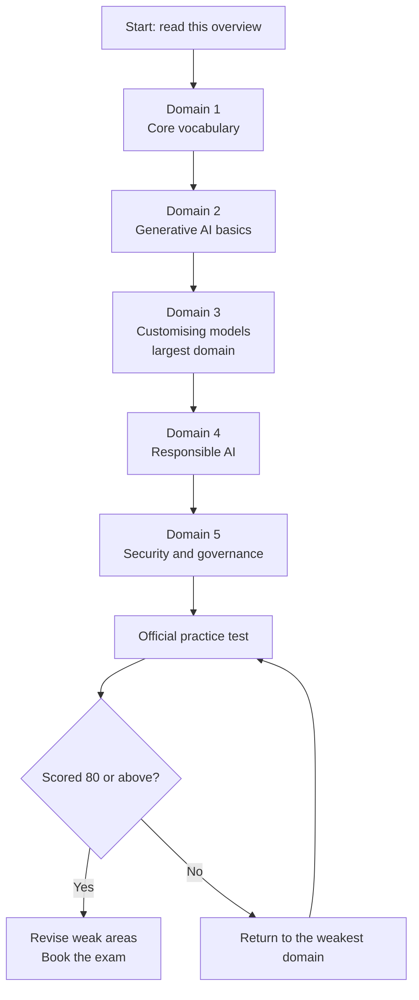

# AWS Certified AI Practitioner (AIF-C01) — Exam Overview and Strategy

Everything you need to know about the exam itself, before you start studying for it. Read this once,
then come back to the time strategy the day before you sit.

This guide tracks **exam guide version 1.1, published 30 April 2026**. That matters more than usual
right now — see [What changed in version 1.1](#what-changed-in-version-11).

---

## Where these notes stop

These notes cover what the exam asks about. They cannot tell you whether you can pick the right
answer in ninety seconds with four plausible options in front of you. That is a separate skill, and
it is the one the exam scores.

The DataCertLab **AIF-C01 practice tests** are built from the same blueprint as these notes: five
full-length tests, 65 questions each, weighted 20/25/28/14/14 across the five domains exactly as the
real exam is. Every question explains why the key is correct and why each other option is not, with
a link to the AWS documentation the answer rests on.

<a href="https://www.udemy.com/course/dcl-aws-certified-ai-practitioner-aif-c01-practice-tests/?referralCode=9F455BD5CACE13156124" target="_blank" rel="noopener noreferrer">
  Take the AWS AI Practitioner Practice Tests
</a>

Read a domain, answer questions on it, then go back to whatever your wrong answers point at. That
loop beats a second read-through.

Learn → Practice → Review → Improve

---

## The exam at a glance

| | |
|---|---|
| **Questions** | 65 total — 50 count towards your score, 15 do not |
| **Time** | 90 minutes |
| **Score range** | 100 to 1,000 |
| **Pass mark** | 700 |
| **Cost** | 100 USD |
| **Where** | A Pearson VUE test centre, or online with a proctor watching |
| **Level** | Foundational — you use AI and machine learning on AWS, you do not build it |

Three things worth knowing straight away.

**The 15 unscored questions are not marked.** You cannot tell which ones they are, so you have to
treat all 65 as if they count. AWS uses them to trial questions for future exams.

**You do not need to pass each section.** The exam is scored as a whole. A weak domain can be carried
by strong ones, so do not panic if one area feels rough on the day.

**There is no penalty for a wrong answer.** An unanswered question is marked wrong, so always answer
everything, even if you are guessing.

---

## Who this exam is for

AWS aims this at someone with **up to six months of exposure** to AI and machine learning on AWS,
who *uses* these services rather than builds them.

That second part is the useful bit, because it tells you where the exam stops. AWS states these
tasks are **out of scope**:

- Writing or coding models and algorithms
- Data engineering or feature engineering work
- Tuning hyperparameters or optimising models
- Building and deploying pipelines or infrastructure
- Doing the mathematics or statistics behind models
- Implementing security or compliance controls
- Writing governance frameworks and policies

So when a question feels like it is asking you to design something, read it again. It is almost
certainly asking you to *choose* something.

---

## Domains and weights

| # | Domain | Weight | Roughly how many scored questions |
|---|---|---|---|
| 1 | Fundamentals of AI and machine learning | 20% | 10 |
| 2 | Fundamentals of generative AI | 24% | 12 |
| 3 | Applications of foundation models | 28% | 14 |
| 4 | Guidelines for responsible AI | 14% | 7 |
| 5 | Security, compliance, and governance for AI solutions | 14% | 7 |

**The weights apply to scored content only,** which is why the counts above are out of 50 rather
than 65. AWS publishes no domain breakdown for the 15 unscored questions, so how they are spread is
simply unknown — do not assume they follow the same weights.

What that changes in practice is nothing about your revision and one thing about your pacing. You
cannot tell the unscored questions apart and they cost you the same minutes, so **pace against 65**
and use the weights above to decide where the revision time goes.

Domains 2 and 3 together are **52% of the exam**. If you are short on time, that is where it goes.

### What each domain actually covers

**Domain 1 — Fundamentals of AI and machine learning (20%)**
Basic terms and how the ideas relate to each other: artificial intelligence, machine learning,
deep learning, generative AI, and agentic AI. Where AI genuinely helps and where it does not.
The stages of a machine learning project, and which AWS service belongs at each stage.

**Domain 2 — Fundamentals of generative AI (24%)**
How generative AI works at a conceptual level, including tokens, embeddings, and what a foundation
model is. What it costs to run — this is where token-based pricing lives. What generative AI is good
and bad at, and how you would justify it to a business. The AWS services you build it with.
Also the new agentic AI concepts.

**Domain 3 — Applications of foundation models (28%)**
The biggest domain, and the most practical. How you make a foundation model fit your use case, and
what each approach costs: prompt engineering, in-context learning, retrieval augmented generation
(RAG), fine-tuning, model distillation, and continued pre-training. Prompt engineering techniques.
How training and fine-tuning actually work. How you evaluate whether a model is any good.

**Domain 4 — Guidelines for responsible AI (14%)**
Bias, fairness, and how you detect them. Why explainability matters and which tools give it to you.
The tradeoff between a model that performs well and a model you can explain.

**Domain 5 — Security, compliance, and governance for AI solutions (14%)**
Controlling who can reach your models and your data. Keeping a record of what happened.
Governance and compliance obligations. Also hallucination detection and grounding, which sits here
rather than in Domain 3 — worth remembering, because it is not where most people look for it.

---

## What changed in version 1.1

Version 1.1 was published on 30 April 2026. AWS says guide updates reach the exam about a month
later, so the live exam has been testing this content since roughly the end of May 2026.

**Most study material you will find online still describes version 1.0.** That includes some
AWS-adjacent material. If a resource does not mention agentic AI or Amazon Bedrock AgentCore, it is
describing the older exam.

### Genuinely new topics

| New topic | What to know |
|---|---|
| Traditional machine learning versus foundation models | When a plain machine learning model is the right answer — usually because of regulation, explainability, or operational constraints |
| Token-based pricing | How you are charged for inference, and how that shapes cost and performance |
| Context engineering | What you put into the model's context, and what that costs |
| Agentic AI concepts | Multi-agent patterns, Model Context Protocol (MCP), memory, tool use, and workflow orchestration |
| Prompt versioning and management | Managing prompts as artifacts, using Amazon Bedrock Prompt Management |
| Business objective alignment metrics | Task completion rate, user satisfaction, cost per interaction |
| Hallucination detection and grounding | RAG grounding, output validation, confidence scoring |

### Changed, and easy to get caught by

- **Inference types now include asynchronous and serverless**, not just batch and real-time.
- **Model metrics changed.** Area Under the Curve (AUC) was removed. Precision and recall were added.
  The set to know is accuracy, precision, recall, and F1 score.
- **Model distillation** was added to the list of ways to customise a foundation model.
- **Using a large language model (LLM) to grade another model's output** was added to the ways you
  assess a model. AWS calls this LLM-as-a-judge.
- **Agents got narrower, not wider.** The old guide asked about Amazon Bedrock Agents and Model
  Context Protocol mechanics. The new one asks you to define what an agent is and describe its
  business uses. You need less depth here than older material suggests.
- **Evaluation now says human-in-the-loop** rather than human evaluation.

### Services added to scope

Amazon Bedrock AgentCore, Strands Agents, Amazon Q, Amazon SageMaker JumpStart, Kiro, AWS Transform,
and Amazon Aurora. **Amazon MemoryDB was removed.**

---

## How the questions are written

This section is based on measuring AWS's own official practice test for this exam. It is the part
most study guides guess at, so it is worth reading closely.

### Four question formats

| Format | How it works |
|---|---|
| **Multiple choice** | One correct answer, three wrong ones. Four options total. |
| **Multiple response** | Two or more correct answers out of five or more options. You must get all of them. |
| **Ordering** | Put 3 to 5 items in the right order. All or nothing. |
| **Matching** | Match a list of answers to 3 to 7 prompts. All or nothing. |

**None of these give partial credit.** On a multiple response question, getting two of three right
scores the same as getting none right.

### What the questions actually look like

**Three out of four are short scenarios.** Only about one in six is a straight definition question.
A typical scenario is two or three sentences — a situation, a constraint, then the question on its
own line. They are shorter than you may expect: around 33 words on average, rarely past 60.

**The constraint is the question.** Most scenarios name something that rules options out — no machine
learning expertise, least development effort, must be explainable, data cannot leave the account.
Two or three options will technically work. Only one works *under that constraint*. If you find
yourself choosing between two good answers, go back and find the constraint you skipped.

**Watch for capitalised words, but do not expect many.** About one question in seven capitalises the
deciding word, and only ever **LEAST**, **LOWEST**, or **HIGHEST**. You will not see MOST or BEST on
this exam.

**Multiple response questions do not tell you how many to pick.** This is a real difference from
other AWS exams, which say "(Select TWO.)". Here you have to work out how many are correct. Read
every option and judge each one on its own.

**Most wrong answers are the right family, wrong member.** This is the single most useful thing to
know. The options are usually all real AWS services in roughly the right area, and the wrong ones are
wrong for a specific, nameable reason — a search service where you needed model access, a translation
service where you needed transcription, the right service but the wrong feature inside it.

The exam is not testing whether you recognise a service name. It is testing whether you know what
that service actually does. So when you revise, do not stop at "Amazon Comprehend does natural
language processing". Learn what it does *not* do, and which service does that instead.

---

## Time strategy

You have **90 minutes for 65 questions**, which is about **83 seconds each**.

**Time is very unlikely to be your problem.** On AWS's own practice test, someone who scored 85% took
around 25 to 30 seconds per question — roughly a third of the allowance. The questions are short and
you either know the service or you do not.

So use the slack deliberately:

1. **First pass — answer everything you know.** Do not agonise. If it takes more than about a minute,
   flag it and move on.
2. **Second pass — the flagged ones.** You will now have 40 minutes or more for maybe 10 questions.
   This is where you re-read for the constraint you missed.
3. **Final pass — check nothing is blank.** A blank answer is a wrong answer, and there is no penalty
   for guessing.

On the day, if you are stuck between two options:

- Find the constraint in the stem. Which option fails it?
- Ask which option needs the *least* building. Foundational exams reward the managed answer.
- Check whether the question asked for a service or a *feature*. Those are different questions.
- Rule out anything doing a genuinely different job, however familiar the name.

---

## Study strategy

**Study the domains in order.** Domain 1 gives you the vocabulary that Domains 2 and 3 assume.
Skipping ahead to the heaviest domain feels efficient and is not.

**Spend your time in proportion to the weights**, with one adjustment: give Domain 3 more than its
28% share. It is the largest domain and the most conceptually dense, and its topics reappear inside
Domain 2 and Domain 5 questions.

**Learn the boundaries between services, not the services.** Because most wrong answers are a
neighbouring service, the highest-value revision is comparing confusable pairs. For each service,
be able to finish these two sentences: "You use it to ___" and "You cannot use it to ___, you use
___ for that."

**Take the official practice test.** AWS publishes one on AWS Skill Builder, and it is the only
practice material written by the people who write the exam. Take it before you book, not after.

---

## Official resources

Use these first. Everything else is someone's interpretation of these.

- **The exam guide** — the definitive list of what is tested, domain by domain, objective by
  objective. If a topic is not in it, it is not on the exam:
  https://docs.aws.amazon.com/aws-certification/latest/ai-practitioner-01/ai-practitioner-01.html
- **The revisions page** — what changed between version 1.0 and 1.1. Check this before trusting any
  other study material:
  https://docs.aws.amazon.com/aws-certification/latest/ai-practitioner-01/aif-01-revisions.html
- **The certification page** — booking, cost, format:
  https://aws.amazon.com/certification/certified-ai-practitioner/
- **AWS Skill Builder** — the official practice question set and official practice exam. A free
  account covers a lot of it.
- **AWS service documentation** — for every service in the exam guide's in-scope list, read the
  "What is..." page. That page alone answers most recall questions.

---

## Hands-on checklist

You are not expected to build anything, and the exam does not test coding. But an hour of clicking
makes several domains concrete. All of this fits in the free tier or costs very little.

- [ ] Open **Amazon Bedrock** and send a prompt to two different foundation models. Compare the
      answers and note the cost shown per request.
- [ ] Adjust **temperature** and **top-p** on the same prompt. Watch what changes.
- [ ] Turn on **Amazon Bedrock Guardrails** and try to make the model discuss a blocked topic.
- [ ] Build a small **knowledge base** in Amazon Bedrock over two or three of your own documents,
      then ask a question only those documents can answer. This is retrieval augmented generation
      (RAG) in about ten minutes, and it makes Domain 3 much easier.
- [ ] Run a document through **Amazon Textract** and the same text through **Amazon Comprehend**.
      Seeing where each one stops is worth several exam questions.
- [ ] Open **Amazon SageMaker JumpStart** and look at the model list. You do not need to deploy one.
- [ ] Look at **AWS CloudTrail** and find a logged application programming interface (API) call. Note
      that it records who, what, and when.
- [ ] Open a **SageMaker Model Card** and read the fields it asks for.

---

## The last 24 hours

Do not learn anything new. Consolidate what you have.

**The evening before**

- [ ] Re-read the [question style](#how-the-questions-are-written) section above, especially the
      right-family-wrong-member point.
- [ ] Review your confusable-pairs list. This is the highest-value hour you have left.
- [ ] Skim the [version 1.1 changes](#what-changed-in-version-11). These are the topics most
      candidates have not studied.
- [ ] Check the list of ways to customise a foundation model, cheapest first: prompt engineering,
      in-context learning, RAG, fine-tuning, continued pre-training. Know which one solves which
      problem.
- [ ] Confirm your booking, your identification, and your test-centre route or your online
      proctoring setup.
- [ ] Stop early. Sleep is worth more than another hour of revision.

**On the day**

- [ ] Remember: 83 seconds per question, and you will probably need half that.
- [ ] Answer every question. There is no penalty for guessing.
- [ ] You do not need to pass every section, only the exam overall.
- [ ] For every scenario, find the constraint before you look at the options.
- [ ] Flag and move on. Do not spend five minutes on question three.

---

## Understanding your score

Your result is a number between **100 and 1,000**, and you need **700**.

**That is not a percentage, and AWS does not publish how the two relate.** Scaled scoring exists so
that different versions of the exam, which vary slightly in difficulty, can be compared fairly. This
means nobody can honestly tell you "you need 35 of 50 correct".

What we can say:

- 700 out of 1,000 is widely treated as roughly **70 to 75% of scored questions correct**. Treat that
  as a working target, not a guarantee.
- Only the **50 scored questions** count. The other 15 do not, and you cannot identify them.
- Scoring is **compensatory** — a weak domain can be offset by strong ones.
- Your report may include a section-by-section breakdown. AWS itself advises caution reading it: with
  only 7 to 14 scored questions per domain, one unlucky question moves a section a long way.

**A sensible target:** aim for 80% or better on the official practice test before you book. That
leaves room for the real exam to be a little harder than practice, and for one domain to go badly.

---

*This overview is built from the official AWS exam guide (version 1.1, 30 April 2026) and from
measuring AWS's own official practice test for this exam. It describes the exam, not its content —
nothing here is a recalled or reproduced exam question.*
