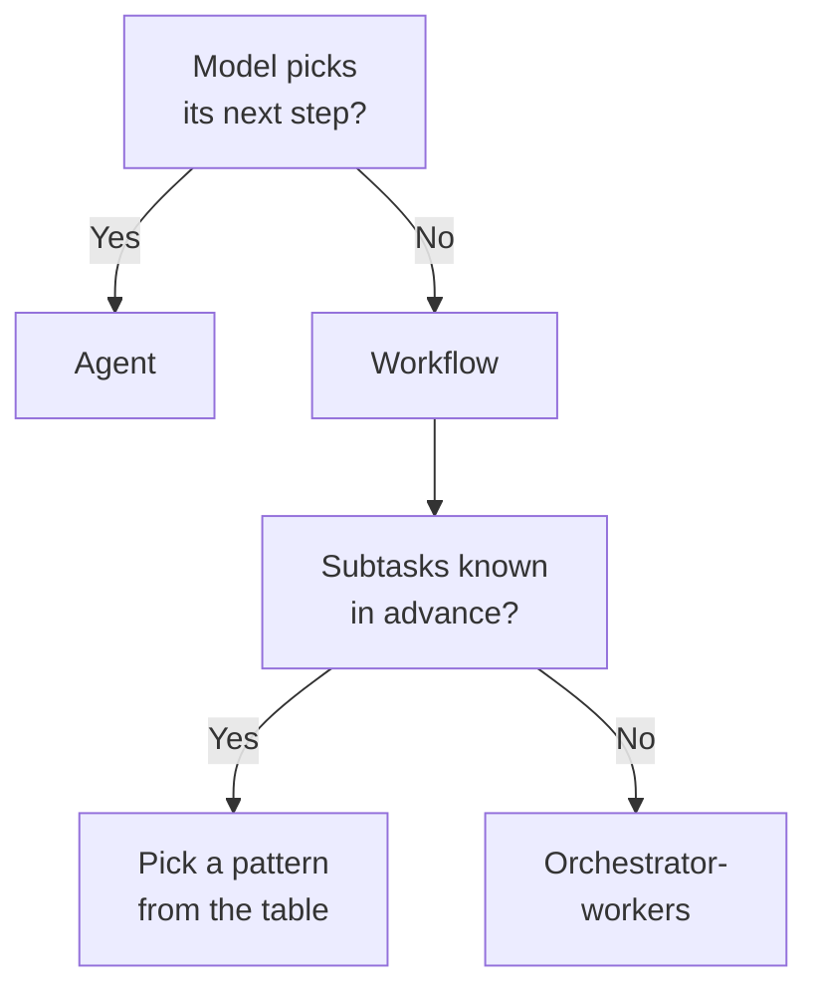

# Domain 1 — Agents and Workflows

This domain is 14.7 percent of the exam, spread across three separately weighted skills:
agent architecture, agent construction with Claude, and agent patterns and frameworks. It
rewards one habit above all others — being able to say, from a paragraph of scenario, whether
the thing being described has its path fixed by an engineer or chosen by a model, and what
follows from that.

The domain is dominated by scenario reasoning rather than by recall. The questions describe a
team, a constraint and a few options that all technically work, and ask which one fits. That means the marks live in boundaries:
workflow against agent, one pattern against its near neighbour, the software development kit
that runs in your process against the hosted service that runs in Anthropic's.

The sections below do not follow the guide's order. The guide puts architecture first,
construction second and patterns last, which leaves the vocabulary until the end. You cannot
choose between the Claude Agent SDK and Claude Managed Agents until you can say what an agent
loop is, and the patterns are what that vocabulary is made of. So the boundary comes first,
then the patterns, then delegation, and only then what you build the thing on.

---

## What this domain actually asks

Three habits carry most of the marks.

**Reach for the simplest thing that works.** Anthropic's own recommendation is to find the
simplest solution possible and increase complexity only when needed, and it says plainly that
this might mean not building an agentic system at all. When an option on this exam declines to
build an agent, it is a real candidate for the key, not filler.

**Answer on the constraint in the stem, not on the product you know best.** Workflows offer
predictability and consistency for well-defined tasks; agents are the better option where
flexibility and model-driven decision-making are needed at scale. The stem carries the fact
that decides it; find that fact before you read the options.

**Know what each choice costs.** Every option here trades something — latency for accuracy,
control for convenience, isolation for context. An option that ignores the tradeoff the stem
raised is usually the weaker candidate.

---

## Workflow or agent, and how to tell

**The split is about who fixes the path, and when.** Anthropic groups everything built this way
under the heading of agentic systems, and then draws one architectural line through the middle
of that category.

A **workflow** is a system where large language models (LLMs) and tools are orchestrated
through predefined code paths. An engineer wrote the sequence, in code, before anything ran. An
**agent** is a system where the model dynamically directs its own processes and tool usage,
keeping control over how it accomplishes the task.

Both call tools. That is why tool use separates nothing, and why a stem that says "the system
calls three tools" has told you nothing at all. Ask instead whether the order of those calls
was decided before the run or during it.

| Term | What it is | Confused with | The separator |
|---|---|---|---|
| Workflow | Predefined code paths through models and tools | Any multi-step system | An engineer fixed the sequence before the run |
| Agent | The model directs its own process and tool use | Any system that calls tools | The model decides the next step after seeing the last result |

An agent begins with a command from, or a discussion with, a user. Once the task is clear it
plans and operates independently, coming back for information or judgement when it needs to.
Underneath, agents are typically just models using tools based on environmental feedback in
a loop, which is why designing the toolset and its documentation carefully matters so much.
The thing that makes that possible is feedback: at every step the agent gains **ground truth**
from the environment — a tool call result, a code execution — and uses it to judge progress.
Take that away and you no longer have an agent, you have a plan.

Agents suit open-ended problems where you cannot predict how many steps are needed and cannot
hardcode a fixed path, and their autonomy makes them well suited to scaling work in trusted
environments. The bill for that autonomy is higher cost and the potential for compounding
errors, where an early wrong step becomes the input to every later one. That is why Anthropic
pairs the recommendation with extensive testing in sandboxed environments and appropriate
guardrails, and why it is common to build in **stopping conditions**, such as a maximum number
of iterations, to keep control.

Anthropic names three core principles for implementing agents, and each one shows up in
scenario questions as a reason to prefer one design over another. **Maintain simplicity** in
the design. **Prioritise transparency** by explicitly showing the agent's planning steps, so a
person can see what it intends before it acts. And **carefully craft the agent-computer
interface** through thorough tool documentation and testing — the same care you would spend on
an interface for people, spent on the one the model uses.

> **Trap.** The exam rewards restraint more often than ambition. For many applications,
> optimising single model calls with retrieval and in-context examples is usually enough, and
> complexity should be added only when it demonstrably improves outcomes. When two options
> both solve the problem and one is simpler, the simpler one is the answer.

<b>Self-check — workflow, agent, and the pattern that fits</b>

1. A system calls four tools in a fixed order and checks the result of each before continuing.
   Is it a workflow or an agent, and which word in that sentence decides it?
2. A colleague says "we added tool use, so now it's an agent". What is wrong with that?
3. Name the one thing an agent must get from its environment at each step, and say what the
   system becomes without it.
4. Two patterns run several model calls at once. Which one has its subtasks fixed in advance,
   and which invents them from the input?
5. When is the right answer "do not build an agentic system at all"?

**Answers.** 1. A workflow — "in a fixed order" says the sequence was predefined. 2. Both
workflows and agents call tools; tool use is on both sides of the line, so it separates
nothing. Ask who fixed the order. 3. Ground truth from the environment, such as a tool result
or a code execution. Without it the system is a plan, not an agent, because nothing informs the
next step. 4. Parallelization has pre-defined subtasks; orchestrator-workers determines them
from the specific input. 5. When optimising a single model call with retrieval and in-context
examples already meets the requirement — the simplest solution is the recommended starting
point.

---

## The five patterns, and when each one earns its place

**The building block underneath all five is the augmented model**: a large language model
enhanced with augmentations such as retrieval, tools and memory. Everything below assumes each
call has those available.

**Prompt chaining** decomposes a task into a sequence of steps, where each model call processes
the output of the previous one. You can add programmatic checks — gates — on any intermediate
step to make sure the process is still on track, and the fact that those checks are code rather
than the model's judgement is what makes this a workflow. It suits tasks that decompose cleanly
into fixed subtasks. Note the direction of the tradeoff, because it catches people: chaining is
sequential, so its goal is to trade latency for higher accuracy by making each call an easier
task. It does not make anything faster.

**Routing** classifies an input and directs it to a specialised follow-up task, which buys
separation of concerns and lets each downstream prompt be written for one kind of input. It
needs two conditions, not one: the categories have to be genuinely better handled separately,
and the classification itself has to be handled accurately, whether by a model or a traditional
classifier. Where inputs blur across categories, every specialised prompt downstream is working
on misfiled input.

**Parallelization** runs work at the same time, and it has two variations that get confused
with each other. *Sectioning* breaks a task into independent subtasks run in parallel — one
model instance handling the query while another screens it for problems, for example.
*Voting* runs the same task several times to get diverse outputs, which is what you want when
several attempts raise confidence in the result. It is effective when subtasks can be split for
speed, or when multiple perspectives are needed.

**Orchestrator-workers** puts a central model in charge: it dynamically breaks the task down,
delegates to worker models, and synthesises their results. This is the structure the exam guide
means by a manager or supervisor hierarchy.

The boundary between parallelization and orchestrator-workers is the one worth rehearsing,
because the source material itself calls the two topographically similar. The difference is
flexibility. In parallelization the subtasks are pre-defined; in orchestrator-workers they are
determined by the orchestrator from the specific input. Where the subtasks are fixed and known
before the run, parallelization is usually the simpler choice.

**Evaluator-optimizer** has one model call generate a response while another evaluates it and
feeds back, in a loop. It is effective where evaluation criteria are clear and iterative
refinement is worth something measurable, and there are two signs of good fit: that a human
articulating feedback demonstrably improves the response, and that the model itself can produce
that kind of feedback. Without the second sign you have added cost and no signal.

| Pattern | What decides it | Reach for it when |
|---|---|---|
| Prompt chaining | Steps run one after another, output feeding input | The task splits cleanly and you will trade latency for accuracy |
| Routing | One input, one specialised destination | Categories are distinct and classification is reliable |
| Parallelization | Several calls at once — sectioning splits the task, voting repeats it | Independent pieces can run together, or repeated attempts raise confidence |
| Orchestrator-workers | A central model invents the subtasks from the input | You cannot predict what the subtasks will be |
| Evaluator-optimizer | One call drafts, another critiques, in a loop | Criteria are clear and the model can produce useful critique |

> **Trap.** These patterns are not a ladder from simple to advanced, and the most sophisticated
> one is not the safe default. They answer different questions. A well-defined,
> repeatable task belongs in a workflow, and moving it to an agent buys nothing but cost,
> latency and the risk of compounding errors.

---

## Delegation, and what a subagent actually gets

**A subagent is a specialised assistant that runs in its own context window**, with its own
system prompt, its own tool access and independent permissions. It works on a delegated task
and returns a summary to the main conversation, and it stays inside the session that spawned
it.

Delegating gives four benefits, and only one of them is speed. **Context isolation** keeps a
large exploration out of the main conversation. **Parallelization** lets independent subtasks
finish in the time of the slowest rather than the sum of all. **Specialised instructions** put
domain knowledge where it is needed instead of bloating the main prompt. **Tool restrictions**
mean a reviewer given only read and search tools cannot modify anything, whatever it decides.

You can define one three ways, and the choice is about where the definition lives rather than
what the subagent can do. **Programmatically**, through the `agents` parameter in your query
options, which is what the documentation recommends for software development kit applications.
**As a file**, a markdown definition in a `.claude/agents` directory, which suits a definition a
whole repository shares. Or **not at all** — Claude can invoke a built-in general-purpose
subagent with no definition written anywhere, which is worth knowing because it means a
delegation you did not configure is still a delegation.

The mechanism behind the first benefit is worth stating exactly, because it is the most useful
fact in this domain. A subagent's intermediate tool calls and results stay inside the subagent,
and only its final message returns to the parent. The parent's context therefore grows by a
concise summary rather than by every file the subagent read.

The other half of that mechanism is what a subagent does *not* get.

| The subagent receives | The subagent does not receive |
|---|---|
| Its own system prompt, and the prompt string you pass it | The parent's conversation history |
| Project-level instructions loaded from the file system | The parent's tool results |
| Tool definitions, or the subset you scoped it to | The parent's system prompt |

Read the right-hand column again, because it is where real systems break. Unless the subagent
is a **fork**, its context window starts fresh, and the only content passed from parent to
subagent is the prompt string — so file paths, error messages and decisions it needs must be
written into that prompt. "Fresh" is not "empty": it loads its own system prompt and
project-level context. But nothing of the parent's turns travels with it.

The exception is worth knowing because it is the one case where the table above does not
apply. A **fork** inherits the parent conversation instead of starting fresh, which is what
you reach for when the worker needs everything that has already been said. Ordinary
delegation is not a fork, so assume the fresh-context behaviour unless a fork was asked for.

Two more practical facts, both about a subagent specifically. Claude decides when to invoke one based on the task and each
subagent's description, so a vague description means the specialist never runs and the main
agent does the work itself; naming it in the prompt bypasses that matching. And a tool you
leave out of a subagent's tool list is not in its session at all — it works without it, with
no permission prompt and no error. Nothing surfaces the absence.

That is the behaviour of an explicit list, and the field has two other settings worth
knowing. Omit `tools` entirely and the subagent inherits every tool available to subagents
instead of getting a narrowed set. A separate `disallowedTools` field removes named tools
from whatever set it ends up with. So "the tool was left out" is only a silent absence when
a list was actually written.

**Depth is where the two Claude products differ, so a question about it has to name which
product it means.** In the
Claude Agent SDK a subagent can spawn subagents of its own, so one prompt can grow into a tree
of agents, and every one of their requests counts toward the query's total cost. In Claude
Managed Agents a **coordinator** can only delegate to **one level** of agents; referencing an
agent that has its own roster fails the request with a validation error.

| Delegation | Claude Agent SDK | Claude Managed Agents |
|---|---|---|
| How deep | Subagents can spawn their own | Coordinator delegates one level only |
| What is shared | Each subagent starts fresh | Same sandbox and file system, separate context |
| What is not shared | Parent history and system prompt | Tools, MCP servers and conversation history |

In a multiagent session every agent shares the sandbox and the file system, and that is where
sharing stops: each runs in its own thread with its own conversation history, and tools, MCP
servers and context are not shared. The patterns that work well there are the ones you already
know — fanning out independent subtasks and synthesising them, routing to agents with
domain-focused prompts rather than loading one agent with every capability, and escalating a
hard subtask to a more capable agent.

<b>Self-check — delegation</b>

1. A subagent is asked to fix a bug the parent has already diagnosed. Why does it often fail,
   and what is the fix?
2. Your main conversation is filling up with search results. Which property of subagents helps,
   and what exactly does the parent's context grow by?
3. A subagent needed a tool it did not have. What did you see in the transcript?
4. A design needs a manager, its team leads, and their workers. Which of the two Claude
   construction routes can express that directly?
5. You defined a specialist subagent and it never runs. What is the first thing to check?

**Answers.** 1. Unless it is a fork, the subagent does not receive the parent's conversation
history or tool results; the only thing passed is the prompt string, so the diagnosis has to
be written into it. 2. Context isolation — intermediate tool calls and results stay inside the subagent, and
the parent's context grows only by the final summary. 3. Nothing. A tool left off its tool list is not
in the session, so there is no permission prompt and no error. 4. The Claude Agent SDK, where
subagents can spawn their own; a Managed Agents coordinator delegates one level only. 5. Its
description, which is what Claude matches the task against.

---

## What you build it on

**There are four construction routes, and the comparison that decides most questions is how
much of the agent loop and its runtime you own.**

At one end is the **Client SDK**, which gives direct access to the Anthropic API rather than to
Claude Code. You implement the tool loop yourself. This is the route the guide means by
**custom agent loops** and harnesses, and it is the right answer whenever a scenario stresses
fine-grained control over the request.

The **Claude Agent SDK** gives you the same tools, **agent loop** and context management that
power Claude Code, programmable in Python and TypeScript. It is a library that runs the agent
loop in your own process, so you get the loop without writing it. It is published for those two
languages only; to drive the same loop from another language you run the command-line interface
(CLI) as a subprocess with the print flag and JSON output.

The **Claude Code CLI** is the terminal interface, built for daily interactive use and one-off
tasks from a terminal.

**Claude Managed Agents** is a hosted service you call over the network, and a separate product
from the Claude Agent SDK — not a hosting mode of it. Anthropic runs the agent and the sandbox.
It provides the harness and infrastructure for running Claude as an autonomous agent, so
instead of building an agent loop, tool execution and a runtime, you get a managed environment
where Claude can read files, run commands, browse the web and run code. It suits long-running
or asynchronous work where you do not want to manage a sandbox or session infrastructure. It
is also stateful by design: sessions are long-running, resume cleanly after pauses, and store
conversation history, sandbox state and outputs on the server, which is the property to reach
for when work has to survive being interrupted.

| Route | Who writes the loop | Whose process it runs in | Reach for it when |
|---|---|---|---|
| Client SDK | You | Yours | You want fine-grained control of each request |
| Claude Agent SDK | Anthropic | Yours | You want an agent without implementing the loop |
| Claude Code CLI | Anthropic | Your terminal | Interactive development, one-off tasks |
| Claude Managed Agents | Anthropic | Anthropic's | Long-running or asynchronous work, minimal infrastructure |

The same axis appears one level up, in the contrast between direct model prompting through the
**Messages API** and the pre-built harness. The Messages API is best for custom agent loops and
fine-grained control; Managed Agents is best for long-running tasks and asynchronous work.

---

## Where it runs, and what still leaves your network

Claude Managed Agents separates two things that candidates routinely fuse. The **agent** is the
model, system prompt, tools, MCP servers and skills. The **environment** is the configuration
for where sessions run. Because the model is configured on the agent, the same agent can run in
either environment unchanged.

There are two environments, and this is the self-hosted against Anthropic-hosted decision the
guide names. An Anthropic-managed **cloud sandbox** runs tools in Anthropic's infrastructure,
under Anthropic's egress controls, with a lifecycle Anthropic manages. A **self-hosted sandbox**
runs them on your infrastructure, under your network policy, with a lifecycle you manage.

**The fact the whole section exists for: self-hosting moves tool execution, not orchestration.**
Orchestration stays on Anthropic's side. Your agent's code, file system and network egress stay
in your environment — but tool inputs and outputs still flow to Anthropic's **control plane**,
where Claude runs, so the model can see the results and decide what to do next. It is a
boundary around execution, not an air gap.

| What differs | Cloud environment | Self-hosted sandbox |
|---|---|---|
| Where tools run | Anthropic-managed sandboxes | Your infrastructure |
| Network reach | Anthropic's egress controls | Your network policy |
| Lifecycle | Managed by Anthropic | Managed by you |

Self-hosting is a good fit for three named situations: data that cannot leave your network
boundary, internal services that are not publicly routable, and running under your own
compliance and audit controls. Outside those, it hands you the lifecycle and the network policy, so the operational cost has
to be justified by something the three cases do not already cover.

> **Currency caveat.** Claude Managed Agents is in beta, and its endpoints carry a dated beta
> header, so field names and quotas move. **This does not change the exam answer.** Objective
> 1.2 names managed agent deployment models and the self-hosted against Anthropic-hosted split
> by name, and that split is what the exam asks about. Answer on where tool execution happens
> and who owns the lifecycle. Never answer on a field name or a numeric quota.

<b>Self-check — construction and deployment</b>

1. A team writes its service in Go and wants the Claude agent loop. What are their two honest
   options?
2. A regulated customer says data must not leave their network. Does a self-hosted sandbox
   satisfy that completely? What still crosses the boundary?
3. Which route should a team choose if the requirement is fine-grained control over every
   request, and why is the Claude Agent SDK the wrong answer?
4. Your agent must run for two hours, unattended, on a schedule, and you have no infrastructure
   team. Which route?
5. Switching an agent from a cloud sandbox to a self-hosted one — what has to be redefined?

**Answers.** 1. Run the Claude Code CLI as a subprocess with the print flag and JSON output, or
use the Client SDK and write the tool loop themselves. The Claude Agent SDK is Python and
TypeScript only. 2. No. Tool execution, the file system and network egress stay inside their
environment, but tool inputs and outputs still flow to Anthropic's control plane, where Claude
runs. 3. The Client SDK — it gives direct API access and you implement the loop. The Claude
Agent SDK deliberately owns the loop, which is what you are trying to control. 4. Claude
Managed Agents. 5. Nothing about the agent. Where sessions run is configured on the
environment, and the model is configured on the agent.

---

## Bounding the loop: turns, budget, and hooks

**Tool use is a contract, and the model is not on the executing side of it.** You specify what
operations exist and what shape their inputs and outputs take; Claude determines when and how
to call them. The model never executes anything on its own — it emits a structured request,
something else runs the operation, and the result flows back into the conversation.

That "something else" is the axis tools differ on, and it decides what your application is
responsible for.

| Where the code runs | Who executes it | Who drives the loop |
|---|---|---|
| User-defined tools | Your application | You |
| Anthropic-schema tools | Your application | You |
| Server-executed tools | Anthropic | Anthropic |

For the first two, the canonical **tool-use loop** is keyed on the **stop reason**: while the
stop reason is a tool-use request, execute the tools and continue the conversation; the loop
exits on any other stop reason. For the third, you enable the tool and the server handles
everything else — you never construct a tool result for a **server-executed** tool.

Anthropic-schema tools deserve one sentence of their own, because the reason to use them is not
obvious. Their execution model is identical to a tool you define yourself. The difference is
that the schemas are trained in: Claude has been optimised on successful trajectories using
those exact signatures, so it calls them more reliably than an equivalent tool of your own.

The agent loop in the Claude Agent SDK is the same shape, automated. Claude receives the prompt
alongside the system prompt, tool definitions and conversation history; evaluates and responds
with text, tool calls or both; the library runs each requested tool and feeds the results back;
and
that cycle repeats. A *turn* is one round trip of that, and it happens without control
returning to your code. In the normal case turns continue until Claude produces output with
no tool calls; a run can also end because a limit was reached or an error interrupted it.

Two limits bound it, both of them options on this software development kit. **Max turns**
counts tool-use round trips only, so the final text-only response is not one of them. The **budget** limit stops the loop at a spend threshold, and it
covers subagents: their requests count toward the total, reaching the cap stops more from
spawning, and background subagents still running are stopped. Without limits the loop runs
until Claude finishes on its own, which is fine for a well-scoped task and expensive on an
open-ended one.

**A hook is the other kind of control, and the difference is who decides that it runs.** A hook
is a user-defined handler that executes automatically at a specific point in the lifecycle. It
is a callback that fires on agent events — a tool about to be called, a session starting,
execution stopping. Hooks are **deterministic**: they fire at fixed **lifecycle points** rather
than at the model's discretion. That is the whole reason to reach for one. An instruction in a
prompt is advice the model weighs; a hook is code that runs regardless.

A hook is configured in three parts, and mixing them up is where the confusion starts: the
**hook event** is the lifecycle point, the **matcher** filters which of those events actually
fire it, and the **hook handler** is what runs. So two teams can register handlers on the same
event and both will fire — the matcher decides *which* calls, not *whose* handler wins.

| Hook event | When it fires | A typical use |
|---|---|---|
| PreToolUse | Before a tool executes | Validate inputs, block dangerous commands |
| PostToolUse | After a tool returns | Audit outputs, trigger side effects |
| UserPromptSubmit | When a prompt is sent | Inject additional context |
| SubagentStart, SubagentStop | When a subagent spawns or completes | Track and aggregate parallel work |

Three facts about hooks that questions turn on. They run in your application's process, not
inside the agent's context window, so their execution does not consume context — though
whatever a hook sends back to Claude is context like any other. A hook can short-circuit the
loop — one that rejects a tool call before execution prevents it from running, and Claude
receives the rejection message rather than silence. And in this software development kit, when
several hooks match one event they run in parallel with the most restrictive result winning:
a single denial blocks the call whatever the others return. Treat that merge rule as this
kit's, not as a law across every Claude product.

<b>Self-check — the loop and its controls</b>

1. What ends an agent loop that has no limits set?
2. You set max turns to two and the agent stopped before editing anything. Does the final
   text-only response count as one of the two?
3. A team wants every file write logged for audit, with no exceptions. Hook or instruction, and
   why?
4. Which tools do you never build a tool result for, and who runs the loop for them?
5. Three hooks match one tool call. Two allow, one denies. What happens?

**Answers.** 1. Claude producing output with no tool calls. 2. No — max turns counts tool-use
turns only. 3. A hook. Hooks are deterministic and fire at fixed lifecycle points rather than at
the model's discretion, so "no exceptions" is achievable; an instruction is advice the model
weighs. 4. Server-executed tools; Anthropic runs both the tool and that part of the loop. 5.
The call is blocked. Hooks run in parallel and the most restrictive permission result applies.

---

## Context is the budget you actually spend

**The context window is working memory, not knowledge.** It is everything the model can
reference while generating a response, and it is a different thing from the corpus the model
was trained on.

The instinct when an agent struggles is to reach for a bigger window, and that instinct is
wrong often enough to be examinable. More context is not automatically better: as token count
grows, accuracy and recall degrade — a phenomenon named **context rot** — which makes curating
what is in the window as important as how much room it has.

What fills it is broader than the conversation. Everything in a request counts: the system
prompt, every message including tool results, images and documents, and your tool definitions.
The output for the turn counts too, thinking included. Inside a session none of it resets
between turns; it all accumulates, and a single verbose tool result can use thousands of tokens
in one turn.

Three techniques change what is in the window rather than how big it is.

**Compaction** happens for you. In the Claude Agent SDK the conversation is compacted
automatically as the window approaches its limit: older tool outputs are cleared first, then
the conversation is summarised, keeping recent exchanges and key decisions. It is not a fixed
behaviour you have to accept — it can be steered, with a hook that runs before it, a command
that triggers it on demand, and instructions the compactor reads like any other context.

It costs something specific. Compaction replaces older messages with a summary, so
instructions given early in the conversation may not survive. That is why, in Claude Code and
in kit sessions that load its configuration, persistent project rules belong in a
**CLAUDE.md** file, whose content is re-injected on every request, rather than in an opening
prompt that a summary may drop.

**Delegation** prevents the spend instead of recovering it. Each subagent starts with a fresh
conversation and only its final response returns to the parent, so the main agent's context
grows by that summary rather than by the whole subtask transcript.

**Tool scoping** is the one people forget. Every tool definition takes context space, so
scoping a subagent to the minimum set it needs is a context measure, not tidiness.

> **Trap.** Compaction and delegation are not interchangeable, and a question can hinge on
> which one a scenario needs. Compaction recovers space that has already been spent, and loses
> detail doing it. Delegation stops the space being spent at all. If the transcript is already
> enormous, compaction is what happens; if you are designing so it never gets there,
> delegation is the answer.

<b>Self-check — context</b>

1. An agent gets less reliable as a long session goes on, well before any hard limit. What is
   happening, and why does a larger window not fix it?
2. Name three things that consume the context window that are not conversation messages.
3. A rule given in the first prompt stopped being followed after two hours. What happened, and
   where should the rule have lived?
4. Why is limiting a subagent's tools described as a context technique?
5. Which costs you detail — compaction or delegation — and why?

**Answers.** 1. Context rot: accuracy and recall degrade as token count grows, so the problem
is what is in the window, not its size. 2. The system prompt, tool definitions, and the output
for the turn including thinking; tool results, images and documents also count. 3. Compaction
replaced older messages with a summary and the instruction was not preserved. In Claude Code,
and in kit sessions that load its configuration, it belongs in a CLAUDE.md file, which is
re-injected on every request. 4. Every tool definition takes context
space, so a smaller tool set is a smaller request. 5. Compaction — it summarises history that
already exists, so detail is lost. Delegation keeps the detail inside the subagent and never
spends it in the parent.

---

## Frameworks, and the advice that surprises people

The guide names three agentic abstraction frameworks by name, so know what kind of thing each
one is. **LangGraph** is a low-level orchestration framework and runtime for long-running,
stateful agents, which lets deterministic hand-coded steps and model-driven steps sit in the
same graph — the workflow and agent boundary made concrete. It is focused entirely on
orchestration and does not require LangChain. **PydanticAI** describes itself as a typed,
extensible agent loop where every model is a string swap away. **Strands** is an open-source
agent kit, named by Anthropic as the Strands Agents SDK from Amazon Web Services (AWS).

Anthropic's own list of frameworks that make agentic systems easier to implement includes its
own Claude Agent SDK, Strands, and the workflow builders Rivet and Vellum. That list is
illustrative and does not match the guide's, so never answer a question about which frameworks
exist.

**The examinable part is the advice, and it runs against the grain.** Frameworks simplify the
low-level work — calling models, defining and parsing tools, chaining calls — but they often add
abstraction layers that obscure the underlying prompts and responses, which makes them harder to
debug, and they make it tempting to add complexity where something simpler would do. Anthropic's
advice is threefold. Start with the model APIs directly, since many patterns take only a few
lines of code. If you do adopt a framework, understand the code underneath it, because
incorrect assumptions about what is under the hood are a common source of error. And reduce
abstraction layers as the system moves toward production.

> **Currency caveat.** The page that defines the workflow and agent patterns was published in
> December 2024 and now opens with a note saying much of the tooling landscape it describes has
> changed, pointing readers to the Managed Agents documentation. **This does not change the
> exam answer.** For this exam, those definitions and the five patterns remain the
> vocabulary the objective is written in. Answer pattern questions from those definitions,
> and answer tooling questions from the current product documentation.

---

## Traps worth carrying into the exam

- **Tool use does not make it an agent.** Both sides of the line call tools. Ask who fixed the
  sequence, and when.
- **Chaining costs latency, it does not save it.** The pattern that buys speed is
  parallelization.
- **If the subtasks are fixed and known in advance, parallelization is the simpler choice.**
- **A subagent knows nothing the parent knows** unless you put it in the prompt string, or it
  is a fork.
- **A tool left off a subagent's list is silent.** No prompt, no error, just a worse answer.
- **Self-hosting is not an air gap.** Execution moves; orchestration and the model do not.
- **In the Claude Agent SDK, max turns counts tool-use turns only.**
- **The simplest option that meets the constraint is usually the key.**
