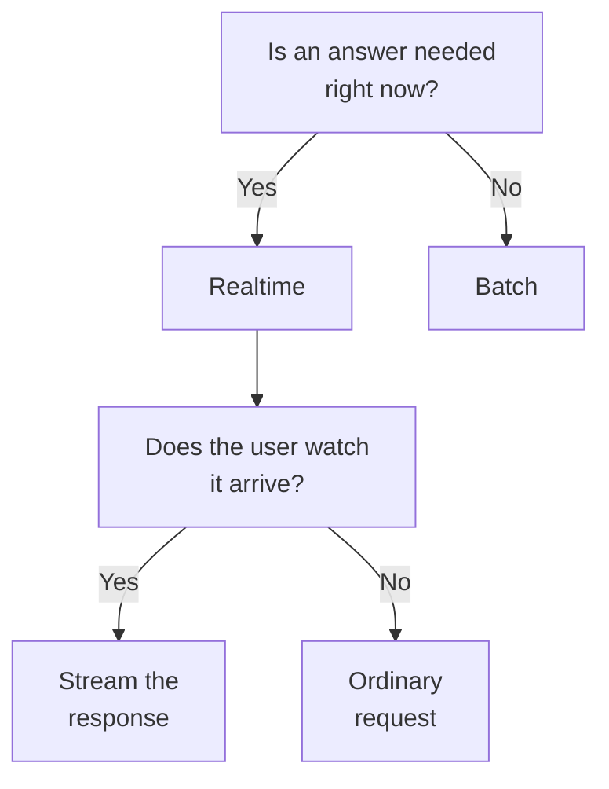

# Domain 2 — Applications and Integration

This domain is 33.1 percent of the exam, spread across six separately weighted skills:
understanding requirements, systems life cycle, Claude API mechanics, software engineering
foundations, Claude application design, and configuration management. It is the largest
domain by a wide margin, and on the published evidence its questions read more like design
reviews than like knowledge tests.

The published samples and this practice set are strongly scenario-driven: the stem supplies a
constraint and the options are all meant to be technically plausible. Cost, latency, data residency, a rule that must hold every time, a client that has to
keep running when the vendor ships something new: the constraint is in the stem. The
answer is the option that respects it, so read for the constraint before you read the
options.

The six skills are not equally weighted, and the exam overview carries the table that says by
how much; if you are budgeting study time across this domain, read it there first. Claude API
mechanics, application design and configuration management carry the most, and requirements
and life cycle the least.

The sections below do not follow the guide's order, which is a taxonomy rather than a path.
Requirements come first, because every later decision is made against one. Then the two
things a request settles before anything is built: whether it needs an answer now, and what
the caller has to send. Configuration and maintenance come last, because "where does this
instruction belong" is unanswerable until you know what sits around the model.

---

## What this domain actually asks

Three habits carry most of the marks.

**Find the constraint, then eliminate.** Options on this domain are rarely wrong in
themselves. They are wrong against the requirement the stem stated, and a requirement you
cannot check is not one — building starts with defining success criteria and then designing
evaluations against them.

**Know what is stateless and what is not.** The core Messages API is stateless. A surprising
amount of this domain — cost growth, caching, session design, why long conversations behave
the way they do — is that one fact, followed downstream.

**Separate the thing from the place it is configured.** Which model answers, which version
of the contract you are on, where the session runs, which file an instruction sits in: these
are independent choices, and confusing two of them is how a plausible option goes wrong.

---

## Turning a business requirement into something you can check

**A requirement that cannot be checked is not a requirement.** Building an application on a
large language model (LLM) starts with clearly defining success criteria and then designing
evaluations to measure performance against them, in that order.

Good criteria are **specific** and **measurable**. Specific means saying what you actually
want: the documentation's own contrast is between "good performance" and "accurate sentiment
classification". Measurable means a quantitative metric or a well-defined qualitative scale,
so that two people reading the result agree on whether it was met.

| Term | What it is | Confused with | The separator |
|---|---|---|---|
| Specific criterion | A named outcome, such as accurate sentiment classification | A goal everyone agrees with | Two readers would score the same output the same way |
| Vague goal | A direction of travel, such as better summaries | A requirement | Nothing can be tested against it |

Resist collapsing everything into one number. Most use cases need multidimensional
evaluation along several success criteria, and the criterion you left out is the one the
system will fail on. Evaluations should also be **task-specific**, designed to mirror the
real-world task distribution, because a generic test measures something other than the thing
the requirement names.

Latency is the infrastructure requirement this domain asks about most. It is the time taken
for the model to process a prompt and generate an output, and it is influenced by the size
of the model, the complexity of the prompt and the underlying infrastructure. Two named
measurements matter, and they answer different questions:

- **Baseline latency** — the time to process the prompt and generate the response, without
  regard to input and output tokens per second.
- **Time to first token** — how long from sending the prompt until the first token of the
  response appears.

A requirement about *perceived* responsiveness is a time-to-first-token requirement, and it
is why streaming often answers it when a faster model does not.

> **Trap.** The order of work runs the opposite way to instinct. Engineer a prompt that
> works well without model or prompt constraints first, and try latency reduction
> afterwards, because reducing latency prematurely can stop you discovering what top
> performance looks like. An option that starts by shrinking the prompt has optimised before
> it knows what it is giving up.

One more infrastructure fact belongs here. A **rate limit** sets the maximum number of API
requests an organisation can make over a defined period. But limits can bite over shorter
intervals than the one they are quoted in. Short bursts can exceed the limit and trigger
errors while the average sits comfortably inside it, so the requirement is about the shape of
the traffic and not only its volume.

---

## Realtime or batch, and what actually decides it

**The deciding question is whether an immediate response is required, not whether the volume
is large.** The Message Batches API processes large volumes of requests asynchronously, with
most batches finishing in less than an hour, while reducing costs by 50 percent and
increasing throughput. That is a genuine saving and it is not free: you get the results when
the batch is done.

Batch fits when large volumes are processed, immediate responses are not required, cost
efficiency matters, or large-scale evaluations are being run. A workload that is high volume
*and* latency-sensitive gets nothing from it.

The mechanics are worth knowing because they bound the design. The system creates the batch,
processes it asynchronously with each request handled independently, and you poll for status
and collect results when processing has ended. Because each request is independent, you can
mix different kinds of request in one batch.

| What you can put in a batch | What you cannot |
|---|---|
| Vision, tool use, system messages, multi-turn conversations, extended thinking | Streaming, because results come back as a single file |
| Different request types mixed together in one batch | A small named list of parameters that returns a validation error |

Two operational limits shape what a batch can be used for. A batch is not a queue that waits
forever: batches expire if processing does not complete within 24 hours, and results are
available for a limited window after creation before they can no longer be downloaded.

> **Currency caveat.** The figures here — batch size ceilings, the 24-hour expiry, the
> result-retention window — are published operational numbers that Anthropic revises. **This
> does not change the exam answer.** The objectives ask which approach fits a constraint,
> not what a quota currently is. Answer on the shape: a batch has a ceiling and a deadline.
> A candidate who tries to recall the figure will lose time and gain nothing.

<b>Self-check — realtime, batch and streaming</b>

1. A nightly job scores 40,000 support tickets and the results are read the next morning.
   Cost is the primary concern. Which approach, and which single phrase in that sentence
   decides it?
2. A team wants batch pricing and a live progress bar. What has to give, and why?
3. Your batch of 5,000 requests uses vision on half of them and tool use on the rest. Is
   that a problem?
4. A workload is high volume and every response is needed within two seconds. Does batch
   help?
5. Your traffic averages well under the published rate limit and you still see rate limit
   errors. What is the likely explanation?

**Answers.** 1. Batch — "read the next morning" says immediate responses are not required,
which is the condition, and cost being primary is what makes the 50 percent saving decisive.
2. The progress bar. Streaming cannot be combined with batch processing, because batch
results come back as a single file rather than a stream. 3. No. Almost any request you can
make can go in a batch, including vision and tool use, and each request is processed
independently so types can be mixed. 4. No. Batch is asynchronous; the volume is irrelevant
if the latency requirement stands. 5. Bursts. Limits can bite over shorter intervals than
the one they are quoted in, so a spiky pattern exceeds them while the average does not.

---

## What the API remembers, and what you have to send

**The core Messages API is stateless: each request supplies the whole conversation it
needs.** Read that once more, because a great deal of this domain is that single fact
followed downstream. It is a statement about that API layer, not a claim that nothing on the
platform can hold state — several things can, and the rest of this page names them. There is no server-side conversation to append to, which is why long
conversations cost more each turn, why prompt caching exists at all, and why keeping track
of a conversation is the application's job.

Two consequences follow immediately. Earlier turns do not have to have originated from
Claude — synthetic assistant messages are a supported way to build up a conversation,
because the API has no record to contradict. And a system instruction is not fixed at the
start. On the models and platforms that support it, a message with the system role can be
added after a user turn to introduce an instruction partway through. It cannot be the first
entry in the list.

That mid-conversation instruction carries the same authority as the top-level system field.
What differs is where it lands: because it is appended to the end of the history, it does not
invalidate a cached prefix that came before it. Same authority, different cost.

| Term | What it is | Confused with | The separator |
|---|---|---|---|
| Stateless API | Every request carries the whole history | A server-side conversation | Nothing is stored between requests |
| Kit session | History a software development kit accumulates and can return to | The API remembering | It persists the conversation, not the filesystem |
| Managed session | A running agent instance that owns a sandbox | A kit session | Its filesystem lives and dies with the session |

That table is where the exam trap lives, because one word covers two mechanisms. **In the
Claude Agent SDK, sessions persist the conversation, not the filesystem.** Returning to one
gives the agent full context from before: files it read, analysis it performed, decisions it
made. Nothing restores the state of the disk, so a resumed run can be reasoning confidently
about a file that has since changed.

A **Claude Managed Agents session is a different resource** and does not behave that way. It
is stateful by design, with an associated sandbox: deleting the session permanently removes
its record, its events and that sandbox, and files the session itself produced go with the
filesystem. So before answering any question about what survives, establish which of the two
the scenario is describing.

Session management is also not universal. It comes into play when several prompts are sent
that should share context, and how much of it an application needs depends on the
application's shape; a single-shot classification endpoint needs none.

**Streaming** is the other thing statelessness makes visible. Setting the stream flag returns
the response incrementally using server-sent events. It is usually a user-experience choice, with one
exception worth knowing. For requests with large maximum token values the software
development kits require streaming to avoid timeouts, so at that size it stops being optional
and becomes a transport requirement.

---

## Making the cache pay

**Prompt caching caches a prefix, not a selection.** It lets a request resume from a specific
prefix, which cuts processing time and cost for repetitive tasks or prompts with consistent
elements. Caching references the entire prompt — tools, system and messages, in that order —
up to and including the block marked for caching.

That ordering is the whole design rule. Anything that changes early invalidates everything
after it, so stable content goes first and volatile content goes last. A team that puts a
timestamp near the top of the system prompt has quietly disabled its own cache.

There are two ways to place the boundary:

- **Automatic caching** applies the cache breakpoint to the last cacheable block and moves it
  forward as the conversation grows. It suits multi-turn conversations where the growing
  history should be cached as it accumulates.
- **Explicit cache breakpoints** put the marker on individual content blocks, for
  fine-grained control over exactly what is cached.

The lifetime mechanics are where people get caught. By default a cache entry lives five
minutes, and it is **refreshed at no additional cost each time the cached content is used**,
so an active conversation keeps its own entry alive without paying to write it again. A
longer duration is available at additional cost.

Read "no additional cost" precisely, because it is about the **refresh** and not about the
read. Caching has its own prices against the base input rate: a five-minute write costs more
than base input, a one-hour write costs more again, and a hit costs a fraction of it. So
there is no charge for holding an entry warm, and reuse is not free either — it is cheap,
and cheaper than sending the same content uncached. A cost argument against caching has to
compare those two, not assume reuse costs nothing.

> **Trap.** The lifetime is measured from the **start** of the request that writes or reads
> the entry, not from the end of its response, and time spent generating counts against it.
> After a response that took four minutes to stream, most of a five-minute window is already
> gone. A design that assumes the clock starts when the response finishes will miss the cache
> and never understand why.

<b>Self-check — caching</b>

1. Your system prompt ends with the current date and time, refreshed per request. What has
   that done to the cache, and why?
2. A conversation reuses its cached prefix every 30 seconds for an hour. What does keeping
   that cache alive cost?
3. A long response streams for four minutes, and the follow-up request a minute later misses
   the cache. Explain it.
4. Which caching mode suits a growing multi-turn conversation, and what does it do as the
   conversation grows?
5. A new instruction has to be added partway through a long cached conversation. Where does
   it go, and why does that matter for cost?

**Answers.** 1. It has disabled it. Caching covers the prefix up to the marked block, so a
value that changes every request invalidates everything after it. 2. Nothing for holding it
open — the refresh is free — but each hit is billed at a fraction of the base input rate. 3. The lifetime
runs from the start of the request, and generation time counts against it, so four of the
five minutes were spent streaming. 4. Automatic caching, which moves the breakpoint to the
last cacheable block as the conversation grows. 5. On a model that supports it, as a
mid-conversation system message, which carries the same authority as the top-level field
but, being appended at the end, does not invalidate the cached prefix before it.

---

## Getting output you can actually parse

**Careful prompting is not a guarantee.** Without constrained decoding, Claude can produce
malformed JSON or invalid tool inputs, and the documentation is explicit that even with
careful prompting you may still see parsing errors, missing required fields, inconsistent
data types and schema violations needing retries.

Structured outputs constrain the response to follow a schema, and they come as two features
that do different jobs:

| Feature | What it constrains | Reach for it when |
|---|---|---|
| JSON outputs | The shape of Claude's response | Downstream code parses the answer directly |
| Strict tool use | Tool names and inputs, validated against the schema | Bad arguments reach a real system |

They are independent, and can be used separately or together in the same request. A team that
needs valid tool arguments does not have to constrain the response format as well.

It helps to know what JSON actually promises, because schema design rests on it. JSON is a
lightweight, text-based, language-independent interchange format. A JSON **object** is an
*unordered* collection of name/value pairs; a JSON **array** is an *ordered* sequence. Code
that relies on object key order relies on something the format does not promise, and a schema
that needs a guaranteed order uses an array. A value is a string, number, boolean, null,
object or array — a closed set, which is why a date or a decimal needs a convention agreed on
top of the format rather than a type within it.

Tool definitions carry two parts, and they are not interchangeable:

| Term | What it is | Confused with | The separator |
|---|---|---|---|
| Tool description | Plain text saying what the tool does, when to use it, how it behaves | Documentation for humans | It is what Claude matches the task against |
| Input schema | A JSON Schema object defining expected parameters | The thing that decides tool choice | Its job is the arguments; the description is what selection is matched against |

**Detailed descriptions are by far the most important factor in tool performance** — the
documentation says exactly that, so treat a wrong-tool problem as a description problem
first. A description should aim for at least three or four sentences and cover what the tool
does, when it should and should not be used, what each parameter means, and any caveats or
limitations. The clause authors omit is the negative one, and it is the clause that stops a
tool being called for the wrong job.

<b>Self-check — output and schemas</b>

1. Claude keeps returning JSON that fails to parse, and the prompt already asks for valid
   JSON in three places. What is the actual fix, and why is more prompting not it?
2. Your agent calls the right tool with the wrong arguments. Which of the two structured
   output features addresses that?
3. Downstream code reads the third key of a returned object. What is wrong with that?
4. The model keeps choosing a search tool when it should choose a lookup tool. Description
   or schema?
5. A schema needs to express a date. What does the format give you, and what does it not?

**Answers.** 1. Structured outputs, which constrain the response through constrained
decoding. Prompting makes valid output likely; it is explicitly not a guarantee. 2. Strict
tool use, which validates tool names and inputs against the schema. 3. A JSON object is an
unordered collection of name/value pairs, so position is not promised; an array is the
ordered structure. 4. Description. The schema's job is the arguments; the description is what selection is
matched against, and descriptions are by far the most important factor in tool performance. 5. A closed set of
value types — string, number, boolean, null, object, array — and no date type, so a date
needs a convention agreed on top of the format.

---

## Choosing where Claude runs

The same model is reachable through Anthropic's own API and through several cloud providers,
and the useful generalisation is that **the request survives the move and the boundaries do
not**.

| What differs | Amazon Bedrock | Google Cloud |
|---|---|---|
| Request shape | The same Messages API shape as the first-party API | Nearly identical, with two named differences |
| Model selection | In the request as usual | In the endpoint URL, not the request body |
| Version | Header as usual | In the request body |

Claude in Amazon Bedrock runs on infrastructure managed by Amazon Web Services (AWS) with
zero operator access. That is what lets a team build sensitive applications entirely inside
the AWS security boundary while keeping the request shape it already uses. Microsoft Foundry
offers two hosting options chosen when the deployment is configured — one where an
Anthropic-operated service runs on Azure infrastructure, one where it runs on Anthropic's.
Note the shape of that: both are an Anthropic-operated service, and only the infrastructure
underneath differs.

What genuinely changes when you move is everything around the request. Authentication
integrates with the cloud provider's own identity and access management rather than following
the first-party API-key pattern. Feature
availability differs in checkable ways: on Amazon Bedrock and Google Cloud only
base64-encoded image sources are available, so a design built on uploaded file identifiers
does not port unchanged. And partner-operated platforms carry their own request size limits.

<b>Self-check — providers</b>

1. A regulated customer requires that inference happen inside their existing cloud security
   boundary. Does that force a rewrite of the request code?
2. Your application uploads images once and references them by identifier across many
   requests. What happens when you move to Amazon Bedrock?
3. What is the first thing that changes about credentials when you move to a cloud provider?
4. Both Microsoft Foundry hosting options are described the same way in one respect. Which?
5. Name the two request-format differences on Google Cloud.

**Answers.** 1. No. Bedrock uses the same Messages API shape as the first-party API; what
changes is authentication, feature availability and limits. 2. It breaks — only
base64-encoded image sources are available there, so images have to be embedded in the
request. 3. Authentication integrates with the cloud provider's identity and access
management system instead of an Anthropic key. 4. Both are an Anthropic-operated service;
only the infrastructure it runs on differs. 5. The model moves into the endpoint URL, and the
version moves into the request body.

---

## One model, several front doors

**The model is the same; the harness around it is not.** Claude Code is Anthropic's agentic
coding harness. It supplies the tools, the context management and the execution environment
that turn a language model into a capable coding agent, and it is one harness among several —
the agent software development kit and the hosted service are others. It works through three phases — gather context,
take action, verify results — and you can interrupt at any point to steer it, add context or
ask for a different approach. A direct API call has none of that unless the application
builds it.

That is the answer to most questions about how Claude interprets instructions across
interfaces. An instruction that works in one surface may have nothing to interpret it in
another, because the surface, not the model, supplies the loop.

Two extension mechanisms are worth naming here, because they decide where behaviour lives.
**Skills** are markdown files containing knowledge, workflows or instructions, invoked with a
command or loaded automatically when relevant. **Plugins** bundle skills, hooks, subagents and
MCP servers — servers built on the Model Context Protocol (MCP) — into a single installable
unit, with plugin skills namespaced so several plugins can coexist without their commands
colliding.

Three request-shaping facts belong to design rather than to mechanics. **Thinking** puts
Claude's reasoning in blocks ahead of the response. Those tokens are billed as output tokens
even when the text is not returned to you, and they count toward the maximum token limit
alongside the answer. Extended thinking and a long response therefore compete for one budget.
Each thinking block also carries a signature, passed back unchanged in multi-turn and
tool-use conversations. A client that strips it breaks the conversation rather than saving
space.
And **vision** accepts images three ways — embedded, by URL, or by an identifier from an
upload — with Claude working best when images come before text.

It is worth knowing what the alternative would actually do. Fine-tuning further trains a
pretrained model on additional data, so it starts to mimic the patterns and
characteristics of that dataset — every habit in it, not only the wanted ones. It also
needs careful consideration of the data and of the effect on the model's performance and
biases.

> **Currency caveat.** The documentation says the Claude API does not *currently* offer
> fine-tuning, which is a dated statement rather than a permanent one. **This does not change
> the exam answer.** The design question the objectives ask is how domain knowledge reaches
> the model, and for that question the supported approach is to supply it through context
> — retrieval, tools and the instructions you write. Pick the option that puts the knowledge in front of the model, and reject a
> fine-tuning option on that design argument rather than on availability alone.

---

## Where configuration belongs, and which one wins

This is the section to read twice. Claude Code has two kinds of file that both look like
configuration, and **their ordering rules run in opposite directions**.

Instruction files — CLAUDE.md and the auto memory Claude writes for itself — are loaded as
*context*. They live in several locations loaded from broadest scope to most specific, so a
project instruction appears in context after a user instruction. Settings files are resolved by
**settings precedence**: when the same key appears in more than one place, the value from the highest
level that sets it wins, and a higher level overrides that key anywhere below.

| Mechanism | How several sources combine | What it gives you |
|---|---|---|
| Instruction files | Loaded broadest scope first, most specific last | Context Claude reads, followed more consistently when specific |
| settings.json | Highest precedence level wins for each key | Configuration that resolves to one value |

**The difference that matters most is not the ordering — it is that one of them is not
enforcement at all.** Claude treats instruction files as context, not enforced configuration.
More specific and concise instructions are followed more consistently, but consistency is not
a guarantee. An action that must be blocked independently of what Claude decides needs a
control outside the instruction layer, and in Claude Code that control is a hook.

| Term | What it is | Confused with | The separator |
|---|---|---|---|
| Instruction file | Context loaded every session | A rule that is enforced | Claude weighs it; a hook fires regardless |
| Auto memory | Notes Claude writes from your corrections | Instructions you wrote | Who writes it |

The precedence stack has one shape worth memorising and one exception worth memorising with
it. **Managed settings deployed by an organisation sit at the top, and nothing you set
overrides them** — not even a key passed on the command line. The exception runs in the safe
direction only: for a few security-sensitive keys, a stricter value from a lower level is
honoured over the managed one. A developer can tighten a managed setting and cannot loosen
it.

Two more facts explain most "my setting is being ignored" reports. Environment variables are
**not a level in the stack**; where a behaviour has both a shell variable and a settings key,
which one applies is decided per pair rather than by level. And the ordinary cause is simply
precedence: another settings file, a command-line flag or a managed source is setting that
key above yours.

Placement is the everyday judgement. Claude Code reads configuration from a directory in the
project and from one in the home directory, and choosing between them is choosing between
everyone working on this project and you across every project. Within the instruction file
itself, keep it to facts Claude should hold in every session — build commands, conventions,
project layout. An entry that is a multi-step procedure, or that only matters for one part of
the codebase, belongs in a skill or a path-scoped rule instead. Everything in the
always-loaded file costs context in every session, whether it is relevant or not.

<b>Self-check — configuration</b>

1. A user-level instruction file and a project-level one disagree. Which one "wins", and why
   is that the wrong question?
2. A key set in your project settings has no effect. Name two explanations.
3. Your organisation deploys a managed setting you find inconvenient. Can you override it
   locally? Can you make it stricter?
4. A rule must hold on every single edit, with no exceptions. Where does it belong, and why
   is an instruction file not enough?
5. A ten-step release procedure is currently in the always-loaded instruction file. What is
   the argument for moving it, and where to?

**Answers.** 1. Neither overrides the other in the settings sense — instruction files are
loaded as context, broadest scope first, so both are present and the project one appears
later. Precedence is a settings concept, not an instruction-file one. 2. A higher precedence
level sets it — another file, a command-line flag or a managed source — or an environment
variable applies for that particular key, since variables are decided per pair rather than by
level. 3. No, and yes: nothing you set overrides a managed setting, but for a few
security-sensitive keys a stricter value from a lower level is honoured. 4. A hook. Claude
treats instruction files as context rather than enforced configuration, so "no exceptions"
needs something that fires whatever the model decides. 5. It is a multi-step procedure, so it
belongs in a skill or a path-scoped rule; keeping it in the always-loaded file spends context
in every session that has nothing to do with releasing.

---

## Keeping it running once it ships

Two pins keep an integration stable, and they are independent of each other.

Every first-party Claude API request carries an `anthropic-version` header, which fixes the
request and response contract; the official client SDKs send it for you. Provider-operated
integrations can express the same version differently — on Google Cloud it moves into the
request body — so read the header rule as the first-party form rather than a universal one. Within a version, existing input and output
parameters are preserved — but Anthropic may add optional inputs, add values to the output,
change the conditions for specific error types, and add new variants to enum-like output
values. **A client that treats today's set of values as closed will break on an addition that
breaks nothing else**, which is the argument for defensive parsing. Anthropic recommends
using the latest version where possible, and previous versions are considered deprecated.

The other pin is the model. Each model identifier identifies a pinned version mapping to a
single fixed, pinned snapshot, and the documentation names the belief that a dateless identifier is
an evergreen pointer to the latest model as a common misconception. What *does* move is a
**model alias**: it points to the recommended version for your provider and updates over time. Use
an alias when you want the recommendation; pin the full model name when the workload must not
change under you.

The same shape appears one layer out. A plugin dependency tracks the latest available version
by default, so an upstream release can change it under your plugin without warning, and a
version constraint holds it at a tested range until you choose to move. When you install a
plugin that declares dependencies, Claude Code resolves and installs them automatically,
apart from a couple of source types you install yourself first.

Error handling is the other half of operating this. The official software development kits
already retry transient failures — connection errors, rate limits and server errors — with
exponential backoff, twice by default, honouring the retry-after header when present. Writing
another retry layer on top usually multiplies attempts rather than adding resilience.

| Symptom | What it means | What to do |
|---|---|---|
| Rate limit with a retry-after header | Your request volume against its allowance | Back off; the kits already do |
| Rate limit from a spend cap, no retry-after | Access is suspended until it resumes | Stop and fix the account |
| Overloaded error | High traffic across all users, not your request | Retry with exponential backoff |

That middle row is the one worth carrying: two failures share a status code and have opposite
correct responses, and retrying the spend-cap one is a loop that never exits.

<b>Self-check — running it in production</b>

1. You pinned the model identifier. Is the request and response contract now pinned too?
2. A client parses an enum-like output field with an exhaustive switch and no default. What
   will eventually happen, and is it a version change?
3. An alias and a full model name are both offered in a settings file. Which does a workload
   that must not change under you take?
4. A plugin that worked last week behaves differently today, with no change on your side.
   What is the likely cause?
5. Your integration retries a rate limit error forever and never recovers. What kind of rate
   limit is it, and how would you have known?

**Answers.** 1. No. The version header fixes the contract and the model identifier fixes
which model answers; the two pins are independent. 2. It will break when a new variant is
added, which is permitted within a version — existing values are preserved but new ones may
appear. 3. The full model name. An alias points to the recommended version and updates over
time. 4. A dependency tracking the latest version by default, changed by an upstream release;
a version constraint would have held it. 5. A spend-cap one, which carries no retry-after
header and keeps failing until access resumes — the absent header is the signal.

---

## The engineering underneath

The guide names core software engineering practices in this domain, and they show up as the
reason an option is safe rather than as topics in their own right.

**Retry safety is a property of the method, not of the client.** A Hypertext Transfer
Protocol (HTTP) request using an idempotent method can safely be retried when there is doubt whether it arrived, because
multiple identical requests do no harm. Safe methods are idempotent, as are `PUT` and
`DELETE`; `POST` and `PATCH` carry no such guarantee.

Read "idempotent" precisely, because it is narrower than it sounds. The specification
defines it in terms of the *intended* effect of the client on the server, so an idempotent
request can still have side effects — the server may log when each one arrived. It is a
statement about what the caller meant, which is why the next paragraph matters.

| Term | What it is | Confused with | The separator |
|---|---|---|---|
| Idempotent method | Repeats do no harm | A promise about the server | Nothing stops a server exposing a non-idempotent endpoint under one |
| Safe method | Does not change state | Idempotent | All safe methods are idempotent; not all idempotent methods are safe |

That right-hand cell matters more than it looks. The method name is evidence about intent
rather than proof of behaviour, so a retry policy built purely on the verb is resting on a
convention the server is free to break.

**Asynchronous code fails without failing.** In Python's asyncio, simply calling a coroutine
does not schedule it to be executed — it returns an object. Work created and never awaited is
work that never runs, and what you see is a request that did nothing rather than an
exception. It is not necessarily silent: Python raises a warning about a coroutine that was
never awaited, which is worth switching on in tests. Coroutines declared with async and await are the preferred way of writing such
applications.

Version control carries the life cycle. Git's own documentation describes a feature
graduating between branches as it goes from experimental to stable, reaching the release line
once it is considered stable enough. Code earns its way forward as confidence in it grows.
That is the life cycle idea the objectives name, in a tool you already use.

> **Currency caveat.** Claude Code's automated code review on pull requests is in research
> preview and
> limited to particular plans, so it postdates the exam guide this material tracks. **This
> does not change the exam answer, so the feature's own details are not worth revision
> time.** What is examinable is the design question underneath it: whether an automated check sits alongside
> a human decision as advice, or replaces it as a gate. Findings that are advisory leave the
> existing process and its accountability intact.

---

## Traps worth carrying into the exam

- **The API remembers nothing.** Every request carries the whole history, and most of this
  domain follows from that.
- **Caching covers a prefix.** Anything volatile near the front invalidates everything
  behind it.
- **Cache lifetime starts when the request starts**, and generation time counts against it.
- **Instruction files are context; settings resolve by precedence.** Opposite ordering rules,
  and only one of them is enforcement.
- **A dateless model identifier is still pinned.** The thing that moves is an alias.
- **A kit session restores the conversation, not the disk** — but a managed session owns a
  sandbox that goes when it does.
- **Fine-tuning is not the answer** to a domain-knowledge gap on this platform; context is.
- **Batch is decided by "is an answer needed now", not by volume.**
