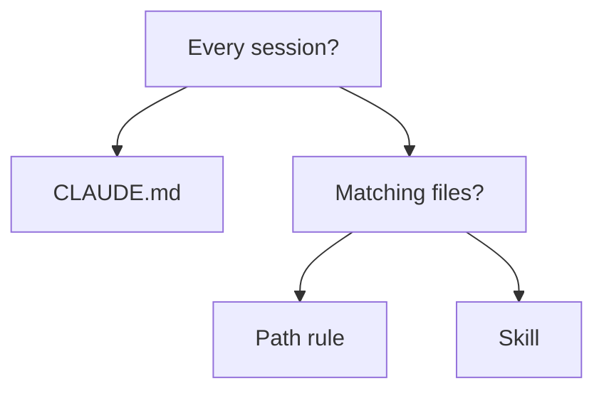

# Domain 3 — Claude Code

This is the smallest domain on the exam and the one most likely to be answered from habit
rather than from knowledge. It has a single skill, and that skill's description reads like an
inventory: rules, skills, commands, agents, agent memory, session management, slash commands,
headless mode, streaming mode, the CLAUDE.md hierarchy, repository initialization, and
settings.json configuration.

Read that list again and notice what it is. It is a list of **places to put things** and
**ways to run**. Almost nothing here is a definition question. The questions give you a piece
of guidance, a constraint, and several plausible homes for it, and ask which home is right.

---

## The question this domain actually asks

Every component in the inventory answers the same two questions: **where does this belong, and
when does it load?** Get those two straight and the domain mostly answers itself.

Start with the thing that surprises people. Claude Code has two memory systems — CLAUDE.md
files that you write, and auto memory that Claude writes — and **both are context, not enforced
configuration.** Claude reads them and is guided by them. The more specific and concise your
instructions, the more consistently Claude follows them, but consistency is not a guarantee.

That matters because of what it rules out. When a requirement is *this must never happen*, no
amount of instruction satisfies it. To block an action regardless of what Claude decides, you
need a control outside the instruction layer — a `PreToolUse` hook. A question that says
"must never" and offers you a CLAUDE.md line is offering you the wrong answer, however well
written the line is.

With that settled, placement is a question about loading cost:

---

## CLAUDE.md and its hierarchy

A project CLAUDE.md can be stored at either `./CLAUDE.md` or `./.claude/CLAUDE.md`. If the file
does not exist yet, `/init` writes a first version: it analyses the codebase and generates a
starting file with the build commands, test instructions and conventions it discovers. Run it
on a repository that already has a CLAUDE.md and it **suggests improvements rather than
overwriting** — a useful thing to know, because "it will overwrite what we wrote" is the reason
teams avoid it.

The files live at four scopes, listed here in load order, broadest first:

| Scope | Location | Reaches |
|---|---|---|
| Managed policy | A system location your organization controls | Everyone in the organization |
| User instructions | `~/.claude/CLAUDE.md` | You, in every project |
| Project instructions | `./CLAUDE.md` or `./.claude/CLAUDE.md` | The team, through source control |
| Local instructions | `./CLAUDE.local.md` | You, in this project only |

Two loading facts do most of the work. **Upward at launch:** Claude Code loads CLAUDE.md and
CLAUDE.local.md from your working directory and every directory above it. **Downward on
demand:** files in subdirectories below you are not loaded at launch and are included when
Claude reads files in those subdirectories. Start Claude in a monorepo package and you get the
repository root's instructions and the package's, but not a sibling package's — until you touch
a file there.

Now the fact this domain builds a question on. **All discovered files are concatenated into
context rather than overriding each other**, ordered from the filesystem root down to your
working directory. Nothing wins. The nearest file is read *last*, not *instead*. If the root
file says one thing and the package file says another, both are in context and Claude is
holding a contradiction — which is an argument for fixing the files, not for trusting the
order. Keep that in mind until the settings section, where the rule is the opposite.

Run `/memory` to see and open these files from inside a session.

---

## Rules: instructions that load when they are relevant

When CLAUDE.md grows past the point where anyone reads it, the answer is not a bigger CLAUDE.md.
It is `.claude/rules/`, a directory of topic files — all `.md` files discovered recursively —
that keeps instructions modular.

The examinable part is one frontmatter field:

- A rule **without** `paths` frontmatter loads at launch, with the same priority as
  `.claude/CLAUDE.md`. You have moved the text, not the cost.
- A rule **with** `paths` frontmatter loads only when Claude works with files matching the
  pattern. Now a convention about the API layer costs nothing in a session about the front end.

That second case is the whole reason rules exist. A twelve-step database runbook that matters
to two engineers a few times a year does not belong in a file every session loads in full.

Personal rules in `~/.claude/rules/` apply to every project on your machine. User-level rules
are loaded *before* project rules, which gives project rules the higher priority — remember
that later means stronger here, the same as the CLAUDE.md ordering.

Rules are guidance, like CLAUDE.md, and they are not the only home for conditional content.
For instructions that do not need to be in context at all until they are used, the answer is a
skill.

---

## Agent memory: what Claude writes for itself

Auto memory is the second memory system, and the separator is simply **who writes it**.

| | CLAUDE.md files | Auto memory |
|---|---|---|
| Written by | You | Claude |
| Holds | Instructions and rules | Learnings and patterns |
| Scope | Project, user, or organization | Per repository |

Claude saves four kinds of note — your role and preferences, corrections you gave it,
project decisions, and pointers to information outside the repository. What it deliberately
**skips** is anything derivable from the codebase, such as architecture, file paths or
debugging fixes, and anything your CLAUDE.md files already say. So "record the architecture in
auto memory so Claude stops re-reading the code" describes the one thing it does not do.

Loading follows the pattern you have now seen twice. An index file loads at the start of every
conversation — the first 200 lines or the first 25KB, whichever comes first — and content past
that threshold does not. Topic files are not loaded at startup at all; Claude reads them on
demand when it needs them.

> **Currency.** Those two figures are published limits, and published limits move. The durable
> shape is the one to carry in: a small index always loads, the detail behind it does not.

---

## Skills and commands

A skill is a `SKILL.md` file of instructions. Claude uses it when it judges it relevant, or you
invoke it directly with `/skill-name`. The sentence that matters for the exam is this one:
**unlike CLAUDE.md content, a skill's body loads only when it is used**, so long reference
material costs almost nothing until you need it.

That gives you a clean three-way choice:

| Put it in | When it loads |
|---|---|
| CLAUDE.md | Every session |
| A rule with `paths` | When Claude touches a matching file |
| A skill | When you invoke it, or when Claude judges it relevant |

**Custom commands have been merged into skills.** A file at `.claude/commands/deploy.md` and a
skill at `.claude/skills/deploy/SKILL.md` both create `/deploy` and work the same way, and
existing `.claude/commands/` files keep working. Where a skill and a command share a name, the
skill takes precedence. Skills add what commands lacked: a directory for supporting files, and
frontmatter controlling who may invoke them.

Where a skill is stored decides who can use it, and here Claude Code does something it does not
do for CLAUDE.md. When skills share a name it **resolves the conflict by source**: across
levels, enterprise overrides personal, and personal overrides project. That is a genuine
override stack. Hold it next to the concatenation rule from earlier — two mechanisms in one
product, resolving conflicts in opposite directions.

Built-in commands are the ones coded into the tool. Type `/` to see what is available. A
command is only recognised at the **start** of a message, and text after the command name
becomes its arguments. Send one while Claude is responding and it is queued until the turn
finishes, apart from a few that run immediately.

<b>Self-check — placement</b>

1. A convention must hold on every run, without exception. Where does it belong?
2. A twelve-step runbook is used twice a year. Where does it belong, and why not CLAUDE.md?
3. The repository root CLAUDE.md and a package CLAUDE.md disagree. Which one wins?
4. What separates a rule from a skill?
5. A `deploy` skill exists in your home directory and in the project. Which runs?

**Answers.** 1. Nowhere in the instruction layer — instructions are context, not enforcement,
so a must-never requirement needs a `PreToolUse` hook. 2. A skill, whose body loads only when
used; CLAUDE.md would load all twelve steps in every session that ignores them. 3. Neither.
The files are concatenated, both are in context, and the package one is merely read last.
4. What triggers the load: a path match for a rule, invocation or judged relevance for a skill.
5. The personal one — across levels, personal overrides project.

---

## Agents

Subagents are specialised assistants for a side task that would otherwise flood the main
conversation with search results, logs or file contents you will not look at again. Each runs
in its own context window with its own system prompt, tool access and permissions, and returns
only its summary.

Domain 1 covers what agents are and when to reach for one. The fact that belongs to *this*
domain is where agents meet agent memory: the main conversation's auto memory **is not loaded
into subagents**. The exception is a fork, which inherits the parent conversation and system
prompt. A subagent's own auto memory is a separate directory.

---

## Sessions

A session is a saved conversation tied to a project directory. Claude Code stores it locally as
you work, so you can resume it, branch it to try another approach, or move between tasks.

| Entry point | What it does |
|---|---|
| `claude --continue` | Resumes the most recent interactive session in this directory |
| `claude --resume` | Opens the session picker |
| `claude --resume` plus a name | Resumes that session directly |
| `/resume` | Switches conversation from inside an active session |

A resumed session restores the full conversation history, including tool calls and results, and
continues on the model it was using — unless that model has been retired or disallowed, or a
flag or environment variable picks one at launch.

The fact worth carrying in is an absence. **Sessions created with `claude -p`, or by the Agent
SDK, are left out of the session picker and out of `claude --continue`.** They are still
stored, and you can still resume one, but only by passing its session identifier to `claude --resume`.
A scripted run does not appear in the interactive list, and a team that has not met this
concludes the run was never saved.

---

## Headless and streaming

Add `-p`, or `--print`, to any `claude` command to run it non-interactively. Claude Code exits
with code 0 on success and a non-zero code on failure, so a script can branch on the exit
status — which is what makes this usable in a build pipeline rather than merely possible.

`--output-format` decides how the response comes back, and the choice follows from who is
reading it:

| Format | Shape | Reach for it when |
|---|---|---|
| `text` | Plain text, the default | A human reads the output |
| `json` | One structured payload with the result, session identifier and metadata | A script parses one answer at the end |
| `stream-json` | Newline-delimited JSON, emitted as the run proceeds | Something needs to show progress live |

**Streaming mode is that third format.** A dashboard that displays work as it happens needs
`stream-json`; no verbosity flag on its own turns plain output into a live feed.

One distinction worth holding, because the two are easy to run together. `stream-json` emits
**events as the run proceeds** — enough for a progress display. Getting **tokens as they are
generated** is a combination rather than a format: that output format plus `--verbose` and
`--include-partial-messages`. Ask which of the two a requirement actually needs before
reaching for the longer form.

The `json` format also carries a per-run cost figure, which is a client-side estimate rather
than your bill.

---

## Auto mode

Auto mode removes routine permission prompts. It does **not** approve everything, and that
distinction is the whole of it.

Tool calls are routed through a classifier that blocks anything irreversible, destructive, or
aimed outside your environment. Your own **deny and explicit ask rules are evaluated before the
classifier** and still block or prompt, so turning auto mode on does not discard the rules your
team wrote.

By default the classifier trusts only your working directory and the current repository's
configured remotes. That is why a team switching it on often finds routine internal operations
blocked — pushing to the company source-control organization, writing to a shared bucket. The
fix is to tell the classifier what to trust, through the `autoMode.environment` configuration.
It is a configuration problem, not a reason to abandon the mode.

> **Currency.** The default trust boundary and the blocking category are things organizations
> configure and Anthropic tunes. Learn the mechanism — a classifier, with your rules ahead of
> it, and a trust list you maintain — rather than any particular default.

---

## settings.json

Claude Code reads settings from four files, and an organization can also deliver managed
settings from the claude.ai console. The scope you choose is the answer to most settings
questions:

| File | Reaches |
|---|---|
| `~/.claude/settings.json` | You, in every project on this machine |
| `.claude/settings.json` | Everyone working in that folder — commit it so the team gets it |
| `.claude/settings.local.json` | You, in this one project; kept out of source control |
| Managed settings | Everyone the organization deploys them to |

A team convention belongs in the shared project file. A personal override belongs in the local
one. That is usually the entire question.

Now the contrast this page has been building toward. **When the same key appears in more than
one place, Claude Code uses the value from the highest level that sets it**, and a key at a
higher level overrides the same key anywhere below it. In order, highest first:

1. **Managed settings** — what the organization deploys
2. **Command line** — flags passed when you start a session
3. **Project local** — `.claude/settings.local.json`
4. **Shared project** — `.claude/settings.json`
5. **User** — `~/.claude/settings.json`

Two things in that order are worth a second look, because neither is what you would guess.
The command line sits *above* both project files, so a flag beats anything committed. And
your personal project-local file sits above the shared one, so a local override wins over the
team's — which is what makes it useful for testing before you share. Settings *override*. CLAUDE.md files
*concatenate*. Same product, opposite rules, and carrying the settings model across to
CLAUDE.md is the commonest mistake this domain can catch you in.

At the top of that stack sit managed settings — deployed through a managed settings file, a
device management policy, or the claude.ai console. **Nothing you set overrides them, apart from
a few security-sensitive exceptions** — not user settings, not the project files, not a key
passed on the command line. A developer who finds a managed value restrictive does not have a
local workaround; they have a conversation with whoever deploys it.

And that exception runs the other way. For a few security-sensitive keys a **stricter** value
from a lower level is honoured over the managed one, which is why it never rescues a request to
loosen something. Domain 2 covers which keys those are.

<b>Self-check — running</b>

1. A scripted nightly run finished, but `claude --continue` does not offer it. What happened?
2. A dashboard must show a headless run's progress as it happens. What do you change?
3. Auto mode is blocking a push to your company's source-control organization. What is wrong?
4. What does a resumed session bring back, and what can stop it using the same model?

**Answers.** 1. Nothing. Sessions created with `claude -p` or the Agent SDK are left out of the
picker and out of `--continue`; resume it by session identifier. 2. The output format, to
`stream-json`. 3. Nothing is broken — the classifier trusts only your working directory and the
repository's remotes by default, so the destination has to be added to the trusted environment.
4. The full conversation history including tool calls and results, on the model it was using,
unless that model is retired or disallowed or a flag or environment variable picks one at launch.

<b>Self-check — configuring</b>

1. A developer sets a key locally that the organization also sets. Which value applies?
2. Where does a permission rule the whole team needs belong, and why there?
3. Two CLAUDE.md files disagree and two settings files disagree. What happens in each?

**Answers.** 1. The organization's: managed settings sit at the top of the stack, and a local
value does not lift a restriction — the one exception honours a *stricter* lower value, never a
looser one. 2. `.claude/settings.json`,
committed, because it reaches everyone working in that folder; the local file reaches only you.
3. The CLAUDE.md files are both in context, concatenated, with neither overriding the other;
for the settings key, the value from the highest level that sets it is the one used.

---

## Traps and what to carry in

- **Instructions are context, not enforcement.** A must-never requirement needs a hook.
- **CLAUDE.md files concatenate; settings keys override.** The nearest CLAUDE.md does not win.
- **A rule without `paths` costs the same as CLAUDE.md.** The frontmatter is the saving.
- **Auto memory is written by Claude**, and it skips what the code already shows.
- **`/init` does not overwrite an existing CLAUDE.md.** It suggests improvements.
- **A custom command and a skill are the same thing now**, and the skill wins on a name clash.
- **Personal overrides project for skills** — the opposite way round from what most expect.
- **The command line outranks both project settings files**, and managed outranks it.
- **A `-p` session is not in the picker.** It exists; it is reachable by session identifier.
- **Streaming is an output format**, not a verbosity flag.
- **Auto mode still honours your deny and ask rules.**

The whole domain reduces to two questions asked in order: *where does this belong*, and *when
does it load*. Answer those and the inventory stops being a list to memorise.
