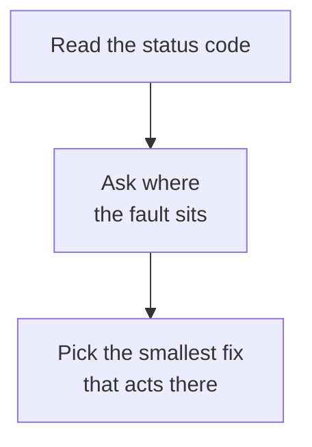

# Domain 4 — Eval, Testing, and Debugging

This is the smallest domain on the exam, and it has one skill: debugging and error handling.
It asks you to identify an error type, choose a recovery strategy, read a trace well enough
to name a failure mode, and say whether a problem started in your integration layer or in
what the model produced.

Those are not four topics. They are one method with four steps. Almost every question here asks
the same thing in different clothes: **where is the fault, and what does that imply about the
fix?** An option that repairs something in the wrong place is the commonest wrong answer here.
It is usually **the option that sounds most diligent**.

---

## The method: read the code, then ask where the fault sits

The Claude API follows a predictable Hypertext Transfer Protocol (HTTP) error code format, and
each status code carries a named error type. That is the first thing to read, because **the
code names a class of fault rather than describing an incident.** A 401 and a 429 are not two
flavours of "the request did not work". They say different things about who has to do
something, and what.

Errors always come back as JSON with a top-level `error` object carrying a `type` and a
`message`. Two consequences matter. First, **the `type` values are documented to grow over
time.** A branch that enumerates today's types with no fallback is a latent defect. That is the
versioning argument Domain 2 makes about response fields, met here in the error path.
Second, **the message is prose for a human, not a contract**.

> **Trap.** Nothing raising is not the same as nothing going wrong. Two of this domain's
> failure modes produce a clean trace, and both are below.

---

## What each error type tells you

Read this table by its right-hand column. The number matters much less than what it tells you
about where to look.

| Error | Type | Where the fault is | What that implies |
|---|---|---|---|
| 400 | `invalid_request_error` | Your request's format or content — or a spend limit you set for yourself | Change the request, or raise the limit |
| 401 | `authentication_error` | Your API key — malformed, revoked or expired | Fix credentials, do not retry |
| 403 | `permission_error` | Your key lacks permission for that resource | Check organization and workspace access |
| 409 | `conflict_error` | Current state of a resource | Resolve the conflict, then repeat unchanged |
| 413 | `request_too_large` | Request size against a documented maximum | Make the request smaller |
| 429 | `rate_limit_error` | Your organization's pace, or a spend cap | See below — this one splits |
| 500 | `api_error` | Anthropic's systems | Retry with exponential backoff |
| 504 | `timeout_error` | The request took too long to process | Change the request shape, not the number of tries |
| 529 | `overloaded_error` | The API, temporarily | Nothing about your request explains it |

Three of these repay a second look.

**The 429 is the best diagnostic fact in this domain, because one code covers two different
situations.** A rate limit is about pace, and backing off works. A usage tier's monthly spend
cap is not about pace at all: that 429 carries **the same error type**, **no `retry-after`
header**, and keeps failing until access resumes. A client that only knows how to back off
will retry against it indefinitely, growing its intervals against a wall, and the trace will
look like a very patient, very broken integration.

Two signals tell them apart, and it is worth knowing both. The first is the **absence** of
`retry-after`, which you can check on any response — the check is always available even though
the header is not. On the Messages API there is also an explicit
**`error.details.error_code` of `enforced_spend_limit_reached`**, which the documentation
names as the way to distinguish this response from a rate limit. Check the header first
because it costs nothing; use the code when you want certainty.

Hold that fact to the **tier** cap, though, and not to spending in general. A limit the
organisation sets for itself is a **400** with `invalid_request_error`, not a 429 at all — and
limits on the Claude Code workspace are checked separately, where going over *can* return a 429
that **does** carry `retry-after`. The missing header identifies the tier cap; it is not a test
for every spend pause.

**A 504 is the case where retrying is the wrong instinct.** The request timed out while
processing, and the documented response is to consider the streaming Messages API for
long-running requests. Sending the same long request again produces the same timeout.

**A 529 is the one error that is explicitly not about you.** The API is temporarily
overloaded, and that can happen when traffic is high across all users. Throttling your own
traffic is the fix for a 429 and does nothing for a 529, which is why telling them apart is
worth more than knowing either number.

> **Currency caveat.** Which caps your account has and where they are set is configuration,
> and it moves. What does not move is the shape: one status code, two situations, and a
> header that separates them. Learn the shape.

---

## Recovery: find out what the client already does

Before writing recovery code, find out what you already have. **The official clients
automatically retry transient failures** — connection errors, rate limits and 5xx server
errors — **with exponential backoff, twice by default, honouring the `retry-after` header
when present.** Each client takes a maximum-retries option to change or disable that.

This makes the diligent-looking answer wrong more often than it makes it right. Wrapping your
own five-attempt loop around a client that already retries twice does not add resilience; it
multiplies attempts, and during an incident it multiplies the load that caused the incident.
The supported lever is the option, not another loop.

The second recovery habit is about how you catch. The clients raise **typed exceptions**
rather than returning raw JSON. The documented practice is to **catch those classes rather
than string-matching messages**, handling the most specific first. Class names differ by
language, which is part of the point: **you catch the type, you do not parse the prose**.

Whether a failed call is safe to send again at all — what the method promises, and what a
timeout leaves you not knowing — belongs to Domain 2, and it is worth reading alongside this.

<b>Self-check — errors and recovery</b>

1. A client has been retrying a 429 with growing backoff for two hours and none has
   succeeded. What should you check first, and why does backoff not help?
2. Why is a 529 a different problem from a 429, even though both arrive under load?
3. A service wraps every call in its own retry loop. What is the likely effect during a busy
   hour?
4. Why is branching on the text of an error message a defect rather than a shortcut?
5. A long request returns 504. Why is sending it again the wrong first move?

**Answers.** 1. Whether the response carries a `retry-after` header. A tier spend-cap 429 has
none and keeps failing until access resumes, so backoff never clears it. 2. A 429 is your
organization against a limit or a cap; a 529 is the API temporarily overloaded, which can
happen when traffic is high across all users, so nothing about your request explains it.
3. It multiplies attempts, because the client already retries transient failures twice with
backoff. 4. Message wording is not a contract and the error `type` values are documented to
grow, so both a string match and an exhaustive branch with no fallback break silently.
5. The request timed out while processing, so the same request will time out again; the
documented response is a different shape, streaming for long-running requests.

---

## Reading a trace

**Every API response includes a unique request identifier (ID) in a `request-id` header,** and the same identifier appears
as `request_id` in error response bodies. It is the one artefact that ties your log line to
Anthropic's record of the same request, and it is what to include when contacting support.
If your logging keeps one field from a failed call, keep that one.

Then the fact that makes trace reading harder than it looks. **When a response arrives over
server-sent events, an error can occur after the API has already returned a 200,** and error
handling in that case does not follow the standard mechanisms. A caller that logs status
codes and nothing else will record a success for a request that failed halfway through the
stream. If your dashboard says the error rate is zero and your users disagree, this is the
first thing to rule out.

---

## Integration layer or model output

This is the objective's hardest half. The useful reframing: **the question is not whose fault
it is — it is where the lever is.** Several failures that look like the model misbehaving are
fixed in your integration layer, and the documentation says so in symptom-to-cause tables.

| Symptom | Likely cause | Where the lever is |
|---|---|---|
| Claude calls one tool when you wanted another | Description ambiguity | Sharpen descriptions: differentiate by *when* to use a tool, not only what it does |
| Claude never calls your tool | Name collision, or a schema too generic | Check for duplicate names; add input examples |
| A parameter that is not in your schema | Over-generation without strict mode | Add strict mode where the schema is supported, or add input examples |
| `tool_use ids were found without tool_result blocks immediately after` | A missing `tool_result`, or it is not the first content block | Fix the message your code assembles |
| An answer inconsistent with the context supplied | Hallucination | Model output — allowing Claude to say it does not know reduces false information |

Only the last row is a model-output problem in the sense candidates usually mean, and even it
has a prompt-level lever. The fourth row is the opposite pole: a pure integration fault whose
error message names its own cause.

Notice what separates the first two rows, because it is the domain's sharpest contrast. A
wrong tool call produces a trace full of activity you can inspect. **A tool that is never
called raises nothing at all** — no error, no refusal, just an answer built without it. The
second is harder precisely because the trace looks fine.

| A failure that raises | A failure that is silent |
|---|---|
| Request-time errors name their cause in the message | A tool is never called; the transcript is clean |
| A 4xx or 5xx status code appears in your logs | A stream fails after a 200 was already returned |
| You know something went wrong and roughly where | You only know the answer was worse than expected |

A clean trace narrows where to look. It never establishes that the run did what it was asked.

<b>Self-check — isolation</b>

1. An agent returns a plausible answer that ignores a tool you provided, and the transcript
   shows no errors. What are the two documented causes worth checking?
2. Why is "the model got it wrong" a true but useless conclusion?
3. A request fails with a message about `tool_use` ids and missing `tool_result` blocks.
   Which side of the boundary is that, and how do you know?
4. What is the one artefact worth logging from every failed call?

**Answers.** 1. A tool name collision across the tool list, or a schema too generic to match;
input examples make the intended use concrete. 2. It names a side of the boundary and no
lever. Several model-shaped symptoms — the wrong tool, an invented parameter — are fixed
through descriptions, strict mode or examples in your own integration. 3. The integration
layer: the message names its cause, and what is malformed is the message your code assembled.
4. The request ID, which appears both as a response header and in the error body.

---

## The same method on configuration

The method transfers. When Claude Code ignores an instruction you wrote, the cause is usually one of three things:
**the file did not load, it loaded from somewhere other than where you expected, or another
file overrode it.** The `/context` command shows what actually occupies the window, broken
down by category. **Establish that the instruction was present before rewriting it.** Domain 3 owns that configuration surface in detail; what belongs here is the habit of
checking presence before quality.

---

## Traps and what to carry in

- **A 429 is two situations.** A tier spend cap sends no `retry-after`, and backoff never
  clears it. Read it that way round: a limit you set is a 400, not that 429.
- **A 529 is not about you.** Throttling your own traffic does not address it.
- **A 504 wants a different request, not another attempt.**
- **A 200 is not proof of success** when the response was streamed.
- **The clients already retry twice with backoff.** Your loop multiplies, it does not protect.
- **Catch typed exceptions, never message text**, and leave a fallback for types that do not
  exist yet.
- **A tool that is never called raises nothing.** Absence is a symptom.
- **"The model got it wrong" names a side, not a lever.**
- **Check that an instruction loaded before deciding it was badly written.**

The through-line, if you carry one sentence into the exam: find where the fault is, then pick
the smallest fix that acts *there*.
