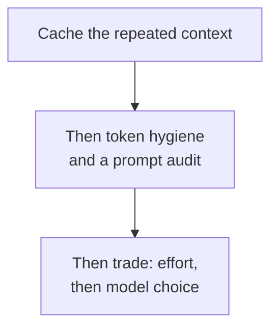

# Domain 5 — Model Selection and Optimization

At 16.8 percent this is the second-largest domain, and it covers four skills: the fundamentals
of how a language model works, the technical surface you build against, choosing a model, and
managing what it costs.

It also has the clearest spine of any domain on this exam, and it is worth having up front.
**The instinctive lever is usually the wrong one.** Reach for a smaller
model and the documentation tells you to tune effort first. Compare two models on price per
token and it tells you the unit is wrong. Go after the model bill and it tells you the cache
read is probably the larger line. Nearly every question here rewards the second thought.

---

## Tokens and the context window

**Tokens are the smallest individual units of a language model**, and they can correspond to
words, subwords, characters or bytes. For Claude a token approximately represents 3.5 English
characters, though the exact number varies with the language. Use that for magnitude, not for
arithmetic — the documentation hedges it twice and no exam question turns on the third
decimal.

The **context window** is all the text a model can reference when generating a response,
**including the response itself**. That last clause is the half people drop. It is what makes
a request for a very large output fail against a window that looked roomy. The window is
working memory, and a different thing from the corpus the model was trained on.

A larger window lets a model handle longer and more complex prompts. The documentation also
says plainly that **more context is not automatically better**. As conversations approach the
limit, **server-side compaction is the primary strategy** for long-running and agentic work.
Domain 1 carries what that costs an agent. Here it is enough to know the window is a budget
rather than a target.

---

## Sampling and non-determinism

**Temperature controls the randomness of the model's predictions.** Higher temperatures give
more creative and diverse output; lower ones are more conservative and more deterministic.
Learn the direction, not a value — no number is the right answer to a question about
temperature.

And then the fact this domain most wants you to carry:

> **Even with temperature set to 0, results are not fully deterministic, and identical inputs
> may produce different outputs across API calls.** This applies to Anthropic's own inference
> service and to inference through third-party cloud providers alike.

Temperature moves the distribution. It does not switch variation off. When a team asks why
the output changed after they pinned the model and set temperature to zero, this is the
answer — and note that neither half of what they did was a determinism control. **Pinning a
model ID buys version stability, not byte-identical output**, for reasons *When the model
changes under you* sets out below. So a suite that asserts on exact response text is asserting on a property
the platform never offered. Assert on the stable properties instead: the shape, the fields,
the classification, the presence of the phrase that matters.

---

## The model options

Four controls sit between you and the model, and the objective names all four.

| Option | What it does | Reach for it when |
|---|---|---|
| **Effort levels** | Controls how many tokens Claude spends on a response | You want to trade thoroughness against token spend without changing model |
| **Adaptive thinking** | The current thinking mode, tuned through effort | Thinking is available and you want depth controlled |
| **Extended thinking** | The older mode, a fixed token budget | Only on models that support nothing newer |
| **Fast mode** | Higher output tokens per second at premium pricing | Output speed is the binding constraint and you have access |

**The effort parameter is the one to learn first.** It trades response thoroughness against
token efficiency **within a single model**, and it is available on all supported models with
no beta header. Where adaptive thinking exists, **effort is the recommended way to control
thinking depth**. That "within a single model" is the load-bearing phrase: the selection
section below turns on it.

**Extended thinking is being retired, and it is the domain's cleanest breaking change.** A
fixed `budget_tokens` budget is **deprecated on the Claude 4.6 models**, where requests using
it still succeed, and **Claude 4.7 and later reject it with a 400 error**. On Claude 4.5 and
earlier that support thinking, extended thinking is the only mode there is. The durable lesson
is not the version numbers: it is that **a model upgrade can turn a working parameter into an
error**, which makes a migration a design step rather than a configuration change.

**Fast mode** delivers up to 2.5 times higher output tokens per second from Claude Opus 5 and
Claude Opus 4.8 at premium pricing.

> **Currency caveat.** Fast mode is a **research preview**, reached through an account manager
> or a waitlist. Carry two things: it buys output speed for a price premium, and it is not
> generally available. The multiplier, the beta header and the model list are all details that
> will move, and none of them is what an exam question can fairly turn on.

---

## Prompting with examples

**Examples are one of the most reliable ways to steer Claude's output format, tone and
structure**, and a few well-crafted ones — **known as few-shot or multishot prompting** —
improve accuracy and consistency. What makes them work is that they are **relevant**: they
mirror the actual use case closely.

A note on vocabulary, because the exam guide and the documentation do not quite agree.
*Multi-shot* is Anthropic's own word, and you will find it on the prompting page. **Zero-shot
and single-shot are the guide's labels**, not Anthropic's, for the other end of the same
spectrum: no examples, and one example. The idea is standard and the naming is not, so meet
the terms without expecting the documentation to define all three.

The practical form of this: when an output's *shape* is inconsistent, a relevant example
usually does more than a longer instruction.

<b>Self-check — fundamentals</b>

1. A team pins a model version and sets temperature to 0, and identical requests still return
   different text. What is happening?
2. Why can a request fail against a context window that looks large enough for the prompt?
3. A workload needs shorter, cheaper answers from the same model. Which control is that?
4. Which thinking mode should a new integration reach for, and why might an older one not have
   the choice?
5. An output's format keeps drifting. What does the documentation reach for first?

**Answers.** 1. Nothing is broken. Even at temperature 0 results are not fully deterministic
and identical inputs may produce different outputs across calls, on Anthropic's service and
through third-party providers. 2. The window covers everything the model can reference
*including the response*, so a large requested output competes with the prompt for it.
3. Effort, which trades thoroughness against token spend within a single model. 4. Adaptive
thinking, controlled through effort; models at Claude 4.5 and earlier that support thinking
have extended thinking as the only mode. 5. Examples — relevant ones that mirror the real use
case — rather than a firmer instruction.

---

## The technical surface

**The Claude API is a representational state transfer (REST) API** providing programmatic access to Claude models and Claude
Managed Agents. Anthropic publishes three kinds of official tooling on top of it: a
command-line tool, the **client SDKs**, and libraries and integrations. The third exposes
Claude inside another framework's API surface rather than the Messages API directly, which
makes it a compatibility layer — useful for migration, not the supported surface.

The client SDKs are general-purpose Messages API clients for `Python`, `TypeScript`, `C#`,
`Go`, `Java`, `PHP` and `Ruby`, and each gives you idiomatic interfaces, type safety, and **built-in support for
streaming, retries and error handling**. That built-in retry behaviour is why Domain 4 treats a
hand-rolled retry loop as a defect: the wrapper already does it.

Now the part where the exam guide and the platform diverge, stated plainly because you will
meet both words.

**Objective 5.2 names websockets. Anthropic's streaming is not websockets.** Setting `stream`
to true streams the response **using server-sent events** — a one-way series of deltas from
server to client, built up incrementally rather than returned as one complete object.

| | Server-sent events | A websocket |
|---|---|---|
| Direction | One way, server to client | Two-way interactive session |
| What Claude uses | This, for streaming responses | Not offered for the Messages API |
| Typical use | Receiving a response as it is produced | Sending and receiving without polling |

A websocket makes it possible to open a two-way session between client and server, sending
messages and receiving responses without polling. It is a real and useful transport. It is not
how you stream a Claude response, and an option offering you one for that job is offering the
wrong mechanism.

### What the kit is doing for you

Four details are worth holding, because each is work you inherit the moment you hand-build
requests instead.

**Headers.** The kits handle authentication, request formatting and error handling, and they
**manage the authentication, version and content-type headers automatically**. The version
header is the one to notice: Domain 2 shows what happens to a parser when that contract
drifts, and a hand-built path owns it.

**Credentials travel per request.** Requests carry an `Authorization` header whose bearer
token is an API key or a short-lived access token. There is no session to open once and
reuse — every request presents its own credential.

**Size limits are per endpoint, not per account.** Messages and token counting sit at one
documented ceiling, the batches endpoint higher, and the files endpoint higher still. A
payload that uploads happily through one path can be rejected on another, and the figures
themselves move — what does not move is that the limit belongs to the endpoint.

**List endpoints paginate.** They return results in pages, with newer ones using a `page`
and `next_page` cursor and a `limit` parameter for page size. A client that reads the first
page and stops is a silent defect: nothing errors, and most of the data is simply never
processed.

One last thing about streaming, because it decides how much work adopting it costs. A stream
is a defined flow of **named events** — a message start carrying an empty message, then each
content block delimited by start, delta and stop events. But **the kits offer more than one
way to consume that**, and the two are not interchangeable. If you need text **as it arrives**,
you iterate the kit's own helper. Only if you do not can you let the kit stream internally and
hand you the finished message.

So choosing to stream is a decision about *when the caller sees output*. What it does not
commit you to is hand-assembling the message from raw events — that is the part the kit
already does.

<b>Self-check — the technical surface</b>

1. What does a client SDK add over calling the REST endpoint yourself?
2. A design proposes a websocket connection to receive tokens as they are generated. What is
   wrong with it?
3. What distinguishes a library or integration from a client SDK?
4. A log must show output arriving rather than one line at the end. Which way of consuming the
   stream does that rule out, and which does it rule in?

**Answers.** 1. Idiomatic interfaces, type safety, and built-in streaming, retries and error
handling. 2. Streaming is delivered over server-sent events, one way from server to client; a
websocket is a two-way session and is not what the API offers for this. 3. A library or
integration exposes Claude inside another framework's API surface rather than the Messages API
directly, which makes it a compatibility layer. 4. It rules out letting the kit accumulate and
return the finished message, which is documented for callers that do *not* need text as it
arrives; it rules in iterating the kit's own helper. Neither of them requires you to assemble
the message from raw events.

---

## Choosing a model

The documentation names four factors to evaluate first — **capabilities, speed, cost and
effort** — and effort appearing beside the other three is the point. It is a selection factor,
not a tuning afterthought.

Speed is measured in two different things, and confusing them costs you the question:

| Term | What it measures | Matters when |
|---|---|---|
| **Latency** | The whole delay between submitting a prompt and receiving the output | A batch or background job has a deadline |
| **Time to first token** | How long until the first token of the output appears | A person is watching a spinner |

There are two documented routes into a choice:

| Route | Start with | Fits when |
|---|---|---|
| **Efficiency-first** | A faster, cheaper model such as Claude Haiku 4.5 | Cost is the binding constraint, and you move up only if evaluation demands it |
| **Capability-first** | The strongest starting point, then optimise down | Intelligence and advanced capabilities are paramount |

Neither is the right answer on its own. What decides is which constraint binds.

Then the fact that reverses most people's arithmetic:

> **Price lists are written per token, and per token the frontier model looks expensive. You
> pay for completed tasks, so compare models on cost per completed task.** A more capable
> model finishes a task with less work, so a model costing several times more per token can
> cost less per task solved.

And before any model change at all: **tuning effort is often a better lever than switching
models.** The documented starting point for the whole tradeoff group is an effort sweep on the
model you are already running.

---

## When the model changes under you

Anthropic retires older models as safer and more capable ones launch, so applications may need
occasional updates to keep working. **Impacted customers are always notified by email and in
the documentation.** Four stages describe where a model stands:

| Stage | What it means |
|---|---|
| **Active** | Fully supported and recommended |
| **Legacy** | No further updates, and may be deprecated in future |
| **Deprecated** | Still functional, no longer recommended, with a replacement named and a retirement date assigned |
| **Retired** | No longer available; requests to it fail |

> **Trap.** Deprecated is not "fine until the switch-off date". **Deprecated models are likely
> to be less reliable than active ones**, and the documented advice is to move workloads to
> active models. The retirement date is the deadline; the deprecation notice is the warning.

One more guarantee worth holding: **each Claude model identifier (ID) identifies a pinned
version**, and
the underlying model stays constant for the lifetime of that ID. That guarantee **covers model
IDs, not the convenience aliases** the API accepts for some earlier models — which is the
difference between a workload that stays put and one that moves under you. Domain 2 tests the
same fact as a configuration decision.

**Know where that guarantee stops, because it is narrower than it sounds.** The weights are
fixed for a given ID; the serving infrastructure around them is not. That infrastructure
includes the request router, the safety classifiers and the sampling logic.

> **Infrastructure updates occasionally produce minor differences in observable behaviour
> even when the model ID and weights have not changed.**

The documented advice follows from it: if a previously stable model ID starts behaving
differently, an infrastructure update is the likeliest cause.

Read this next to the non-determinism fact above and both point the same way. Pin the ID so
the *model* stays put, and test on properties rather than on exact text. Neither pinning nor
temperature was ever an output-identity guarantee.

<b>Self-check — selection and lifecycle</b>

1. A service is over budget. Options include a smaller model and an effort reduction. Which
   does the documentation reach for first, and why?
2. Two models are compared on price per million tokens and the cheaper one is chosen. What is
   wrong with the comparison?
3. A model has been marked deprecated and the team plans to migrate at the retirement date.
   What does that plan give up?
4. What does a model ID guarantee that an alias does not, and what does it not guarantee?

**Answers.** 1. Effort, which trades intelligence for latency and cost within a single model;
tuning it is often a better lever than switching models, and the documented start is an effort
sweep on the current model. 2. The unit. You pay for completed tasks, so the comparison is cost
per completed task, and a more capable model can finish with enough less work to cost less
overall. 3. Reliability in the meantime — deprecated models are likely to be less reliable than
active ones. 4. That the underlying model stays constant for the lifetime of the ID. It does not
guarantee identical output: the weights are pinned, the serving infrastructure around them is
not, and an infrastructure update can shift observable behaviour without the ID changing.

---

## Cost: free wins before tradeoffs

When a workload moves from prototype to production **cost becomes a first-class design
constraint**, because the most capable model can be too expensive at scale and the least
expensive one can fall short on quality. Neither easy answer survives.

The documentation splits the levers into two groups, and **the split is the most useful thing
in this objective**:

| Free wins — cut spend without touching quality | Tradeoffs — exchange cost for intelligence |
|---|---|
| Prompt caching | Model choice |
| Token hygiene | Effort |
| A prompt audit against your current model | Output caps and task budgets |
| Batch processing, for work that can wait | Multi-model architectures |

Pictured as a frontier where cost buys intelligence, **the free wins move a workload toward
that frontier and only the tradeoffs move along it**. Reaching for a tradeoff while a free win
is still on the table pays quality for something that was available at no cost.

**Where context repeats, caching goes first, and the reason is mechanical.** Every turn of an agentic task resends the
entire growing conversation — system prompt, tool definitions and every prior turn — so the
same content is paid for again and again. Across Anthropic's measured runs, **cache reads are
routinely the largest single component of task cost.** That makes caching worth more than
most model-choice decisions.

Caching covers the prompt — tools, system and messages in that order — **up to and including
the block marked with the cache control field**. That marker is the **cache breakpoint**, which
is what the exam guide calls *cache check-pointing*; the two names mean the same thing.
Placement comes in two forms: **automatic caching** applies the breakpoint to the last cacheable
block and moves it forward as the conversation grows, while **explicit breakpoints** put the
marker on individual blocks for fine-grained control. A growing conversation is exactly the case
automatic was built for. Domain 2 covers what invalidates a prefix and what a cache hit costs.

**Batch processing is free on quality and not free on time.** It sits among the levers that
cut spend without lowering output, at 50 percent off for work that can wait. Its documented
caveat is that it trades latency for the discount, and a user-facing path has none to spend.

**Token counting runs before the request, not after it.** It determines the number of tokens
in a message before you send it. That is what makes it useful for managing rate limits and
costs proactively, for routing between models, and for optimising a prompt to a length.
Counting afterwards tells you what happened; counting first lets you decide.

---

## Combining models

A multi-model architecture is a tradeoff lever, which is why it appears after the split above
rather than as a topic of its own. It **fits workloads whose task complexity varies enough that
different steps are best served by different models** — routine work a smaller model handles
reliably, mixed with harder steps that need frontier capability. Where traffic is uniform there
is nothing to split.

Two strategies cover most workloads, and they differ on one thing: **which model holds the main
loop.**

| | Advisor | Orchestrator |
|---|---|---|
| Control flow | Smaller model runs the loop, escalates on demand | Frontier model runs the loop, delegates the bulk work |
| Frontier model's role | Consulted for plans and corrections | Plans, dispatches and synthesises |
| Fits | Serial work that is hard in spots | Work that fans out across independent pieces |
| Frontier cost scales with | How often the executor gets stuck | How hard the pieces are to coordinate |

That last row is the one to carry. Choosing the wrong strategy does not merely underperform —
it makes the expensive model's spend scale on the wrong variable. Domain 1 owns
orchestrator-workers as an agent pattern; this is the same shape viewed as a cost decision.

---

## Measuring on your own workload

None of the above settles a specific case, and the documentation says so. The method:

1. **Pull production-weighted tasks** from real logs and write outcome checks for each — tests
   pass, ticket closed, row count correct — recording **cost per task beside the score**.
2. **Baseline the model tiers across effort levels**, not only the defaults, and plot score
   against spend.
3. Add a multi-model strategy **only where the curve still shows a gap after an effort sweep**,
   and note the bar: such a configuration **must beat the single model's whole curve**, not its
   default.
4. **Run the winner in shadow** on a traffic slice before cutover, then keep the suite running.

> **Currency caveat.** The documentation states plainly that its published figures reflect list
> prices at the time of measurement and **will drift as models and prices change**, and that
> your own escalation rate, how cleanly tasks split, and transcript length move them too. So
> carry the **orderings**, never the numbers: caching before other levers, free wins before
> tradeoffs, cost per completed task rather than per token, effort before a model switch. Those
> are what an exam question can fairly ask.

<b>Self-check — cost</b>

1. A team wants to cut spend and proposes moving to a cheaper model. What should be exhausted first, and why is that not a quality compromise?
2. Why does the documentation say caching is worth more than most model-choice decisions?
3. A user-facing endpoint is over budget. Why can it not take the batch discount?
4. What is the bar a multi-model configuration has to clear before it is adopted?
5. The cost page publishes dollar-per-task figures. What should you carry from it instead?

**Answers.** 1. The free wins — prompt caching, token hygiene, a prompt audit and batch where the work can wait. They cut spend without touching quality, moving the workload toward the cost-intelligence frontier rather than along it. 2. Every turn of an agentic task resends the whole growing conversation, so across measured runs cache reads are routinely the largest single component of task cost. 3. The discount is paid for in latency, and a user-facing path has none to spend. 4. It must beat the single model's whole curve across effort levels, not just its default. 5. The orderings — caching first, free wins before tradeoffs, cost per completed task, effort before a model switch — because the figures reflect list prices at the time of measurement and drift.

---

## Traps and what to carry in

- **Tune effort before switching models.** It trades thoroughness for spend within one model.
- **Compare cost per completed task, not per token.** The unit reverses the answer.
- **Free wins before tradeoffs.** Caching, token hygiene, prompt audit and batch cost no quality.
- **Caching first, and it is usually the largest line** — bigger than most model choices.
- **Temperature 0 is not determinism.** Identical inputs can still differ.
- **Deprecated still runs and is less reliable.** Retired is the one that fails.
- **A model upgrade can turn a working parameter into a 400.**
- **A model ID is pinned; an alias is not** — and pinning buys version stability, not
  byte-identical output.
- **Anthropic streams with server-sent events, not websockets.**
- **Batch is free on quality, not on time.**
- **Count tokens before the request, not after.**
- **A multi-model split needs varied complexity.** Uniform traffic has nothing to divide.

One sentence to carry in: **find the lever that costs nothing before spending quality, and
check the unit before comparing anything.**
