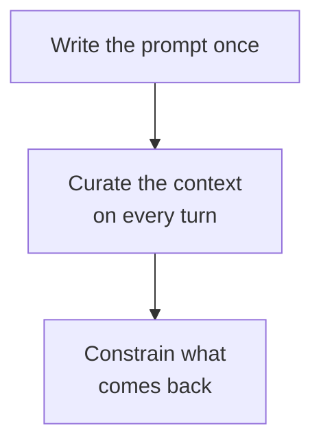

# Domain 6 — Prompt and Context Engineering

At 11 percent this domain covers three skills: engineering the context a model works from,
engineering the prompt itself, and handling what comes back.

Almost every question here reduces to one diagnosis. **Is this a wording problem or a curation
problem?** Teams reach for the prompt because the prompt is the thing they wrote, and a good
share of the time the answer is what the model was given rather than how it was asked. Get
that distinction right and most of this domain follows.

---

## Two disciplines, and how to tell them apart

Anthropic draws the line in one sentence, and the exam guide splits it into two objectives:

> In contrast to the discrete task of writing a prompt, **context engineering is iterative and
> the curation phase happens each time we decide what to pass to the model.**

**Context engineering is the art and science of curating what will go into the limited context
window** from the constantly evolving pile of information an agent generates as it runs. A
prompt is written once and then it exists. Context is decided again on every turn.

So the test is about *when the decision is made*. A feature that returns the wrong shape has a
prompt you wrote once and can fix once. An agent that gets worse over forty turns has no single
bad decision in it — it has forty decisions about what to carry forward, and that is a
different job with different tools.

---

## The attention budget

Curation is not tidiness. It is necessary, and the reason has a name.

**Context rot**: benchmarking has shown that as the number of tokens in the window grows, a
model's ability to accurately recall information from it degrades. This is not a limitation of
one model — it appears across all of them, some more gently than others.

So **context has to be treated as a finite resource with diminishing marginal returns.** The
documentation puts it in a way worth memorising: like humans with limited working memory,
models have an **attention budget**, drawn down as the window fills.

That reframes the whole objective. The window has a hard limit, and the budget starts
degrading well before you reach it — so *"we still have room"* is not an answer to a context
problem. The goal the documentation names is precise:

> Good context engineering means **finding the smallest possible set of high-signal tokens
> that maximise the likelihood of the desired outcome.**

Smallest, and high-signal. Not the most you can fit. Domain 1 covers what this costs a running
agent, and Domain 5 covers the window as a fundamental; what belongs here is the discipline
between them.

---

## Curating the window

Three techniques, and the objective names all three. They are not interchangeable.

| Technique | What it does | Reach for it when |
|---|---|---|
| **Compaction** | Manages context automatically, server-side | It is the default for long-running conversations and agentic work |
| **Context editing** | Selectively clears specific content as history grows | You need fine-grained control over exactly what is kept |
| **Subagents** | Give a focused task its own clean window | A task would otherwise fill the main window with detail nobody needs again |

**Compaction is the recommended strategy** for long-running conversations and agentic
workflows, and the phrase to hold is that it handles context management **without client-side
summarisation code**. The wrong answer to a growing conversation is to write your own
summariser; that work is already done.

**Context editing** clears content selectively as history grows — this is what the objective
means by tool output pruning. Read its purpose carefully, because it is easy to file under
cost: beyond optimising spend and staying inside limits, it is about **actively curating what
Claude sees**, since irrelevant content degrades focus. It is the finer instrument, for the
cases where you need to say precisely what goes.

**Subagents** are the third answer, and the reason is context rather than speed. Rather than
one agent maintaining state across a whole project, specialised subagents handle focused tasks
with **clean context windows** while the main agent coordinates with a high-level plan. Domain
1 covers what a subagent inherits and what returns to the parent; what matters here is why you
would want one.

> **Currency caveat.** Server-side compaction is in beta and sits behind a beta header, so the
> interface may move. What does not move is the shape: context management is a managed feature
> rather than something your application writes for itself.

<b>Self-check — context engineering</b>

1. An agent's answers get less reliable over a long session, and the window is only half full.
   Why is "we still have room" not a reply to that?
2. A conversation is growing past what fits. What is the documented first move, and what is the
   move it replaces?
3. Why is clearing old tool output described as curation rather than as a cost saving?
4. Give the reason to reach for a subagent that is not about speed.

**Answers.** 1. Because recall degrades as token count grows — context rot — so the attention
budget is spent before the capacity is. 2. Server-side compaction, which handles context
management automatically; it replaces writing client-side summarisation code. 3. Because
irrelevant content degrades the model's focus, so removing it improves the answer and not only
the bill. 4. A focused task gets its own clean window, so its detail never enters the main
conversation.

---

## Writing the prompt

The documentation's first principle is to **be clear and direct**: Claude responds well to
clear, explicit instructions, and being specific about the output you want improves results. Behaviour above the ordinary has to be **asked for** rather than
inferred from a vague prompt. The documentation's own test is the most useful thing in this
section:

> **Golden rule:** show your prompt to a colleague with minimal context on the task and ask
> them to follow it. If they would be confused, Claude will be too.

That turns "the prompt is unclear" from an opinion into something you can check.

Two more levers worth knowing by name. **Explaining why** an instruction matters — the context
or motivation behind it — helps Claude understand the goal and produce more targeted
responses, which is the counter to the instinct that shorter prompts are always better. And
**setting a role in the system prompt** focuses behaviour and tone for your use case; the
documentation notes that even a single sentence makes a difference. That is the cheapest
placement decision available to you.

Finally, structure. **XML tags help Claude parse complex prompts unambiguously**, especially
where a prompt mixes instructions, context, examples and variable inputs, and wrapping each
kind of content in its own tag reduces misinterpretation. Note what that buys beyond
tidiness: if user-supplied text sits in its own tagged block, the boundary between your
instructions and their input is explicit — which is exactly what the next section needs.

---

## Examples and consistency

**Examples are one of the most reliable ways to steer output format, tone and structure**, and
a few well-crafted ones — few-shot or multishot prompting — improve accuracy and consistency.
The condition attached is short and load-bearing: they must be **relevant**, mirroring your
actual use case closely. Examples borrowed from a public dataset teach the model a different
job.

When an answer varies more than it should, there are two documented routes and they act on
different things:

- **Define the format precisely.** Using JSON, XML or a custom template makes Claude follow
  every formatting element you require. This is a prompt-side fix.
- **Ground it in retrieved material.** For tasks needing consistent context — chatbots,
  knowledge bases — retrieval anchors responses in a fixed information set. This is a
  context-side fix.

Which one you need is the S1 question again. If the wording is fine and the *inputs* vary,
tightening the wording will not settle it.

---

## Input you did not write

Objective 6.2 names input sanitization, and the documentation's own word for it is **input
screening** — which covers a filter and a model call, not one instead of the other.
**Jailbreaking and prompt injection are attempts to make Claude ignore its guidelines or your
instructions**, and while Claude is inherently resilient to such attacks, extra steps
strengthen your application.

The part worth carrying is that there are **two threat models, and they need different
answers**:

| | Direct prompt injection and jailbreaks | Indirect prompt injection |
|---|---|---|
| Who is the adversary | The user of your application | Not the user — the content |
| What carries the attack | Input crafted to bypass your guardrails | Third-party content Claude processes: web pages, emails, documents, tool results |
| Who you are defending | The application, from its own users | A trusted user, from what their tools return |

The second is the one teams miss. You can trust every user completely and still be exposed the
moment an agent reads a web page or a tool result, because the adversarial instruction arrives
inside content nobody in your organisation wrote.

Two documented mitigations for the direct case, listed together rather than against each
other. **Filter input for known injection patterns**, and **pre-screen user input with a
lightweight model** before it reaches the main conversation, using structured outputs to
constrain the screen's own response so its verdict is parseable. What separates them is
generalisation: a maintained list matches the wording an adversary varies first, and the
documented answer to that is to have a model build the screen from those examples. It is a cheap pass in front of an expensive
one. The model named in the documentation is an example, not a requirement.

<b>Self-check — prompt engineering</b>

1. An instruction is being ignored and the team's response is to repeat it more firmly. What
   does the documentation reach for instead?
2. What does wrapping content in XML tags buy beyond readability?
3. Every user of an internal tool is a trusted employee. Which injection threat model still
   applies, and why?
4. An answer varies between runs and the prompt is clear. What is the other lever?

**Answers.** 1. Specificity, a stated reason, or a relevant example; the golden rule is to hand
the prompt to a colleague and see whether they are confused. 2. It separates kinds of content,
so the boundary between your instructions and someone else's input is explicit. 3. Indirect
injection — the user is trusted and the adversarial instruction arrives inside third-party
content the agent processes. 4. Retrieval, grounding the response in a fixed information set,
which fixes the inputs rather than the wording.

---

## Constraining the output

There are two different things you can do about output shape, and the gap between them is the
whole of objective 6.3.

| | Asking for a format | Constraining the output |
|---|---|---|
| Mechanism | Instruction in the prompt | Schema enforced by the platform |
| What you get | Better odds | A guarantee |
| Fails how | Occasionally, unpredictably | It does not produce invalid shape |

**Structured outputs constrain Claude's responses to follow a specific schema**, ensuring
valid, parseable output for downstream processing. They come as two complementary features:

- **JSON outputs** — get the response in a specific JSON format.
- **Strict tool use** — guarantee schema validation on tool names and inputs.

They can be used **independently or together in the same request**, so a workload needing both
a valid tool call and a valid final answer does not have to choose.

The mechanism behind strict tool use is worth knowing, because it explains why the word
"guarantee" is doing real work: setting strict mode **constrains the model's token sampling to
schema-valid outputs**, a technique called grammar-constrained sampling. The output is not
checked afterwards; the invalid tokens are never available. Strict tool use is documented for
validating parameters, building agentic workflows, type-safe calls, and complex tools with
nested properties — all of which are about *arguments*. A prose answer in the wrong shape is a
JSON-outputs problem, not a strict-mode one.

> **Trap, and the one most likely to catch you.** Prefilling the assistant turn used to be the
> way to force an output format. **Starting with the Claude 4.6 models, prefilled responses on
> the last assistant turn are no longer supported, and such requests return a 400 error.** The
> documented migration is structured outputs, which was built for that job. Be aware that
> guidance published elsewhere still lists prefill as a consistency technique — under a note
> saying it is unsupported. If you learned prefill from older material, you have learned a
> technique that now errors.

---

## Not trusting what parses

A schema guarantees shape. It guarantees nothing at all about truth.

**Models can generate text that is factually incorrect or inconsistent with the context they
were given** — hallucination — and a well-formed JSON object containing a wrong answer is
still a wrong answer. One documented mitigation is small and effective: **explicitly give
Claude permission to say it does not know**, which can drastically reduce false information.

The posture objective 6.3 asks for is exactly this. Confidence is not evidence, and validity is
not correctness. Constrain what you can enforce, and stay sceptical about the rest.

<b>Self-check — output handling</b>

1. What is the difference between asking for JSON and constraining the output to a schema?
2. Why does strict tool use "guarantee" valid inputs rather than merely improve them?
3. A team forces JSON by prefilling the assistant turn. What happens on a current model, and
   what replaces it?
4. A response parses cleanly against your schema. What have you established, and what have you
   not?

**Answers.** 1. Asking improves the odds through an instruction; constraining enforces the
schema so invalid shape is not produced. 2. It constrains token sampling to schema-valid
outputs — grammar-constrained sampling — so the output is never checked after the fact.
3. Requests with prefilled assistant messages return a 400 from Claude 4.6 onward; structured
outputs is the documented migration. 4. That the shape is right. Nothing about whether the
content is true.

---

## Traps and what to carry in

- **Ask first whether it is a wording problem or a curation problem.** A prompt is written
  once; context is decided every turn.
- **"There is still room" is not an answer.** The attention budget degrades before the limit.
- **Aim for the smallest set of high-signal tokens**, not the most that fits.
- **Do not write your own summariser.** Compaction is managed; editing is the fine instrument.
- **Clearing tool output is curation**, and the cost saving is a side effect.
- **Subagents buy a clean window**, not only parallelism.
- **A repeated instruction is rarely the fix.** Specificity, a reason, or a relevant example is.
- **Examples must mirror your real traffic.**
- **A trusted user does not protect you from indirect injection.**
- **Asking for a format is not constraining one.**
- **Prefill returns a 400 from Claude 4.6.** Structured outputs replaced it.
- **Valid is not correct.** A schema checks shape, never truth.

One sentence to carry in: **fix the input before the wording, enforce what you can, and never
mistake a clean parse for a right answer.**
