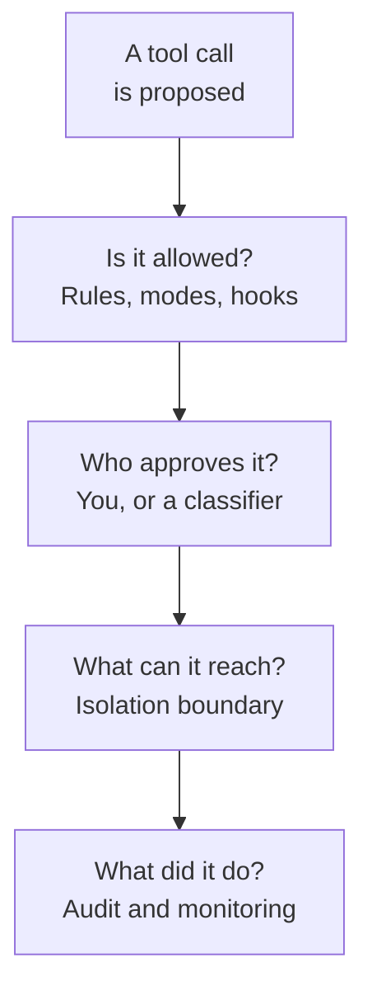
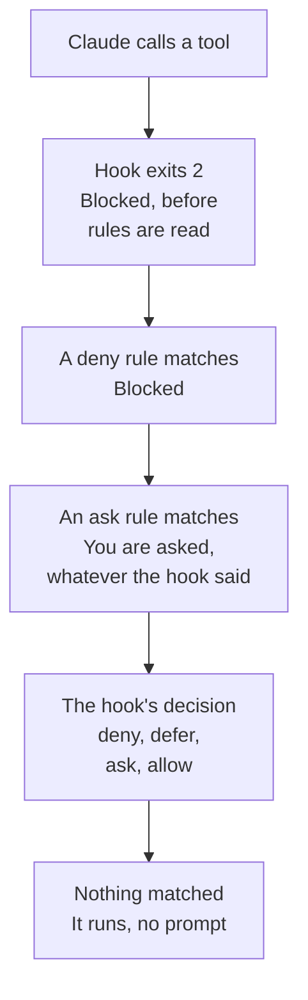

# Domain 7 — Security and Safety

This is 8.1 percent of the exam, split across four skills: application security, guardrails and
safe deployment, hooks, and identity and secrets. It rewards one habit above all others —
knowing **which question a control answers**, and noticing when a scenario is asking a different
one.

The sections below are not in the guide's order. They follow the layers as they sit in front of
a request. What you do with input you did not write, then what you keep out of the prompt. Then
what the runtime allows, and what the boundary contains once it does. Then what the gate blocks,
and what credential the whole thing runs as. Read in that order, the domain stops being a list
of features.

---

## What this domain actually asks

Almost never "should you add security?" — the answer is always yes and the exam knows it. What
it asks is which of four plausible controls belongs at the point of failure being described.
Three habits carry most of the marks.

**Ask what the control contains, not what it does.** Every mechanism here reduces something and
none of them contains everything, and the documentation is unusually direct about the limits.
The sandbox restricts shell commands and not the processes around them. Isolation reduces the
impact of a breach and does not change what is sent to the model. Expiry shortens a leak and
does not revoke it. When an option sounds like the whole answer, it is usually the wrong one.

**Ask where enforcement happens.** Instructions live where the model reads them; rules live
where the runtime applies them. Anything an option describes as "tell Claude to…" is a request,
not a control.

**Assume the gate fails open until you have checked.** This domain is full of mechanisms whose
default failure is to let the action through: a shell exit code that reads as failure and
proceeds, a mistyped path, a hook that times out, a credential nobody listed. A guardrail that
is absent looks exactly like one that never fires.

---

## Untrusted input, and where you put it

**The primary defence against instructions hidden in content is structural, not verbal.**
Third-party content — a fetched page, an inbound email, text pulled out of an uploaded file, the
result of a tool call — goes into `tool_result` blocks and **never into the system prompt or a
plain user text block**. That is not a stylistic preference. Claude is trained to treat
instructions appearing inside tool results with appropriate skepticism, so the block type is
what buys you the model's caution. A warning wrapped around the same text in a user turn buys
nothing.

Three more things sit on top of it, and the documentation lists them together rather than as
alternatives.

| What you do | Where it goes | What it buys |
|---|---|---|
| Say what the content is and where it came from | The tool's description, or the result's structure | Claude calibrates how far to trust directives inside it |
| State that tool and document content is untrusted data | The system prompt | An explicit rule that retrieved text never overrides instructions |
| Wrap third-party strings in a JSON object | The tool result itself | Escaping gives unambiguous delimiters, so an attacker cannot close a quote or tag to break out |

> **Trap.** The channel that protects you breaks your own steering if you use it the wrong way
> round. Because Claude treats tool-result content as untrusted, **your own instructions must not
> go there** — they may be ignored, or flagged as an injection attempt. Send them in a user turn
> that follows the tool result.

Two operational practices complete the picture. **Screen what the tools return**, not only what
the user sends: run the tool, pass its raw output to a small classifier call, and only hand the
content back as a tool result if the screen reports no injection attempt. And **red-team the
workflow before it ships**, with documents and tool outputs that deliberately carry injection
attempts, confirming both that Claude ignores them and that the screening catches the rest.

None of this assumes the defence holds. The other half of the documented answer is to
**apply least privilege so that a successful injection can do minimal damage**: withhold secrets
Claude does not need, run tools in sandboxed environments, and scope permissions as narrowly as
possible. And the strategies are meant to be combined — the worked enterprise example chains a
hardened system prompt with a screening call whose verdict is constrained to a simple
classification, rather than choosing one control and trusting it.

<b>Self-check — untrusted content</b>

1. A service pastes fetched web pages into the user turn with a line telling Claude to ignore
   any instructions inside them. What has it not done?
2. Where do your application's own instructions go when the turn before them was a tool result?
3. Your users are all employees and all trusted. Which threat model still applies?
4. What does encoding an untrusted string as JSON actually prevent?

**Answers.** 1. It has not put the content where the model treats it with skepticism; the
protection comes from the tool result block, not from the warning. 2. In a user turn after the
tool result — instructions placed inside the result may be ignored or flagged. 3. Indirect
injection: the hostile text arrives in the pages, files and tool results Claude reads on the
user's behalf. 4. Breaking out — escaping gives unambiguous delimiters, so the payload cannot
close a quote or tag and continue as an instruction.

---

## Keeping the prompt's own secrets

**Prompt leak is a real risk and hardening the prompt is the last thing you should try.** The
documentation is unusually blunt about the cost: leak-resistant prompt engineering adds
complexity that may degrade performance in other parts of the task, so it belongs to cases where
it is absolutely necessary. No method is foolproof, which is another reason not to buy one at
the price of a worse product.

What comes first is monitoring — output screening and post-processing, which catch leaks that
have happened rather than trying to make them impossible. Then, in rough order of value:
separate context from queries by isolating key information in the system prompt; filter outputs
for keywords that might indicate a leak; **leave out proprietary detail Claude does not need for
the task**; and audit prompts and outputs periodically.

That third one is the cheapest defence in the whole domain and the one teams skip. A secret that
was never in the prompt cannot leak from it, and extra content also distracts the model from the
instructions telling it not to leak.

---

## The agentic surface

**An agentic coding tool has real injection safeguards, and its own documentation declines to
call them sufficient.** Worth knowing what they are, because the exam tests the shape rather
than the list.

In its manual permission mode, Claude Code requires explicit approval for sensitive operations,
analyses the full request for harmful instructions, sanitizes input against command injection,
and does **not** auto-approve commands that fetch content from the web. Web fetch runs in a
separate context window so that a fetched page cannot inject into the conversation. First-time
codebases and new servers require trust verification. Suspicious shell commands need manual
approval even when previously allowlisted, and **unmatched commands require approval by
default** — the gate fails closed.

That last principle is portable and worth carrying: an unrecognised command asks rather than
runs. It is the opposite of what an allowlist-shaped mental model expects, and it is the right
default.

The vendor's own summary is that these protections significantly reduce risk and that no system
is completely immune. The documented practices that follow are ordinary and effective. Review
suggested commands before approving them. **Avoid piping untrusted content directly to Claude.**
Verify proposed changes to critical files, and run scripts and tool calls in a virtual machine
when external web services are involved.

---

## Privacy, regulated data, and what is retained

**The most useful fact here is about a place regulated data leaks that nothing in the request
looks different about.** When you use structured outputs or tools in strict mode, the schemas
are compiled into grammars that are **cached separately from message content**, and those cached
schemas do not receive the same protections as prompts and responses. So protected health
information (PHI) must not appear in a schema — not in property names, not in enumerated values,
not in constants, not in pattern expressions. Patient-specific detail belongs in the message
content, where the safeguards apply.

Two arrangements govern retention, and they are frequently confused because both sound like the
strict one.

| | Zero data retention | HIPAA readiness |
|---|---|---|
| What it does | Prompts and responses are not stored at rest after the response returns | Encryption, access controls and audit logging protecting the data across its lifecycle |
| Its logic | Delete immediately | Safeguard throughout |
| For | Organisations that want nothing kept | Organisations handling PHI under the Health Insurance Portability and Accountability Act (HIPAA) |
| Together? | Not needed alongside the other | The one to use; it does not also need zero data retention |

Two limits on zero data retention are worth holding. It is **enabled per organization** and does
not extend to other organizations under the same account, so a team that has it on one and
assumes it covers the second has a gap nothing in the interface surfaces. And even with either
arrangement in place, data may be retained where the law requires it or where automated trust
and safety systems have flagged it.

One architectural consequence follows from the first arrangement: cross-origin browser requests
are not supported for organizations with zero data retention, so a browser application routes
its calls through a backend proxy server rather than reaching the interface directly.

<b>Self-check — privacy and retention</b>

1. A team keeps patient identifiers out of every prompt but names its schema fields after them.
   What have they missed?
2. An organization handling health records asks for both arrangements. What would you tell them?
3. Zero data retention is enabled. Under what two circumstances might data still be retained?
4. Why can a browser application not call the interface directly under zero data retention?

**Answers.** 1. Schemas are compiled and cached separately from message content and do not carry
the same protections, so property names, enumerated values, constants and patterns must not hold
regulated data. 2. HIPAA readiness is the arrangement for protected health information and
applies broader safeguards across the lifecycle; they do not also need zero data retention.
3. Where the law requires it, and where automated trust and safety systems have flagged the
content. 4. Cross-origin requests are not supported for those organizations, so calls route
through a backend proxy.

---

## What the runtime allows

**Permission rules are enforced by the runtime, not by the model.** Instructions in a prompt or
an instructions file shape what Claude *tries* to do; they do not change what is allowed. Access
is granted or revoked with a permission rule, a permission mode, or a hook that runs before the
tool call. Any option that proposes writing the policy somewhere the model reads it has proposed
a request rather than a control.

The mechanics reward precision, because they run against most engineers' instincts.

| Rule | What it does | The part that surprises people |
|---|---|---|
| Deny | Blocks the tool call | Evaluated first, and specificity is irrelevant — a broad deny cannot carry allowlist exceptions |
| Ask | Forces a prompt | Beats a more specific allow, and still prompts when a hook returned allow |
| Allow | Runs without a prompt | Has no effect at all in the mode that skips prompts |

Modes set the baseline and rules layer on top of it. That is why **a deny rule blocks in every
mode, including the one that skips permission prompts.** Allow rules are the half that stops
mattering there, since nothing is left for them to permit.

**Rules are evaluated deny, then ask, then allow, and the first match decides.** So a broad deny
paired with a narrow allow is simply a deny, and nothing warns you. This is the single most
testable mechanic in the objective, because everywhere else in an engineer's working life the
more specific rule wins.

A second distinction inside deny: a rule naming a bare tool **removes that tool from Claude's
context entirely**, so it is never attempted, while a rule scoping a pattern within a tool leaves
the tool available and blocks the matching calls when Claude tries them.

Two facts about scope complete it. Managed organisation settings sit highest, so no other level
including a command-line argument can override a managed rule, and a tool denied at any level
cannot be allowed at another. And because allow rules and added directories *grant* capability, a
project's settings apply them only after you accept the workspace trust dialog for that folder —
while deny and ask rules from the same file apply immediately, since they only restrict. Shared
configuration can tighten your security without asking and can only loosen it with consent.

<b>Self-check — rules and modes</b>

1. A policy denies a whole command family and allows one specific subcommand of it. What runs?
2. What is the difference between denying a tool by name and denying a pattern inside it?
3. Which rules in a repository's settings apply before you have trusted the folder?
4. Where does an instruction in a project instructions file sit in this picture?

**Answers.** 1. Nothing in that family — deny is evaluated first and specificity does not change
the order, so a deny cannot carry exceptions. 2. The bare name removes the tool from Claude's
context so it is never attempted; the scoped rule leaves it available and blocks matching calls.
3. Deny and ask, because they only restrict; allow rules and added directories grant capability
and wait for the trust dialog. 4. It shapes what Claude tries to do and changes nothing about
what is allowed.

---

## What the boundary contains

**Permission modes decide whether an action runs and whether you are asked first. Isolation
decides what that action can reach once it does.** Two questions, two controls, and most wrong
answers in this objective answer one of them with the other's mechanism.

The boundary you choose has to match what you need contained, and the built-in one is narrower
than its name suggests.

| Boundary | What is inside it | What is still on the host |
|---|---|---|
| The sandboxed shell tool | Shell commands and their children, whose filesystem and network access it restricts | Built-in file tools, connected servers, and hooks |
| Sandbox runtime, container or virtual machine | The whole session, including all of the above | Nothing in the session |

That first row is the fact to carry. Connected servers and hooks are precisely the parts that
run arbitrary code, and the built-in sandbox does not cover them, so a team that enables it and
believes the session is contained has left the most capable processes outside the fence.

Which boundary an unattended run needs depends on what replaced the prompt. A session run with
permission prompts skipped entirely **must** be inside a container, a virtual machine or the
sandbox runtime. A session using the classifier that reviews actions in its place is different.
**A classifier is a per-action control, not an isolation boundary.** A boundary there is defence
in depth rather than a requirement.

Permissions and isolation are complementary for a reason worth stating outright. A deny rule
stops Claude from even attempting the access. A sandbox restriction stops the command reaching
anything outside its boundary **even if a prompt injection has already bypassed Claude's
decision-making** — which is the case the outer layer exists for, and the answer to anyone
asking why both are needed.

> **Trap.** Isolation is not a privacy control. It reduces the impact of a breach without
> eliminating risk — anything permitting network egress can still leak what the agent can read —
> and it **does not change what is sent to the model**. Prompts and the files Claude reads are
> transmitted to the interface with or without a sandbox, so sandboxing satisfies no requirement
> about data leaving the environment.

Credentials are the other thing people expect a boundary to handle and it does not. **Sandboxed
commands inherit the parent process environment by default, including any credentials set
there**, and there is no built-in list of secrets to withhold: only the files and variables you
name are restricted. Naming one has two settings and they trade off honestly. Denying a variable
unsets it before each sandboxed command, which also breaks the tools that authenticate with it;
masking shows the command a placeholder and has the sandbox proxy substitute the real value on
outbound requests to hosts you allow.

<b>Self-check — isolation</b>

1. Sandboxing is enabled for shell commands. Which parts of the session are still unconstrained?
2. A team sandboxes the agent to satisfy a rule that source code must not leave the network.
   Does it?
3. Why does a session run without permission prompts need a whole-session boundary while a
   classifier-reviewed one does not?
4. A sandboxed command needs a token to publish a package, but you do not want it readable.
   Which setting?

**Answers.** 1. Built-in file tools, connected servers and hooks, all of which run directly on
the host. 2. No — isolation does not change what is sent to the model; the files Claude reads
are transmitted either way. 3. Because a classifier reviews each action rather than confining
it; with no prompt and no boundary, nothing limits what an approved action reaches. 4. Masking,
which keeps the tool working by substituting the real value on allowed outbound requests, where
denying would unset the variable and break it.

---

## A gate in front of the model

For organisations that need the check to apply everywhere rather than per machine, an inference
hook routes every governed prompt through a security service the organisation runs, before
inference happens. The service returns an allow or deny verdict and **a denied request never
reaches the model**. Because the check runs on the provider's side after the request leaves the
client, it applies to every governed request uniformly with nothing deployed on user devices.
It is a beta capability for enterprise organizations rather than a general interface feature, so
treat the placement as the durable fact and the availability as the moving one.

Three details make it examinable. If the security service is unreachable, errors, or is too slow,
**a failure-handling setting decides whether the request is blocked or proceeds uninspected** —
fail-closed or fail-open, chosen deliberately. Enforcement rolls out gradually: a shadow mode
observes verdicts on live traffic without blocking anything, a percentage inspects a fraction of
requests, and exclusions exempt chosen roles. And the service sees **text only** — transcript
text, tool calls and their results, and text extracted from attachments, never raw file or image
bytes — so image-only content such as a screenshot of a document is not inspected at all.

It is worth separating from the interface that retrieves activity, chats, files, transcripts and
users after the fact. One acts inline and prevents; the other acts afterwards and audits. The
call direction gives it away: for the inline gate, the provider calls your service.

---

## Hooks that actually block

A hook that runs before a tool call is the sharpest guardrail available, and this objective is
mostly about the ways one silently is not.

The order the checks are consulted in is fixed, and the first rung that applies decides.

**Restriction wins in both directions.** Deny and ask rules are evaluated whatever the hook
returns, so a hook cannot loosen them; and a hook exiting 2 stops the call before rules are read
at all, so it blocks even where an allow rule would have let it through. That asymmetry is what
makes the documented pattern work: allow the shell tool broadly, then register a hook that
rejects the specific commands you want stopped. Where several hooks disagree, the order is deny,
then defer, then ask, then allow.

Now the failures, all three of which leave the action running.

| The hook | What you expect | What happens |
|---|---|---|
| Exits 1 after detecting a violation | Blocked, since non-zero means failure | A non-blocking error; the action proceeds |
| Points at a path that is wrong or not executable | An error you notice | A non-blocking error; the gate is silently disabled |
| Reaches its configured timeout | Blocked, or at least retried | Cancelled with its output discarded; no decision is rendered |

**Only exit code 2 blocks through the code alone.** A policy hook written with the conventional
failure code reports failure and stops nothing, which is why the documentation says outright to
use exit 2 for enforcement. Watch the first run of any new gate for the error notice, because a
mistyped path produces exactly the same silence as a rule that never matched.

The timeout row has a twist worth holding: on the same event, a callback hook written against
the agent development kit **does** block when it exceeds its timeout. Porting a policy hook
between the two changes its failure mode without changing a line of its logic.

Two more gaps. A hook before a tool call fires **only when Claude calls a tool**. A file the user
pulls in with an `@` reference is inserted while the prompt is being built, with no tool call at
all, so no hook fires for it whatever it matches on. Blocking those paths takes a read deny rule.

And hooks are themselves an attack surface. Command hooks execute with your full user
permissions. An interactive session holds them back until you accept the workspace trust
dialog, but **a non-interactive or automated session never shows that dialog and treats the
folder as trusted**. Hooks committed in someone else's repository run, unprompted, in a folder
nobody trusted.

<b>Self-check — hooks as gates</b>

1. A gate detects a forbidden command, prints an explanation and exits 1. What happens?
2. An allow rule permits the shell tool broadly. Can a hook still stop one command?
3. A hook calls a policy service that becomes slow. What is the effect on the tool call?
4. A hook matches the file-reading tool to protect a secrets file. What does it not protect
   against?
5. Why is running an unfamiliar repository non-interactively riskier than opening it yourself?

**Answers.** 1. Nothing is blocked — without valid structured output, exit 1 is a non-blocking
error and the action proceeds. 2. Yes: exiting 2 stops the call before rules are evaluated.
3. A command hook that reaches its timeout is cancelled with its output discarded and renders no
decision, so the call continues; a callback hook written against the development kit blocks
instead. 4. A file the user references directly in the prompt, which is inserted without a tool
call. 5. The trust dialog never appears, so hooks committed in that repository run with your full
user permissions in a folder you never trusted.

---

## Credentials and the identities behind them

**A credential should be backed by an identity your organization already manages.** That single
idea explains almost every recommendation in this objective, including the ones that look
arbitrary.

There are three ways to authenticate a request. A static key sent as a bearer token. Workload
identity federation, which exchanges an identity provider's token for a short-lived one. And app
attestation, which issues a short-lived token to a verified installation of a registered mobile
or desktop application. Keys and federation **grant exactly the same access**, so federation is
not a more powerful credential — it is a differently held one. Start with a key; move to
federation when the workload already has a platform-issued identity to federate.

| Key type | Acts as | Stops working when | Reach for it |
|---|---|---|---|
| Personal | You, with your roles | You lose access to the organization | Your own development and scripts |
| Service account | A managed non-human identity | The service account is archived | Anything shared, automated, or in production |
| Workspace (legacy) | Nobody | It expires, is disabled or deleted, or its workspace is archived | Nothing new — migrate it |

The middle column is the whole argument. Identity-backed keys stop working when their identity is
removed from the organization, so **offboarding revokes them for free**. A workspace key belongs
to no one and keeps working regardless of whether its creator leaves, which is exactly why it is
legacy. And a shared personal key is the worst of both: it acts as one person and breaks when
they leave.

Three lifecycle facts follow. **Expiration is fixed when the key is created and cannot be changed
afterwards**, so rotation is designed into the deployment rather than deferred. An expired key
returns an authentication error and cannot be reactivated. Expiry limits how long a leaked
credential stays usable and is **not a substitute for hygiene** — store keys in a secrets manager
and revoke anything you suspect. Revocation itself has two settings. Disabling is reversible
while you investigate; deleting is permanent, and a deleted key stays visible in the listing as
archived, so the audit trail survives.

Federation deserves the same scepticism the rest of this domain gets. It genuinely removes the
long-lived secret: there is no key string to mint, distribute or rotate, and the token is
exchanged and refreshed automatically. But it **does not on its own guarantee end-to-end
security**. The trust chain is only as strong as the identity provider's configuration, and a
long-lived secret one hop upstream — a static cloud credential that can mint identity tokens —
still undermines it. Federation moves the secret; pairing it with the provider's own controls is
what removes it.

Two scoping facts round it out. A key scoped to one workspace works only there and its requests
can omit the workspace identifier, but administrative endpoints accept a personal or service
account key **only** when it is not workspace-scoped, so the narrower key is the one that cannot
administer. And workspaces separate usage while keeping billing and administration central, with
roles held per workspace — but organization administrators automatically hold administrative
access to every workspace, so workspace separation is not a boundary against them.

Least privilege is not available everywhere, and it is worth knowing where it runs out. An
administrative key created in the console **has no selectable scopes** and carries full access to
every endpoint that accepts one, while an enterprise organization's key is created with the
scopes you choose. Where scoping is unavailable, the controls left are guarding the secret and
expiring it.

Finally, two facts about the development machine. Credentials are stored in the operating
system's encrypted store where one exists and in an owner-only file otherwise, and a credential
helper script is the supported route for dynamic or rotating secrets fetched from a vault. And
credentials are chosen in a fixed order, in which **an environment key outranks the interactive
login once approved** — which is why an unchanged machine can suddenly start failing
authentication when that leftover key belongs to a disabled organization.

<b>Self-check — identity and secrets</b>

1. A production service authenticates with a key created by the engineer who built it. Name two
   problems.
2. A key is expiring next week and the team wants to extend it. Can they?
3. What does federation not protect you from?
4. Administrative tooling fails with a workspace-scoped key. Why?
5. A developer signed in interactively is suddenly rejected, and nothing on the machine changed.
   What would you check first?

**Answers.** 1. It acts as one person, so requests are misattributed, and it stops working when
they leave the organization; a service account gives the workload its own identity. 2. No —
expiration is set at creation and cannot be changed; create a new key. 3. A long-lived secret one
hop upstream that can mint identity provider tokens, and any weakness in the provider's own
configuration. 4. Administrative endpoints accept a personal or service account key only when it
is not scoped to a specific workspace. 5. Whether an environment key is set, since it outranks
the interactive login once approved and may belong to a disabled organization.

---

## Traps worth carrying into the exam

**The control that sounds complete is usually the wrong option.** Screening without placement,
a sandbox without a boundary around the processes that matter, an expiry without revocation,
federation without the provider's controls. In this domain the documentation names its own
limits, and the exam tests whether you noticed.

**A guardrail that fails open looks identical to one that works.** Exit 1, a mistyped path, a
timed-out hook, an unlisted credential, a security service set to allow on error. If a scenario
describes a policy that "should have caught it", look for the failure mode before looking for a
missing rule.

**Enforcement never happens where the model reads.** An instructions file, a system-prompt
policy and a carefully worded request all shape what Claude attempts. Rules, modes, hooks and
isolation decide what happens.

**Deny beats specificity, everywhere.** Rule order is deny, then ask, then allow, first match
wins; a deny at any scope cannot be undone at another; and among disagreeing hooks the most
restrictive decision applies.

**The safe default has a cost, and the documentation states it.** Hardening a prompt against
leaks can degrade the task. Denying a credential to the sandbox breaks the tool that needed it.
The narrow key cannot administer. An option that claims a security improvement with no tradeoff
is usually the distractor.
