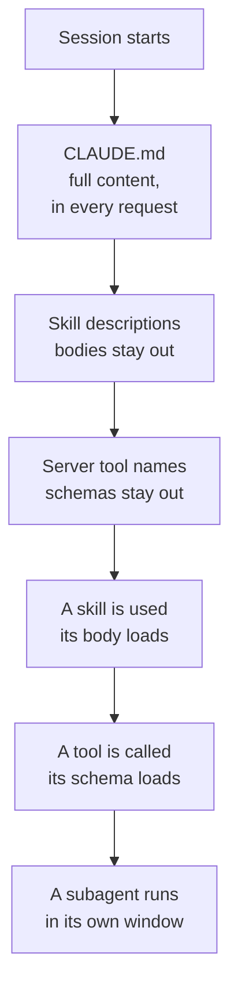

# Domain 8 — Tools and MCPs

This is 10.6 percent of the exam across three skills: implementing tools, developing servers
that provide them, and choosing between the several ways of extending Claude. It rewards one
habit above all: knowing **where the tokens go and when**, because almost every decision here
turns out to be a context decision wearing different clothes.

The sections follow the life of a tool rather than the guide's order of skills. When Claude
calls one, how you answer it, what happens when it fails, how a whole set of them stays
workable, where tools come from, and finally which kind of extension you wanted in the first
place. The last question is asked last on purpose: it is easier to choose between four options
once you know what each of them costs.

---

## What this domain actually asks

Not "what is a tool" — the exam takes that for granted. It asks which of several real,
working mechanisms fits the constraint the scenario stated. Three habits carry the marks.

**Ask which number the option actually moves.** Four documented mechanisms reduce tool-driven
context pressure and they reduce four different things. One of them does not reduce the tokens
in your window at all. If a scenario says the window is full, that rules an option out no
matter how much it saves.

**Ask who executes.** Client tools and server tools differ in who runs the code, and everything
downstream follows: who returns a result, who handles the failure, and what a response with an
unfinished call means. Half the implementation traps in this domain are one of these treated
as the other.

**Ask when it loads, not what it is.** In the last skill every option can hold instructions.
What separates them is whether the content enters your context window at session start, on
demand, or not at all — and whose window it enters.

---

## When Claude calls a tool

**Tool use, also called function calling, lets Claude call functions you define or that
Anthropic provides.** Claude decides from the request and the tool's description, then returns
a structured call that your application executes or that Anthropic executes. The two names are
one feature; you will meet both.

With the default tool choice, Claude decides on each turn whether to call a tool or answer
directly. It calls one **when the request maps to that tool's described capability and the
answer is not already in context**, and answers directly for stable knowledge, creative work
and ordinary conversation. That second condition is the one people forget: material already in
the conversation is a reason *not* to call.

That boundary is steerable from the system prompt. A light instruction to investigate before
responding increases tool use, and a conservative one holds it back. But **to require a call
rather than raise its odds, you set the tool choice parameter** — prompting moves the boundary,
the parameter removes the decision.

> **Trap.** A request that does not supply a required parameter may not fail. Claude Opus is
> much more likely to notice and ask; Claude Sonnet might ask, and might instead **infer a
> reasonable value you never supplied**. Strict mode does not save you here, because a guessed
> value is schema-valid. The defence is a stem-level habit: notice when a scenario's request is
> under-specified.

---

## Answering the call

Unlike interfaces that give tools their own message role, **the Claude API puts tools inside
the ordinary user and assistant message structure**. Assistant messages carry the calls, user
messages carry the results, and both sit in the same arrays as text and images.

```mermaid
flowchart TD
    A["You send a request<br/>with a tools array"] --> B["Claude replies with<br/>a call block"]
    B --> C["Client tool<br/>You run it"]
    B --> D["Server tool<br/>Anthropic runs it"]
    C --> E["You return a result<br/>in a user message"]
    D --> F["The result block<br/>arrives in the<br/>same reply"]
```

A call block carries an id used to match the result later, the tool's name and an input object.
**A call belonging to the computer use or browser use toolset carries a toolset name as well**,
and its own name is the member being called, so a dispatcher that switches on the name alone
routes those blocks wrongly.

Server-executed calls change the shape of your work rather than adding to it. Their call block
carries its own identifier prefix, the interface runs the tool internally, and **you return no
result for it** — the tool's result block follows in the same assistant turn.

Two consequences are worth holding, because both look like errors and are not.

**A paused turn is a continuation, not a failure.** The interface runs server tools in its own
loop and may pause a long-running turn. You continue it by passing the paused response back as
it stands in a further request, and by including the same tools, which preserves the work
already done rather than starting over.

**A response can hold a client call and an unfinished server call at once.** The server call
has no result block yet. Reply with a user message containing only the results for your client
tools, keep the same tools array, and the interface runs the server tool on that request.

---

## When a tool fails

**A tool failure is information the model reasons over, not an exception to swallow.** Return
the error in the tool result with the error flag set, and Claude incorporates it into its
answer instead of proceeding as though the call worked.

What you write there matters more than it looks. The documented practice is **instructive error
messages: say what went wrong and what Claude should try next.** "Rate limit exceeded. Retry
after 60 seconds." gives Claude what it needs to adapt; "failed" invites the same call again.
An error string is a prompt.

| The error | Who handles it | What to do |
|---|---|---|
| A client tool throws during execution | You | Return the message with the error flag set, written to be acted on |
| Claude calls a tool with missing or invalid arguments | Claude, then you | It retries two or three times with corrections; sharpen the description, or set strict mode to remove the failure |
| A server tool fails | Anthropic | Nothing — Claude handles it transparently and offers an alternative response |

That last row is the boundary. Client and server tools are symmetrical in almost nothing, and
error handling is where the asymmetry costs you: an application written to return an error
result for a server tool is writing into a channel nobody reads.

<b>Self-check — calls and failures</b>

1. A tool is defined, described well, and Claude answers without calling it. Give a reason
   other than the description.
2. Your prompt tells Claude to always use the search tool first. It usually does. What would
   make it certain?
3. A response has a call block for your tool and another with no result block. What do you send?
4. Why is "the request failed" a poor thing to return in a tool result?

**Answers.** 1. The answer was already in context, which is a documented reason not to call.
2. Setting the tool choice parameter; a prompt moves the boundary rather than removing the
decision. 3. A user message with results for your client tools only, keeping the same tools
array — the second call is a server call that has not finished. 4. Claude reads it and decides
what to do next, so a message with no cause and no next step usually produces the same call
again.

---

## Keeping a tool set workable

**A tool set has two failure modes and the second arrives first.** Definitions for a typical
multi-server setup can run to tens of thousands of tokens before any work happens. But long
before the window is anywhere near full, **selection accuracy falls away once more than a few
dozen tools are available.** The set degrades the answer before it exhausts the room.

Four documented approaches address this, and the whole point is that each reduces something
different.

| Approach | What it reduces | When it fits |
|---|---|---|
| Tool search | Definitions loaded upfront | Large sets where most tools are not needed every turn |
| Programmatic tool calling | Result roundtrips | Chains of calls that could run as one script |
| Prompt caching | The cost of repeated definitions | Sets that are large but fixed |
| Context editing | Old results sitting in history | Long conversations whose early results are stale |

**Prompt caching is the one that does not reduce the tokens in your context.** It reduces what
they cost on later requests. That single fact settles most questions in this section: a
scenario whose constraint is a full window has ruled it out, however large the saving.

The other three each move a different thing. **Tool search** keeps definitions out of the
window until Claude asks for them, trading one extra turn of latency for a large drop in
baseline usage — and it protects selection accuracy at the same time, which is the half people
miss. **Programmatic tool calling** collapses a chain into a single script the sandbox runs, so
the intermediate results never enter the history at all. **Context editing** removes old result
blocks once they have served their purpose.

They compose, and the documented order to add them in is worth carrying. Caching on the
definitions from day one. Tool search once the set has grown and the baseline usage becomes
noticeable — the documentation pairs a tool count with that second trigger, and the count is
the half that moves. Context editing once conversations run long enough that early results stop
mattering. And programmatic tool calling when you notice repetitive chains of small calls.

<b>Self-check — tool set context</b>

1. A team's tool definitions cost a lot per request and the set never changes. Which approach?
2. The same team's window is now filling before the task finishes. Does that change the answer?
3. An agent has forty tools and plenty of window. Is there still a problem?
4. Which approach stops intermediate results from entering the conversation at all?

**Answers.** 1. Prompt caching — a large but fixed set is exactly what it is for. 2. Yes:
caching leaves the token count unchanged, so the window problem needs tool search, or context
editing if the pressure is accumulated results rather than definitions. 3. Yes — selection
accuracy degrades past a few dozen tools regardless of room. 4. Programmatic tool calling,
which runs the chain as one script in the sandbox.

---

## Choosing tools that fit together

**Anthropic's own tools are designed to pair, and the pairing follows workflow stages**: one
tool gathers or discovers, another processes or acts. Search with code execution for research,
an editor with a shell for a coding loop, search with fetch when the answer needs the full
page rather than the snippet, memory alongside anything that must recall earlier sessions.

The selection rule underneath is the useful part. **The computer use tool subsumes most others
by driving a full desktop, which makes it the most general option and also the slowest**,
because Claude typically needs a fresh screenshot after each batch of actions. So prefer the
narrowest tool that covers the task, reach for computer use when nothing else fits, and use the
browser tool when the whole job happens inside webpages.

---

## Where tools come from

Tools reach an agent from three places, and a server's own documentation tells you which one
you are looking at.

| The documentation gives you | It is | Runs |
|---|---|---|
| A command to run | A `stdio` server | As a local process, speaking over standard input and output |
| A web address | An `http` or `sse` server | Somewhere else, reached over the network |
| Nothing — you are writing the tools | An in-process server | Inside your own application, with no separate process |

That third row is the one people do not expect. **Custom tools defined in your application code
need no deployment, no transport and no separate lifecycle**: the protocol is used as an
interface and the server runs in-process. A tool there is four parts — a name, a description
Claude reads to decide when to call it, an input schema, and a handler. The handler returns a
content array, optionally machine-readable structured data alongside it, and optionally an
error flag Claude can react to.

> **Trap.** Connecting a server does not make its tools usable. Tools provided over the
> protocol **require explicit permission**, and without it Claude can see that they exist and
> cannot call them. A server that connects cleanly and then appears to do nothing is usually
> this. The tools are namespaced by server, which is what lets one rule cover a whole server at
> once.

One thing you get for free in the development kit: where many tools are configured, **tool
search is on by default**, withholding definitions from context and loading only what a turn
needs. On the interface the same mechanism exists and is opted into.

---

## Configuring servers without surprises

**When the same server is defined in more than one place, the client connects once and uses the
whole entry from the winning source.** Fields are not merged across scopes. That is the rule
that produces real bugs: an environment value added at a lower-precedence scope is silently
absent, because the entry that lost took its fields with it.

Precedence runs local, then project, then user, then servers a plugin provides, then
connectors. The three configuration scopes match duplicates **by name**; plugins and connectors
match **by endpoint**, so one pointing at the same address or command as a higher-precedence
server is the same server whatever it is called.

Sharing a project configuration does not mean committing a secret. The file expands environment
variables — with a fallback form for values that may be unset — in the command, its arguments,
the environment handed to the server, the address, and the authentication headers. The file
travels; the values stay.

For remote servers there is a hosted connector that reaches them straight from the messages
interface **without you implementing a client**. Two limits decide whether it fits. It carries
only the protocol's **tool calls**, of the three primitives the objective names. And the server
must be publicly exposed over the web, so **a local `stdio` server cannot be connected through
it at all** — which rules it out for exactly the setups people reach for it from. It is a beta
capability, so treat what it removes as the durable fact and its availability as the moving one.

Two cautions about servers you did not write. Remote servers published by other companies are
third-party services **not owned, operated or endorsed by Anthropic**, and the documented
guidance is to connect only to ones you trust after reviewing their security practices and
terms. And attaching a server does not change how Claude decides to use it: a connected tool
fires when the request maps to its described capability, so "how do this product's databases
work" is answered from knowledge and "what is in my database" calls the tool.

<b>Self-check — servers</b>

1. A server's documentation gives you a command to run. Which transport, and where does it run?
2. You add an environment variable to a server's project entry and it has no effect. Why?
3. You rename a plugin's server so it stops clashing with yours. Does that work?
4. Your server runs on a laptop and the team wants it reached from the messages interface
   directly. What do you tell them?

**Answers.** 1. A `stdio` server, running as a local process speaking over standard input and
output. 2. A higher-precedence definition exists and the whole entry comes from there; fields
are not merged across scopes. 3. No — plugins match by endpoint, not by name, so it is still
the same server. 4. The hosted connector needs a server publicly exposed over the web; a local
`stdio` server cannot be connected through it.

---

## Which extension, and what it costs

The last skill is a single question: given a use case, which of these do you reach for? The
documentation answers it twice — once by purpose, once by cost — and the second answer is the
more testable one.

| Feature | What it does | Reach for it when |
|---|---|---|
| `CLAUDE.md` | Persistent context loaded every conversation | You need always-do rules and project conventions |
| Skill | Instructions, knowledge and workflows Claude can use | Content is reusable, reference, or a repeatable task |
| Subagent | Isolated execution that returns summarised results | You need context isolation or parallel work |
| MCP | Connects to external services | You need external data or actions |
| Hook | Automation triggered by events | Something must run on every matching event |

Now the **context cost** of each, which is where the choices actually get decided.

Read those two together and the confusable pairs answer themselves.

**A skill and a subagent both hold instructions and differ in whose window pays.** A skill is
reusable content loaded into the context you are already using, and it adds to your main
window. A subagent runs separately in its own window with its own input and output tokens, and
only a summary comes back. So a scenario whose problem is a filling window, or a side task that
reads dozens of files you will never refer to again, has named the second.

**An instructions file and a skill both store instructions and differ in when they load.** The
file loads its full content every session and is in every request, which is right for
conventions and never-do rules. A skill loads on demand, can be invoked by name, and is right
for material Claude needs only sometimes.

> **Trap.** Adding extensions is not free until the window fills. **Too much context also adds
> noise**, and the failure that follows is quiet: skills stop triggering correctly and stated
> conventions get lost. The setup degrades before it overflows.

Two more things the documentation says outright and nobody guesses. The first: **features layer
by three different rules.** Instructions files are additive, with every level contributing at
once. Skills, subagents and servers override by name, so one definition wins. Hooks merge, and
every registered one fires regardless of source.

The second: the documented **triggers for adding a feature are behavioural**, arriving during
the work rather than in a design review. A convention Claude gets wrong twice. A prompt you
keep retyping, or a playbook pasted for the third time. A system you keep copying data out of.
A side task flooding the conversation. Something you want to happen every time without asking.
A second repository needing the same setup.

Finally, they combine more often than they compete. The clearest pairing: **a connection
provides access and a skill provides competence.** The connection reaches your database; the
skill documents the schema and the query patterns. A team with a connected database and bad
queries has the first and not the second.

<b>Self-check — choosing an extension</b>

1. A side task reads forty files and you need three sentences of it. Skill or subagent, and why?
2. Your style guide is long and relevant about once a week. Where does it go?
3. You have connected a database and Claude writes poor queries against it. What is missing?
4. The same rule is defined at user and project level. Does the more specific one win?

**Answers.** 1. A subagent — it runs in its own window and returns only a summary, so the forty
files never touch your context. 2. A skill, which loads on demand; the always-loaded file is for
things Claude should never be without. 3. A skill documenting the schema and query patterns —
the connection gave access, not competence. 4. It depends on the feature: instructions files are
additive, skills and servers override by name, and hooks all fire.

---

## Skills, and why they scale

**A skill is not a saved prompt.** A prompt is a conversation-level instruction for one task; a
skill is a reusable resource on the filesystem that loads on demand, so the same guidance is not
repeated across conversations.

The property that makes a large library affordable is **progressive disclosure**: Claude loads
information in stages rather than consuming context upfront. The metadata is always loaded, the
instructions load when the skill is triggered, and the rest follows only if needed. **Until a
skill is triggered, only its name and description occupy context** — which is why you can
install many skills without a context penalty, and why the same content in an always-loaded file
would not scale at all.

That puts unusual weight on one field. **The description is what Claude matches your request
against when deciding whether to use the skill**, so it has to say both what the skill does
*and* when to use it. A skill that never fires almost always has a description that says only
the first.

<b>Self-check — skills</b>

1. What is loaded from a skill you have installed but never used?
2. Why does a skill scale better than the equivalent content in an always-loaded file?
3. A skill that should obviously apply never triggers. Where do you look first?

**Answers.** 1. Its name and description, loaded at startup so Claude can decide when to use it.
2. Progressive disclosure — the body loads only when the skill is triggered, where the file's
full content is in every request. 3. The description, which must say when to use the skill and
not only what it does.

---

## Traps worth carrying into the exam

**Ask which number the option moves.** Caching lowers cost and leaves the token count alone;
tool search lowers the count; context editing lowers it from the other end. An option that
saves money does not answer a question about a full window.

**Client and server tools are symmetrical in almost nothing.** Who executes decides who returns
a result, who handles the failure, and what an unfinished call means. A stop reason you do not
recognise is usually the server-side loop rather than an error.

**A control that exists is not a control that applies.** A connected server's tools need
permission before they can be called. A configuration defined twice contributes one entry, not
a merge. A directory listing is not an endorsement.

**Fitting is not the constraint that binds first.** Tool selection degrades before the window
fills, and a crowded setup adds noise before it adds overflow. Both fail quietly.

**When the choice is between extensions, the discriminator is when the content loads and whose
window it enters** — never which one is more capable. Every option in that skill can hold
instructions.
