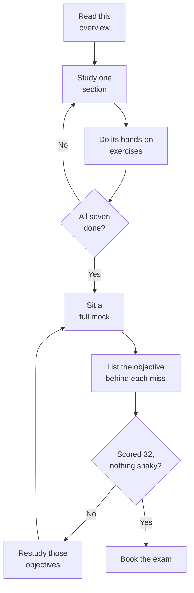

# Databricks Certified Data Engineer Associate (DEA) — exam overview

This page is the map. It tells you what the exam is made of, what its questions look like,
how to spend the 90 minutes, and where the material you find elsewhere will mislead you.

That last part matters more on this exam than on most. The current version is a substantial
rewrite, and almost every course, blog post and practice set still describes the previous
one.

---

## The exam at a glance

| Fact | Value |
|---|---|
| Scored questions | 45, all multiple choice |
| Time limit | 90 minutes |
| Registration fee | USD 200, plus local tax |
| Delivery | Online, or at a test centre |
| Test aids | None permitted |
| Prerequisite | None, though six months of hands-on Databricks is recommended |
| Validity | Two years, then you retake the current live exam |
| Languages | English, Japanese, Brazilian Portuguese, Korean |

A sitting **may** also carry unscored items — the guide says exams may include them, not that
they always do. Where they appear, Databricks does not identify them, does not say how many
there are, and adds time to cover them. So treat 45 as the number of questions that decide your
result, and be ready for a paper that runs somewhat longer.

### The passing score is not published, and you will be told otherwise

Databricks does not publish passing scores for any certification. Their own certification FAQ
says the scores are set by statistical analysis, change as exam forms are updated, and are
therefore not published.

Two corrections follow, and both are worth carrying:

- **70% is not an official figure.** It is repeated across third-party sites and it has no
  published source behind it.
- **80% is a real Databricks number for a different thing.** It is the minimum for *Badges*,
  which are free, unproctored assessments. It is not the certification pass mark.

The scoring model is likewise unstated. Databricks does not say whether a per-domain minimum
applies, so do not plan to write off a domain and make up the marks elsewhere. Prepare as
though every section counts, because nothing published says it does not.

---

## What the exam covers

Seven sections, and their weights are published for the first time in this version. Study
time follows this table.

| Section | Weight | What it actually rewards |
|---|---|---|
| Databricks Intelligence Platform | 6% | Naming the platform's parts, and picking the right compute for a workload |
| Data Ingestion and Loading | 21% | Choosing between ingestion paths, and saying why one beats the others |
| Data Transformation and Modeling | 22% | PySpark and SQL transformation, and which Gold-layer object to build |
| Working with Lakeflow Jobs | 16% | Orchestration, task dependencies, and trigger choice |
| Implementing CI/CD | 10% | Bundles, Git folders, and the command-line workflow |
| Troubleshooting, Monitoring, and Optimization | 10% | Reading the Spark UI and run history, and diagnosing from evidence |
| Governance and Security | 15% | Unity Catalog privileges, masking, row filters, and attribute-based policies |

Two sections carry nearly half the exam between them: Data Ingestion and Loading at 21%, and
Data Transformation and Modeling at 22%. If your time is short, that is where it goes.

Section names above are spelled as Databricks spells them, including American spellings such
as *Modeling*. The rest of this material uses British spelling.

---

## What changed in the May 2026 version

The previous exam guide was published in July 2025. It had five sections and no published
weights. This one has seven sections, 33 objectives, and weights for every section.

**Four features were renamed.** The guide leads with the new name and parenthesises the old
one — it writes "formerly Databricks Repos" and "formerly Databricks Asset Bundles" in the
objectives themselves. So both names are in the current guide, and learning only the old one
leaves you reading the parenthesis instead of the objective.

| Old name | Current name |
|---|---|
| Workflows | Lakeflow Jobs |
| Delta Live Tables, LDP | Lakeflow Spark Declarative Pipelines |
| Databricks Asset Bundles | Declarative Automation Bundles, or Automation Bundle |
| Databricks Repos | Databricks Git Folders |

**Two sections are entirely new.** Implementing CI/CD at 10% and Troubleshooting, Monitoring,
and Optimization at 10% had no counterpart section in the previous guide. Together they are a
fifth of the exam, and older study material does not cover them as sections at all.

**New topics appear with no previous counterpart.** Lakeflow Connect and its standard and
managed connectors, the `COPY INTO` command, Unity Catalog attribute-based access control
policies, column masking and row-level security, Liquid Clustering, predictive optimization,
the three trigger types, and the Databricks command-line interface.

**And several topics were dropped from the outline entirely.** This is the trap, because it
is where older courses spend their time:

- Delta Sharing, which had four separate objectives in the July 2025 guide
- Lakehouse Federation
- Databricks Connect
- Unity Catalog key roles, audit-log storage, and lineage

None of these has an objective of its own in the current outline.

**But "no longer its own objective" is not "off the exam", and the guide proves it.** Sample
question 3 in the current guide asks how Databricks audit logs are stored — the delivery
format, the latency, whether files get overwritten. Audit-log storage was a July 2025
objective and is not one now. The guide files that question under objective 2.1, *"Enable and
detail data ingestion patterns"*, which absorbed it.

So the rule to carry in is about the **objective**, not the topic:

- A topic without its own objective can still be the right answer, where a current objective
  covers the ground. Audit-log storage under an ingestion objective is the guide's own worked
  example.
- Delta Sharing and Lakehouse Federation are not named as objectives anywhere in the May 2026
  outline. That is all the outline establishes. It does not put them beyond every question:
  objective 1.1 asks about the platform's core components "such as its architecture, Delta
  Lake, and Unity Catalog", and a *such as* list is open at the end.

Ask which objective a question is testing, not whether its topic still has a bullet. Databricks
publishes nothing about how it builds wrong answers, so treat none of this as a rule about
where distractors come from.

### One name has already moved on without the guide

The guide names **Lakeflow Spark Declarative Pipelines**. Current Databricks documentation
calls the same product **Lakeflow pipelines** — the page on what happened to Delta Live Tables
says the product "has been updated to Lakeflow pipelines", and the release notes now use that
shorter name too. The longer form points at Apache Spark Declarative Pipelines, the
open-source framework the Databricks product extends.

**This does not change the exam answer.** The exam guide is what the exam is written from, and
it uses the longer name. If an option says Lakeflow Spark Declarative Pipelines and another
says Delta Live Tables, the first is current and the second is the retired name. Do not talk
yourself out of a correct option because the documentation you just read said something
shorter. Learn all three names for the one product, and pick the one the guide uses.

---

## What the questions actually look like

Databricks publishes sample questions inside the exam guide, and there is no official practice
exam for this certification, whatever older links suggest. What follows comes from working
through every sample Databricks publishes for this exam, read alongside the samples in its
other current exam guides.

**Read one caveat first.** The guide labels its own samples: *"These questions are retired
from a previous version of the exam."* They are printed under the current objectives to show
what each objective means. So they are reliable evidence of **how Databricks writes**, and
weaker evidence of how hard the live form is. Everything below is about style, and style is
the part that carries across.

**The published samples are scenarios.** Each opens with a situation rather than a question,
and the pattern holds across Databricks' other current exams too. Treat that as a consistent
house style rather than a published rule: prepare for scenarios, without assuming bare recall
is impossible.

**Four options, one correct, on this exam's samples.** Every DEA sample gives options A to D
with a single answer. The format is not guaranteed — another current Databricks associate exam
includes a five-option item asking for two answers — but if a stem wants two, it says so. No
sample anywhere uses "All of the above" or "None of the above".

**Stems are short.** The published samples run from about 23 to 64 words, clustering near 48.
That is a measurement of retired samples rather than a promise about the live form, but where
a stem does run long, the extra words are evidence rather than padding.

**The decisive constraint is in lower case.** No published sample capitalises MOST, LEAST or
BEST, and Databricks publishes no rule about it either way — so treat it as an observed habit
rather than a guarantee. The constraint sits quietly in the closing question instead — "with
the lowest cost", "without rearranging the data", "while emphasizing simplicity" — or as a
stated assumption. Read the last line twice. If you are used to exams that shout the qualifier,
do not wait for the shout.

**Expect code, even though the DEA samples contain none.** The guide says outright that code
is given in SQL where possible and in Python otherwise, so it is on the exam. It simply does
not appear in the samples chosen for this guide. In Databricks' other current guides it sits
inline inside the scenario — a `CREATE TABLE` statement or a few lines of PySpark — rather
than in a separate block. Prepare to read code in a stem.

**Numbers in a stem are load-bearing.** Where a sample gives a shuffle read size or a task
duration, the answer turns on it. The samples do not decorate a stem with a figure that does
not matter.

---

## Timing and pacing

You get 90 minutes for 45 scored questions. That is about two minutes each, and the unscored
items come with extra time rather than eating into it.

Two minutes is comfortable for this exam, given a median stem of 48 words. The risk is not
running out of time. It is spending four minutes on a governance question you half-know and
then rushing three ingestion questions you would have got right.

A workable pass structure:

1. **First pass, about 60 minutes.** Answer everything you know. Flag anything that needs
   more than roughly two minutes and move on immediately.
2. **Second pass, about 25 minutes.** Return to the flagged questions with the pressure off.
3. **Last five minutes.** Confirm nothing is unanswered.

Answer every question, including ones you run out of time on. This is practical advice, not a
scoring fact. Databricks publishes nothing about how a blank is treated or whether a wrong
answer is penalised — it does publish some scoring facts, such as unscored items not affecting
your score, but not these two. Nothing on record makes an attempted answer worse than a blank,
so answer.

---

## How to study for this exam

The whole route, before the detail. The part most people get wrong is the loop at the bottom:
a failed mock sends you back to **specific objectives**, not back to another mock.

**Work through the sections in the guide's order, not by weight.** The platform section is
only 6%, but it defines the vocabulary every later section assumes. Read it first even though
it is worth least.

**Weight your depth, not your order.** Ingestion and transformation together carry almost half
the marks. Governance carries 15% and is heavily rules-based, which makes it the cheapest
section to convert into reliable marks.

**Get hands on.** Databricks Free Edition costs nothing, and this exam asks what happens when
you do things rather than what the documentation says. The checklist below is the minimum.

**Check the names before you trust any source.** A source using Workflows, Delta Live Tables,
Asset Bundles or Repos is a source to check, not necessarily an old one — a recent tutorial may
use a former name deliberately, for readers who learned it that way, and Databricks itself
keeps the old names in compatibility notes. Treat the old name as a prompt to confirm the
material against the current guide, and learn the name the guide leads with.

**Read the objectives as written.** The guide's own objective list is the syllabus, and it is
specific. Where an objective names a command, learn that command.

### The hands-on checklist

These all run in a Free Edition workspace. Each answers a family of questions, and the section
it serves is in the last column.

| Do this | What it settles | Section |
|---|---|---|
| Create a managed table and an external table, then drop each | What `DROP` does to the underlying files | Governance and Security |
| Load the same files with `COPY INTO`, then with Auto Loader | Why one is re-runnable and the other tracks state | Data Ingestion and Loading |
| Add a column to the source, rerun Auto Loader | Schema evolution, and what happens when it is off | Data Ingestion and Loading |
| Build a view, a materialized view and a streaming table over one source | Freshness against recompute cost | Data Transformation and Modeling |
| Chain three tasks in a job, make the middle one fail, then repair the run | Task dependencies, and what repair reruns | Working with Lakeflow Jobs |
| Set a file-arrival trigger and drop a file into the location | How data-driven triggers differ from schedules | Working with Lakeflow Jobs |
| Deploy the same bundle to two targets with different variables | Environment overrides and promotion | Implementing CI/CD |
| Grant a group `SELECT`, then apply a column mask and a row filter | Which control acts where | Governance and Security |

#### One exercise Free Edition cannot give you

Objective 6.3 asks you to spot skew, shuffle and spill **by reading stage-level metrics in the
Spark UI**. You cannot practise that in Free Edition. Free Edition runs on serverless compute
only, and on serverless the Spark UI is not available — the documentation says to use the
query profile instead.

That leaves two honest options:

| If you have | Do this | What you get |
|---|---|---|
| Free Edition only | Run a deliberately skewed join, then open the **query profile** | The slowest and most expensive operator, with its time, rows, memory and shuffle activity |
| A workspace with classic compute | Run the same join on a classic cluster, then open the **Spark UI** stage detail | The view the objective names: per-task minimum, median and maximum shuffle read |

Be clear about the difference, because it is the difference the objective turns on. The query
profile works at the level of **operators** — it will show you that one join is consuming the
time and moving the data, which is worth seeing. It does not break a stage down into its
individual tasks, so it cannot show you the lopsided spread across tasks that identifies skew.
That comparison lives in the Spark UI. If you can borrow a workspace with classic compute for
an hour, spend it here.

### Official resources

This list is deliberately short, and all of it is first-party. Most of it is free; the cost
column says where that stops.

| Resource | Why it is worth your time | Cost |
|---|---|---|
| [Exam guide PDF](https://www.databricks.com/sites/default/files/2026-05/databricks-certified-data-engineer-associate-exam-guide-may-2026-000.pdf) | The syllabus, and the only authority on what is asked | Free |
| [Certification page](https://www.databricks.com/learn/certification/data-engineer-associate) | Registration, languages, and the link to the current guide | Free |
| [AI Prep Guide](https://www.databricks.com/sites/default/files/2026-06/ai-prep-guide-any-databricks-certification.pdf) | Databricks' own method for studying with an AI tool, including how to catch the outdated answers they give | Free |
| [Databricks Academy](https://www.databricks.com/learn/training/certification) | The courses the guide's Recommended Training names | Self-paced free; instructor-led is paid, and access can depend on entitlement |
| [Product documentation](https://docs.databricks.com/) | The product truth, cloud-tabbed — check you are on your cloud's tab | Free |
| [Free Edition](https://www.databricks.com/learn/free-edition) | Where the hands-on checklist gets done, with the one gap noted above | Free |
| [Certification FAQ](https://www.databricks.com/learn/certification/faq) | Scoring policy, retakes, and what is not published | Free |

Check the certification page for a newer guide about two weeks before you sit. Databricks
updates it whenever the exam changes, and this exam changed substantially in May 2026.

### Are you ready? A readiness measure, not a prediction

**Read this first, because it decides how to use everything below.** Databricks does not
publish a pass mark, so no mock score predicts your result. Databricks says so itself, in its
own prep guide: practice questions *"aren't a calibrated readiness check; your real signal is
full coverage of the exam guide objectives plus hands-on confidence."*

Take that seriously, because it changes what a mock is for. **A mock is a diagnostic, not a
verdict.** Use it to find which objectives you cannot answer, then go and learn those. A score
that tells you "probably ready" has told you nothing you can act on.

So there is one number here, and only one.

**The threshold:** 32 correct out of 45 on a full-length mock — 45 questions, 90 minutes, no
notes. That is this course's own readiness bar, the same figure shown on our practice tests. It
is not a Databricks pass mark, and it is not the 70% myth corrected earlier on this page; it is
a threshold we chose, and 32 of 45 is what it works out to. Below it, keep studying. Above it,
you are in reasonable shape — and still not finished, because the real signal is objective
coverage.

**Then read the mock by section, because the total hides where the marks went.** A 45-question
mock splits by the published weights, so each section contributes a fixed number of questions:

| Section | Questions in a 45-question mock |
|---|---|
| Databricks Intelligence Platform | 3 |
| Data Ingestion and Loading | 9 |
| Data Transformation and Modeling | 10 |
| Working with Lakeflow Jobs | 7 |
| Implementing CI/CD | 5 |
| Troubleshooting, Monitoring, and Optimization | 4 |
| Governance and Security | 7 |

Two things fall out of that table. Dropping half of Data Transformation and Modeling costs you
five marks, while getting every Platform question wrong costs three — so a weak section is only
worth worrying about in proportion to its size. And because Databricks does not say whether a
per-section minimum applies, do not let any section sit near zero on the assumption you can
carry it elsewhere.

**Then convert the section into objectives, which is the step that actually works.** Take each
question you got wrong, find the objective it tests in the guide's outline, and mark that
objective. Objectives with two or more misses are your study list. Full coverage of that list,
plus the hands-on checklist above, is the signal Databricks itself points at — and unlike a
score, it is something you can finish.

**Retake the same mock only to check a fix.** A score that climbs because you remember the
items is measuring memory, not readiness.

### The last 24 hours

Stop learning new material. Reread the section weights and confirm you know which two sections
carry the most marks. Review the renamed features until the current name comes first. Read
the list of topics that lost their own objective once, so that meeting one in the exam prompts
you to ask which current objective the question is testing. Then rest, because this is a 90
minute exam and reading accuracy is what it measures.

---

*This page tracks the official exam guide version May 4, 2026 (file: may-2026-000), retrieved
22 August 2026. Databricks updates the guide whenever the exam changes. Check the
certification page for a newer version about two weeks before you sit.*
