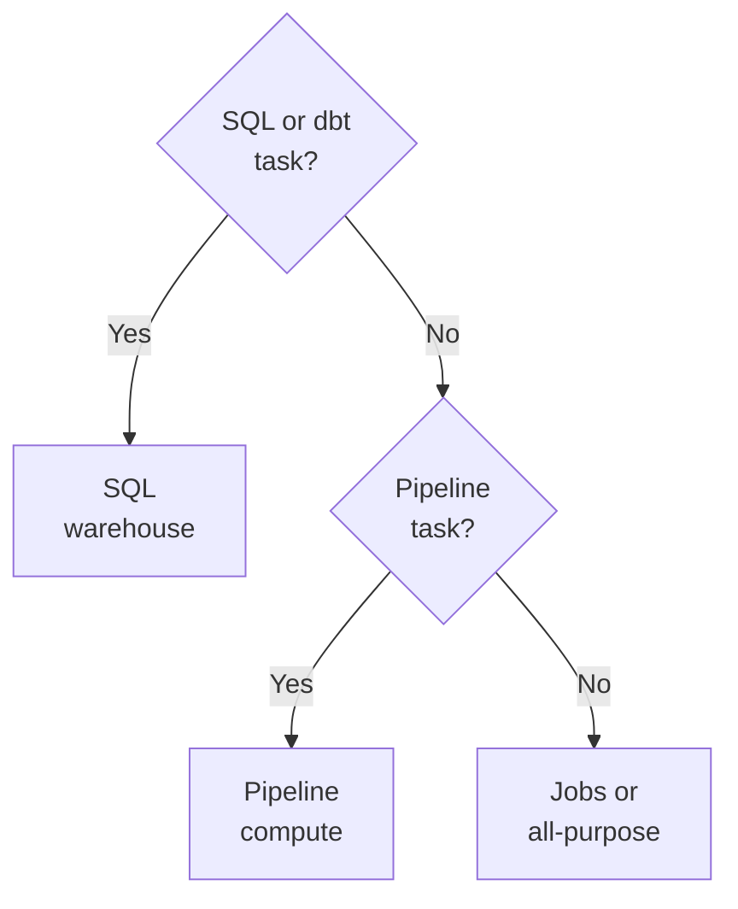

# Domain 1 — Databricks Intelligence Platform

This domain is 6% of the exam, the smallest of the seven. Do not skip it. It defines the
vocabulary the other six assume, and two of its ideas — where compute runs, and what a table
already is — decide questions filed under other sections entirely.

The sections below are not in the guide's order. They follow the three questions you actually
ask when you meet this platform: where does my code run, what is my data sitting in and how is
it named, and which compute do I pick for this job. Architecture comes first because the rest
is unreadable without it.

One thing before you start. The Databricks documentation shows different text depending on
which cloud you are on, with tabs for Amazon Web Services (AWS), Azure and Google Cloud. The
same page can say "your AWS account" on one tab and something different on another. When you
check a fact, notice which tab you are reading. This material was read from the AWS tab, and
says so where the fact is genuinely cloud-specific.

---

## What this domain actually asks

Three habits carry most of the marks here.

**Ask whose account something runs in.** Half of this domain is the split between what
Databricks operates and what runs in your own cloud account. Serverless and classic sit on
opposite sides of that line, and the cost model follows from it.

**Assume the default.** A table is a Delta table unless someone went out of their way. A
question that offers you "convert it to Delta first" is usually offering you work you have
already had done for you.

**Answer compute questions from the task first, then the constraint.** The stem will tell you
what matters — start-up time, concurrency, cost, who shares it. Read those against the kind of
task being run, because the task narrows the options before any constraint does. The constraint
then usually settles which of the remaining ones is right.

---

## Where your code actually runs

**Databricks splits into a control plane and a compute plane, and only one of them touches
your data.**

The control plane holds the backend services Databricks manages, and it sits in the Databricks
account rather than in your cloud account. The web application lives there. That is why the
workspace stays open in your browser when nothing is running: the thing you are looking at is
not the thing that processes data.

The compute plane is where your data is processed, and there are two kinds of it.

In the **classic compute plane**, compute resources run in your own cloud account. New
resources are created inside each workspace's virtual network. Because it lives in your
account, a classic compute plane has natural isolation — nothing else is sharing it, because
the boundary is your account boundary.

In the **serverless compute plane**, compute resources run inside the Databricks account
instead. Databricks allocates and manages them. That is not the same as no boundary: serverless
compute runs within a network boundary for the workspace, with layers of security isolating one
Databricks customer's workspaces from another's.

| | Classic compute plane | Serverless compute plane |
|---|---|---|
| Runs in | Your own cloud account | The Databricks account |
| Network | Inside each workspace's virtual network | A workspace boundary Databricks operates |
| Isolation | Natural, from your account boundary | From that boundary, operated for you |
| You manage | The compute resources | Nothing |

This is the fact people most often have backwards. "Serverless" sounds like *your* servers,
managed for you. It is the opposite: serverless is the one that is not in your account.

A **workspace**, meanwhile, is a single deployment in the cloud that a team works in. It is not
the top level — the account is above it, which matters in the next section but one.

<b>Self-check — where code runs</b>

1. A colleague says the compute for their serverless job is running in the company's cloud
   account. What is wrong with that, and where is it actually running?
2. Where does the isolation of a classic compute plane come from? Name the boundary.
3. The workspace loads fine but a query will not start. Which plane is healthy, and which one
   is the problem?

 

1. Serverless compute runs in a serverless compute plane inside the Databricks account. It is
   classic compute that runs in the customer's own cloud account.
2. From the account boundary itself. Classic compute runs in each customer's own cloud
   account, so the isolation is natural rather than configured.
3. The control plane is healthy — that is what serves the web application. The compute plane
   is where processing happens, so that is where to look.

---

## The default table, and what the log buys you

**You already have a Delta table.** By default, every table created on Databricks is a Delta
table. Getting anything else takes a deliberate choice.

Delta Lake is the optimized storage layer that provides the foundation for tables in a
lakehouse on Databricks. Read *layer* carefully. It is not a file format competing with
Parquet — it is open source software that extends Parquet data files with a file-based
transaction log, and the log is what buys you atomicity, consistency, isolation and durability
(ACID) transactions along with metadata handling that scales.

So the data still lands in Parquet. What Delta adds sits beside it.

That transaction log is the single mechanism behind three things people often treat as
separate features:

- **Transactions.** Concurrent writes do not corrupt the table.
- **Metadata at scale.** File listings do not become the bottleneck as a table grows.
- **Querying the past.** You use the transaction log to review modifications to your table and
  to query previous table versions.

That last one is worth pausing on. Time travel is not a backup you switch on, and it is not a
separate product. It falls out of a log that is already being written for the first two
reasons. If a question offers you a mechanism you have to enable in order to read an earlier
version of a table, the mechanism is already there.

What it does depend on is the files still being there. Reading a previous version needs **both
the log and the data files** for that version, and `VACUUM` deletes data files once they are
past the retention threshold, which defaults to seven days. So "read it as it was last month"
is not a question about whether the feature exists; it is a question about what has been
vacuumed.

The log also has a well-defined open protocol that any system can use to read it. That is the
answer to "are we locked in" — the format is readable outside Databricks by design.

<b>Self-check — Delta Lake</b>

1. Someone proposes converting a table to Delta before enabling time travel. How many things
   are wrong with that sentence?
2. Delta Lake extends Parquet. What exactly does it add, and what stays the same?
3. Why is "we would be locked into Databricks" a weak objection to Delta Lake?

 

1. Two. The table is already Delta unless someone deliberately made it otherwise, and time
   travel is not a feature you enable — it comes from the transaction log that is already
   there.
2. It adds a file-based transaction log. The data still sits in Parquet files.
3. The transaction log has a well-defined open protocol that any system can use to read it.

---

## Names, levels, and who owns the files

Unity Catalog is the unified governance layer for data and artificial intelligence built into
Databricks. Two things about it are asked repeatedly: how objects are named, and who owns the
files underneath.

**Names have three levels, not two.** Assets such as tables, views, volumes, functions and
models follow a three-level namespace, written `catalog.schema.object`. If you learned on a
Hive metastore you will reach for `schema.table` out of habit, and that leaves the catalog
unstated.

**Unstated is not the same as broken.** How a name is *written* and how a name *resolves* are
two rules, and the exam separates them. Three parts, `catalog.schema.relation`, is unique on
its own. Two parts, `schema.relation`, is completed with the result of `current_catalog()` — so
it resolves, against whatever catalog the session happens to be on. That is fine in a notebook
where you set the catalog yourself, and it is the thing to avoid in a scheduled job, which
cannot rely on a session catalog. Write all three parts there.

Not everything sits inside that namespace. Objects such as storage credentials, external
locations, connections and shares sit directly under the metastore instead.

**The metastore is above the workspace, not inside it.** Unity Catalog provides an
account-level metastore that registers metadata about catalogs, schemas and tables, and about
permissions. Catalogs are the highest-level container for organising and isolating data, and
you can share a catalog across workspaces within the same region and account.

That sharing is the point of the account-level design. If each workspace had its own metastore,
a catalog could not be shared between them.

**Managed and external describe storage, not governance.** For tables and volumes, the
difference is who owns the file storage lifecycle.

| | Managed table | External table |
|---|---|---|
| Governance | Unity Catalog | Unity Catalog |
| Storage lifecycle | Unity Catalog | Something else |
| Governed at all? | Yes | Yes |

The word "external" invites you to hear "outside Unity Catalog". It is not. Unity Catalog
handles governance for both; with a managed table it also handles the underlying file storage
lifecycle, and with an external table it does not. This distinction returns in the governance
domain, so it is worth fixing now.

<b>Self-check — Unity Catalog</b>

1. Write out the shape of a fully qualified object name. How many levels, and what are they?
2. A team wants one catalog visible from three workspaces. What makes that possible?
3. An auditor asks whether external tables are governed. What is the accurate answer?

 

1. Three levels: catalog, then schema, then the object — `catalog.schema.object`. A two-part
   name is not an error; it is completed with `current_catalog()`, which is exactly why a
   scheduled job should not depend on it.
2. The metastore is at account level, so a catalog can be shared across workspaces in the same
   region and account.
3. Yes. Unity Catalog handles governance for external tables too. What it does not handle is
   their underlying file storage lifecycle.

---

## Choosing compute for the work

This is what objective two of this domain is really about, and it is the largest thing in the
domain. Work through it by constraint.

### What happens after the work ends separates them

You create an all-purpose cluster yourself, through the workspace user interface (UI), the
command-line interface or the API, and you can manually terminate and restart it. A job cluster
is different: the Databricks job scheduler creates it when a job runs on new job compute, and
terminates it when the job completes.

The consequence is the part that gets tested.

| | All-purpose compute | Job compute |
|---|---|---|
| Created by | You | The job scheduler |
| After the work ends | Can be manually terminated, and restarted | Terminates and cannot be restarted |
| Job pointed at it | Autostarts it if terminated | Created fresh for each run |

Read the second row twice. When a job runs on new job compute, that compute terminates and is
unavailable for restarting. But if you schedule a job against an *existing* all-purpose compute
that has been terminated, that compute will autostart. Same scheduled job, two different
outcomes, decided by which compute it points at.

Databricks does not recommend classic all-purpose compute for production jobs. The
documentation offers it as something you can optionally configure, not as the way to run
production work.

**Serverless compute** is a Databricks-managed service that connects you to on-demand compute
for notebooks, workflows and pipelines. It speeds up start-up and scaling, minimises idle time
and reduces the need to manage compute at all. It is not universal, though: serverless compute
for jobs has limitations and does not support all workloads, so check before assuming it. The
compute table names the sharpest case — a Spark Submit task lists classic jobs compute as both
its recommended **and** its only supported compute, so serverless is not on offer for it at
all. One task type of that kind is enough to stop a blanket migration.

> **Recommended is not universal.** The limitations page is where a workload gets ruled out, and
> four of its entries decide real migrations. Only Spark Connect APIs are supported, so the
> resilient distributed dataset (RDD) APIs are not. Compute-scoped libraries and instance pools are
> unavailable — note what that does to the pool saving below. Structured Streaming is restricted to
> `Trigger.AvailableNow` and `Trigger.Once`. And a run is terminated at seven days. Check the
> workload against that page before promising the move.

**Start from the task, not the schedule.** Compute is defined per task, and the task type
decides the family before anything else does. A SQL or dbt task runs on a SQL warehouse. A
Lakeflow pipelines task runs on pipeline compute. Only notebook and script tasks leave a further
choice open.

That last box is where scheduling finally matters, and it holds three options rather than two.
The table recommends **serverless jobs** for notebook and script tasks; classic jobs and classic
all-purpose are supported alternatives, and between those two a scheduled or automated run
belongs on jobs compute while all-purpose is for interactive work. Note what this rules out — "it runs on a
schedule, so it must be job compute" is wrong, because a scheduled SQL task still runs on a SQL
warehouse. Which *type* of warehouse comes next, and the table below answers that.

### The three SQL warehouse types

A SQL warehouse is a computation resource on which you run SQL queries. There are three
standard types: Classic, Pro and Serverless. They differ on where the compute layer sits, how long it takes to
start, and which performance features it supports.

| Type | Compute layer | Start-up time | Performance features |
|---|---|---|---|
| Serverless | Databricks account | About 2 to 6 seconds | All of them |
| Pro | Your own cloud account | About 4 minutes | No Intelligent Workload Management |
| Classic | Your own cloud account | About 4 minutes | No Predictive IO either |

A serverless SQL warehouse supports all of the performance features of Databricks SQL. A pro
warehouse supports Photon and Predictive IO but not Intelligent Workload Management. A classic
warehouse supports Photon but neither of the other two, and gives only entry-level performance.

Two traps live in that table. First, **Photon is in all three**, so it can never be the thing
that tells them apart — which makes it excellent bait. Second, pro is not a slightly slower
serverless. Its compute layer sits in your own cloud account rather than in the Databricks
account, exactly as classic does, and it takes about four minutes to start against serverless's
handful of seconds. If a scenario turns on how fast a warehouse becomes available, that gap is
the whole answer.

Databricks recommends using serverless SQL warehouses when available.

> **Currency caveat.** The documentation now also lists Lakehouse Real-Time, in Beta, as a
> specialised serverless warehouse type for sub-second, high-concurrency reads. It reached Beta
> after the exam guide version this material tracks, and that guide does not name it. **This
> does not change the exam answer.** The guide asks you to select a compute service on its
> characteristics, limitations and cost model; it does not list warehouse types at all, and the
> three standard ones are what the documentation sets out for that job. Answer on Serverless,
> Pro and Classic, and treat a Beta name among the options as a distractor.

<b>Self-check — choosing compute</b>

1. A nightly job is pointed at an existing all-purpose cluster that is currently terminated.
   What happens at run time? What would happen instead on new job compute?
2. A team needs a warehouse that is ready within seconds. Which type, and why can you rule out
   pro immediately?
3. An option says a workload should use pro "because it supports Photon". What is wrong with
   the reasoning even if pro turns out to be right?

 

1. The all-purpose compute autostarts and the job runs. New job compute would be created for
   the run and terminated afterwards, with no restarting.
2. Serverless, which starts in roughly 2 to 6 seconds. Pro takes about four minutes, because
   its compute layer sits in your own cloud account.
3. All three warehouse types support Photon, so Photon cannot distinguish between them. The
   reason is doing no work.

---

## What it costs, and what the price does not include

Objective two names cost models, and there is a specific shape to get right.

**Total cost is the Databricks Unit (DBU) plus the infrastructure underneath.** Total costs
include Databricks Units plus virtual machine, disk and associated network costs. A DBU figure
on its own therefore never answers "what will this cost" — there is a second bill.

**Serverless changes what the DBU covers.** For serverless services, the DBU cost already
includes the virtual machine costs. Read that scope carefully: it is the machine that is folded
in, and it is not a claim that a serverless DBU is your entire bill. Even so, it is the most
useful cost fact in the domain, because it means a serverless DBU rate and a classic DBU rate
are not comparable as they stand. Set them side by side without knowing this and serverless
looks expensive, when in fact one of the two numbers already covers the machine.

The same two-part shape explains instance pools. Databricks does not charge Databricks Units
while instances are idle in a pool — that is the saving the pool exists for — but
instance-provider billing does apply. No DBU, still a machine, still a bill.

Two selection statements are worth memorising because Databricks makes them outright rather
than leaving them to be inferred:

- On job compute, non-interactive workloads cost significantly less than on all-purpose
  compute. Cost and the production recommendation point the same way.
- For interactive SQL workloads, a Databricks SQL warehouse is the most cost-efficient engine.

---

## Traps worth carrying into the exam

- **Serverless does not run in your account.** Classic does. If an option says serverless
  compute runs in the customer's cloud account, it is wrong.
- **You do not need to make a table Delta.** It already is, unless someone deliberately made it
  otherwise.
- **Time travel is not a feature you turn on.** It is the transaction log you already have.
- **Job compute does not restart.** All-purpose does, and autostarts for a scheduled job.
- **Photon separates nothing.** All three warehouse types have it.
- **External still means governed.** Only the storage lifecycle sits elsewhere.
- **A DBU is not the whole bill** — except on serverless, where it covers the machine too.

> **One more currency caveat.** On serverless compute the Spark UI is not available; the
> documented substitute is the query profile, which visualises each query operator and its
> metrics — time spent, rows processed, memory consumed. That is a different unit from the
> Spark UI, where a stage's summary metrics compare durations across the tasks in that stage,
> and skew shows up as a maximum far above the 75th percentile. **This does not remove the
> Spark UI from the exam.** A later domain still asks you to read stage-level Spark UI metrics.
> Learn both screens and what each one can show you.
