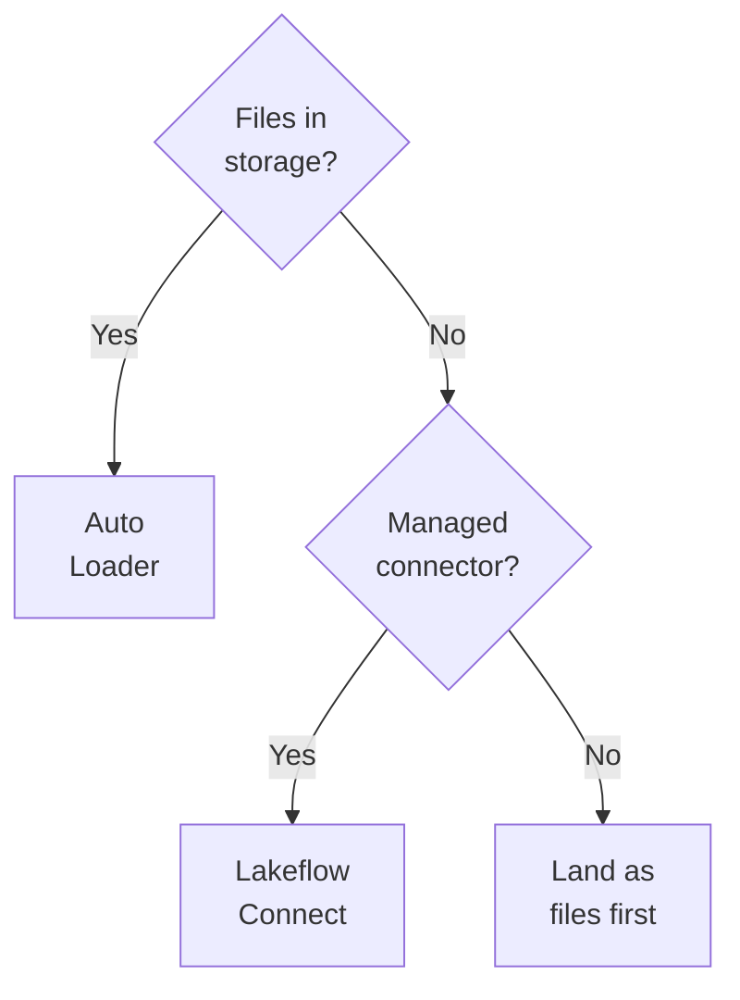
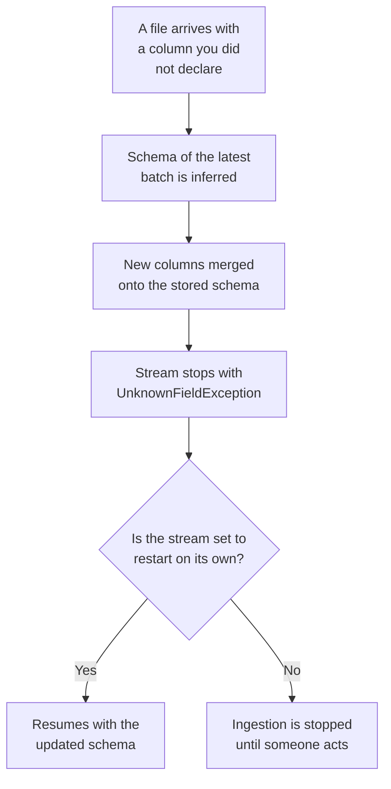
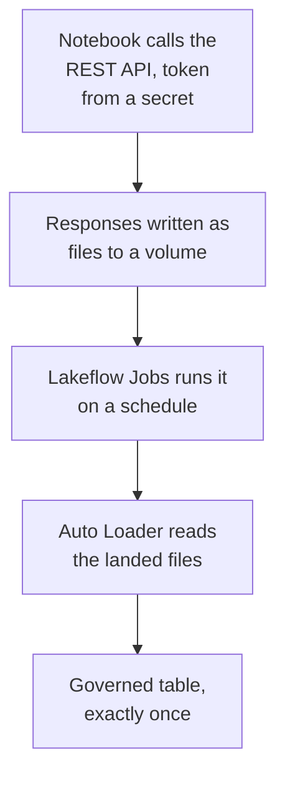

# Domain 2 — Data Ingestion and Loading

This domain is 21% of the exam, the second largest of the seven. It is also the one where the
right answer is most often the least clever option on the page. Most of what is tested here is
selection: several mechanisms can move the data, and the question is which one the platform
tells you to reach for given a volume, a cadence and a governance requirement.

The sections below are not in the guide's order. The guide puts choosing sixth, after the
individual tools. That is backwards for study, because the choice is the frame everything else
hangs off, so it comes first here and every later section is a detail about one rung of it.

**Expect to read code.** Databricks states that data manipulation code in this exam is
provided in SQL where possible, and in Python in all other cases. Some questions put a statement
in the situation and ask what it does; others put statements in the options and ask which one is
right. The statements in this file are the forms worth recognising on sight.

One thing before you start. The Databricks documentation shows different text depending on
which cloud you are on. Most of this domain reads the same on all of them — the load command,
schema handling, what a connector deploys — but two things do not: which file detection modes
each store supports, and what the credential options are called. This material was read from
the Amazon Web Services (AWS) tab and says so where the fact is genuinely cloud-specific.

---

## What this domain actually asks

Three habits carry most of the marks here.

**Start at the managed end and walk down.** The platform publishes its ingestion products as a
ladder from most managed to most customisable, and the documented instruction is to begin at
the managed end and drop down when that layer cannot do the job. Candidates reach for the
most configurable option because it is the one they can picture. That instinct is wrong here
more often than it is right.

**Read the constraint before the tool.** How many files, arriving how often, changing shape or
not, and does the data have to land or only be readable. Those four facts settle nearly every
selection question in this domain, and the stem always supplies at least two of them.

**Separate what is default from what is recommended.** This domain has two places where they
differ, and questions are written on exactly that gap.

---

## Start at the managed end

**The platform describes its ingestion products as three layers, ordered from most customisable
to most managed, and tells you to start at the managed end.**

Structured Streaming sits at the customisable end: a streaming engine with end-to-end fault
tolerance and exactly-once processing, driven by Spark code you write. Above it, declarative
pipelines extend that engine — you define the transformations and the pipeline handles
orchestration, monitoring, data quality and errors. Above that sit managed connectors, which
build on those pipelines and add source-specific authentication, change data capture (CDC),
retries and automatic schema evolution for popular sources.

The instruction is explicit: begin with the most managed layer, and **drop down** to the next
when that layer does not meet the requirement — most often because it does not support
your source. Before writing any custom ingestion code against an interface, check whether a
managed connector already exists for it, because a connector handles authentication, paging
and incremental extraction and is almost always less work. By an interface here we mean a web
API — usually a Representational State Transfer (REST) API returning paged JSON.

Auto Loader is not a competitor to any of this. The same engine is reachable from Structured
Streaming for full control, from a declarative pipeline for a managed experience, and from SQL
for the most automation. The file-transfer connector makes the shape obvious: it extends Auto
Loader with a source adapter in front, rather than being a separate engine.

The platform publishes its own mapping from source to mechanism, and it is the most useful
single thing in this domain.

| Source | Reach for | Why |
|---|---|---|
| Files landing in cloud object storage | Auto Loader | Incremental discovery, schema inference and evolution |
| Databases and business applications | Lakeflow Connect | Configuration-driven, handles authentication and CDC |
| Message buses | A Structured Streaming source | These are native streaming sources, not files |
| Small or static reference data | A batch read into a materialized view | No benefit to streaming something that **barely changes** |
| A REST API with no connector | Land its responses as files first | Then the file case above applies |



Two things sit outside that table and are worth placing now. Lakeflow Connect standard
connectors are the source integrations you drive yourself — object storage through Auto Loader,
plus message buses and file transfer. And validated technology partner integrations exist for
low-code ingestion from many sources; Partner Connect is how you set one up, which makes it a
way to connect somebody else's tool rather than an ingestion engine of its own. It is optimised
for creating new partner accounts, so if you already have one, connect it manually using the
partner's own guide.

> **Trap.** "Most control" is not a tie-breaker. If two options both work and one is more
> managed, the more managed one is the documented answer unless the stem gives you a reason it
> cannot work.

<details>
<summary><b>Self-check — choosing a mechanism</b></summary>

1. A team wants to ingest from a business application that has a managed connector, but a
   developer proposes writing a Spark job instead for flexibility. What does the documented
   guidance say, and what has to be true before dropping down a layer?
2. Rarely-changing lookup files land in object storage once a quarter. Why is Auto Loader not
   the documented answer?
3. Where does Auto Loader sit on the three-layer ladder?

1. Start at the most managed layer and drop down when it does not satisfy the requirement,
   for example when it does not support the source. Flexibility on its own is not that reason.
2. There is no benefit to streaming something that barely changes; the documented route is a
   batch read into a materialized view.
3. On none of them exclusively. It is reachable from all three layers — the streaming engine, a
   declarative pipeline, and SQL.
</details>

---

## Batch, streaming, and the word that is neither

**Batch and streaming describe when the work runs. Incremental describes how much it reads, and
it is a separate axis.**

A pipeline runs in one of two modes. Triggered mode processes what was available when the
update started and then stops by itself. Continuous mode keeps running until it is stopped,
processing data as it arrives. The platform's own use-case table maps batch ingestion to
triggered and streaming ingestion to continuous.

Read that mapping as which mode a use case reaches for, not as a fence around the tools. A
streaming source can be run in triggered mode, and later in this file Auto Loader does exactly
that under the available-now trigger — which is how a streaming tool becomes a nightly batch
job. The mode is a property of the run, not of the product.

| Question | Triggered | Continuous |
|---|---|---|
| When does the update stop | Automatically, when complete | Runs until manually stopped |
| What data is processed | What was available at the start | All data as it arrives |
| Freshness it suits | Every 10 minutes, hourly, daily | Between 10 seconds and a few minutes |

Cost follows directly. Triggered runs the cluster only long enough to update the pipeline, so
it consumes less; continuous requires an always-running cluster, which costs more and buys
lower latency.

Incremental is the third word and it is not a third mode. It means that after a first full
load, the system tracks what changed at the source and each later run brings in only that —
where the source supports it, because some sources and specific tables do not. So a nightly
triggered pipeline is batch and incremental at the same time, and a continuous stream is
streaming and incremental. The two axes are independent.

Scheduling is the other half of cadence. Lakeflow Jobs can start a run on a time-based
schedule, when source tables update, when new files arrive in a governed storage location, when
a registered model changes, continuously, or manually. The file-arrival trigger is the one this
domain cares about: it lets a batch-style ingestion react quickly without paying for a stream.
For a managed connector you do not build the job at all — each schedule you add creates one,
with the ingestion pipeline as a task inside it.

---

## Getting files in by hand, and why it stops there

**There is a page for uploading files from your own machine, and its published limits are what
rule it out of most questions.**

The file upload page creates or overwrites a managed table from files you drag into it,
accepting delimited text, JSON, Avro, Parquet and plain text. It takes **up to 10 files at a
time**, with a total size **under 2 gigabytes**, and it does not accept compressed archives.
Uploaded files combine by appending their rows into the target table; joining or merging during
upload is not supported.

Those two numbers decide questions. It is a real ingestion route, named by an objective. Those
two numbers are what make it unsuitable for a source that keeps producing data, so treat it as
the way to get a sample or a one-off file onto the platform. Notice also that it produces a
*managed* table — the by-hand route does not give you an external one.

For anything recurring, files belong in a governed volume. Volumes are the documented place
for non-tabular data in cloud object storage, including files staged for ingestion, and the
file-based mechanisms in the rest of this file — the load command, Auto Loader, and the
file-reading table function — all read from them.

---

## Two tools for the same files

**COPY INTO and Auto Loader both load files from cloud object storage, and the exam separates
them on volume and on how easily you can reprocess.**

COPY INTO is a SQL command that loads files into a Delta table. It is retriable and
**idempotent**: files that have **already been loaded** are skipped on later runs, and that
stays true even when a file has been modified since it was loaded. It reads from Amazon S3,
Azure Data Lake Storage (ADLS), Google Cloud Storage (GCS) and governed volumes, handles the
common file formats, and can infer, map, merge and evolve the target schema. It runs from SQL,
from a notebook, and from Lakeflow Jobs.

The statement itself is worth recognising whole:

```sql
COPY INTO target_table [ BY POSITION | ( col_name [, ...] ) ]
  FROM { source | ( SELECT expression_list FROM source ) }
  FILEFORMAT = data_source
  [ VALIDATE [ ALL | num_rows ROWS ] ]
  [ FILES = ( file_name [, ...] ) | PATTERN = glob_pattern ]
  [ FORMAT_OPTIONS ( reader_option = value [, ...] ) ]
  [ COPY_OPTIONS ( copy_option = value [, ...] ) ]
```

Only the target, the source and `FILEFORMAT` are required. Everything in square brackets is
optional, and `FILEFORMAT` being mandatory is the part candidates drop.

That idempotency clause is sharper than it looks. Correct a bad file, re-upload it under the
same name, and the next run will skip it. Reloading takes the `force` copy option, which turns
idempotency off for that run, or a different path.

A few controls are worth knowing by name. Setting `mergeSchema` to true in `COPY_OPTIONS` lets
the target schema evolve with the incoming data — the same word also appears in `FORMAT_OPTIONS`,
where it is passed to the reader instead, so say which one you mean. `VALIDATE` checks what would be loaded — whether it parses, whether the schema
matches or needs to evolve, whether constraints hold — without writing anything, and Auto
Loader has no equivalent. You can create an empty **placeholder** table and let the first load
infer its schema, but that table is unusable outside the command until data has been written
into it. Access can come from a governed external location you have read permission on, from a named
credential, or from inline temporary credentials.

The choice between the two tools is published on three criteria.

| Criterion | Points to COPY INTO | Points to Auto Loader |
|---|---|---|
| File volume over time | **Thousands** | **Millions or more** |
| Schema churn | Stable enough | Evolving frequently |
| Reprocessing a chosen subset | Easier to manage | Harder; needs a workaround |

Auto Loader needs fewer total operations to discover files and splits work across batches, so
it is cheaper and more efficient at scale — and where a directory holds a very large number of
files, it is the documented recommendation outright. Going the other way, being able to
**reload a subset** of re-uploaded files is the one thing the command genuinely does better,
and the two can run against the same table at once.

Three more controls close the section. `FILES` names an explicit list of files, capped at
1,000, and cannot be combined with `PATTERN`, which matches a glob against the source directory
instead. `BY POSITION` matches source columns to target columns by ordinal position, and is
supported only for headerless delimited files. And `VACUUM` cleans up the unreferenced metadata
files the command leaves behind.

Do not reach for concurrency as a speed trick. Concurrent invocations are supported on distinct
sets of files, but one command with many files typically performs better than many commands
with one file each. Concurrency *is* documented for two situations, and neither of them is
speed. One is producers that have no easy way to coordinate into a single invocation. The other
is a very large directory taken sub-directory by sub-directory — and at that size the
recommendation above still points at Auto Loader.

> **Currency.** The documentation now points SQL users at **streaming tables** for a more
> scalable and robust file ingestion experience. **This does not change the exam answer.** The
> command is named by an exam objective, it is not deprecated, and it is still the SQL command
> that idempotently loads files into a table. When a question asks for that, answer with the
> command. A candidate who corrects for the newer recommendation will mark the right option
> wrong.

In SQL, ingestion from files looks like this:

```sql
CREATE OR REFRESH STREAMING TABLE catalog.schema.table AS
  SELECT * FROM STREAM read_files('s3://bucket/path', format => 'json');
```

The `STREAM` keyword is the whole difference. Drop it and the query is an ordinary batch read,
the table is not incremental, and nothing warns you.

Streaming tables are worth understanding on their own, because they are where the platform is
pointing. A standalone streaming table is registered to the catalog and defined outside a
declarative pipeline, though one is created for it automatically. Creating or refreshing it
does **not** consume the SQL warehouse you issued the statement from: a dedicated serverless
pipeline is created and managed for each one, and it does both the initial load and every
refresh.

<details>
<summary><b>Self-check — the two file tools</b></summary>

1. A file was loaded last night, found to be wrong, corrected, and re-uploaded under the same
   name. What happens on tonight's COPY INTO run, and what would change it?
2. A directory will accumulate several million files over two years. Which tool, and what is
   the published reason?
3. You create or refresh a streaming table from a SQL warehouse. Which compute does the
   initial load actually run on?

1. Nothing — it is skipped, because it has already been loaded, and that holds even though the
   file changed. The `force` copy option disables idempotency for a run, or you load it from a
   different path.
2. Auto Loader. It requires fewer total operations to discover files and can split processing
   into multiple batches, which makes it less expensive and more efficient at scale.
3. Not the warehouse. A dedicated serverless pipeline is created and managed for the table, and
   performs both the creation and every refresh.
</details>

---

## What Auto Loader does with a schema you did not declare

**Auto Loader processes new files as they arrive through a streaming source called
`cloudFiles`, and it tracks what it has ingested in a checkpoint rather than in your table.**

Given an input directory it picks up new files automatically, with the option of also
processing files already there. It reads JSON, delimited text, XML, Parquet, Avro, plain
text, Optimized Row Columnar (ORC) and **binary** formats, including pre-compressed files,
from S3, ADLS, GCS, governed
volumes and Azure Blob Storage.

The tracking mechanism is the thing to internalise. As files are discovered, their metadata is
persisted in a scalable key-value store in the **checkpoint location**, and that store is what
provides **exactly once** processing and lets a failed stream resume where it stopped. Nothing
reads the target table to work out what is new. Two consequences follow. Point the checkpoint
somewhere with no object lifecycle policy: if those files are cleaned, the stream state is
corrupted and you start over. And in a declarative pipeline you set neither the checkpoint nor
the schema location, because the pipeline manages both.

In Python the same ingestion is a stream read and a stream write:

```python
(spark.readStream.format("cloudFiles")
    .option("cloudFiles.format", "parquet")
    .option("cloudFiles.schemaLocation", "<path-to-schema>")
    .load("<path-to-source-data>")
  .writeStream
    .option("checkpointLocation", "<path-to-checkpoint>")
    .start("<path-to-target>"))
```

Three things to notice, because each is where a wrong option gets planted in a distractor. The
format and the schema location are separate options. The schema location belongs to the read.
The checkpoint belongs to the write.

Schema handling is a separate mechanism that happens to live in the same product. Setting a
**schema location** is what enables inference and evolution at all — it is not a switch called
"evolution". To infer a schema, Auto Loader samples the first 50 gigabytes or 1,000 files,
whichever comes first, and stores what it found there.

Now the fact that surprises people. For formats that do not encode types — JSON, delimited text
and XML — every column is inferred as a string by default, **nested fields** in JSON included,
deliberately, to avoid evolution failures caused by type mismatches. Parquet and Avro use the
types encoded in the file. Setting `cloudFiles.inferColumnTypes` to true selects types from
sample data instead. Note also that being able to *ingest* a format and being able to *infer
and evolve* it are two different lists: ORC ingests fine and is unsupported for inference.

The second surprise is that evolution includes a deliberate failure. What follows is the
`addNewColumns` path — the default when you have provided no schema. The other modes do not
behave this way, and the table after it says how they differ.



That is why the documented practice is to run these streams under Lakeflow Jobs, so the restart
is automatic. Which behaviour you get is set by the evolution mode.

These are the generally available modes, and the ones an exam answer will rest on.

| Mode | On a new column | Stream |
|---|---|---|
| `addNewColumns` | Merged onto the schema, existing types unchanged | Fails once, resumes on restart |
| `rescue` | Never evolves; recorded in the rescued data column | Keeps running |
| `failOnNewColumns` | Not updated automatically at all | Fails and will not restart |
| `none` | Ignored, and not rescued unless asked for | Keeps running |

There is a fifth, `addNewColumnsWithTypeWidening`, which behaves like the first and also widens
supported types such as whole numbers to larger whole numbers. **Its automatic widening is a
preview feature on recent runtime versions and is not an exam answer.** Recognise the name, and
answer from the four above.

Which mode applies when you set none of them depends on something the question has to tell you:
with no schema provided, new columns are added; provide a schema and the default becomes none.
Adding new columns is not even available with a provided schema unless you supply it as a hint
instead. A question asking "which mode applies by default" without saying whether a schema was
provided has two correct answers.

The **rescued data column** is the safety net, added automatically as `_rescued_data` whenever a
schema is inferred. It catches three documented things: a column missing from the schema, a type
mismatch, and — the one nobody predicts — a case mismatch, because casing variants are treated
as one column and the case is chosen from the sample. It stores a JSON blob of the rescued
columns plus the source file path, so the data is recoverable rather than gone.

Two smaller controls close the section. Schema hints fix the types you know while leaving the
rest inferred, and are used only when you have not provided a schema. They go in as one string of
comma-separated declarations, not one option per column:

```python
.option("cloudFiles.schemaHints", "tags map<string,string>, version int")
```
 Partition columns are
inferred from a directory layout that uses key-and-value folder names, but they are not
considered for evolution unless you name them explicitly.

<details>
<summary><b>Self-check — schema behaviour</b></summary>

1. A JSON file has a nested object with a numeric field. With default settings, what type does
   that field arrive as, and why was that choice made?
2. A stream running with no schema provided and no evolution mode set meets a new column
   overnight, and the ingestion stops. Is that a bug?
3. A field named `customerId` starts arriving as `CustomerID`. Where does it go, and why?

1. A string. For formats that do not encode data types, every column including nested JSON
   fields is inferred as a string, specifically to avoid evolution problems from type
   mismatches. Setting the column-type inference option changes it.
2. No. In `addNewColumns` — the default when no schema was provided — the new columns are
   merged onto the stored schema first and then the stream fails once; restarting resumes with
   the updated schema, which is why these streams are run under a job that restarts them.
3. Into the rescued data column, as a case mismatch. Casing variants are treated as one column
   and the case is chosen from the sampled data, so fields arriving in another case are rescued
   rather than merged.
</details>

---

## How Auto Loader finds the files

**There are two ways to detect new files, and the default is not the recommendation.**

In **directory listing** mode, new files are found by listing the input directory. It needs no
permissions beyond access to the data, which is why it starts quickly. In **file notification**
mode, the platform uses notification and queue services in your cloud account, and can set them
up for you; with file events enabled on the governed external location, no extra permissions
are needed when you set the stream up.

| | Directory listing | File notification |
|---|---|---|
| Status | The default | The recommendation for most workloads |
| Setup | Nothing beyond data access | Notification and queue services |
| Cost under a continuous trigger | Relists the whole directory | Reads from a queue |

> **Currency.** The documentation now recommends file notification using file events for most
> workloads, and advises migrating existing streams onto it. **This does not change what
> happens by default** — directory listing is still what a stream uses unless you configure
> otherwise. Read whether the question asks what happens automatically or what you should
> choose, because those have different answers here. Older material presents directory listing
> as the normal choice and notification as the scale-out exception; the recommendation has
> flipped, the default has not.

Cost is the reason the recommendation moved. Continuous triggers are especially expensive in
listing mode, because the whole directory is relisted to find new files. At the latency extreme
the advice flips once more: classic notification reads straight from the cloud queue without the
caching step that file events add.

Neither mode guarantees the order in which files are discovered or processed, so pipelines have
to tolerate out-of-order arrivals whichever you pick. You can switch modes across restarts and
keep the exactly-once guarantee.

Two behaviours round this out. Each file is processed once, identified by its path; allowing
overwrites makes the last-modified timestamp count too, reprocesses the whole file, and leaves
duplicate handling to you, which is why the documented advice is to point Auto Loader at
immutable files. And by default at most 1,000 files are processed per micro-batch — the file
limit is hard, the byte limit is soft.

Finally, the answer to "how do I run a streaming tool once a night". The available-now trigger
processes everything that arrived before the query started and then stops, so Auto Loader can be
scheduled in Lakeflow Jobs as an ordinary batch job. That is what the objective means by batch
modes, and it is the documented way to cut compute cost when latency does not matter.

<details>
<summary><b>Self-check — finding files</b></summary>

1. A stream is created with no detection mode set. Which mode is it using, and which does the
   platform recommend?
2. Why is a continuous trigger expensive in directory listing mode?
3. A nightly load must use Auto Loader but must not run all day. What makes that possible?

1. Directory listing, which is the default. File notification using file events is the
   recommendation for most workloads. The default and the recommendation are different facts.
2. Because the entire directory is relisted every time the stream looks for new files.
3. The available-now trigger, which processes every file that arrived before the query started
   and then stops, letting the stream be scheduled as a batch job.
</details>

---

## What a managed connector actually deploys

**Lakeflow Connect gives you fully-managed connectors for databases and business applications,
and how much gets deployed depends on which kind you pick.**

The resulting pipeline is governed by the catalog and built on declarative pipelines. Every kind
shares two pieces. A **connection is a** securable catalog object holding the source's
authentication details, which puts connector credentials under the same governance and grants as
everything else. And the destination tables are streaming tables — Delta tables with extra
support for incremental processing.

Beyond that they differ, and this is the richest boundary in the domain.

| Connector kind | Extra components | Compute |
|---|---|---|
| Business application | None | Pipeline on **serverless compute** |
| Database, change capture | **Ingestion gateway** and **staging** volume | Gateway on **classic compute**, pipeline serverless |
| Database, query-based | None | Pipeline serverless by default |

The change-capture shape is where the cost surprise lives. The **ingestion gateway** extracts
snapshots, change logs and metadata from the source. It runs on classic compute and it runs
*continuously*, so that it captures changes before the source truncates its logs — which means
you provision and pay for that compute even while the ingestion pipeline is idle, and an
undersized gateway can fail the initial snapshot. Extracted data buffers in a **staging** volume
and is purged after 30 days. Connectors of this kind exist for the common relational databases.

Query-based connectors are the third shape and they dissolve the assumption that ingesting from
a database means configuring change capture. They query the source directly on a schedule, using
a **cursor column** — a monotonically increasing timestamp or integer — to find rows added or
updated since the last run. No gateway, no staging volume. The trade-off is real. Running on a
schedule means they capture only the latest state of a changed row, not every intermediate
state. And querying the tables directly can be slower, and puts more load on the source than
reading its change log would.

Incremental behaviour is shared. The first run ingests everything selected and tracks changes in
parallel; later runs bring in only what changed, where the source supports it. On failure the
connector retries with backoff, and where a person has to intervene it stores the cursor
position so it can resume.

Reaching the source is the other half of configuring one. Connectors for business
applications call the source's own APIs over the network, and work with serverless egress
controls. Connectors for cloud databases reach them over a private link, or through a network
peered with the one hosting the database. Connectors for on-premises databases use dedicated
private connectivity. Set the identity up first, too — a pipeline can run as a service
principal, which is what stops it depending on one person's account.

Two operational notes. Connections for sources that authenticate by interface can be created
programmatically — from a notebook, the Databricks CLI, or Declarative Automation Bundles —
rather than through the catalog interface; those that require an interactive browser sign-in
cannot. And a managed connector depends on an external service the platform does not control,
so the documentation reserves the right to discontinue one if that service changes enough.

<details>
<summary><b>Self-check — connector shapes</b></summary>

1. A team is told their connector is "fully managed" and budgets nothing for compute between
   nightly runs. What have they missed?
2. A source database supports no change capture. Is Lakeflow Connect ruled out?
3. What does a business-application connector deploy that a change-capture connector also
   deploys, and what does it not?

1. The ingestion gateway. It runs on classic compute continuously, so it is provisioned and paid
   for even while the ingestion pipeline is idle.
2. No. A query-based connector queries the source on a schedule using a cursor column, with no
   change capture, no gateway and no staging volume.
3. Both deploy a connection and destination streaming tables, with the pipeline on serverless
   compute. The business-application connector deploys no gateway and no staging volume.
</details>

---

## When no connector fits

**The objective here is notebook code reaching *out* to a source. Its confusable neighbour
points the other way.** The JDBC and ODBC drivers connect an outside tool *to* the platform,
which is useful contrast and is not what the objective asks for. Read which way the scenario
points before you answer.

| Direction | What does it | Typical use |
|---|---|---|
| Tool into the platform | The JDBC and ODBC drivers | Query tools and clients, against a cluster or warehouse |
| Platform out to a source | Notebook code using the Spark data source interface | Reading or writing an external database |

The drivers connect tools such as desktop query clients to a cluster or a SQL warehouse. That is
all they do here, and neither the driver version nor its licence is ingestion knowledge.

Going the other way, the Spark data source interface reads from and writes to external
databases, reading the schema and mapping types automatically. The documented guidance is to
prefer governed, **read-only** access with automatic query pushdown, and to use the data source
interface only when you need the engine's full flexibility, native queries at the source, or
write access. Credentials never belong in code: store them as a **secret** and reference them at
runtime rather than entering them into a notebook or leaving them in plain text.

That brings up the boundary that decides scenarios. **Query federation** runs federated queries
against external relational databases with pushdown and catalog governance through foreign
catalogs, and catalog federation reads external catalogs' data in place. Both are **read-only**.
So federation lets you *query* a source; it does not *land* the data. A requirement to land,
transform or retain it rules federation out however convenient it looks.

> **Currency.** The older query-federation documentation carries a banner saying it is retired
> and not officially endorsed or tested, and federation is now recommended where it supports the
> source. **This does not change the exam answer.** An objective names these notebook clients
> explicitly as an in-scope ingestion method, so the pattern is examinable. What moved is the
> recommendation, not the availability.

For a REST API with no connector, there is no built-in generic API source, so you handle
authentication, pagination and rate limits yourself. The documented production pattern separates the
call from the pipeline.



That chain is worth memorising as a chain, because it is how an objective's whole sentence
resolves: a REST client in a notebook, landing into storage, scheduled with Lakeflow Jobs,
arriving in a governed table. It also isolates the awkward parts of the source from the transformation
logic and inherits exactly-once file tracking for free.

---

## Landing data that has no fixed shape

**Once JSON is in, the question becomes how to store it, and there are four documented answers
with different costs.**

| Approach | Best for | Cost |
|---|---|---|
| **Variant** | **Semi-structured** JSON wanting optimised storage | Beats **JSON strings** on read and write |
| **JSON strings** | An exact copy of the raw source | Worst on read; the whole string parses every query |
| **Structs** | Well-known schemas you want validated | Best on read, degrades past hundreds of columns |
| Maps and arrays | Around 500 fields | Balanced, but statistics cannot be collected |

Whichever you choose, the documented advice is to store the result as Delta tables. Variant is
the newer option and uses an optimised encoding for the same flexible JSON that a string column
would hold. Structs enforce their schema on write, which is what you want when the shape is
known and stable, and are the least flexible when it is not. Maps and arrays sit between the
two: their **keys and values are typed and enforced on write** as a struct's are, and the shape
still holds up as fields are added. That is the row to pick when both of those matter at five
hundred fields, and the price of it is the statistics.

Remember that this interacts with what you read in the schema section: by default those
**nested fields** arrive as strings, so a struct of typed columns is something you ask for
rather than something you get.

For **unstructured** files — documents, images, audio — there are two generally available
routes. Auto Loader reads the **binary** format, `BINARYFILE`, directly, which is how files
become rows. And
Lakeflow Connect provides managed file connectors for enterprise file storage services, running
on serverless compute and writing to streaming tables, which is how you ingest documents without
writing code. Note the connector is not an unstructured-only route — the documentation describes
file source connectors as ingesting unstructured *and* structured files — this is just where you
first need it.

> **Currency.** The documentation now shows a `FILE` type that stores *references* to
> unstructured files in a table, in two storage modes — `FILE MANAGED`, which keeps copies in
> governed storage, and `FILE EXTERNAL`, which points at files already in a volume. You will
> meet all three names on the same pages you read for this objective. **They are not an exam
> answer.** The reason is the platform's own: pre-release features
> are not production-ready, carry no interface stability and no service commitment, and this
> exam guide predates any general availability. Answer with `BINARYFILE` ingestion or a managed
> file connector.

Two SQL-side facts close the domain. The file-reading table function reads files under a
location and can detect the format and infer a schema across them; used inside a streaming table
it *is* Auto Loader, and the streaming keyword is required. So a streaming table built over
files is not a third tool — it is the same engine with SQL syntax, which is why the rescued data
column turns up there too.

<details>
<summary><b>Self-check — shape and storage</b></summary>

1. A source emits JSON whose fields change weekly, and queries must stay fast. Which storage
   approach, and which one does it beat?
2. Why is a struct a poor fit for a source with 900 fields?
3. A colleague says the file-reading function is a lighter alternative to Auto Loader. Correct
   them.

1. Variant. It holds the same flexible JSON as a string column but uses an optimised encoding
   that outperforms JSON strings on both read and write.
2. Structs are best on read but degrade past a few hundred columns, and they enforce the schema
   on write, which is the least flexible option when the shape keeps changing.
3. In a streaming table query the function leverages Auto Loader — it is the same engine reached
   through SQL, not an alternative to it, and the streaming keyword is required.
</details>

---

## Traps worth carrying into the exam

**The most configurable tool is not the safe answer.** Start at the most managed layer and drop
down when it cannot do the job.

**A corrected file re-uploaded under the same name is skipped.** Idempotency is by path, and it
holds even though the file changed.

**Directory listing is the default; file notification is the recommendation.** Two different
questions, two different answers.

**File notification does not preserve arrival order.** Neither mode guarantees the order files
are discovered or processed.

**Schema evolution stops the stream on purpose.** The columns are merged first, then the stream
fails once, then a restart picks them up.

**"The default mode" is not answerable alone.** It depends on whether a schema was provided.

**Fully managed does not mean no cluster.** A change-capture connector runs a gateway on classic
compute, continuously, whether or not the pipeline is running.

**Federation reads; it does not land.** If the scenario needs a governed copy, federation is out.

**Thousands versus millions or more** is the published line between the SQL command and Auto
Loader.

**Do not stream what barely changes.** Static reference data is a batch read into a materialized
view.
