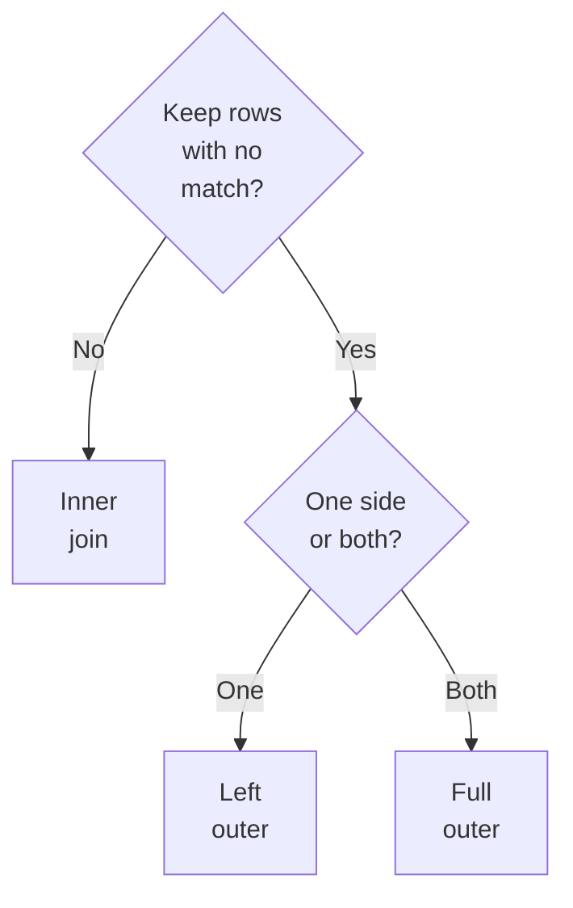
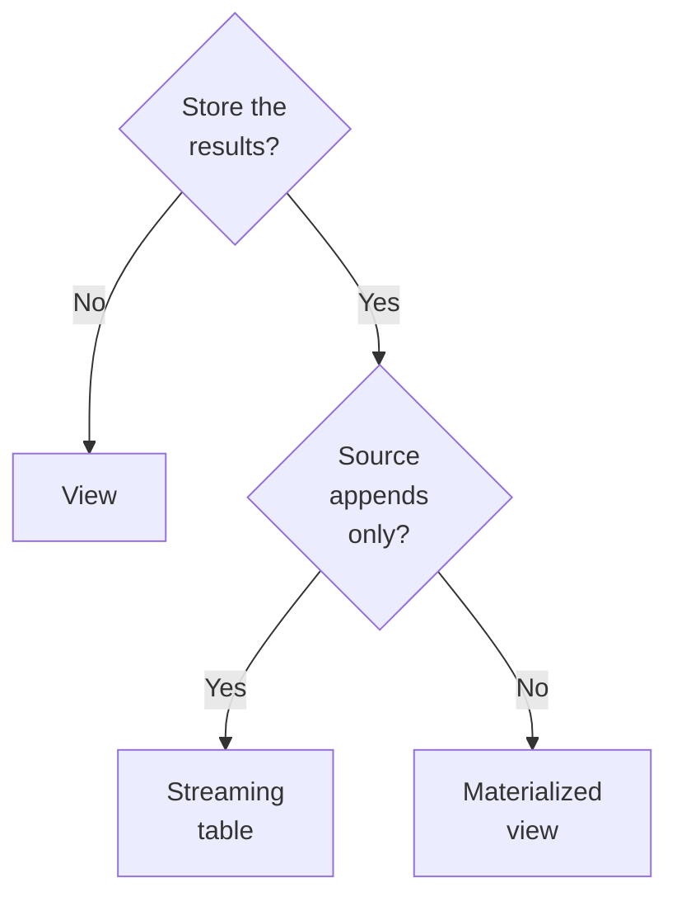
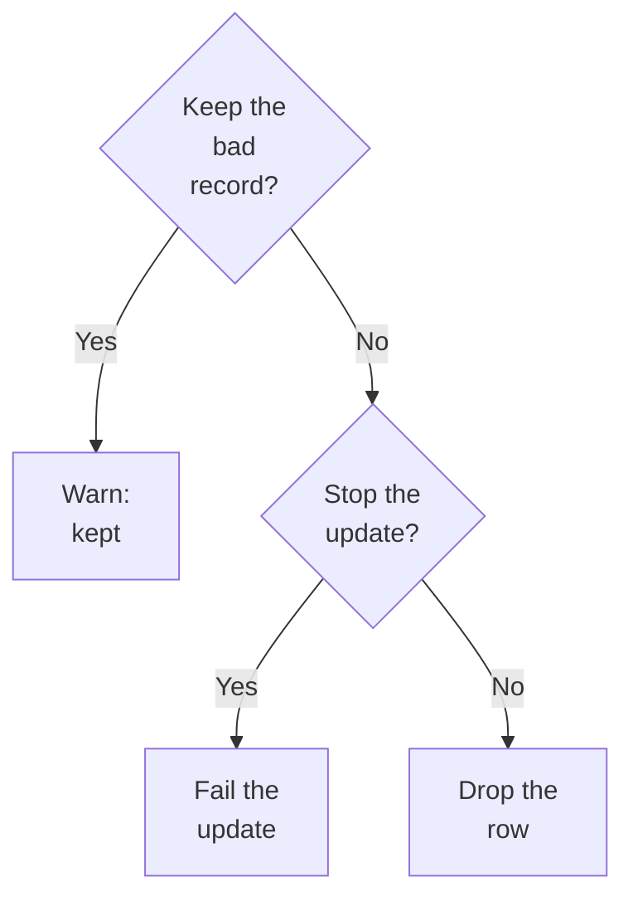

# Domain 3 — Data Transformation and Modeling

This domain is 22% of the exam, the largest of the seven. It is also the least like the others.
The rest of the exam asks you to choose a product; this one asks you what a query returns, and
the wrong answer is usually a reasonable belief about a function you have used for years.

The sections are not in the guide's order. Nearly every question here is settled by knowing which
layer you are standing in, so layers come first, then the mechanics in the order a pipeline meets
them, then tuning, then the objects the query is written into, then the rules that decide whether
it lands.

**Expect to read code.** Databricks states that data manipulation code in this exam is provided
in SQL where possible, and in Python in all other cases. Some questions put a statement on the
screen and ask what it returns. Others put statements in the options and ask which one is right.
The forms in this file are the ones worth recognising on sight.

One thing before you start. **Two official sources are in play** — Databricks documents the
platform, Apache Spark documents the engine — and where they disagree, the disagreement is
usually the question. Broadcast thresholds, shuffle partition defaults and skew hints all differ.
This file says which source a fact comes from wherever the two do.

---

## What this domain actually asks

Three habits carry most of the marks.

**Read which layer the situation has put you in.** Cleaning belongs in silver, aggregation in
gold, and neither belongs in bronze. A surprising number of questions are answerable from that
sentence alone, before you have looked at the options.

**When a word means two things, check which surface you are on.** `UNION` in SQL removes
duplicates. `union` in the DataFrame API does not. The same is true of thresholds, defaults and
several function names. The stem always tells you which surface; it rarely tells you twice.

**Prefer the documented behaviour to the tuned one.** This platform re-optimises queries while
they run. Most inherited advice about partition counts, broadcast hints and skew is now either
unnecessary or actively wrong here, and the documentation says so plainly.

---

## Which layer you are standing in

**The medallion architecture names three layers by the quality of the data in them: bronze is
raw, silver is validated, gold is enriched.** Following it is a recommended best practice rather
than a requirement, but the exam's scenarios assume it.

Bronze holds raw, unvalidated data. It is appended to incrementally, grows over time, and is
meant for the workloads that enrich it into silver — not for analysts. Only minimal validation
happens there, and Databricks recommends storing most fields as string, VARIANT or binary so an
unexpected schema change cannot drop data. That is why standardising types is a silver job.

A silver job reads bronze tables with PySpark or SQL, cleans what it finds, and writes silver
tables —
DataFrames on one surface, statements on the other, same operations either way. Objectives one to
four live here. Databricks lists what silver does: schema enforcement, null and missing values,
deduplication, out-of-order and late data, quality checks, schema evolution, type casting and
joins. Read bronze or silver and write silver — **not** straight from ingestion, which lets schema
changes and corrupt records through. Always keep at least one validated, non-aggregated
representation of each record. Where every source is append-only, most bronze reads should be
streaming, batch only for small dimensional tables.

Gold is the refined layer that drives analytics, dashboards and applications. It is aggregated,
modelled dimensionally, aligned to business logic, and contains fewer datasets than the layers
below it.

| Layer | What happens there | Recommended processing |
|---|---|---|
| Bronze | Raw ingestion, no cleanup, appended incrementally | Streaming, because the work is stateless |
| Silver | Cleaning, deduplication, type casting, joins | Batch, with incremental refresh in materialized views |
| Gold | Last-mile aggregation for reporting | Batch, with incremental refresh in materialized views |

That third column surprises people. Batch reprocesses everything in the source; streaming tracks
progress and reads only what is new. Streaming sounds strictly better, and for bronze it is —
ingestion is stateless. Silver and gold are stateful: joins, aggregations, deduplications, which
is exactly where late data gets hard. So the recommendation for both is batch with incremental
refresh in materialized views, which is what the page gives for silver transformation and for gold
last-mile aggregation alike, with streaming named only as the option for cases where efficiency and
latency matter much more than accuracy.

---

## Cleaning: nulls, then types

**Nulls decide more questions in this domain than any single function does.** Learn what a null
does to a comparison before you learn what removes one.

A comparison with a null returns null, not false. `5 > NULL` is null; `NULL = NULL` is null. The
null-safe equal operator `<=>` is the exception: it returns true when both operands are null and
false when only one is. Most other expressions are null-intolerant — they return null if any
argument is null.

This has a consequence that costs people rows. A condition in `WHERE`, `HAVING` or a join is
satisfied only when it evaluates to **true**. So `WHERE amount > 0` does not merely exclude
negatives; it also discards every row where `amount` is null. The same rule inside a join
condition means rows with a null key vanish from an inner join rather than arriving unmatched.

Aggregates behave differently again, deliberately. They ignore nulls, and `count(*)` is the only
exception. On an input where every value is null, `MAX`,
`MIN`, `SUM` and `AVG` return null, `count(column)` returns zero, and `count(*)` returns the row
count — it counts rows, not values. And for grouping, nulls are
treated as equal to each other: `GROUP BY` puts them all in one bucket and `DISTINCT` counts
them as a single value. Two nulls are not equal in a comparison and are the same group in an
aggregation. Both statements are true.

| Situation | What a null does | The portable rule |
|---|---|---|
| Comparison with `=` | Returns null, so no row qualifies | Use `IS NULL`, or `<=>` when null must match null |
| `WHERE`, `HAVING`, join condition | Row is dropped | A condition is satisfied only when it is true |
| `SUM`, `AVG`, `MAX`, `MIN` | Ignored; all-null input returns null | Only `count(*)` counts a null row |
| `GROUP BY`, `DISTINCT` | All nulls form one bucket | Grouping and comparison disagree, on purpose |

To drop rows with nulls, use `na.drop`. `how` defaults to `any`, so a bare call drops a row for a
single null; `na.drop("all")` needs saying explicitly. `thresh` keeps rows with at least that many
non-null values and overrides `how`. To fill instead, use `na.fill` — and watch the types:
**columns whose type does not match the fill value are silently ignored**, so filling a numeric
column with `"0"` returns the DataFrame unchanged and raises nothing. `fillna()`/`na.fill()` and
`dropna()`/`na.drop()` are the same calls under two names.

```python
df = df.na.drop("all", subset=["amount", "customer_id"])   # only fully-empty rows
df = df.na.fill(0, subset=["amount"])                       # numeric value, numeric column
```

In SQL, `coalesce` returns the first non-null argument, evaluating left to right and stopping as
soon as it finds one, and returns null only when every argument is null. `nvl(a, b)` is a synonym
for `coalesce(a, b)` with two arguments.

Types come second because a failed conversion produces one of the two outcomes you have just
learned to read. Casting is `cast` in SQL, a synonym for the `::` operator, and the `cast` method
on a column in PySpark. **A bad value does not quietly become null.** A string that does not
match the target type's literal format raises `CAST_INVALID_INPUT`, and a value outside the
target's range raises `CAST_OVERFLOW`. `try_cast` is the function that turns both into null,
provided the cast combination itself is supported.

```sql
SELECT try_cast(amount AS DECIMAL(10,2)) AS amount FROM catalog.bronze.orders
```

| Function | On a value that will not convert | Reach for it when |
|---|---|---|
| `cast` | Raises, and the load stops | Bad data should stop the pipeline |
| `try_cast` | Returns null, row survives | A later rule will catch the null |

One older behaviour is worth knowing because it explains conflicting advice. In Databricks
Runtime, if `spark.sql.ansi.enabled` is false, an overflow does not raise; it wraps. Serverless
compute pins that setting to true, so on serverless you get the error rather than the wrap.

A bad value and a bad record are the same decision asked twice, and the guide splits them
across two objectives. The value half is the table above. The record half is the last section
of this file, and it is worth reading the two together.

> **Trap.** Filtering for valid values silently removes the records whose value is missing. If a
> question asks why a cleaned table lost rows nobody expected it to lose, look at the predicate
> before you look at the join.

<details>
<summary><b>Self-check — nulls and types</b></summary>

1. A table has 1,000 rows, 200 of which have a null `amount`. How many rows does
   `WHERE amount > 0 OR amount IS NULL` return, and why is the second clause needed?
2. What does `df.na.drop()` do to a row with one null among twenty columns?
3. `na.fill("0", subset=["amount"])` runs, reports success, and changes nothing. Why?
4. Which of `cast` and `try_cast` fails the job on a malformed string, and what is the other one
   for?
5. A column of entirely null values is aggregated. What do `SUM` and `count(*)` return?

1. All 800 non-null rows plus the 200 null ones. Without `IS NULL` the comparison returns null
   for those rows, and a condition qualifies a row only when it is true.
2. Drops it. The default is `how="any"`, not `"all"`.
3. The fill value is a string and the column is numeric. Subset columns whose type does not match
   are ignored, and nothing is raised.
4. `cast` raises `CAST_INVALID_INPUT`; `try_cast` returns null so a later rule can catch it.
5. `SUM` returns null. `count(*)` returns the row count, because it is the one aggregate that
   does not skip nulls.
</details>

---

## Shaping columns and rows

**Everything in this section is a transformation, which means none of it runs when you write
it.** Transformations return a DataFrame and Spark does not act until an action is called, which
is why the calls chain.

Columns are selected with `select` and referenced with `col` from `pyspark.sql.functions`;
`expr` takes an expression as a string and `selectExpr` accepts SQL expressions directly. To
name a specific DataFrame's column when two share a name, use the bracket operator or the dot
operator — the dot form will not take a column starting with a digit or containing a space.

New columns come from `withColumn`. Renaming is `withColumnRenamed`, which takes the old and new
names and creates nothing; inside an aggregation, `alias` is what renames the output column. Removing a
column means `drop`, which accepts several names at once, or simply leaving it out of a `select`.

Rows are filtered with `filter` or `where` — these are the same method, and multiple conditions
combine with `&` and `|`. Sorting is `sort` or `orderBy`, ascending by default, with `limit` to
cut the result. Databricks warns that sorting is expensive at scale and, more usefully, that
**order is not guaranteed when sorted data is stored and read back**, so sorting before a write
buys nothing.

| Operation | DataFrame | SQL |
|---|---|---|
| Add a column | `withColumn("flag", col("amt") > 1000)` | `SELECT amt > 1000 AS flag` |
| Rename | `withColumnRenamed("old", "new")` | `SELECT old AS new` |
| Drop | `drop("a", "b")` | `SELECT * EXCEPT (a, b)` |
| Filter rows | `filter(col("amt") > 0)` | `WHERE amt > 0` |

A silver pass usually reads a table, filters, adds and casts a column or two, drops what it does
not need, and writes. That is the shape worth recognising:

```python
(spark.table("catalog.bronze.orders")
   .filter((col("status") == "F") & (col("amount") > 0))
   .withColumn("amount", col("amount").cast("decimal(10,2)"))
   .withColumnRenamed("o_custkey", "customer_id")
   .drop("raw_payload")
   .write.mode("append").saveAsTable("catalog.silver.orders"))
```

Writing has one default worth memorising: **a write fails when data already exists at the
target.** `overwrite` replaces, `append` adds, and `ignore` silently does not write at all —
that last one is a decision about the whole write, not about duplicate rows. A DataFrame is read
from a table with the `table` method and saved with `write.saveAsTable`, both using the
three-level catalog, schema and table name.

Two operations change the row count rather than the columns, and usually appear together. `split`
breaks a string on a regular expression into an array; its `limit` defaults to zero, and above
zero the final element holds everything after the last delimiter rather than truncating.
`explode` then turns each array element, or each map key and value, into its own row — naming the
array's column `col` and a map's `key` and `value`. Same function in PySpark, from
`pyspark.sql.functions`.

```sql
SELECT order_id, tag
FROM catalog.silver.orders,
     LATERAL explode(split(tags, ',')) AS t(tag)
```

**`explode` produces no rows at all when the collection is null**, so a record whose array is
null disappears. `explode_outer` keeps it with nulls. `LATERAL VIEW OUTER` does both — null *and*
**empty**. The clause form is deprecated from Databricks Runtime 12.2 long-term support (LTS) onward for a
table reference; both still run, so **it does not change the exam answer**. Answer on the row
count.

> **Trap.** Flattening a nullable array with `explode` is a silent delete. Count the rows before
> and after, or use `explode_outer` and filter deliberately.

<details>
<summary><b>Self-check — shaping and schema change</b></summary>

1. `withColumn` and `withColumnRenamed` — which one can leave you with two columns?
2. A job writes to a table that already has data and the mode is not set. What happens?
3. A flattening step loses 4% of its records. Nothing errored. What is the most likely cause?
4. Which of these needs column mapping enabled on the table first: adding a column, renaming a
   column, dropping a column?
5. A dropped column is invisible to every query. Is its data gone?

1. Neither leaves two copies. `withColumn` creates or replaces one column; `withColumnRenamed`
   renames an existing one. The confusion is the point of the pairing.
2. The write fails. Failing is the default when data exists at the target.
3. `explode` on a column containing nulls. Rows with a null collection produce no output.
4. Renaming and dropping. Adding a column does not need it.
5. No. Dropping is a metadata change; purging the data needs `REORG TABLE` and then `VACUUM`.
</details>

---

## Changing the table, not the query

Everything above changes a result. This section changes the table, and every item in it has an
operational consequence the query-level equivalent does not.

Delta tables support schema evolution: adding columns at arbitrary positions, reordering
columns, renaming columns and type widening of existing columns, made explicitly with `ALTER
TABLE` or implicitly through a write. Columns are added with `ALTER TABLE ... ADD COLUMNS`,
optionally with a position and a comment, and nullability defaults to true.

```sql
ALTER TABLE catalog.silver.orders ADD COLUMNS (channel STRING COMMENT 'web or store')
ALTER TABLE catalog.silver.orders RENAME COLUMN amt TO amount
```

| Change | What it needs first | What it costs |
|---|---|---|
| Add a column | Nothing | Nullable by default |
| Rename or drop a column | Column mapping enabled on the table | Otherwise the data is rewritten |
| Drop a column | Column mapping enabled | Data stays in the files until `REORG TABLE` and `VACUUM` |
| Any schema update | Coordination | Terminates streams reading the table |

Two write-time options are constantly confused. `mergeSchema` lets a write add new columns to
the existing schema. `overwriteSchema` replaces the schema and partitioning during an overwrite
— necessary because **by default, overwriting the data does not overwrite the schema.** Changing
a column's type or name by rewriting the whole table is the `overwriteSchema` route.

Databricks recommends enabling schema evolution per write operation rather than session-wide,
using `mergeSchema` or `INSERT WITH SCHEMA EVOLUTION` for writes and `MERGE WITH SCHEMA
EVOLUTION` for merges. An operation-level setting takes precedence over the Spark configuration,
which is the pattern this platform uses everywhere: the narrow, explicit setting wins.

---

## Joins: what must the result contain

Databricks supports standard SQL join syntax — inner, outer, semi, anti and cross. The names
are easy and the selection is not, so choose on what the result has to contain rather than on
which name sounds right.



| Join | Returns | Reach for it when |
|---|---|---|
| Inner | Rows with matching values in both sides; the default | The question needs columns from both |
| Left outer join | All left rows, right columns null where unmatched | Left side must survive |
| Full outer | All rows from both, nulls where unmatched | Neither side may be lost |
| Left semi / left anti | Left side's values only, matched or unmatched | A filter written as a join |

A cross join returns the Cartesian product. **Omitting the join criteria makes any join type
behave as a cross join**, which is the single most expensive mistake available in this domain: a
query that reads as an inner join returns every pairing, and nothing errors.

Criteria come in two forms. `ON` takes any boolean expression — a non-boolean one raises
`JOIN_CONDITION_IS_NOT_BOOLEAN_TYPE`. `USING` takes column names that must exist on both sides and
matches them for equality; it is the compact way to join on **multiple keys**, and a missing name
raises `UNRESOLVED_USING_COLUMN_FOR_JOIN`. The practical difference is the output: with `USING`,
`SELECT *` shows each matched column once, so there is no duplicate to drop. `NATURAL` matches
every same-named column implicitly — in the syntax, not something to reach for.

In the DataFrame API, `join` takes `other`, `on` and `how`, and `how` defaults to inner. Several
spellings of each type are accepted — `left`, `leftouter` and `left_outer` are all valid. Passing
a list of column names as `on` requires them on both sides and performs an equi-join, which is
the DataFrame way to join on multiple keys. Multiple conditions combine with `&` and `|`.

```python
joined = orders.join(customers, on=["customer_id", "region"], how="inner")
joined = orders.join(broadcast(regions), orders.region_id == regions.id, "left")
```

Batch joins are stateless. Stream-to-stream joins are stateful — watermark both sides. A
**stream-static join** sits between: it joins the latest version of a static Delta table to each
micro-batch, needs no watermark, and is low latency. Its cost is that the output is **not
deterministic** if the static side changes, since each micro-batch sees whatever version is
current. To keep an inner join's result up to date, use a materialized view rather than repeating
the join.

Performance belongs here too. `BROADCAST` broadcasts the hinted side **regardless of the size
threshold**; `BROADCASTJOIN` and `MAPJOIN` are aliases, as are `SHUFFLE_MERGE` and `MERGEJOIN` for
`MERGE`. With different hints on both sides the priority is `BROADCAST`, `MERGE`, `SHUFFLE_HASH`,
`SHUFFLE_REPLICATE_NL`. But a hint is a suggestion — a strategy may not support every join type,
so the one you asked for is not guaranteed. In PySpark, `broadcast` marks a DataFrame small enough
to send.

Two hints you do not need. **Skew hints are unnecessary on Databricks**, which
optimises skewed joins automatically. Range join hints are the exception that remains useful, for
inequality joins such as those on timestamp ranges.

> **Trap.** A `BROADCAST` hint is not a guarantee, and a missing `ON` clause is not a syntax
> error. Both facts are documented and both make excellent wrong answers.

<details>
<summary><b>Self-check — joins</b></summary>

1. A query joins two tables and returns far more rows than either contains. The join type says
   `JOIN`. What is missing?
2. Which join returns columns from the left side only?
3. Why might a stream-static join produce different results when the same input is reprocessed?
4. `SELECT *` over a join shows the key column twice. Which criteria form was used?
5. A table is 12 MB and is not being broadcast. Two options fix it. Which one is guaranteed to
   apply?

1. The join criteria. Without them any join type behaves as a cross join.
2. Left semi, and left anti for the unmatched case.
3. The static side may have changed. Each micro-batch joins the latest version at the time.
4. `ON`. With `USING`, each matched column appears once.
5. Neither is guaranteed, but the `BROADCAST` hint ignores the size threshold, which raising the
   threshold also does. The hint may still be declined for an unsupported join type.
</details>

---

## Unions, and the word that means two things

**In SQL, `UNION` removes duplicate rows and `UNION ALL` keeps them.** `DISTINCT` is the default
and does not need writing. Both forms require the same number of columns on each side and a least
common type per column; a mismatch raises `NUM_COLUMNS_MISMATCH` or `INCOMPATIBLE_COLUMN_TYPE`.
The other two set operators are `INTERSECT` and `EXCEPT`, with `MINUS` accepted for `EXCEPT`, and
`INTERSECT` binds more tightly than the other two when they are chained.

**In the DataFrame API, `union` does not deduplicate.** It performs the union with no automatic
removal of duplicates — the behaviour of `UNION ALL` — and `distinct()` is what deduplicates.
`unionAll` is an alias to `union`, so the two method names differ in nothing at all. Appending
rows to a DataFrame means creating a new one with `union`.

There is a second difference in the same method and it is quieter. `union` resolves columns **by
position**, following SQL's own behaviour. Two DataFrames with the same column names in a
different order will combine into a result with values in the wrong columns, and nothing will be
raised as long as the types are compatible. `unionByName` resolves by name, and with
`allowMissingColumns=True` fills the gaps with null.

| Form | Duplicates | Columns matched by |
|---|---|---|
| `UNION` | Removed; `DISTINCT` is the default | Position |
| `UNION ALL` | Kept | Position |
| `union` / `unionAll` | Kept — no automatic deduplication | Position |
| `unionByName` | Kept | Name, with optional missing columns |

<details>
<summary><b>Self-check — unions</b></summary>

1. Two feeds share 5,000 records. One pipeline uses `UNION`, another uses `DataFrame.union`. Which
   result is larger, and by how much?
2. What does `unionAll` do that `union` does not?
3. Two DataFrames have the columns `id, name, region` and `id, region, name`. What does `union`
   return?

1. The DataFrame one, by 5,000 rows. SQL `UNION` deduplicates by default; the API method does not.
2. Nothing. It is an alias to `union`.
3. A result with region and name values swapped in the second set of rows, and no error. Columns
   resolve by position; `unionByName` is the fix.
</details>

---

## Counting things once, and counting them fast

Deduplication has three routes and they are not interchangeable.

| Route | What it compares | Reach for it when |
|---|---|---|
| `distinct` | Whole rows, no arguments | Exact duplicate rows |
| `dropDuplicates(subset)` | Named columns, all columns if none given | One row per business key |
| `MERGE INTO ... WHEN NOT MATCHED` | Incoming rows against the target table | Duplicates against what is already stored |

`distinct` returns the distinct rows of a DataFrame and takes no arguments, so a question asking
for one row per customer is never answered by it. `dropDuplicates` accepts a subset of columns
and defaults to all of them; `drop_duplicates()` is an alias. The merge route is the only one
that deduplicates against data already in the target, which is why an append-only log table is
usually loaded that way.

**On a streaming DataFrame, `dropDuplicates` behaves differently.** For a static batch it simply
drops duplicate rows. For a stream it keeps all data across triggers as intermediate state, so
that a duplicate arriving tomorrow is still caught — and that state grows without bound until
`withWatermark()` limits how late a duplicate may be.

Aggregation is `groupBy` to name the grouping columns and `agg` to name the aggregations, with
`avg`, `sum`, `max` and `min` imported from `pyspark.sql.functions`. Three different things are
spelled `count`, and only one of them is an action. `DataFrame.count()` triggers computation and
returns a number. `GroupedData.count()` — what `df.groupBy(...).count()` calls — returns one count
per group as a DataFrame. And `count` imported from `pyspark.sql.functions` is a column expression
for use inside `agg`, which is the one in the example below.

```python
(orders.filter(col("status") == "F")
   .groupBy("region")
   .agg(count("*").alias("orders"), avg("amount").alias("avg_amount"))
   .sort(col("orders").desc()))
```

In SQL, `GROUP BY` takes a column name, a position or an expression; one containing an aggregate
raises `GROUP_BY_AGGREGATE`. `GROUP BY ALL`, from Databricks Runtime 12.2 LTS, adds every
non-aggregate select expression for you — convenient, not guaranteed to resolve. A `FILTER` clause
passes only matching rows to that aggregate, which is how two differently-filtered measures come
out of one pass. `GROUPING SETS`, `CUBE` and `ROLLUP` compute several aggregations at once.

Counting has three forms worth separating. `count(*)` counts all rows in the group.
`count(expr)` counts only rows where the expressions are not null. `count(DISTINCT expr)` returns
the number of unique non-null values. All return a `BIGINT`.

**`approx_count_distinct` returns an estimate, not a count.** It uses the dense HyperLogLog++
algorithm and is accurate within a default of 5 percent, configurable through its `relativeSD`
argument. It is the right answer for a dashboard cardinality and the wrong answer for a number
that has to reconcile.

For profiling a DataFrame quickly, `describe()` computes count, mean, standard deviation, minimum
and maximum. `summary()` adds approximate quartiles at 25, 50 and 75 percent by default and lets
you name exactly which statistics you want. Spark documents both as exploratory tools and makes
no guarantee about the schema of the result, so neither belongs in a production contract.

<details>
<summary><b>Self-check — deduplication and aggregation</b></summary>

1. A silver job must keep one row per `order_id`, retaining the other columns. Which of `distinct`
   and `dropDuplicates` can do it?
2. A streaming deduplication job's state grows every day. What is missing?
3. `count(*)` returns 1,000 and `count(amount)` returns 840. What does that tell you?
4. When is `approx_count_distinct` the wrong answer?
5. What does `summary()` give you that `describe()` does not?

1. `dropDuplicates(["order_id"])`. `distinct` compares whole rows and takes no arguments.
2. A watermark. Without one, a stream keeps all data across triggers to catch late duplicates.
3. 160 rows have a null `amount`. `count(*)` is the only aggregate that does not skip nulls.
4. Whenever the number must reconcile. It is accurate within 5 percent by default.
5. Approximate quartiles, and control over which statistics are computed.
</details>

---

## The knobs, and when not to turn them

**Adaptive query execution is why most inherited Spark tuning advice is wrong here.** It
re-optimises during execution, on real statistics from the end of a shuffle or broadcast exchange
rather than pre-run estimates. **Enabled by default**, with four features: sort merge join to
broadcast hash join, small partitions coalesced after a shuffle, skew handled by splitting and
replicating skewed tasks, and empty relations detected and propagated. The adaptive query execution page scopes it to non-streaming
queries with at least one exchange or sub-query — and not every one of those is actually
re-optimised.

| Property | Default | What it governs |
|---|---|---|
| `spark.sql.shuffle.partitions` | 200, or `auto` on serverless | DataFrame and SQL shuffles: joins, aggregations |
| `spark.default.parallelism` | Cluster cores | RDD transformations only |
| `spark.sql.autoBroadcastJoinThreshold` | 10485760 bytes, 10 MB | Planning-time broadcast decision in Apache Spark |
| `spark.executor.memory` / `spark.driver.memory` | 1 GB each in Apache Spark | Memory per executor process, and for the driver |

That third column is where the marks are. **`spark.default.parallelism` governs the resilient
distributed dataset (RDD) API, not DataFrames** — setting it and re-measuring a DataFrame job
produces no change at all. Setting the shuffle property to `auto` enables auto-optimized shuffle,
which derives the number from the query plan and the input size. For Structured Streaming that
property cannot be changed between restarts from the same checkpoint, so the change is accepted
and nothing happens.

**That restriction is the stateful case, and the exam answer.** It is worth knowing it has a
boundary, because both of the sentences above have one. A *stateless* streaming query — one using
no stateful operator, so no streaming aggregation, no `dropDuplicates`, no stream-stream join —
supports changing the shuffle partition count on restart, and adaptive execution reaches it too,
enabled by default. That is documented on its own page for Databricks Runtime 18.0 and above.
**Answer on the stateful rule**: objective 3.5 asks for basic tuning parameters, not for runtime
version boundaries. But read the stem for the operator, because the operator is what decides which
kind of streaming query you are looking at.

Broadcast thresholds come in three similarly named forms, and the exam knows it. The Apache Spark
property above defaults to 10 MB and is disabled by setting it to -1. Databricks has its own
runtime threshold, `spark.databricks.adaptive.autoBroadcastJoinThreshold`, which triggers the
switch to a broadcast join during execution and defaults to 30 MB. A third,
`spark.sql.adaptive.autoBroadcastJoinThreshold`, defaults to the same value as the first and is
used only inside the adaptive framework. Any question about "the broadcast threshold" has to name
the property in full.

Adaptive coalescing is on by default and targets `spark.sql.adaptive.advisoryPartitionSizeInBytes`
— 64 MB — while never producing partitions smaller than 1 MB. Skew handling needs both
`spark.sql.adaptive.enabled` and `spark.sql.adaptive.skewJoin.enabled`, and the second defaults to
true. That is the mechanism behind the advice not to bother with skew hints.

Partitioning hints are the query-level equivalent of the same idea. `COALESCE`, `REPARTITION`,
`REPARTITION_BY_RANGE` and `REBALANCE` let a statement suggest a partitioning strategy, and
`REBALANCE` is ignored when adaptive execution is off. Note the collision: this `COALESCE` is the
hint that reduces partitions, not the function that returns the first non-null argument.

Where a property is set decides who it affects. In a notebook, that session only. In the compute
configuration, every notebook and job on that resource — and administrators can enforce
configurations with compute policies. Databricks SQL allows a handful, aliased to shorter names
and mostly overridable per session. Serverless does not support setting most Spark properties at
all.

**Databricks generally recommends against configuring most Spark properties** — legacy settings
override newer defaults — and specifically says not to hardcode `spark.executor.memory`. On
classic compute executor memory follows the worker type you pick, and two workers at 16 cores and
128 GB match eight at 4 and 32. On serverless there are none to size. From Databricks Runtime 19,
standard access mode restricts certain properties outright and a cluster setting one fails to
start.

Then **re-measure**, which is the objective's own last word. `EXPLAIN` will not tell you what
happened: it does not execute the query, so its plan is always the initial one and never reflects
adaptive re-optimisation. The plan that ran is read from the `AdaptiveSparkPlan` node once its
`isFinalPlan` flag turns true, and the statistics that decided it are the ones flagged
`isRuntime`.

> **Trap.** "I ran `EXPLAIN` and it still shows a sort merge join" is not evidence that the join
> was not broadcast. Compare the final plan after the query has run.

<details>
<summary><b>Self-check — tuning</b></summary>

1. An engineer raises `spark.default.parallelism` to speed up a DataFrame join. What changes?
2. What is the default number of shuffle partitions on classic compute, and what is it on
   serverless?
3. Why can raising the shuffle partition count fail to change a streaming job?
4. Two broadcast thresholds have defaults of 10 MB and 30 MB. Which is which?
5. Where do you look to see whether adaptive execution changed the plan?

1. Nothing. That property governs RDD transformations; DataFrame shuffles use
   `spark.sql.shuffle.partitions`.
2. 200, and `auto`.
3. For a stateful stream it cannot be changed between restarts from the same checkpoint, and the
   adaptive query execution page scopes adaptive execution to non-streaming queries. Both hold
   because the job is stateful — a stateless one has neither restriction.
4. 10 MB is Apache Spark's planning-time property; 30 MB is the Databricks runtime threshold used
   during execution.
5. The final plan after execution, not `EXPLAIN`.
</details>

---

## Building the gold layer

**A view stores nothing.** Creating one writes no data — only the query text is registered — and
every query re-evaluates the defining logic. That single sentence separates a view from
everything else in this section. `CREATE VIEW` constructs a virtual table with no physical data,
and `ALTER VIEW` and `DROP VIEW` change only metadata.



A **materialized view** incrementally calculates its query's results and stores them in an
underlying Delta table; a standalone one is a Unity Catalog managed table updated on a schedule or
automatically. Databricks recommends them for cleaning, enriching and denormalizing base tables,
and for keeping a dashboard current with minimal latency. Creating one is
synchronous — the statement blocks until the initial load finishes — and they need a Pro or
Serverless SQL warehouse, or a pipeline.

A **streaming table** is registered to Unity Catalog with extra support for incremental
processing. Its defining query must be a streaming query, using the `STREAM` keyword to read the
source, and each refresh appends newly arrived data. They run in pipelines and in Databricks SQL
with Unity Catalog; on Databricks Runtime compute the statement **only parses the syntax**, so
nothing is created and nothing errors.

```sql
CREATE OR REPLACE MATERIALIZED VIEW catalog.gold.weekly_revenue AS
  SELECT date_trunc('week', order_ts) AS week, sum(amount) AS revenue
  FROM catalog.silver.orders GROUP BY week;

CREATE OR REFRESH STREAMING TABLE catalog.silver.events
  SCHEDULE EVERY 1 hour
  AS SELECT * FROM STREAM catalog.bronze.events;
```

| Object | Stores results | How it updates |
|---|---|---|
| View | No | Recomputed on every query |
| Temporary view | No | Scoped to the session or the query, then gone |
| Materialized view | Yes | Refresh, incrementally where possible |
| Streaming table | Yes | Refresh appends new source rows |

Both types refresh on serverless pipelines that do not consume the warehouse's compute —
**cost scales with data processed, not warehouse size.** Standalone materialized views always run
triggered. A refresh is incremental, merging only what changed, or full, rerunning the query;
Databricks picks between them with a cost model. Incremental needs Delta sources with row tracking
on, and change data feed is recommended. Refreshes are synchronous unless `ASYNC` starts a
background job and returns immediately.

Materialized views support neither identity columns nor time travel.

Temporary views earn their own line: their scope differs by surface. In notebooks and jobs they
are scoped to the notebook; in Databricks SQL to the **query**, so the next query in the same
dashboard cannot see them. Only the creating session sees them, they die with it, and their names
cannot be qualified. Global temporary views are legacy Hive and not recommended. Dynamic views
carry row- and column-level access control.

Plain tables complete the set. Unity Catalog managed tables are the default, with Unity Catalog
handling storage and optimisation. An external table keeps its files in your
own cloud storage, and dropping it removes the metadata while leaving the data in place.
Materialized views and streaming tables can both carry `ROW FILTER` and `MASK` clauses at
creation to hide sensitive data from the users querying them.

**Two currency notes, neither of which changes the exam answer.** A newer page adds a **Beta**,
region-limited route — creating both from a notebook with `spark.sql()` on serverless general
compute. Answer warehouse or pipeline anyway. And a streaming table's runtime channel was once a
table property; it has no effect now and is safely ignored, because streaming tables always run
the latest Databricks SQL runtime.

> **Trap.** `CREATE OR REPLACE VIEW` is equivalent to dropping and recreating the view, and it
> does not preserve the privileges granted on it. `ALTER VIEW` does.

<details>
<summary><b>Self-check — gold objects</b></summary>

1. Which gold object writes no data when you create it?
2. A dashboard query is slow because it re-aggregates the same silver table every time. Which
   object is the documented fix?
3. A `CREATE STREAMING TABLE` statement runs on a Databricks Runtime cluster and nothing appears.
   Why?
4. A temporary view created in the Databricks SQL editor is not visible to the next query. Bug or
   behaviour?
5. Why does a bigger warehouse not make a materialized view refresh faster?

1. A view. Only the query text is registered.
2. A materialized view, which stores precomputed results and refreshes them.
3. Streaming tables run in pipelines and Databricks SQL with Unity Catalog. On
   Databricks Runtime compute the statement only parses.
4. Behaviour. In Databricks SQL a temporary view is scoped to the query.
5. The refresh runs on an automatically created serverless pipeline. Cost and speed scale with
   the data processed, not the warehouse.
</details>

---

## Making the data trustworthy

Three mechanisms enforce quality and they act at different moments.

| Mechanism | Where it acts | On a failure |
|---|---|---|
| Pipeline expectation | Per record, inside a pipeline | Warn, drop the row, or fail the update |
| Enforced constraint | On the table, at write time | Transaction fails with an error |
| Informational constraint | Declared, never checked | Nothing |
| Data profiling | After the fact, over time | Reports a trend; stops nothing |

**Expectations are optional clauses on a pipeline's materialized view, streaming table or view
that check every record passing through the query**, written as standard SQL boolean statements.
Each needs a name, unique within a dataset and reusable across datasets. The constraint must be
valid SQL and **cannot** contain custom Python functions, external service calls or subqueries
referencing other tables — so validating a row against a reference table is a join or a
quarantine pattern, never an expectation.

The action is the highest-value fact in the objective. **The default is warn, and invalid records
are written to the target.** Dropping needs `ON VIOLATION DROP ROW` and failing needs `ON
VIOLATION FAIL UPDATE`.



```sql
CREATE OR REFRESH STREAMING TABLE catalog.silver.customers(
  CONSTRAINT valid_age EXPECT (age BETWEEN 0 AND 120),
  CONSTRAINT has_id EXPECT (customer_id IS NOT NULL) ON VIOLATION DROP ROW
) AS SELECT * FROM STREAM catalog.bronze.customers;
```

```python
from pyspark import pipelines as dp

@dp.table
@dp.expect_or_drop("has_id", "customer_id IS NOT NULL")
def customers():
    return spark.readStream.table("catalog.bronze.customers")
```

Dropping logs the count of dropped records alongside other dataset metrics. Failing rolls the
transaction back atomically, requires manual intervention before reprocessing, and — because it
stops on the first invalid record — **records no metrics at all**, so a team wanting a quality
trend cannot get one from it. In a triggered pipeline a single flow's failure does not fail the
others; in a continuous pipeline it stops the flow and everything downstream of it.

Only Python can group expectations and give them a collective action, through `expect_all`,
`expect_all_or_drop` and `expect_all_or_fail`, which take a dictionary of names to constraints.
SQL supports multiple expectations, just not grouped ones. The same `CONSTRAINT ... EXPECT`
clause works on streaming tables and materialized views created in Databricks SQL, though there
the Data quality tab is unavailable and the metrics come from the event log instead.

Databricks recommends storing expectation definitions separately from pipeline logic and tagging
related ones so the same rules apply consistently across datasets, though dynamically loading
them from a file is not supported in SQL. The quarantine pattern combines expectations with
temporary tables and views so valid and invalid records take separate downstream paths — the
fourth option beside warn, drop and fail, and usually what a silver layer actually wants.

Table constraints are the other half. Enforced constraints are `NOT NULL` and `CHECK`; a
violation fails the transaction, and all constraints require Delta Lake. Adding a CHECK
constraint is not metadata-only — `ALTER TABLE ADD CONSTRAINT` verifies every existing row first,
and so does `NOT NULL`. A `CHECK`
expression may use any SQL function that always returns the same result for the same arguments,
excluding user-defined, aggregate, window and multi-row functions.

**Primary key, foreign key and unique constraints are informational only and are not enforced.**
They describe relationships and might help query optimisation. A duplicate primary key value is
not an error, and `CREATE TABLE AS SELECT` statements do not support the constraint clause at all.

Finally, data profiling — older material calls it lakehouse monitoring, same feature — computes
summary statistics over time. It needs Unity Catalog and Databricks SQL, and offers time series,
inference and snapshot analysis. **It reports; it does not enforce.** If a question asks how to
stop bad data reaching a table, profiling is not the answer.

<details>
<summary><b>Self-check — data quality</b></summary>

1. An expectation is declared with no `ON VIOLATION` clause. What happens to a failing record?
2. Why can a team using `FAIL UPDATE` everywhere not build a data quality dashboard?
3. A table declares a primary key. Two rows arrive with the same key. What happens?
4. Which of these can an expectation not do: compare two columns, call a user-defined function,
   use a `CASE` statement?
5. Name the mechanism that acts per record, the one that acts per transaction, and the one that
   acts after the fact.

1. It is written to the target and counted. Warn is the default.
2. Failing stops the update on the first invalid record, so no metrics are recorded.
3. Both are stored. Primary keys are informational and are not enforced.
4. Call a user-defined function. Subqueries against other tables and external calls are also out.
5. Expectations, enforced constraints, and data profiling.
</details>

---

## Traps worth carrying into the exam

- A predicate that filters for valid values also discards rows whose value is null.
- `na.drop()` with no argument drops a row containing **any** null, not only all-null rows.
- `na.fill` silently ignores subset columns whose type does not match the fill value.
- `cast` raises on a bad value; only `try_cast` returns null.
- A join with no criteria is a cross join, whatever the join type says.
- SQL `UNION` deduplicates; `DataFrame.union` does not, and it matches columns by position.
- `explode` drops records whose collection is null; `explode_outer` keeps them.
- `distinct` cannot deduplicate on a key — that is `dropDuplicates` with a subset.
- `approx_count_distinct` is an estimate, accurate within 5 percent by default.
- `spark.default.parallelism` governs RDD work; DataFrame shuffles use
  `spark.sql.shuffle.partitions`.
- A `BROADCAST` hint is a suggestion; skew hints are unnecessary on Databricks.
- `EXPLAIN` shows the plan before adaptive re-optimisation, never the one that ran.
- Creating a view writes no data; a materialized view is a table that stores results.
- Expectations default to **warn**, which writes the invalid record to the target.
- Primary and foreign keys are informational; only `NOT NULL` and `CHECK` are enforced.
