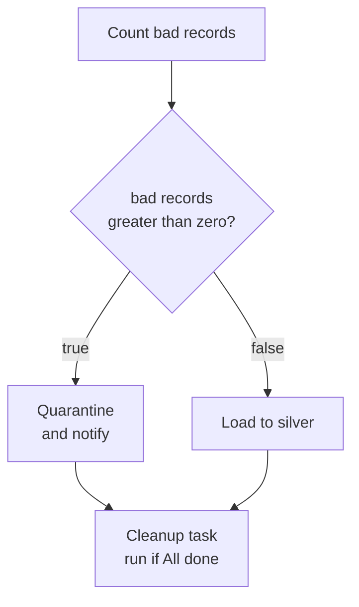
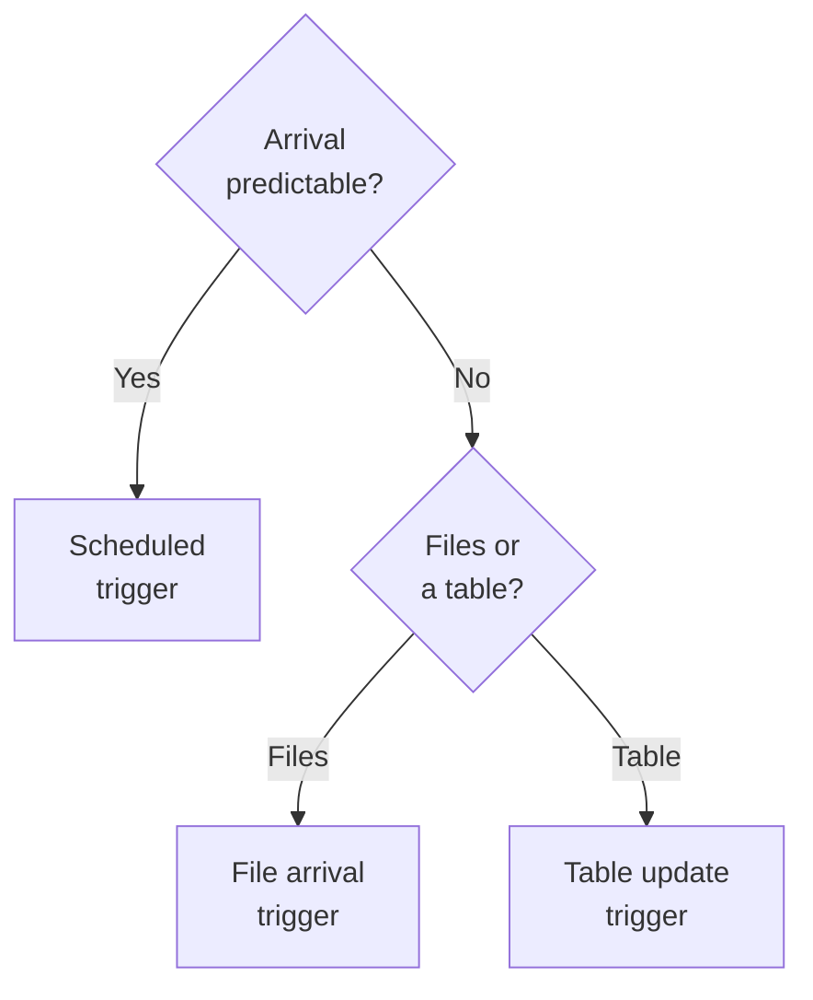

# Domain 4 — Working with Lakeflow Jobs

This domain is 16% of the exam. It is the orchestration domain: not what a transformation does,
but what runs it, in what order, and what happens when one piece of it breaks. Nearly every
question here turns on a default, a state name, or a constraint that one option violates and the
others do not.

The sections below are not in the guide's order. The guide puts control flow first, ahead of the
tasks that control flow acts on. That is backwards for study, so this page follows the order a
job is actually built. What a job is made of, then what the tasks are, then how dependencies form
a graph. Then how that graph branches and loops, what happens when part of it fails, what starts
it, and which starter to choose.

**Expect to read code.** Databricks states that data manipulation code in this exam is provided
in SQL where possible and in Python in all other cases. The code in this domain is short: a line
that sets a value, a reference in curly braces, a condition expression. The forms in this file
are the ones worth recognising on sight.

One sentence about the documentation, because the last two domains needed a warning here. The
Databricks documentation shows different text depending on which cloud you are on, and this
material was read from the Amazon Web Services (AWS) tab. In this domain that does not bite:
task types, dependency rules, trigger types and retry behaviour read the same on every tab.

---

## What this domain actually asks

Three habits carry most of the marks.

**Know the default, then know what overrides it.** Retries, loop parallelism, concurrent runs
and dependency conditions all have a default, and in every case it is the conservative one.
Questions are written on candidates assuming the generous one.

**Read the state name, not the colour.** A task that did not run may be Excluded, Upstream
failed, or Disabled. Those three resolve differently for everything downstream, and the question
is usually what happens next.

**Ask what the work is waiting for.** A clock, an arriving file, an updated table, or nothing at
all. That single question settles every triggering scenario on the paper, and the last section
here is nothing but that question.

---

## A job, a task, a trigger

**Three nouns carry the whole domain, and the documentation introduces them in this order: jobs,
tasks and triggers.**

A job is the primary resource for coordinating, scheduling and running your work. A task is a
specific unit of work inside it. A trigger is the mechanism that starts a run. Jobs range from
one notebook to hundreds of tasks with conditional logic between them, and they support custom
control flow — branching with if/else statements, looping with for each statements — built in a
visual authoring interface.

The tasks in a job are visually represented by a Directed Acyclic Graph (DAG). Both halves of
that name do work later. It is directed, so dependencies point one way, and it is acyclic, which
is why a job cannot loop back on itself and why two jobs that trigger each other are unsupported.

Databricks lists four things under **minimum configuration** for a job: a task containing logic,
a compute resource, a schedule, and a unique name. The same page then makes the schedule
optional, and says plainly what happens without one — **by default a job runs only when you start
it manually**, and you configure a schedule or an event trigger to make it run automatically.
Learn the behaviour rather than the list: three of those four are things a job cannot exist
without, and the schedule is the one you can leave out. You create a job by configuring its first
task, rather than by creating an empty job and filling it.

Compute is attached **per task**, not per job. This is the fact most often assumed the other way,
and it is why one job can run a notebook task on serverless compute and a SQL query task on a
warehouse in the same graph.

Three ceilings are worth a glance. A job holds up to 1000 tasks. A workspace holds up to 12000
saved jobs and runs at most 2000 concurrent task runs — a request for a run that cannot start
immediately comes back as 429 Too Many Requests rather than waiting.

---

## The four task types, and what each one needs to run

**The objective names four task types by hand, and the separable fact about each is the compute
it demands.**

A **notebook task** runs a Databricks notebook: you give it a path and any parameters it needs.
Its source is either the workspace or a remote Git repository, and Databricks recommends the Git
provider option for anything scheduled. Only one remote repository can serve all the tasks in a
job. Parameters arrive as key-value pairs and the notebook reads them with `dbutils.widgets`. A
warehouse can run a notebook task only when the notebook is written entirely in SQL with SQL as
its default language; mix languages and it needs a cluster.

A **SQL query task** runs a query, an alert, or a file of statements separated by semicolons. It
requires Databricks SQL and a serverless or pro warehouse — no cluster will run it. Alerts accept
no parameters, and an alert task reports Succeeded whenever the alert evaluated cleanly, whether
or not the alert condition fired. A failed alert task means the evaluation itself broke.

A **dashboard task** refreshes the results of a dashboard that is already published, and emails
them to the subscribers listed on the task. That list is separate from the dashboard's own
subscribers. It also needs a serverless or pro warehouse. Where a dashboard filter's identifier
matches a job parameter key, the task applies that parameter's value to the filter.

A **pipeline task** runs a Lakeflow pipeline — one maintaining materialized views or streaming
tables, for instance. The division is clean: a job defines relationships between tasks, a
pipeline defines relationships between datasets and transformations. In a scheduled job the
pipeline task starts a single update and stops when it completes. In a continuous job it runs the
pipeline continuously, because the job's schedule sets the execution mode and overrides the
pipeline's own mode setting. Since a pipeline runs one update at a time, any job containing a
pipeline task is capped to a single concurrent run.

Two other task types recur through this page. A **Run Job task** triggers another job in the
workspace and pushes job parameters down to it; circular chains are unsupported, as is nesting
more than three deep. The For each task belongs to the next section but one.

| Task type | Compute it runs on | The constraint |
|---|---|---|
| Notebook, Python script, Python wheel | Serverless jobs compute, or a cluster | Serverless is the default where supported |
| SQL query, dashboard, alert | Serverless or pro warehouse | No cluster will run these |
| Pipeline | The pipeline's own compute | Set on the pipeline, not on the task |

Where serverless is available, Databricks recommends it for job tasks. Where a workspace is not
enabled for serverless and you have to pick a Compute option, the recommendation is always jobs
compute. Either way, Databricks does not recommend classic all-purpose compute for production
jobs, so an always-warm interactive cluster is the wrong answer even when it would work. The
supported way to avoid repeated start-up cost is to share one jobs compute resource
across tasks: it starts when the first task using it begins, terminates after the last one
finishes, and sits idle in between.

> **Currency.** The task type dropdown also offers a submit task for Spark applications, and it
> is deprecated and pending removal — newer runtime versions do not support it, and creating one
> is restricted to workspaces already using it. The documentation points a Java workload at the
> Java archive (JAR) task, and the two pages then disagree about what that task runs on: the
> serverless page lists JAR among the types serverless supports, the compute page recommends
> classic jobs and does not offer serverless at all. **Neither point changes the exam answer.**
> The objective names notebook, SQL query, dashboard and pipeline tasks, so nothing here turns on
> a cell the documentation itself disputes. The table's first row is the part both pages agree on.

Sharing has a price that is easy to miss. Tasks on a shared resource run on the same driver
process, so class state and singletons persist between them for the run, and parallel tasks can
overwrite each other's values. Libraries cannot be declared on a shared cluster either — they go
in task settings. Where isolation matters, give the task its own compute or make the tasks
sequential.

<details>
<summary><b>Self-check — task types and their compute</b></summary>

1. A team schedules a dashboard refresh on the job cluster the rest of the pipeline uses, and the
   task will not save. Why?
2. A notebook mixes Python and SQL. Which compute options remain open to it?
3. Two tasks share one jobs compute resource, and the second reads a stale value the first task
   set. What is happening, and what are the two documented fixes?

1. A dashboard task requires a serverless or pro warehouse. No cluster runs it, and neither does
   a classic warehouse.
2. A cluster, or serverless jobs compute. A warehouse is only available to a notebook written
   entirely in SQL with SQL as its default language.
3. Tasks sharing compute run on the same driver process, so class state and singletons persist
   across them. Give each task its own compute, or add an explicit dependency so they run in
   sequence rather than in parallel.
</details>

---

## Dependencies are the program

**Configuring dependencies is what creates the Directed Acyclic Graph. Nothing else defines
execution order.**

You set them in the Depends on field, which appears only once a job has more than one task, and
they are drawn as lines between tasks in the graph. Databricks runs upstream tasks before
downstream ones and runs as many of them in parallel as it can. Two tasks with no edge between
them therefore run at the same time, whether or not that was the intention.

Each dependency also carries a condition. The Run if dependencies field decides whether the
downstream task runs at all, based on the success, failure or completion of the tasks above it.
There are six conditions, and the fourth column below is the second rule set you have to hold at
the same time: what each condition does when a parent task has been disabled.

| Run if condition | The task runs when | If the condition is unmet | If a parent is disabled |
|---|---|---|---|
| **All succeeded** — the default | Every dependency ran and succeeded | Marked Upstream failed | Does not run |
| At least one succeeded | Any one dependency succeeded | Marked Upstream failed | Runs if another parent succeeded |
| None failed | Nothing failed and at least one ran | Marked Upstream failed | Runs if a parent completed without failure, not if all are disabled |
| All done | Every dependency finished, any status | Cannot be unmet | Runs normally |
| At least one failed | At least one dependency failed | Marked Excluded | Runs if another parent failed |
| All failed | Every dependency failed | Marked Excluded | Does not run |

Two of those names mislead. **All done** does not mean everything succeeded; it means everything
finished, whatever the outcome, which is what you pick for a cleanup or notification task. And
**None failed** additionally requires that at least one dependency actually ran, so it is tolerant
of skips rather than tolerant of failure.

**The two ways a task can fail to run resolve in opposite directions.** An upstream task marked
Excluded is treated as successful when Run if conditions are evaluated. One marked Upstream
failed, or Upstream canceled, is treated as failed — explicitly not as skipped. In the graph both
are a box that never ran.

Exclusion also cascades, and this is the part that surprises people. A failure-handling task
whose condition is not met is marked Excluded and skipped. If every one of a task's dependencies
is excluded, that task is excluded too, regardless of its own condition. In a chain of A to B to
C, excluding A excludes B, which excludes C. An All done task does not rescue a chain that was
excluded above it.

Cancellation behaves differently, and usefully. Cancelling a task run propagates the cancellation
downstream, and tasks whose condition handles failure are run. That is how a cleanup task still
runs when somebody stops the job by hand.

> **Trap.** The default condition is All succeeded, and a task marked Upstream failed under it
> did not fail — it never started. Read what the stem says about the parent, then read the
> condition, and answer in that order.

<details>
<summary><b>Self-check — dependencies and Run if</b></summary>

1. Task A is excluded because its condition was not met. Task B depends only on A, with the
   condition All done. Does B run?
2. Which two conditions mark the task Excluded rather than Upstream failed when they are unmet,
   and why does that difference matter downstream?
3. A cleanup task must run whether the load succeeded or failed. Which condition, and which
   common alternative is wrong?

1. No. Every one of B's dependencies is excluded, so B is excluded too, regardless of its own
   condition, and the exclusion carries on down the chain.
2. At least one failed and All failed. It matters because an Excluded upstream task counts as
   successful for the next condition, while Upstream failed counts as failed.
3. All done. None failed is the tempting wrong answer: it still refuses to run when something
   failed, which is the case the cleanup task exists for.
</details>

---

## Branching, looping, and passing a value along

**If/else branches on a value. Run if branches on an outcome. That one line settles most
conditional questions in this domain.**

An If/else condition task adds boolean logic to the task graph: a boolean operator and a pair of
operands, where an operand may reference a job parameter, a task parameter, a task value or a
dynamic value. A condition looks like this:

```text
{{tasks.process_records.values.bad_records}} > 0
```

Tasks added below it default to depending on the true branch, and the false branch is chosen
explicitly. Several tasks can hang off either branch, in series or in parallel. The result of the
condition and the details of its evaluation appear in the run details afterwards, which is where
you go when a branch went the wrong way.

The operators are the six you would expect, and two of them do not behave as you would expect.
`==` and `!=` perform **string** comparison, so `12.0 == 12` evaluates to false. The ordering
operators `>`, `>=`, `<` and `<=` compare numerically, so `12.0 >= 12` is true. Only numeric,
string and boolean values may be referenced in an operand — anything else fails the expression —
and a boolean is serialized to the text true or false.



The **For each task** is the loop. It needs two tasks defined: itself, and one nested task, which
may be any standard task type except another For each. There are no nested loops here. Its input
is an array of objects, one object per iteration, and the nested task refers to the current
element as `{{input}}` or to a field of it as `{{input.table}}`. That array reaches the loop by
one of three routes: typed in as a JSON array, taken from a preceding task's task value, or taken
from a job parameter. An upstream SQL task can also feed it directly, each output row sent to the
nested task in turn, within that task's limit of 1,000 rows and 48 KB. The Concurrency setting
decides how many iterations run at once and **defaults to 1**, so a loop is serial until somebody
changes that. Downstream tasks depend on the For each task itself; they cannot depend on or
reference the nested task inside it.

A **task value** is how one task hands a computed result to a later one, and it is what makes
both of the above useful. You set one in a Python notebook:

```python
dbutils.jobs.taskValues.set(key = "prod_list", value = prod_list)
```

Setting is restricted to Python notebooks, because these are Python functions. Reading is not:
any task that supports parameters can reference the value through the dynamic reference form,
which is the form Databricks recommends.

```text
{{tasks.product_inventory.values.prod_list}}
```

The alternative, `dbutils.jobs.taskValues.get`, works but hard-codes the upstream task's name
into every consumer, so renaming that task breaks all of them. Task values must be valid JSON and
must not exceed 48 KiB, and a list is a perfectly good value — generating one in a notebook and
looping over it in a For each task is the standard metadata-driven shape.

Parameters come in two shapes, and which shape a task takes decides whether job parameters reach
it automatically.

| Parameter shape | Task types that take it | Job parameters reach it |
|---|---|---|
| Key-value pairs | Notebook, SQL, Run Job, Python wheel with keywords | Automatically |
| JSON array of strings | Python script, Java archive, For each, Python wheel with positional arguments | Only by explicit reference |

A job parameter is defined once at job level and pushed down; a task parameter belongs to one
task. When their keys collide, **the job parameter wins** — the opposite of what most
configuration systems do. Note where a dynamic reference is allowed to live: in a parameter or in
a job field that passes context into a task, never inside the notebook, query or archive itself.
The asset receives a resolved value; it cannot ask for one.

> **Trap.** A misspelt dynamic reference does not fail the task. Syntax errors and references
> that do not exist are silently ignored and passed through as literal text, so the notebook
> receives the reference itself instead of a value. One case does raise an error: a reference in
> a known namespace that is not a valid member of it, such as `{{job.notebook_url}}`. Silence is
> the rule; an unknown key inside a known namespace is the exception.

<details>
<summary><b>Self-check — branching, looping, values</b></summary>

1. A condition compares a record count of `12.0` against `12` with `==` and the branch never
   fires. Why?
2. A job must process a list of tables discovered at run time, and each table's work must itself
   loop over three regions. What is the constraint, and what is the documented shape?
3. A SQL task needs a value a notebook task computed. Can it read it, and how?

1. `==` performs string comparison, so `12.0 == 12` is false. Only the ordering operators compare
   numerically.
2. A For each task cannot be nested inside another For each. Flatten the pairs into a single
   input array — typically generated upstream and passed in as a task value.
3. Yes. Setting a task value is restricted to Python notebooks, but any task that supports
   parameters can read one through a dynamic reference.
</details>

---

## When part of the job fails

**For most job configurations, the default is no retries at all.**

A retry policy is something you add to a task; until you do, a transient error ends the task and
whatever depended on it. Some features assume you have added one — schema evolution with
Structured Streaming expects the job to retry, so that the environment resets and the workflow
carries on. Two exceptions to the no-retry default are documented, and both are worth knowing
by name.
Serverless jobs auto-optimize retries by default, which is why a non-idempotent task on
serverless has to have that turned off deliberately. And continuous jobs retry automatically with
exponential backoff. Neither of those makes an ordinary scheduled job retry.

Two details decide scenario questions. With both a timeout and retries configured, the timeout
applies to **each retry** — ten minutes with three retries is up to forty minutes of wall clock,
and everything downstream waits for all of it. And the retry interval is measured from the start
of the failed run, not from the moment it failed.

Continuous jobs work differently enough to state separately. You cannot give one a retry policy;
it retries the whole job on failure with exponential backoff and there is no limit on the number
of retries. Task-level retries still exist through the task retry mode, which defaults to On
failure in continuous mode and allows three retries for a single-task job before the run is
cancelled and a new one started.

**Neither a retry nor a repair is idempotent, and Databricks says so plainly.** A repair re-runs
each unsuccessful task from the beginning, so a task that wrote half its output before failing
writes that half again. Whether recovery is safe depends on the task's own logic; the documented
remedy is to write with overwrite or merge rather than append.

A **repair run** re-runs only the unsuccessful tasks and any tasks that depend on them, using the
job's current settings — so a notebook path corrected between the failure and the repair takes
effect. It needs a job of two or more tasks; a failed single-task job is simply started again.

A **disabled task** is skipped at run time without being removed from the job, and keeps both its
configuration and its run history. It changes the graph for that run: downstream conditions are
evaluated against the disabled parent exactly as the fourth column of the earlier table
describes. Only tasks you disable yourself are recorded as disabled in the job definition —
downstream disablement is worked out when the run is created and never written back.

**Two task types break that pattern, and the table will not warn you.** An If/else condition task
fails if the upstream task supplying its condition value is disabled, and a For each task fails if
the upstream task supplying its input values is disabled. Those two fail rather than skip.

Disabling is not the same as deselecting a task when you run a job with different settings. That
affects one run only. A partial run does exactly what you select, applies no condition
propagation at all, and its expansion to neighbouring tasks skips disabled ones unless you name
them. In the interface and the request, a leading plus adds a task's upstream tasks and a
trailing plus adds its downstream tasks:

```json
{ "job_id": 11223344, "only": ["+task_1", "task_2+"] }
```

**A run's outcome is decided by its leaf tasks** — the tasks with no downstream dependencies.
This is the rule candidates never predict, and everything below follows from it.

| Run state | What it means |
|---|---|
| Succeeded | Every task succeeded |
| Succeeded with failures | Some tasks failed, but every leaf task succeeded |
| Failed | One or more leaf tasks failed |
| Skipped | The run never started, for instance over a concurrency limit |

Succeeded with failures counts as a successful state, so a team that notifies only on failure
never hears about it — you have to select Success. Job-level notifications are also silent while
a failed task is being retried, so a task that fails twice and then succeeds passes unremarked.
Task-level notifications are the documented answer to both.

<details>
<summary><b>Self-check — failure and recovery</b></summary>

1. A nightly job fails on a transient network error at 02:00 and nobody is paged until morning.
   The team assumed the platform would retry. What was wrong with that assumption, and where is
   it right?
2. A repair is proposed for a task that appends rows to a table. What has to be checked first?
3. A job's middle task failed but the run reports success. Explain it, and say what to change so
   the team hears about it.

1. For most configurations the default is no retries; a retry policy has to be added. It is right
   for serverless jobs, which auto-optimize retries, and for continuous jobs, which back off
   exponentially.
2. Whether re-running duplicates data. A repair re-runs the task from the beginning and the
   platform does not make tasks idempotent, so an append can write the same rows twice.
3. Run outcome is decided by the leaf tasks, and a failure that is not on a leaf yields Succeeded
   with failures, which counts as success. Notify on Success as well, or use task-level
   notifications.
</details>

---

## What starts the job

**The product offers six trigger types. The objective names three of them, and that is where the
marks are.**

| Trigger type | It starts a run | Reach for it when |
|---|---|---|
| **Scheduled** | On a time-based schedule | The cadence is a clock |
| **File arrival** | New files land in a governed location | Arrival is irregular |
| **Table update** | Monitored source tables are updated | The upstream job is the signal |
| Continuous | Whenever the previous run ends | The workload is always-on streaming |
| Model update | A registered model is created or changed | It is a machine learning workflow |
| None | Only when a person or a tool asks | Runs are started by hand |

> **Currency.** The list in the product is longer than the three the objective names, and two
> entries are marked Beta: the model update trigger, and the variants of the table update trigger
> that watch **OpenSharing** tables and views and system tables. OpenSharing is the word the
> documentation uses for data shared into the workspace, so recognise it rather than looking for
> "shared". **This does not change the exam answer.** The objective names scheduled, file arrival
> and table update, and those are what to answer on. Treat a model update trigger in a list of
> options as the plausible wrong answer it is put there to be.

**The scheduled trigger** comes in two forms. A simple schedule takes a unit and an interval, and
you cannot set the time of the first run — the scheduler chooses it when you save. An advanced
schedule takes a period, a start time and a time zone, and can be displayed and edited as Quartz
cron syntax. Two behaviours travel with it. A minimum of 10 seconds is enforced between scheduled
runs whatever the expression says. And an hourly job in a zone that observes daylight saving is
skipped, or appears delayed by an hour or two, when the clocks change, so pick Coordinated
Universal Time (UTC) when you need every absolute hour.

**The file arrival trigger** watches the root or a subpath of a Unity Catalog external location
or volume, recursively through every subdirectory beneath it. It needs a workspace with Unity
Catalog enabled, read permission on the location and `CAN MANAGE` on the job. It checks for new
files about once a minute, on a best-effort basis that the underlying storage can slow down. Only
**new** files fire it — overwriting an existing file with the same name does not — and the path
may not contain wildcards. Where the location is not enabled for file events, a workspace may
have at most 50 such jobs and the location at most 10,000 files. The trigger starts the job; it
does not tell the job which files are new, and Auto Loader is what the documentation reaches for
to process them incrementally and exactly once.

**The table update trigger** watches up to 10 Unity Catalog tables for data changes — updates,
merges and deletes — across managed tables, external tables backed by Delta Lake, materialized
views, streaming tables, and views over supported tables. Where more than one is selected, you
choose whether the run fires when any table is updated or only when all tables are updated. The
job can then read which tables changed,
and at what commit version, through dynamic references — so the run knows what it is there for.

Both event triggers share the same two advanced options, and they answer different questions.

| Advanced option | What it does | Use it to |
|---|---|---|
| Minimum time between triggers | Caps runs to one per interval | Stop back-to-back runs |
| Wait after last change | Waits for quiet, resetting on each arrival | Process a whole batch in one run |

Set both and both apply: the run waits out the interval and then waits for the arrivals to stop.

Concurrency decides what happens when a trigger fires while the job is already running, and it
takes **two** settings to answer, not one. Maximum concurrent runs is the ceiling and defaults to
1. Databricks recommends keeping that default, and raising it only for a reason the documentation
recognises: a job on a frequent schedule whose consecutive runs are meant to overlap, or several
runs that differ by their input parameters.

Queueing decides what happens to the run that meets the ceiling. With queueing off, Databricks
skips it. With queueing on, it waits up to 48 hours for capacity. And queueing is **enabled by
default for jobs created through the interface after 15 April 2024**, so for a job built in the
interface today the default outcome is queued, not skipped. Skipped and Queued are both statuses
in the run history, with different causes. Queueing is a job-level property: it queues runs of
that job and of nothing else.

That same ceiling governs **backfills**, which is the documented way to re-run a scheduled job
over an earlier date range — data missed during an outage, or history from before the job
existed. You give it a range and a time interval; it splits the range into one run per interval,
each passed parameters for the slice it should process. Four facts decide the scenario questions.
The job must already take a date or time parameter for the backfill to override, and
`{{backfill.iso_datetime}}` is the reference carrying each run's own time range. A range that
splits into more than 100 runs will not start at all — widen the interval or break it into
several backfills. Those runs go in parallel only as far as maximum concurrent runs allows, so at
the default of 1 they do not, and a job holding a pipeline task runs them sequentially whatever
you set. And a backfill always runs completely: there is no backfilling a subset of its tasks or
tables.

Continuous mode deserves its own paragraph because it is not a fast schedule. There is exactly
one running instance, a gap of under 60 seconds between runs, and **no task dependencies at all**
— a continuous job cannot be a graph. While the trigger is active the run button is replaced by a
restart control, and pausing a trigger stops new runs while letting the current one finish.

<details>
<summary><b>Self-check — triggers and schedules</b></summary>

1. A vendor republishes `orders.csv` in the monitored volume every morning and the job has never
   fired. What is happening?
2. A job must run at 06:00 in a European office's local time, and the team also runs an hourly
   aggregate. What do you configure for each, and why are they different?
3. A trigger fires while the previous run is still going. Which two settings decide what happens
   to the new run, and which way does a job created in the interface last month lean?
4. An outage lost six weeks of an hourly job's output. The team sets up one backfill across the
   whole period at the job's usual hourly interval, and the dialog will not let them start it.
   What is wrong, and what will they find when they do start it?

1. Only new files trigger runs. Overwriting a file with one of the same name does not, and
   nothing raises an error to say so.
2. An advanced schedule with the local time zone for the 06:00 job, because the point is local
   business time. Coordinated Universal Time for the hourly one, because a daylight-saving zone
   skips or delays an hourly job when the clocks change.
3. Maximum concurrent runs sets the ceiling and defaults to 1; queueing decides what happens at
   the ceiling. With queueing off the run is skipped, with it on the run is held for up to 48
   hours. Queueing is on by default for jobs created in the interface after 15 April 2024, so a
   recent one leans queued.
4. Six weeks of hours is over 1,000 runs, and a backfill that splits into more than 100 will not
   start. Widen the interval or break the period into several backfills. Then, unless maximum
   concurrent runs has been raised, the runs go one at a time — and if the job holds a pipeline
   task they run sequentially however high that is set.
</details>

---

## Choosing between a clock and an event

**The objective asks you to choose between time-based and data-driven triggers on data
availability and pipeline dependencies. Four arguments settle nearly every scenario.**

The tree below decides among the three trigger types the objective names, and its first question
is the one that separates them. "Are files landing?" is not that question: a partner who drops
`orders.csv` at 06:00 every day is a scheduled job, files or not. Ask whether the arrival is
predictable, and only then ask what the work is waiting for. Continuous mode sits outside the
tree, and the third argument below says when to reach past it.



**Regularity of arrival.** A file arrival trigger is documented for exactly the case where a
scheduled job's efficiency is compromised by irregular new data arrivals. Polling more often
costs more and still misses the arrival by up to a full interval.

**Upstream dependency.** Scheduling a downstream job to start when the upstream one usually
finishes makes it wrong whenever the upstream one is slow. A table update trigger runs the job
when the data is actually ready, without a continuously running cluster and without any knowledge
of the process that writes the table. Where the job waits on several tables, one trigger monitors
them all, set to All rather than Any.

**The latency floor.** Event triggers check about once a minute. The job scheduler is explicitly
not intended for low-latency work and its runs can be delayed several minutes by network or cloud
conditions. Anything that must react faster than that is a streaming workload, and the shape for
it is continuous mode — which Databricks recommends over a pipeline's own continuous setting,
with the pipeline left at triggered.

**Cost is not one of the arguments.** Neither the file arrival trigger nor the table update
trigger incurs additional charges beyond the cloud provider's own listing costs. The instinct
that watching must cost more than polling is simply wrong here.

| Question | File arrival trigger | Table update trigger |
|---|---|---|
| What it watches | New files in a governed location | Commits to up to 10 tables |
| Where it sits | The front door of the pipeline | Between one job and the next |
| Jobs per workspace without file events | 50 | 1,000 |

Two constraints close the choice off. A continuous job cannot have task dependencies, so a
workload that must stream *and* run downstream tasks is two jobs, not one. And on serverless
compute a continuous job works only with bounded streaming triggers such as
`Trigger.AvailableNow`; the time-based streaming triggers are not supported there at all.

<details>
<summary><b>Self-check — picking a trigger</b></summary>

1. A partner drops between two and forty files at unpredictable times each day, and each batch
   must be processed once. Which trigger, and which two options do you set?
2. A gold job must wait for three silver tables. What is the documented configuration?
3. A team proposes a continuous job that streams from a topic and then runs two reporting tasks
   afterwards. What is wrong with the design?

1. A file arrival trigger, with wait after last change set longer than the gap between files in a
   batch and shorter than the gap between batches, so the whole batch lands in one run. Add
   minimum time between triggers if the run rate also needs capping.
2. One table update trigger monitoring all three tables, set to fire when all tables are updated.
   Separate triggers, or a schedule guessing when the upstream job ends, are the wrong answers.
3. A continuous job cannot use task dependencies. The streaming work and the downstream tasks
   have to be separate jobs, with the second triggered on the table the first one writes.
</details>

---

## Traps worth carrying into the exam

**There is no retry by default.** Most configurations do not retry a failed task. Serverless
auto-optimization and continuous mode are the two exceptions.

**A timeout applies to each retry**, not to the task as a whole.

**Excluded counts as success; Upstream failed counts as failure.** Both are a task that never
ran, and they resolve in opposite directions.

**Exclusion cascades.** If all of a task's dependencies are excluded, it is excluded too, All
done or not.

**All done means finished, not succeeded.** It is the cleanup condition.

**Equality in a condition is a string comparison.** `12.0 == 12` is false.

**If/else branches on a value, Run if on an outcome.** Failure handling belongs to Run if.

**A For each loop is serial by default.** Concurrency starts at 1, and a pipeline task inside a
loop stays at 1 whatever you set.

**Retries and repairs can duplicate data.** Tasks are not made idempotent for you.

**A run can succeed with a failed task inside it.** Only leaf tasks decide the outcome.

**The job parameter beats the task parameter** when their keys collide.

**A job's schedule overrides a pipeline's own mode.** A triggered pipeline in a continuous job
runs continuously.

**Overwriting a file does not fire a file arrival trigger.** Only new files do.

**A run over the concurrency limit is skipped only while queueing is off**, and queueing is on by
default for jobs created in the interface after 15 April 2024.

**A continuous job cannot have task dependencies.**
