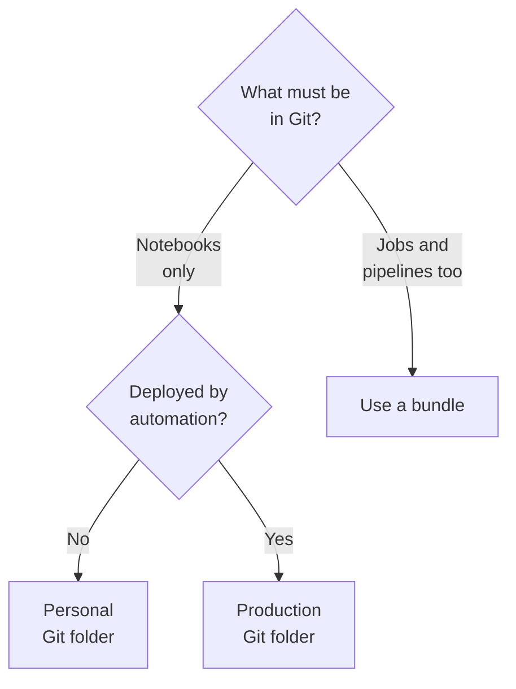
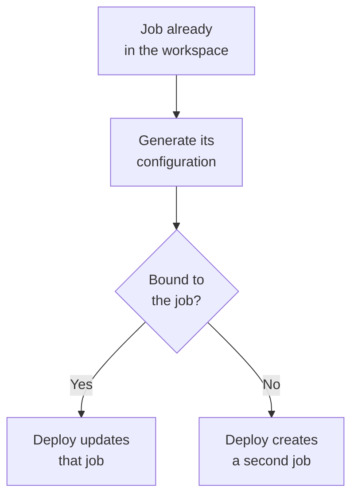

# Domain 5 — Implementing CI/CD

This domain is 10% of the exam. Continuous integration (CI) is the habit of merging and testing
work often. Continuous delivery (CD) is the habit of moving it to the next environment by
automation rather than by hand. This domain asks how both are done on Databricks: where the code
sits while you write it, and what carries it to production once you are finished.

The sections below keep the guide's spine and make one move. The guide describes environment
variables and overrides before it describes the thing they configure, so this page teaches what a
bundle is and what deploying one does first, and only then how a bundle varies per environment.
Everything else runs in the guide's order.

One warning before you start, because it shapes half the questions here. Almost every name in
this domain has changed in the last two versions of the product, and two of those renames also
changed behaviour. The last section is a table of them. Read it before you revise from anything
written more than a year ago.

---

## What this domain actually asks

Three habits carry most of the marks.

**Name the tool the scenario is standing in.** Git folders, bundles and the command line solve
different problems, and an option that would be right for one is usually the trap for another.
Databricks says it in one sentence: use Git folders for interactive development, and use bundles
for continuous delivery and production deployments.

**When two places could set a value, ask which one wins.** This domain contains four separate
precedence rules — for variables, for presets, for permissions and for authentication — and each
is a published ordered list. Questions are written on candidates who assume that the value
written closest to the resource wins. Sometimes it does.

**Assume the quiet operation is the destructive one.** Switching a branch can delete workspace
assets. Pulling clears a notebook's outputs. Removing a job from a configuration file deletes the
deployed job. None of the three reports an error, and all three are examinable.

---

## Where your code lives while you are working on it

**Databricks Git folders is a visual Git client and an API inside your workspace.** It clones a
repository, commits and pushes, pulls, manages branches, and shows you a diff before you commit.
The folder is an ordinary workspace folder that happens to track a remote.

The supported providers come in two lists, and the second is the one candidates forget: **cloud**
providers such as GitHub, Bitbucket Cloud, GitLab and Azure DevOps, and **on-premises** providers
such as GitLab Self-Managed. Do not memorise either list — both move. Remember that both
categories are supported.

Two things must be true before you can clone. You need the `CAN MANAGE` permission on the parent
folder you are cloning into, and your workspace needs Git credentials. Credentials are a personal
access token or a linked account from your provider, added under your own settings. A public
repository can be cloned with no credentials at all; anything private, and any write to anything,
needs a credential with write permission.

Each provider gets one default credential per user, and Databricks uses it for jobs, for API
operations and for any folder that has not been given a specific one. The first credential you
create becomes that default, and you may hold ten in total. A job that needs a non-default
credential has to run as a service principal instead. One provider is fussy: Databricks Git
integration does not accept Microsoft identity-platform tokens, so Azure DevOps needs its own
personal access token.

Folder permissions are the ordinary workspace ones — `NO PERMISSIONS`, `CAN READ`, `CAN RUN`,
`CAN EDIT`, `CAN MANAGE` — applied to everything inside the folder. Most Git operations require
`CAN MANAGE`, which is why a colleague with `CAN RUN` can execute your notebook and not commit it.

Databricks Repos was the earlier name for this feature. Databricks characterises the rename as
terminology rather than function: the core functionality has not changed. Two differences are not.

| Question | Repos | Git folders |
|---|---|---|
| Where can it live | Fixed path under a Repos root | Any depth of the workspace tree |
| Remote repository URL | Optional | Required |
| Old paths after the change | — | Still resolve, unchanged |

---

## Branch, commit, push, pull — and what each one costs

**The daily loop is four operations, and two of them cost you something the interface does not
warn about.**

You open the Git dialog from a notebook or from the folder, and **Create Branch** takes a name and
a base branch. Switching to another branch carries your uncommitted changes across with you,
provided they do not conflict with what is already there. Discard them first if you did not mean
to bring them.

Committing needs a message, and **Commit & Push** does both in one action. There is no
local-only commit to amend later, which is why any credential used for committing must be able to
write.

Your identity on the commit comes from the credential: its email becomes the author and committer
email, its username the committer name. A credential saved without an email uses the username
instead, which is how commits stop being attributed to anyone.

Notebook outputs are not committed by default in the source formats. To version outputs or a
notebook's dashboard definition, save it in the format that stores them and commit with outputs.

| Operation | Notebook state | Workspace assets |
|---|---|---|
| Commit, push, create branch | Preserved | Untouched |
| Pull | Cleared | Overwritten from the remote |
| Switch branch | Preserved | May be deleted, then recreated with new links |

The second and third rows are the traps. A pull rewrites notebook source, so Databricks
overwrites the notebook, and the **notebook state** — outputs, comments, version history, widgets
— goes with it. A branch switch is worse: an asset the new branch does not contain may be
deleted, and switching back recreates it with a new identifier and a new URL, which cannot be
undone. Every bookmark and every shared link to it is now dead.

> **Trap.** The exam's phrase is "creating pull requests using Databricks Git integration", and it
> does not mean the workspace raises one. You push a branch from the folder, then open the
> **pull request** in your provider's own interface and merge it there. The documentation says so
> in exactly the case where it matters: when you lack permission to commit to the default branch.

One more piece of hygiene. Give every team member their own folder mapped to the same remote, and
let only one person perform Git operations in any one folder. Two people sharing a folder share
its branch, so one of them switching branches switches it for both.

<details>
<summary><b>Self-check — the daily loop</b></summary>

1. A colleague pulls before a demonstration and the charts in their notebook vanish. What
   happened, and which three operations would have been safe?
2. A dashboard built from a notebook in a Git folder stops loading for everyone after a teammate
   switches to a branch that predates it. Switching back brings the dashboard back. Why are the
   links still broken?
3. A learner is asked where a pull request is created in this workflow. What is the answer, and
   what does the workspace do instead?

1. A pull rewrote the notebook's source, so the notebook state — outputs, comments, version
   history and widgets — was cleared. Commit, push and creating a branch change no source and
   preserve it.
2. Switching away deleted the asset because the older branch does not contain it. Switching back
   recreates it with a new identifier and a new URL, and that cannot be reversed, so every old
   link points at something that no longer exists.
3. In the Git provider's own interface. Databricks commits and pushes the branch; the review and
   the merge happen in the provider.

</details>

---

## Three ways to combine work, one way to lose it

**Merge, rebase and reset all combine two branches, and they differ in what survives.**

| Operation | What it runs | What it costs |
|---|---|---|
| Merge | A merge, no force push | Nothing; history is preserved |
| Rebase | Replays your commits, then a forced push | Rewritten history, painful for collaborators |
| Reset | A hard reset and a forced push | All changes, committed and not, on both copies |

Databricks recommends merge for anyone not fluent in Git, for the reason in the middle column: it
never force-pushes and never rewrites history. Rebase gives you a linear history and pays for it
with a forced push, so anyone else working from the same branch is now out of step. Reset replaces
a branch's contents and history with another branch's, locally and on the remote, and there is
nothing to recover afterwards.

Deleting a branch is not in this list, because you cannot do it here. Delete it in the provider,
and expect the local copy to linger in the folder for up to thirty days.

---

## Limits, and the ways round them

**Databricks sets no limit on repository size, but every Git operation is capped.** A working
branch is limited to 1 GB, each operation gets 2 GB of memory and 4 GB of disk writes, and files
over 10 MB will not open in the workspace. Because the caps are per operation, cloning a 5 GB
repository fails while cloning a 3 GB one and adding 2 GB afterwards succeeds.

When a repository is too large, there are two documented answers and one popular non-answer.
Rewrite the history to drop the large files, or clone only part of the tree with **sparse
checkout** — a client-side cone pattern chosen at clone time and impossible to disable afterwards.
With no pattern given you get the root files and no subdirectories, and exclusions with an
exclamation mark are not supported. The non-answer is `.gitignore`, which only ever applies to
untracked files; adding a committed file to it changes neither the history nor the size.

Not everything in the folder is under version control. Files, notebooks and folders are, and
queries, dashboard drafts and alerts are in preview. Legacy alerts, experiment records and agent
definitions are not: you can move them into the folder, but their changes will never commit.
Notebooks are recognised by extension or by a marker comment in the first line, names must be
unique across extensions, may not contain a slash, and are capped at 255 bytes.

Two guardrails are worth knowing by name. A workspace admin can restrict which remotes are
reachable, either for every operation or for writes only — the second leaves cloning and pulling
open. And every commit is scanned for exposed credentials first, including keys beginning `AKIA`.

Finally, the protocol boundary. Git folders authenticate over Hypertext Transfer Protocol Secure
(HTTPS) only. Secure Shell (SSH) keys are not supported, and neither is signing commits with `GPG`.

---

## Git folder or bundle

**A Git folder version-controls code. A bundle version-controls the code and everything that runs
it.** That is the whole distinction, and most scenario questions in this domain resolve on it.

If a job's schedule, its cluster definition and its permissions are configured by hand in the
workspace, they are not in Git, and no amount of committing notebooks will put them there. That is
the gap bundles close.



The right-hand leaf is the recommended one, and the left branch still has a legitimate use. A
production Git folder is created by an admin outside anyone's home folder, tracks a deployment
branch, and is updated only by automation when a pull request merges — usually through the folders
API. Most users get run-only access to it; only admins and **service principals** may edit. Use it
when you want code deployed and have no external automation to run a bundle.

Two habits apply whichever you choose. Point job tasks at the Git provider rather than a workspace
path, so a job starting mid-pull cannot run half of one commit and half of another. And keep the
main branch deployable, versioning anything you upload by commit hash.

<details>
<summary><b>Self-check — choosing the tool</b></summary>

1. A team keeps every notebook in Git, but a schedule change last month was never reviewed and
   nobody can say who made it. Which tool closes that gap, and why does the Git folder not?
2. What distinguishes a production Git folder from the one under your own workspace folder, and
   who is allowed to edit it?
3. A job reading notebooks from a Git folder fails intermittently during working hours. What is
   the documented cause and the documented fix?

1. A bundle. The schedule is job configuration, not code, and a Git folder only version-controls
   the code files. A bundle carries the job definition itself as source.
2. It sits outside user folders, is created by an admin, tracks a deployment branch, and is
   updated only by automation on merge. Only admins and service principals may edit it; everyone
   else gets run-only access.
3. A job starting during a Git operation can pick up some notebooks already updated and others
   not. Configure the job's tasks to use the Git provider as their source instead of a workspace
   path.

</details>

---

## What a bundle is, and what one deployment does

**Declarative Automation Bundles — formerly Databricks Asset Bundles — describe a whole project as
source files: the code, the jobs and pipelines that run it, and the settings for each environment
it goes to.** The rename is non-breaking. The command group is unchanged and no existing
configuration needs editing.

A bundle needs exactly one file called `databricks.yml` at its root, and it may pull in others
through an include list. The name is required. Everything the bundle creates goes under a
`resources` mapping — jobs, pipelines, clusters, dashboards, models, schemas, volumes and more —
and everywhere it can be sent goes under `targets`, of which exactly one may be the default.

```yaml
bundle:
  name: sales-etl

resources:
  jobs:
    daily_load:
      name: daily_load
      tasks:
        - task_key: ingest
          notebook_task:
            notebook_path: ../src/ingest.py

targets:
  dev:
    default: true
  prod:
    workspace:
      host: https://example.cloud.databricks.com
```

Bundles are a feature of the Databricks CLI, and you normally build them locally and deploy from
there. You do not have to: the workspace can create and deploy a bundle with nothing installed,
given **workspace files** enabled, a Git folder to hold it, and serverless compute. Any folder
with `databricks.yml` at its root is recognised as a bundle. What the workspace editor cannot do
is deploy to a *different* workspace — that is a command-line job, and it is how promotion works.

Now the part that surprises people. A deployment tracks what it created by identifier, in state
stored in the workspace, and never by name.

| The resource in your configuration | On the next deployment |
|---|---|
| Not yet in the workspace | Created |
| Already in the workspace | Updated in place |
| Deleted from your configuration | Removed from the target workspace |

That third row means removing a job from the file is a request to delete the deployed job.
Renaming one, by contrast, updates the existing job rather than making a second, because the name
was never what linked them.

These are two rules, not one. A bundle's identity is its `root_path`, which defaults to
`~/.bundle/${bundle.name}/${bundle.target}` — the deployer, the bundle name and the target.
Forgetting a resource is a different list: the bundle name, the target or the workspace. The
deployer is in the first and not the second.

<details>
<summary><b>Self-check — bundles and deployments</b></summary>

1. A developer comments out a pipeline block to stop working on it and deploys. What happens to
   the deployed pipeline?
2. Two engineers deploy the same bundle, same target, to the same workspace. Do they collide?
3. Which file must exist, where, and what does its presence mean to the workspace?

1. It is removed from the target workspace. A resource missing from the configuration is a
   resource the deployment deletes, provided that deployment created it.
2. No. Identity is the bundle name, the target and the identity of the deployer, so two different
   deployers land in different root paths. Two deployments matching on all three would interfere.
3. `databricks.yml`, at the bundle root, exactly one of them. A folder that contains one is
   recognised by the workspace as a bundle.

</details>

---

## One codebase, three environments

**The point of a target is that the same project deploys to development, test and production with
only the differences written down.** A mapping a target does not override **falls back** to the
top-level one, so a target states what differs and nothing else.

Values that differ come from two places. A substitution reads something the bundle already knows —
`${bundle.name}`, `${bundle.target}`, `${workspace.host}`, the current user — and needs no
declaration. A custom variable is declared once and referenced as `${var.my_cluster_id}`.

```yaml
variables:
  cluster_id:
    description: The cluster this target runs on
    default: 1234-567890-abcde123

targets:
  dev:
    default: true
  prod:
    variables:
      cluster_id: 2345-678901-bcdef234
```

A variable is a string unless you declare `type: complex`, which is what lets one variable hold a
whole cluster definition — the documented answer to the same block appearing in five places.
Complex is the only legal value there, and validation fails if you declare it and then give a
single value as the default. Instead of a literal, a variable can carry a lookup, which names an
object — a cluster, a warehouse, a job, a service principal — and resolves to its identifier at
deploy time. A lookup that matches nothing, or more than one thing, is an error rather than a
guess, which is exactly what a hardcoded identifier never gives you.

A variable needs no default. If it has none, some other source has to supply it, and there are
five, in this order.

| Order | Where the value comes from |
|---|---|
| 1 | `--var` on the command |
| 2 | An environment variable named `BUNDLE_VAR_` plus the variable name |
| 3 | The target's `variable-overrides.json` file |
| 4 | The `variables` mapping inside that target |
| 5 | The default in the top-level declaration |

The search stops at the first hit. A stale shell variable therefore beats the value your target
carefully sets, and nothing announces it.

Overrides work the same way for whole blocks, except that the target's settings are *joined* to
the top-level ones rather than replacing them. Matching is by key, and the key differs by what you
are overriding.

| What you are overriding | Joined by |
|---|---|
| A job cluster | `job_cluster_key` |
| A pipeline cluster | The cluster `label` |
| A task inside a job | `task_key` |

Where both levels set the same field, the target wins. Where only one sets it, both survive. Get
the key wrong and nothing merges — you get a second entry and no error.

> **Trap.** Bundle variables are **deployment-time variables**. They are resolved when you deploy
> and baked into the deployed resource, so supplying a different value when you *run* a job does
> nothing at all. Values that must reach a run go in as job parameters. This is the single most
> confidently answered wrong question in the objective.

Two closing rules. Supply a variable the same way when deploying and when running, or the two will
disagree. And do not hardcode environment-specific settings — cluster sizes, secrets, hosts — which
makes the project unusable elsewhere and risks publishing identities that should not travel.

<details>
<summary><b>Self-check — variables and overrides</b></summary>

1. A production deployment keeps using a development cluster. The target sets the variable
   correctly and the file is committed. Where do you look first, and why?
2. A team adds `num_workers` under a target for a job cluster, and the deployed job has two
   cluster entries instead of one changed one. What went wrong?
3. An engineer passes a new value with `--var` when running a deployed job and the job ignores it.
   Explain, and give the correct mechanism.

1. At anything higher in the precedence order: a `--var` on the command, a `BUNDLE_VAR_`
   environment variable left in the shell, or a `variable-overrides.json` for that target. All
   three beat the target's own mapping.
2. The `job_cluster_key` under the target did not match the one at the top level. Overrides join
   on that key; an unmatched key adds a new entry rather than merging, and nothing errors.
3. Bundle variables are resolved at deployment time and are already fixed in the deployed job.
   Run-time values are job parameters, passed with the parameters option.

</details>

---

## Development mode, production mode, and presets

**A mode is a named bundle of behaviours applied to a target, and it is optional.** You can deploy
without one. What a mode buys you is not having to configure eight things individually.

| Behaviour | `development` | `production` |
|---|---|---|
| Resource names | Prefixed and tagged for you | Left as written |
| Schedules and triggers | All paused | As configured |
| Pipelines | Marked as development | Verified not to be |
| Cluster override on deploy | Allowed | Refused |
| Git branch | Not checked | Must match the target's branch |

Development mode also allows concurrent runs everywhere and drops the deployment lock, both for
speed. Production mode's branch check is the one that stops a deployment: deploying production
from a feature branch fails unless you force it. If you do not deploy production as a service
principal, production mode adds two more checks — that the paths have not been pointed at one
person's folder, and that the run identity and permissions are stated explicitly.

Presets set the same behaviours one at a time: a name prefix, tags, a pause status for triggers, a
maximum for concurrent runs, whether pipelines are in development. Where a target has both, a
preset overrides the mode's default, and a setting on an individual resource overrides the preset.
Specific beats general, as usual.

There is one documented exception, and it is the examinable one. **In development mode every
trigger and schedule is paused regardless of what the preset says.** A team that sets the pause
status to unpaused and wonders why nothing fires has met it.

<details>
<summary><b>Self-check — modes and presets</b></summary>

1. A nightly job deployed to a development target has not run once. Give the cause and the two
   ways to change it.
2. A release pipeline fails at deployment with a complaint about the branch. Which mode, which
   check, and which flag overrides it?
3. A job sets its maximum concurrent runs to 10 and the target sets a preset of 20. What runs?

1. Development mode pauses every schedule and trigger. Either unpause that job explicitly through
   its own pause status, or deploy to a target that is not in development mode. A preset will not
   do it — the mode overrides the preset in this one case.
2. Production mode validates that the current branch matches the branch named in the target.
   Deploying with the force flag overrides the validation.
3. Ten. A setting on the individual resource overrides the preset, which overrides the mode.

</details>

---

## Who deploys, who runs, and how each one signs in

**The identity that deploys a bundle and the identity that runs its workflows are two different
things, and `run_as` is what separates them.** Set it at the top level or per target, to a user or
to a service principal. Non-admins may only name themselves.

Separating them has a price worth remembering: when the deployer and the run identity differ, only
jobs and pipelines are supported. When they are the same, everything is. And `run_as` is refused
outright for model serving endpoints — declaring one alongside it is an error.

```yaml
targets:
  prod:
    mode: production
    run_as:
      service_principal_name: 5cf3z04b-a73c-4x46-9f3d-52da7999069e
```

Databricks calls that the most secure way to run a production workflow. It decouples permission to
run from whoever deployed, and lets the production identity hold fewer privileges than the person
who pushed the button.

Permissions come from a `permissions` mapping, at the top level for everything in the bundle or on
one resource. Do not do both for the same principal — overlapping definitions are not allowed. The
top-level levels are `CAN_VIEW`, `CAN_MANAGE` and `CAN_RUN`; individual resource types accept
longer lists of their own. Where the same principal is granted at several levels, the order is the
resource inside the target, then the target, then the resource, then the bundle.

Signing in splits the same way. Interactive work uses browser-based sign-in with short-lived
tokens and a **configuration profile** on your machine. Automation uses machine-to-machine
authentication for a service principal, with the settings in environment variables. Personal
access tokens still work and are described as the legacy option. One service principal with access
to all three workspaces lets one set of environment variables serve the whole promotion path.

---

## The commands, and what each one actually touches

**The Databricks CLI wraps the platform's API, and its bundle command group is objective 5.4
entire.** Commands take the form of a group, a command, then flags. Every one of them can also be
run from the workspace web terminal, which needs no authentication set up at all.

| Command | Reads | Changes |
|---|---|---|
| `databricks bundle validate` | The configuration | Nothing |
| `databricks bundle plan` | Configuration and deployed state | Nothing |
| `databricks bundle deploy` | The configuration | The target workspace |
| `databricks bundle run` | What is already deployed | Starts a run |
| `databricks bundle destroy` | The deployment state | Deletes what was deployed |

`databricks bundle init` starts a project from a template — the supplied ones, or a path or Git
URL of your own. `databricks bundle validate` checks the files against the object schemas and
prints the bundle's identity. It is a schema check, not a rehearsal: a property the schema does
not recognise is a **warning**, so a misspelled key passes validation and quietly does nothing.
Add the JSON output option and it prints the values a deployment would actually use, which is how
you find out what a variable resolved to. For an inventory of what is deployed, with links, use
the summary command instead.

`databricks bundle plan` is the dry run: it lists the actions a deployment would take and changes
nothing. Deploy then applies them, to the target named with `-t` or to the default. Its flags
matter: **`--auto-approve`** skips interactive prompts, the force flag overrides the branch check,
another fails the deploy if runs are in flight, and the selective flag is for development
workspaces only, because it skips downstream dependencies.

Running takes the **resource key** — the top-level element of the resource's block, not the
deployed name, which development mode has prefixed anyway. Job parameters go in with the
parameters flag; a subset of tasks with the only flag, where a leading plus adds upstream tasks
and a trailing plus adds downstream ones. `databricks bundle destroy` deletes everything the
bundle deployed and cannot be undone, so `--auto-approve` on that command deserves its own review.

Two commands exist for adopting work that already lives in the workspace, and the order matters.



Generate writes the configuration and downloads the files. Binding is what tells the bundle that
this configuration *is* that job, and without it the first deployment builds a duplicate. Bind
either as part of generating, with the bind flag, or as its own command before deploying. It does
not recreate data, so a bound pipeline keeps its tables.

The rest is plumbing worth recognising. Sync copies local changes to the workspace, one way only,
and schema prints the configuration schema for your editor. Authentication resolves from the
bundle's own settings first, then environment variables, then profiles — and bundle files may
never hold credentials, only a pointer to one. Where no profile is named, the tool falls back to
the profile environment variable, then a recorded default, then `DEFAULT`. A `.netrc` file is
never consulted.

```bash
databricks bundle validate
databricks bundle deploy -t prod
databricks bundle run -t prod daily_load
```

<details>
<summary><b>Self-check — the commands</b></summary>

1. A deployment succeeds and the job ignores a setting the team added. Validation passed. What is
   the likely cause and which command output would have shown it?
2. After onboarding an existing job into a bundle, the workspace now shows two jobs with the same
   name. What was skipped?
3. Which command shows what a deployment would change without changing anything, and how does it
   differ from validation?

1. The property is not in the object's schema, so validation recorded a warning rather than
   failing. Reading the warnings, or running validation with JSON output to see the values a
   deployment would use, would have shown it.
2. The generated resource was never bound to the existing job. Without a binding the deployment
   creates a new resource instead of updating the old one.
3. The plan command. Validation checks the files against the schemas and never looks at what is
   deployed; plan compares the configuration with the deployed state and lists the actions.

</details>

---

## What changed, and what your older material will say

**Four names in this domain have changed, and two of the four also changed behaviour.** Every row
ends the same way: the exam tests the current product, so pick the current answer.

| Older material says | Now | Behaviour changed? |
|---|---|---|
| Databricks Asset Bundles | Declarative Automation Bundles | No — same commands, same files |
| Repos | Git folders | Yes — location and required remote |
| `${bundle.environment}` | `${bundle.target}` | No — same value |
| Terraform deployment engine | Direct deployment engine | Yes — one difference, below |

The bundles rename is non-breaking, and Databricks says so plainly: the command group and every
existing configuration file are untouched. **This does not change the exam answer.** The guide
itself uses both spellings across its own objectives, so an option is not wrong for saying either.

The Git folders rename is the one to read carefully. A folder may now sit anywhere in the
workspace tree rather than at a fixed path, and it requires a remote repository URL where a Repo
did not. Existing paths still resolve, so nothing already written needs changing. **A learner who
was told the rename was purely cosmetic will answer the location question wrong.**

The substitution rename is cosmetic. The documentation's own list says to use the target form, and
older projects still carry the older one, which is not an error to find in a repository.

The engine change matters least day to day and most in one specific way. Bundles were built on the
Terraform provider; two engines are now supported, and new bundles created with a current command
line default to the direct one. Databricks recommends migrating and says the older engine will
soon be disabled — with no date, so treat it as direction, not as a fact about today. The
commands are identical either way. The difference to carry: under the direct engine, a field you
delete from the configuration reverts to that resource's default, where the older engine left the
last deployed value in place. If a value matters, state it.

One last version note, since the tool has its own numbering. Versions 1.0.0 and above are general
releases, 0.205 to 0.299 were previews, and anything at 0.18 or below is the legacy tool, which
gets no support and no new features.

---

## Traps worth carrying into the exam

- **A pull clears the notebook state.** Commit, push and creating a branch do not.
- **Switching branches can delete workspace assets**, and switching back gives them new links.
- **Pull requests are raised in the Git provider**, not in the workspace.
- **`.gitignore` does not shrink a repository.** A committed file stays in the history.
- **The first value found wins**, and the command line is searched before your target.
- **Bundle variables are fixed at deployment.** Run-time values are job parameters.
- **A resource removed from the configuration is deleted** from the workspace on the next deploy.
- **Validation warns about unknown properties rather than failing**, so a typo deploys.
- **`databricks bundle run` takes the resource key**, not the deployed job name.
- **Generating configuration for an existing job creates a second one** unless you bind it first.
