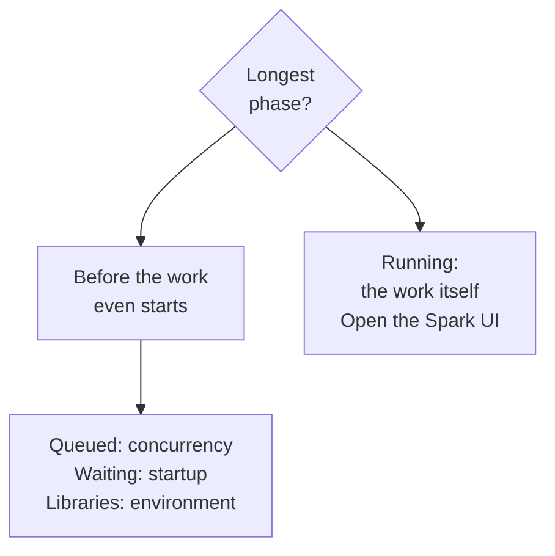
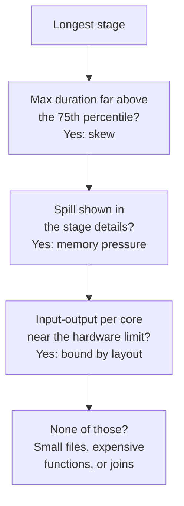

# Domain 6 — Troubleshooting, Monitoring, and Optimization

This domain is 10% of the exam. It is the only one written from the position of something having
already gone wrong: a job that used to finish in twenty minutes now takes ninety, a cluster that
will not start, a query somebody else killed. What it rewards is knowing which surface answers
which question, and reading the number in front of you rather than guessing at the cause.

The sections below depart from the guide's order once, deliberately. The guide puts the Spark
user interface (UI) third and cluster failures last. But a job that never started has no stages to
inspect, so the cheaper checks come first here. Where the evidence lives, then what the run itself
tells you, then whether compute and libraries were ever healthy, and only then the drill-down into
stages. Liquid clustering and predictive optimization come last because they are not diagnosis at
all — they are what you turn on once you know the layout is the problem.

---

## What this domain actually asks

Three habits carry most of the marks.

**Name the surface before you name the cause.** Almost every question here is really asking which
of four or five places you would open. Run history, the system tables, the run breakdown, the
Spark UI and the compute metrics page answer different questions over different time windows, and
an answer that is right for one is the trap for another.

**Read the phase, not the symptom.** "The job is slow" is not a diagnosis. The run breakdown
splits a run into phases, and each phase has its own short list of causes and its own fix.
Reaching for a bigger cluster is the wrong answer to three of the four phases.

**Assume the platform already did the obvious thing.** Adaptive query execution is on, Query
Watchdog is on for clusters made in the UI, and predictive optimization runs maintenance on
managed tables. Before choosing an option that says to enable something, check whether the
scenario already has it on — that is where these options usually fail. Note the shape of each
default, because two of the three are scoped: Query Watchdog is on for all-purpose compute created
through the interface, not everywhere, and the adaptive execution page scopes its own statement to
non-streaming queries.

---

## Where the evidence lives, and for how long

**The retention window decides the surface.** Four numbers separate every monitoring question in
this domain, and none of them is negotiable.

| Surface | What it answers | Window |
|---|---|---|
| Finished runs count graph | How many runs finished, and the top error types | 48 hours |
| Run history in Lakeflow Jobs | What happened on a given run | 60 days |
| Compute metrics | Hardware and Spark load on a cluster | 30 days |
| System tables in the `lakeflow` schema | Trends across every job in the account | 365 days |

The 60-day figure is the one that catches people. A question that asks you to compare this
quarter against last quarter cannot be answered from the run history view at all, no matter how
you filter it — **the runs are gone**. That comparison is a SQL query against the system tables, and
Databricks recommends exporting run results before they expire if you need them for longer.

Two details on those system tables are examinable. The schema was previously called `workflow`
and the content of both is identical, so older material naming the old schema is not wrong, just
old. And the 365-day window is not absolute: the most recent record for each job and task is kept
even when it is older than a year, so the latest row per entity never disappears.

The two timeline tables are the ones to know by name. `job_run_timeline` tracks job runs and
their metadata, `job_task_run_timeline` tracks task runs, and both carry the start and end of the
period a row covers. Reach for the task-level table when the question is about a specific task's
execution rather than the run as a whole.

<details>
<summary><b>Self-check — surfaces and windows</b></summary>

1. A team wants to know whether their nightly job has drifted slower over the past six months.
   Which surface answers that, and why is it not the run history view?
2. Which two system tables hold job-run and task-run timeline information?
3. How long does the finished-runs graph look back?

**Answers.** 1. The system tables in the `lakeflow` schema, which retain 365 days; run history
keeps 60 days, so six months of comparison is not there to read. 2. `job_run_timeline` and
`job_task_run_timeline`; the task-level one is where task-specific execution detail lives.
3. 48 hours.
</details>

---

## Reading a run without guessing

**Open a job by its name and you land on its Runs tab.** That tab holds two views of the same
active and completed runs: a **matrix view** and a list view. **The matrix view is the fastest
read of a job's health.** Each column is a run and each cell in the task row is one task. Colour
carries the outcome — green succeeded, red failed, pink skipped, yellow waiting for a retry — and
bar height carries **duration, not severity**. Those
are two independent signals, and reading height as badness is the single most common misreading of
this screen. A tall green bar is a slow success.

**Grey is the one that does not settle anything.** Pending, canceled and timed out are all grey, so
three different endings share a colour and you have to open the run to tell them apart. The other
four colours each mean one thing; grey means three.

The screen makes exactly one comparison for you, and only if you asked for it: **where an expected
completion time has been configured, the matrix shows a warning when a run exceeds it.** Nothing
learns a baseline from history. Height lets *you* see a trend; the warning is the only thing that
flags one, and it is measuring against a number somebody typed.

The run details page offers three views of the same run. They are not three renderings of the
same information.

| View | Use it to see | Best for |
|---|---|---|
| Graph view | Dependencies, and which task blocked the rest | Upstream blockers |
| Timeline view | Which task occupied the wall clock | Long-running tasks |
| List view | Status, type, resource and duration per task | Scanning many tasks |

A task can also end as Disabled, and that is worth knowing precisely: a downstream task shows
Disabled when something it depends on was disabled, so the task nobody touched is the one you
notice first. Jobs deployed by Declarative Automation Bundles are read-only in the Jobs UI by
default, which explains an edit button that will not respond. Notebook results and run logs can be
exported for every job type, and logs can be delivered automatically to DBFS or S3 by configuring
log delivery on the cluster.

### The run breakdown is the triage tool

Hovering over a run's duration splits it into four phases: Queued, Waiting for resources, Library
installation, and Running. Each has a different cause and a different fix, and the fix for one is
wrong for the others.

You do not walk these in order. Find the phase that took the most time and read only its causes.
The first split decides where you look next.



**Queued means concurrency, never capacity** — either the job hit its own maximum concurrent runs or
the workspace limit. A bigger cluster does nothing. Waiting for resources is compute startup, and
on serverless a standard-performance job carries a startup latency of 4 to 6 minutes, which
switching to performance-optimized mode reduces. Library installation grows with the size of the
environment, especially where init scripts install packages at startup. Only the Running phase is
a question about the work itself.

Two qualifications. For a multi-task job the job-level breakdown counts Waiting for resources
only until the first task starts, so the full picture lives in each task's own breakdown. And a
pipeline task has different phases entirely — created, waiting for resources, initializing,
setting up tables, and running.

> **Trap.** A run that got slower is not necessarily code. The documented causes are more data,
> a changed job or compute configuration, and changed code, in that order. Check what changed
> before you profile anything.

<details>
<summary><b>Self-check — reading a run</b></summary>

1. A run's matrix bar is tall and green. What has gone wrong?
2. A run spent most of its time Queued. Does a larger cluster help?
3. Which view shows you which upstream task blocked the others?

**Answers.** 1. Nothing failed; the bar height is duration, so the run was slow but successful.
2. No. Queued is a concurrency limit, so the fix is the concurrency setting or the schedule.
3. The graph view.
</details>

---

## When compute never really started

**A cluster that will not start usually names its own reason.** Termination codes appear in the
compute event log, which retains events for 60 days, and each code points at a different owner of
the problem.

| Code | What happened | Who fixes it |
|---|---|---|
| `INIT_SCRIPT_FAILURE` | A cluster-scoped script failed or was not found | The cluster owner |
| `GLOBAL_INIT_SCRIPT_FAILURE` | A workspace-wide script failed | A workspace admin |
| `SPARK_STARTUP_FAILURE` | The driver did not start in time | Remove custom configs and scripts |
| `BOOTSTRAP_TIMEOUT_DUE_TO_MISCONFIG` | The virtual machine could not be reached | Network or subnet configuration |

The last two are easy to blur and the exam knows it. One is Spark failing to come up on a machine
that exists; the other is the machine never becoming reachable at all, which is a networking
problem before Spark is involved. An init script failure has two modes worth separating too: the
script could not be fetched, usually because nothing is at that path, or it ran and returned a
non-zero status.

Global init scripts have a scope people get wrong. They run on dedicated single-user and
no-isolation clusters, **not on standard access mode clusters** — so "it runs everywhere" is false,
and a script that works on one access mode may simply never execute on another. Because only
workspace admins manage them, diagnosing one is often a conversation rather than a fix.

Init script events appear in the cluster event log as started and finished entries, with global
and cluster-scoped scripts distinguished by a key in the event detail. One caution: those events
are **not logged per node**. Databricks picks one node to represent them all, so the log cannot tell
you which node failed. For that you need the script logs themselves, which are written under the
cluster log path when log delivery is configured.

> **Trap.** Requesting an instance type with no capacity in the region fails the launch, and that
> is a cloud-provider condition rather than a Databricks fault. The fix is a different instance
> type or a different availability zone, not a support ticket.

---

## When the library is the problem

**Scope decides lifetime, and lifetime explains almost every library complaint.** A compute-scoped
library is installed on the cluster and is available to every notebook and job on it. A
notebook-scoped library belongs to one notebook, does not survive the session, and must be
reinstalled when the cluster restarts.

That distinction is the answer to the most common scenario in this area: it worked in the notebook
and failed as a job. A notebook-scoped install is **invisible to a job** running on the same cluster,
because the job is a different session.

Databricks recommends `%pip` for notebook-scoped Python libraries. Two consequences follow.
`%pip` **does not restart the Python process**, so a package that was already imported keeps
serving the old version until you restart it deliberately. That is why an install reporting
success can still leave your code importing the version you were trying to replace. And restarting the
Python process discards Python state, so the recommendation is to install everything at the top of
the notebook before you build up anything you would mind losing.

A restart is specifically required after installing a version of a package that ships with the
runtime, after upgrading a library explicitly, after configuring an environment from a
requirements file, and after installing anything that changes the versions of the runtime's own
dependencies. Uninstalling with `%pip` is not a reliable way to remove a library that came with
Databricks Runtime or was installed on the cluster — the original is still there underneath.

Compute-scoped libraries can come from a package repository, from workspace files, from Unity
Catalog volumes, from a cloud object storage location, or from a local path. Two constraints on
where they live. Storing library files in the DBFS root is **deprecated and disabled by default**
from Databricks Runtime 15.1 upward, because any workspace user can modify them. And a cluster
policy that enforces library installations makes the install and uninstall controls unavailable —
the greyed-out button is policy, not breakage. Installing libraries through an init script is
explicitly not recommended.

<details>
<summary><b>Self-check — libraries and startup</b></summary>

1. A notebook runs correctly interactively and fails with an import error as a scheduled job on
   the same cluster. What is the likely cause?
2. You installed a newer version of a package with `%pip` and the old behaviour persists. Why?
3. Which termination code points at networking rather than at Spark?

**Answers.** 1. The library is notebook-scoped, so it does not exist for the job's session; install
it on the cluster. 2. `%pip` does not restart the Python process, so the already-imported module is
still in memory. 3. `BOOTSTRAP_TIMEOUT_DUE_TO_MISCONFIG`.
</details>

---

## Into the Spark UI: read the timeline first

**The Spark UI is the classic-compute route, and it has a documented order.** You open it from
the cluster's own page, or from the Compute page by selecting the compute and clicking its Spark
UI tab — two routes to the same screen. Then use the jobs
timeline to spot major issues, then the longest stage, then skew or spill. Then decide whether the
stage is bound by input and output (I/O), and only then look for other causes. Serverless jobs go a
different way: they use query insights and query history rather than the compute metrics UI.

The timeline has four patterns worth recognising, and two of them are innocent.

| Pattern | What it usually means |
|---|---|
| Failing jobs or executors | A real failure, or autoscaling doing its job |
| Gaps in execution | Non-Spark code, a complex plan, or simply no work |
| One long job | The target: open it and find the longest stage |
| Many tiny jobs | Lots of small operations that should run in parallel |

Gaps are worth a minute of your attention only if they are a minute or more. Short gaps are
expected while the driver coordinates work, so "any gap is a problem" is wrong. Longer gaps have a
short list of causes: there is genuinely no work to do, the driver is compiling a complex plan,
non-Spark code is running, the driver is overloaded, or the cluster is malfunctioning. On
all-purpose compute the first is the most likely, because the cluster stays up between queries.
Building a plan with `withColumn()` inside a loop is a documented way to produce an expensive
plan and a long gap while it compiles.

Executors leaving the timeline is likewise not automatically a failure. The most common reasons
are autoscaling, which is expected, spot instance loss, and executors running out of memory — and
only the last two are problems. Jobs that appear to start at the same instant are usually just
jobs submitted in parallel; a job shows as running from the moment it is submitted, not from when
its first task executes.

---

## The four readings that explain a slow stage

Once you are on the longest stage, four readings account for most of what the exam asks.



**Skew is read from durations, not from the data.** On the stage page's summary metrics, a maximum
task duration **around 50% above the 75th percentile** suggests skew; in a healthy stage those two
numbers are roughly equal. That is a screen you read, not a distribution you go and study.

**Spill is memory, not disk.** It happens when Spark runs low on execution memory and writes
intermediate data out, and it is most common during shuffles. If the stage details show no spill
statistics at all, **the stage has no spill** — an absent number is an answer here, not a missing one.

**I/O bound is a calculation, not an impression.** Take the largest number in any input or output
column, divide by the number of worker cores, then by the stage duration, and compare the result
against what the hardware can do. A stage moving a lot of data is not automatically I/O bound; a
stage moving a little can be. Where a stage really is bound by input, the remedies are Delta Lake,
liquid clustering on the filter columns, and reading less. Where it is bound by output, check
whether Spark is rewriting more data than you expect by comparing the write in the SQL directed
acyclic graph (DAG) against what you asked it to write.

**When none of those explain it,** the usual causes are small files, an expensive user-defined
function (UDF), or an exploding join. Tens of thousands of files is a small-file problem rather
than a fact of life — files should not be much below 8 MB. That floor is a reading of the
evidence, not an instruction to tune every table by hand: manual file-size tuning does not apply
to Unity Catalog managed tables, which size their files automatically. The fixes are running
`OPTIMIZE`,
enabling predictive optimization, and reconsidering the layout. A UDF where the time is going is
best rewritten with native functions. Cartesian and nested loop joins in the DAG are expensive by
construction and usually indicate a missing or wrong join condition.

Two readings of the DAG get misused. Node times are **cumulative across executors**, so they are
not meant to add up to the stage's elapsed time. And greyed-out boxes are stages Spark skipped
because their results were already available — a good sign rather than a failure.

> **Trap.** A single long task in a stage is not a memory problem and rarely a sizing problem.
> The documented causes are an expensive UDF on small data, a window function with no partitioning
> clause, an unsplittable file such as gzip, the multi-line option on JSON or CSV, schema inference
> on a large file, or an explicit repartition to one. Adding workers leaves one task doing all the
> work.

<details>
<summary><b>Self-check — reading a stage</b></summary>

1. Which two numbers on the summary metrics tell you a stage is skewed?
2. The stage details show no spill statistics. What does that mean?
3. Why is a stage that moves a great deal of data not necessarily I/O bound?

**Answers.** 1. Maximum task duration against the 75th percentile — roughly 50% above suggests
skew, and equal values are healthy. 2. There is no spill. 3. Because I/O bound is a rate: the
volume has to be divided by cores and by duration before it can be compared with the hardware.
</details>

---

## Memory problems, and what actually fixes them

**Memory errors lie about themselves.** They surface as generic messages that other faults also
produce, so the documented approach is to test the hypothesis rather than trust the text. The
useful test is the ratio of cores to memory: move to a worker with the same number of cores and
twice the memory. If the job then survives, or takes longer to fail, memory was the constraint.

That test is not the fix. The reasons behind memory pressure are too few shuffle partitions, a
large broadcast, UDFs, a window function without a partitioning clause, skew, and streaming state
— and doubling memory addresses none of them directly. An `ExecutorLostFailure` blaming a lost
remote procedure call (RPC) connection is usually memory rather than networking, because the
executor died and stopped answering.

For shuffle partition counts, Databricks recommends setting the shuffle partitions
configuration to `auto` and letting Spark choose, rather than tuning the number by hand.

---

## What the platform is already doing for you

**Adaptive query execution (AQE) is enabled by default.** It re-optimises a query while it runs.
It has four features: switching a sort merge join to a broadcast hash join, coalescing small
partitions after a shuffle, handling skew by splitting oversized tasks, and detecting empty
relations. Because it is already on, **enabling adaptive query
execution is a no-op** as an answer, and it is a distractor precisely because it sounds active.

AQE's skew handling and the Spark UI's skew rule are not the same measurement. AQE compares
partitions against the **median**; the stage page compares maximum duration against the **75th
percentile**. Both are real, and confusing them is the point of the pairing.

Query Watchdog is the other thing already running. It prevents a single query from monopolising a
cluster by terminating queries that pass a threshold, and it is enabled for all all-purpose
compute created through the UI. That makes "my query was killed and nobody cancelled it" a
diagnosable event rather than a mystery — a join key that is an empty string in every row is the
documented example of the kind of query it stops.

Compute metrics deserve one paragraph of their own. They are near real time with under a minute of
delay, are collected every minute, and can be filtered across the last 30 days. Hardware metrics
show all nodes by default, Spark metrics are chosen from a dropdown, and per-node selection is how
you find an outlier machine. Graphics processing unit (GPU) metrics are the exception: they are
not available per node.

---

## Liquid clustering

**Liquid clustering replaces partitioning and Z-ordering; it does not sit on top of them.** It is
a data layout technique, generally available for Delta Lake tables from Databricks Runtime 15.4
long-term support (LTS) upward. It is **not compatible** with either of the things it replaces. Databricks recommends it for all new tables, including streaming tables and
materialized views.

The property that makes it different is that clustering keys can be changed without rewriting the
data. Partition columns cannot.

| Question | Liquid clustering | Partitioning |
|---|---|---|
| Change the layout key later | Yes, without rewriting | No, requires a rewrite |
| Skewed or high-cardinality columns | Handled | Produces uneven partitions |
| Combine the two | Not compatible | Not compatible |

Enable it on creation, or on an existing unpartitioned table:

```sql
CREATE TABLE sales (order_id BIGINT, region STRING, order_date DATE)
  CLUSTER BY (region, order_date);

ALTER TABLE sales CLUSTER BY (region, order_date);
```

Up to four keys are allowed, but **four is a limit rather than a target**: on tables below 10 TB, more
keys can make single-column filters worse. Choose the columns that appear most often in query
filters; order does not matter, and between two highly correlated columns one is enough. Keys must
have statistics collected, and which columns those are depends on the table. For a Unity Catalog
**external** table, statistics are collected on the first 32 columns by default, so a key beyond
that point quietly fails to help. For a Unity Catalog **managed** table — the default kind —
statistics are chosen by predictive optimization and there is **no 32-column limit** at all. Read
the table type before you reach for the number. Complex types cannot be keys, though a field
inside a struct can be, using dot notation.

Two commands are routinely confused. `OPTIMIZE` clusters incrementally and leaves alone the files
whose keys do not match what is being clustered. `OPTIMIZE FULL` reclusters everything, and it is
what you run when clustering is first enabled or after the keys change — on a large table that has
never been clustered on those keys, it can take hours. `CLUSTER BY NONE` removes the keys but does
not rewrite any data, so previously clustered files stay as they are.

```sql
OPTIMIZE sales;               -- incremental, leaves non-matching files alone
OPTIMIZE sales FULL;          -- reclusters everything, run after a key change
ALTER TABLE sales CLUSTER BY NONE;   -- drops the keys, rewrites nothing
```

Automatic liquid clustering, written `CLUSTER BY AUTO`, lets Databricks pick the keys by analysing
the table's query history. It requires predictive optimization to be enabled, and it may decline
to choose keys — because the table is too small to benefit, already has an effective layout, is
not queried often, or is not on a recent enough runtime.

> **Trap.** Clustering on write only happens above a size threshold that varies with the number of
> keys, and the thresholds are lower for Unity Catalog managed tables than for other Delta Lake
> tables. So "clustering is enabled, therefore data is clustered as it arrives" is false, and the
> documented habit is to run `OPTIMIZE` regularly unless predictive optimization is doing it.

---

## Predictive optimization

**Predictive optimization runs maintenance for you, on Unity Catalog managed tables only** —
managed Delta Lake and managed Iceberg alike. It
runs three operations — `OPTIMIZE`, `VACUUM` and `ANALYZE` — choosing tables that would benefit
rather than working through everything on a schedule. That boundary is the most keyable fact in
the objective: **an external table gets no predictive optimization, ever**.

The prerequisites are a workspace on the Premium plan or above in a supported region, SQL
warehouses or Databricks Runtime 12.2 LTS or above, and managed tables. It is enabled by default
for accounts created on or after 11 November 2024, with existing accounts moving over on a gradual
rollout. So **enabled by default** and **enabled for your account** are different claims, and
only the first is safe to assume.

Inheritance is where the questions are. It can be set on an account, a catalog, a schema or a
table, and it inherits downward. Disabling at the account level does **not** disable it for a catalog
or schema that has enabled it explicitly — the more specific setting wins. Check the state with
`DESCRIBE`, and check why a particular table was skipped either through the extended table
description or the History tab in Catalog Explorer, where the Auto label marks operations it ran.
Results there can take up to 24 hours to appear, which explains an empty screen straight after
enabling.

Two limits worth carrying. It runs on serverless compute and the account is billed for it, so it
is **automatic rather than free**. And it does not run `ZORDER`: on a Z-ordered table it will compact
without preserving the ordering, which makes migrating such tables to liquid clustering the
sensible move rather than an optional one.

<details>
<summary><b>Self-check — layout and maintenance</b></summary>

1. Which table types does predictive optimization cover?
2. You change a table's clustering keys. Which command reorganises the existing data?
3. An admin disabled predictive optimization for the account. Is a catalog that enabled it
   explicitly now off?

**Answers.** 1. Unity Catalog managed tables only. 2. `OPTIMIZE FULL`; plain `OPTIMIZE` leaves
files whose keys do not match. 3. No — the explicit setting on the catalog still applies.
</details>

---

## Traps worth carrying into the exam

| The belief | What is actually true |
|---|---|
| A taller bar in the matrix is a worse run | Height is duration; colour is outcome |
| Run history can show a quarter-on-quarter trend | 60 days only; that is a system-tables question |
| A queued run needs a bigger cluster | Queued is a concurrency limit |
| Enabling AQE will fix a skewed stage | It is already enabled by default |
| Spill means the disk filled up | Spill is execution memory pressure |
| Gaps in the timeline mean something broke | Short gaps are expected; a minute or more is the signal |
| Any stage moving lots of data is I/O bound | It is a rate per core per second, not a volume |
| Doubling memory per core fixes a memory error | It is the test, not the fix |
| Clustering keys behave like partition columns | Order is irrelevant and keys can change without a rewrite |
| Predictive optimization keeps every table tuned | Unity Catalog managed tables only, and it skips `ZORDER` |
| Global init scripts run on every cluster | Not on standard access mode clusters |
| My query was killed, so the cluster failed | Query Watchdog terminates queries past a threshold |

<details>
<summary><b>Self-check — the whole domain</b></summary>

1. A serverless job is slow. Which surface do you open, and which one does not apply?
2. Name the four run-breakdown phases in order.
3. Which two facts about predictive optimization are different claims that sound identical?

**Answers.** 1. Query insights and query history for serverless; the compute metrics UI and the
Spark UI are the classic-compute route. 2. Queued, Waiting for resources, Library installation,
Running. 3. That it is enabled by default for new accounts, and that it is enabled for your
account — existing accounts arrive on a gradual rollout.
</details>
