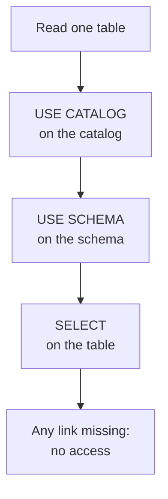
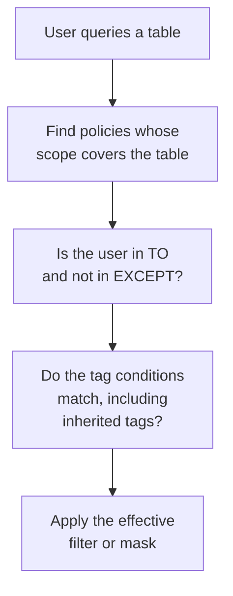

# Domain 7 — Governance and Security

This domain is 15% of the exam. It asks who can reach a piece of data, what they see when they do,
and what happens to the files underneath when somebody deletes the table. Almost every question
turns on a boundary rather than a feature: managed against external, granting against denying,
owning against managing, one table against a whole catalog.

The sections keep the guide's own order, because for once it is the order the decisions happen in.
You choose what kind of table you are creating, then who can reach it, then what they see inside
it, then how to express that rule once instead of a thousand times. One warning before you start:
this domain contains a control the exam names and the product does not support, and the section on
it is the single highest-value paragraph on this page.

---

## What this domain actually asks

Three habits carry most of the marks.

**Ask what happens to the files, not just to the table.** Half of 7.1 is the difference between
removing a row from a catalogue and deleting data in cloud object storage. The answer depends on
the table type and on which metastore it is registered in, and there are four combinations.

**Count the privileges, all the way up.** Reading one table needs three grants, not one. A
question that offers `GRANT SELECT` on its own is offering an incomplete answer, and it is the
most common wrong option in the objective.

**Separate the thing that restricts from the thing that grants.** Row filters, column masks and
policies decide what a principal sees *after* they already have access. None of them gives access,
and none of them substitutes for a grant.

---

## Managed and external tables

**Unity Catalog managed tables are the default and the recommendation, for Delta Lake and Apache
Iceberg alike.** Unity Catalog manages the storage, the layout and the optimisation, and the data
files live inside the catalog or schema that contains the table. External tables point at files
you placed in cloud object storage yourself, inside the current external location.

The reason to reach for external is narrower than most people assume, and it is not performance.

| | Managed table | External table |
|---|---|---|
| Who owns the layout | Unity Catalog | You do |
| Best for | Almost everything | Existing data, or non-Databricks readers |
| Formats | Delta Lake and Apache Iceberg | `DELTA`, `CSV`, `JSON`, `AVRO`, `PARQUET`, `ORC`, `TEXT` |

Databricks documents **two** reasons to choose external. The first is registering a table over
data that already exists in a format managed tables do not support, such as JSON or Avro. The
second is needing direct access from clients outside Databricks that cannot use the other external
access patterns. That second
reason carries a warning worth memorising — **Unity Catalog privileges are not enforced when users
reach data files from external systems**. Governance stops at the boundary of the platform.

Managed tables pay for themselves in features that simply do not exist for the other kinds:
catalog commits, predictive optimization, multi-statement transactions, automatic
Liquid Clustering, and metadata caching. Two of those are the whole of another domain's
optimisation story, which is why "we need predictive optimization on this table" is only ever
answered by a managed table. They also cost less to store and query, and they do not trap your
data: managed tables support access from both Delta Lake and Apache Iceberg clients, so
interoperability is an argument **for** managed rather than against it.

Creating an external table needs more than creating a managed one. You need `CREATE EXTERNAL
TABLE` on an external location that grants access to the path, plus `USE CATALOG` on the parent
catalog, `USE SCHEMA` on the parent schema, and `CREATE TABLE` on the schema. The external
location has to exist first, granting access to the cloud storage path the table will use.

Two storage cautions. Where an S3 external location is shared by more than one metastore, avoid
granting write access to tables that use it. And table paths for external tables must contain only
standard American Standard Code for Information Interchange (ASCII) characters: letters, digits
and a small set of punctuation. That is the kind of constraint that surfaces as an unexplained
failure rather than a clear error.

> **Trap.** External does not mean ungoverned. An external table is still a Unity Catalog
> securable with owners and grants; what is unenforced is access that bypasses Databricks
> altogether. And if the files change underneath through a path-based or non-Databricks client,
> the table metadata does not update itself.

---

## What DROP actually does

**Dropping a table does not reliably delete data, and it does not reliably preserve it either.**
There are **four combinations** and the exam knows all four.

| Table type and metastore | Metadata | Underlying data |
|---|---|---|
| Managed, Unity Catalog | Removed | Marked for deletion, undroppable for 7 days by default |
| Managed, Hive metastore | Removed | **Deleted outright, no recovery** |
| External, Unity Catalog | Removed | Remains; access governed by the external location |
| External, Hive metastore | Removed | Remains |

The recovery window on a Unity Catalog managed table is the detail people miss. The data is marked
for deletion rather than destroyed, and the table can be undropped within the configured period,
which **defaults to seven days**; setting that period with `RETAIN DROPPED` is Public Preview, so
answer on the default. Automatic file deletion after `DROP TABLE` is unique to Unity Catalog
managed tables — no other combination in the table above cleans up after itself.

The recovery window is what makes the second row dangerous rather than merely different. A managed
table in Unity Catalog can be undropped; the same table registered to the legacy Hive metastore
cannot, and **the difference is invisible from the command you typed**. Confirming which metastore a
table belongs to is therefore part of the operation, not a preliminary to it.

Where the intent really is to remove the table from the metastore, `DROP TABLE` is the documented
command. Its behaviour differs by table type **and** by metastore, which is exactly why the four
rows above are worth memorising rather than reasoning about under time pressure.

<details>
<summary><b>Self-check — table types and DROP</b></summary>

1. A managed table in the legacy Hive metastore is dropped by mistake. What is recoverable?
2. Which two situations does Databricks document as reasons to use an external table?
3. Which table type gets predictive optimization?

**Answers.** 1. Nothing — the metadata is removed and the underlying data is deleted, with no
recovery period. 2. Registering a table over existing data in a format managed tables do not
support, and direct access from non-Databricks clients. 3. Unity Catalog managed tables only.
</details>

---

## Converting an external table to managed

**`ALTER TABLE ... SET MANAGED` converts in place, and in place is the point.** The table keeps its
identity, so **grants, ownership and downstream references survive**; nothing is recreated. Databricks
prefers it to `CREATE TABLE AS SELECT`, which also works but copies the data into a new table and
leaves you to reapply everything attached to the old one.

The syntax differs by source, and using the wrong form fails rather than guessing:

```sql
-- external table: no MOVE, no COPY
ALTER TABLE main.sales.orders SET MANAGED;

-- roll back within 14 days
ALTER TABLE main.sales.orders UNSET MANAGED;
```

Adding `MOVE` or `COPY` to an external conversion fails, and omitting both when converting a
foreign table fails as well. Each raises a named error telling you which form to use.

The prerequisites differ by source type, and the permission is the half that catches people.
Both paths need Delta Lake format and Databricks Runtime 17.3 long-term support (LTS) or above
or serverless compute. Converting an **external** table then requires **ownership of the table**.
Converting a **foreign** table requires **owner or `MANAGE`** on it plus `CREATE` on the external
location, and only Hive metastore and Glue federated tables can be converted at all. Readers and
writers of the source table need Databricks Runtime 15.4 LTS or above.

Three windows govern what happens afterwards, and they are different numbers for different things:

| Window | What it covers |
|---|---|
| 14 days | You can roll back with `UNSET MANAGED` |
| After 14 days | Retained external data is deleted automatically, with predictive optimization on |
| 7 days after a rollback | The data in the managed location is deleted |

Rolling back points the metadata at the original external location again, and **writes made to the
managed location after conversion are preserved**. Path-based reads and writes are redirected
automatically once converted, so legacy code keeps working.

One caveat on history. If you roll back within the 14 days, time travel to commits from before the
conversion may not be available, so a rollback is not perfectly free. And `SET MANAGED` is the
recommended route rather than the only one: `CREATE TABLE AS SELECT` also produces a managed table,
but it creates a **new** table, which means new grants, new ownership and every downstream
reference repointed by hand.

> **Trap.** A converted managed table cannot be dropped like any other. Run `UNSET MANAGED` first,
> because dropping it directly takes the data with it. And do not use `DESCRIBE EXTENDED` to verify
> a foreign table conversion or rollback — confirm the source type in Catalog Explorer or with
> `DESCRIBE EXTENDED` **before** you convert, not after.

---

## The hierarchy, and the three-privilege rule

**Access in Unity Catalog is granted on securable objects arranged in a hierarchy, and privileges
inherit downward.** A metastore is the top-level container. Catalogs sit inside it and schemas
inside those; tables, views, volumes and functions are the non-container objects at the bottom. A
privilege granted on a container applies to every current and future child.

That inheritance is what makes the most common mistake in this domain a mistake. `USE CATALOG` and
`USE SCHEMA` are *usage* privileges, and a usage privilege is a **prerequisite** for interacting with
anything beneath it. So reading one table is three grants:



Writing swaps `SELECT` for `MODIFY`. Creating a schema needs `USE CATALOG` plus `CREATE SCHEMA` on
the catalog; creating a table needs `USE CATALOG`, `USE SCHEMA` and `CREATE TABLE`.

`ALL PRIVILEGES` is a convenience that expands to every applicable privilege for the object type,
so it does not have to be updated as new privileges appear. It is **not literally everything**: it
excludes `EXTERNAL USE SCHEMA`, `EXTERNAL USE LOCATION`, `MANAGE` and `READ METADATA`.

`BROWSE` is the discovery privilege — it lets a user find objects and see their metadata without
granting any access to the data itself. It is the answer whenever a scenario wants people to know
a dataset exists without being able to read it.

Two boundaries at the top of the hierarchy. Initially, users have no access to data in a metastore
at all; access begins when an account admin, a workspace admin or an owner grants it. And the
`samples` catalog is a fixed exception — modifying access to it is not supported, because it is
provided to every workspace rather than owned by yours.

> **Trap.** New users are not locked out by default in every case. Where a workspace was enabled
> for Unity Catalog automatically, all workspace users receive `USE CATALOG` on the workspace
> catalog, plus `USE SCHEMA`, `CREATE TABLE`, `CREATE VOLUME`, `CREATE MODEL`, `CREATE FUNCTION`
> and `CREATE MATERIALIZED VIEW` on its default schema.

---

## Who can grant, and who owns

**Ownership and MANAGE are close relatives, and the exam pulls them apart.** Every securable has
**exactly one owner**, which may be a user, a service principal or a group. Owners have all
capabilities on the object, though Databricks does not literally assign them `ALL PRIVILEGES`.

| | Ownership | MANAGE |
|---|---|---|
| How many principals | Exactly one | Any number |
| Data access by default | All capabilities | No — grant it explicitly |
| Inherits to children | No, but owners can manage children | Yes, on a container |

The practical difference is that a user with `MANAGE` can grant and revoke privileges on the object
without holding those privileges themselves — they can, however, explicitly grant themselves
`SELECT`. `MANAGE` also carries reduced usage requirements: `MANAGE` on a catalog needs no usage
privilege at all, and on a schema it needs `USE CATALOG` on the parent but not `USE SCHEMA`. That
reduction applies **only to metadata capabilities**; `SELECT` and `MODIFY` still need the usual usage
privileges even for a user holding `MANAGE`.

Privileges can be granted by the object's owner, by the owner of the containing catalog or schema,
by a user with `MANAGE` on the object, and by a metastore admin. Account admins can grant directly
on a metastore.

`MANAGE` is a composite privilege with `READ METADATA` as its child, granting read-only visibility
into an object's metadata without the ability to modify it. Composite and child privileges move
independently in both directions: granting `MANAGE` does not grant `READ METADATA`, and revoking
`MANAGE` does not revoke a `READ METADATA` that was granted explicitly.

Three syntax details are examinable. `GRANT` and `REVOKE` name the privilege, the securable type
and name, and the principal. A `REVOKE` **succeeds even when the privilege was never granted**, so it
is safe to run defensively. And a service principal is named by its **`applicationId`**, not by its
display name. Registered models are a type of function, so a grant on a model is `GRANT ... ON
FUNCTION`.

Privileges can be managed through SQL, the Databricks CLI, the Databricks user interface (UI) and
the API. In Catalog Explorer you select the object, go to the Permissions tab, and grant from
there — worth knowing because objective 7.2 names the UI first. `SHOW GRANTS` lists them, returning
principal, action type, object type and object key.

Who can *see* those grants is a separate question from who can change them: metastore admins, users
holding `READ METADATA` or `MANAGE` on the object, and the object's owner. And note what `SHOW
GRANTS` does not show — an owner's capabilities are not stored as grants, so a table's owner may
not appear in its own grant list at all.

Principals come in three kinds — users, groups, and service principals — and a group can own an
object just as a user can.

<details>
<summary><b>Self-check — privileges and ownership</b></summary>

1. An analyst has `SELECT` on a table and still cannot read it. What is missing?
2. You revoke `MANAGE` from a user who was also granted `READ METADATA` directly. What do they keep?
3. How is a service principal identified in a `GRANT`?

**Answers.** 1. `USE CATALOG` on the catalog and `USE SCHEMA` on the schema — reading needs all
three. 2. `READ METADATA`, because child privileges granted explicitly survive the composite being
revoked. 3. By its `applicationId` value, not its display name.
</details>

---

## DENY, and why Unity Catalog does not have it

**Objective 7.2 names `DENY`, and Unity Catalog does not support it.** That sentence is the single
most valuable thing on this page. `DENY` is a real statement in Databricks SQL, it denies a
privilege to a principal, and a denial takes precedence over any grant — but it **applies only to
the `hive_metastore` catalog and its objects**. On Unity Catalog it is not supported at all.

So the way you stop a group reading a table in Unity Catalog is to **not grant it, or to revoke
what was granted**. There is no negative grant to reach for. `REVOKE` is the answer to "make sure they
cannot read this", and because a revoke succeeds even when nothing was granted, it is safe to run
without checking first.

Two more places the word appears, and neither rescues the idea. Attribute-based access control
mentions `DENY` policies only inside a limitation note about two identity functions, which is not a
basis for teaching a Unity Catalog `DENY`. And what attribute-based access control actually offers
for exclusion is the `EXCEPT` clause on a policy, which names principals the policy does not apply
to.

Within `hive_metastore`, the semantics explain why the feature reads as attractive. Denying a
privilege on a schema implicitly denies it on every object in that schema, and you undo a denial
by revoking the same privilege.

> **Trap.** "Use `DENY` to block the group" will appear as an option, and it will look like the
> decisive answer. On Unity Catalog it is not an answer at all.

---

## Row filters and column masks

**These control what a principal sees inside a table they can already read.** **Neither grants
access.** A row filter restricts which rows come back; a column mask changes the values returned for
particular columns. Both are SQL user-defined functions (UDF) attached to the table.

| | Row filter | Column mask |
|---|---|---|
| Attached to | The table | One column |
| Function returns | `BOOLEAN` | The column's type, or castable to it |
| How many | One per table | One per column |
| Applied with | `SET ROW FILTER` | `SET MASK` |

A row filter's function returns `BOOLEAN`, and rows where it returns `FALSE` or `NULL` are
filtered out. It accepts zero or more input columns — zero is legal, and then the function takes no
parameters. A column mask function is a scalar UDF with at least one parameter, whose first
parameter maps one-to-one with the masked column, and additional columns can be passed with
`USING COLUMNS` so the mask can vary on more than one attribute.

```sql
ALTER TABLE main.hr.staff SET ROW FILTER main.hr.region_filter ON (region);

ALTER TABLE main.hr.staff ALTER COLUMN salary
  SET MASK main.hr.redact_salary;

ALTER TABLE main.hr.staff DROP ROW FILTER;

ALTER TABLE main.hr.staff ALTER COLUMN salary DROP MASK;
```

**Detach before you drop.** Run the `DROP ROW FILTER` form before dropping the function behind it,
or the table is left in an inaccessible state — repaired by dropping the orphaned reference. That
is the same ordering discipline as `UNSET MANAGED` before dropping a converted table. Those are the
only two orderings here that punish getting them wrong.

Masks commonly inspect who is asking, using `session_user()` or `is_account_group_member()`, and a
`CASE` expression to return either the real value or a redacted one.

Both are applied **as soon as the row is fetched from the data source**, before any expressions,
predicates or ordering. That has a consequence worth carrying: a join on a masked column compares
**the masked values, not the underlying ones**. Masking is not a display trick.

Permissions split three ways. Assigning a function that adds a filter or mask needs `EXECUTE` on
the function. Adding or removing one on an existing table requires being **the table owner**, or
holding both `MANAGE` and `SELECT` on it. The `SELECT` half is deliberate. You should not be able to
change what a filter reveals without being able to see the data yourself. Adding one at creation
time requires `CREATE TABLE`. Row filters work in Databricks SQL and Databricks
Runtime 12.2 LTS and above, and can be added when creating or altering a table, a materialized view
or a streaming table.

Two costs to weigh. Databricks recommends keeping these functions simple, because a filter or mask
runs for every row fetched and a complicated one is paid for on every query. And where the same
rule has to hold across many tables, table-level controls are the wrong unit entirely — that is the
case attribute-based policies exist for.

A third mechanism sits alongside both. Dynamic views wrap one or more base tables in a view that
filters rows or masks columns in its own definition, and they suit sharing a curated or transformed
version of the data rather than protecting the base table in place.

> **Trap.** You cannot drop the function while a table still uses it. Run `ALTER TABLE ... DROP ROW
> FILTER` first, then drop the function. And you cannot layer several filters or masks on the same
> target to build up a rule — it is one filter per table and one mask per column.

<details>
<summary><b>Self-check — filters and masks</b></summary>

1. What does a row filter function return, and what happens to a row when it returns `NULL`?
2. Who is allowed to add a row filter to an existing table?
3. Why does Databricks recommend simple functions here?

**Answers.** 1. `BOOLEAN`; rows returning `FALSE` or `NULL` are filtered out. 2. The table owner,
or someone holding **both** `MANAGE` and `SELECT` — `MANAGE` on its own is not sufficient. 3. The
function runs as every row is fetched, so its cost is paid on every query against the table.
</details>

---

## Attribute-based access control

**Attribute-based access control (ABAC) applies a rule to everything carrying a tag, instead of to
each object by name.** A policy is attached at a catalog, schema or table, and it matches tables
and columns dynamically through their governed tags. Write the rule once and **every table that later
acquires the tag is covered**, including tables that did not exist when you wrote it.

The attributes are **governed tags** — key-value pairs defined at the account level, which is why
the same taxonomy works across workspaces. Securables inherit tags from their parent catalog or
schema by default. Policy conditions reference them with functions such as `has_tag()`.

```sql
CREATE POLICY mask_pii_for_hr
ON CATALOG main
COLUMN MASK main.hr.redact
TO `account users` EXCEPT `HR admins`
FOR TABLES
WHEN has_tag('HR')
MATCH COLUMNS has_tag('PII') AS pii_col
ON COLUMN pii_col;
```

Read that policy as five decisions: what it does, who it applies to, who is excluded, which tables
it matches, and which columns within them. Evaluation then runs in order:



Because evaluation depends on who is asking and on the tags in place at that moment, **two users
can run the same query and get different results**, and that is correct behaviour rather than a
fault.

Inheritance is part of the model rather than a convenience. A securable inherits tags from its
parent catalog or schema by default, and an inherited tag can be overridden further down — so the
**tag a policy matches on may never have been set on the table itself**. That is what makes a policy
written today cover a table created next month.

Two limits are heavily examinable. ABAC is **fail-closed**: where Databricks cannot verify that a
policy can be enforced, it denies access rather than returning unprotected data. And enforcement
depends on compute. Policies need Databricks Runtime 16.4 or above or serverless compute, and
standard or dedicated compute on earlier runtimes **cannot access ABAC-secured tables at all**. On
dedicated access mode, Databricks delegates enforcement to serverless compute to guarantee it.
Operations that cannot be made safe, such as some time travel and cloning paths, fail rather than
bypass the control.

Those two facts answer the same tempting question in opposite directions to the one people expect.
A user whose compute is too old does not quietly see unprotected data; they cannot reach the table.
An operation a policy blocks is not something an administrator can simply run instead. And a table
owner cannot work around a policy attached above them, which is the whole point of attaching it
there.

Note also that the policy interface in Catalog Explorer does not support the identity-attribute
functions, so those policies have to be written in SQL. Personally identifiable information (PII)
tagging is the usual worked example, and the point of it is that a new table tagged tomorrow is
covered by yesterday's policy.

---

## When ABAC and table-level controls collide

**A table or column can be protected by a table-level control or by a policy, not by both.** That
is the rule the objective is really testing, because the two mechanisms look complementary and are
not.

| | Table-level filter or mask | ABAC policy |
|---|---|---|
| Attached at | One table or column | Catalog, schema or table |
| Matches by | Name | Governed tags, dynamically |
| Managed by | The table owner | Higher-level administrators |

Multiple ABAC policies can coexist on the same table or column **only if they produce the same
effective filter or mask**. Where Databricks detects two distinct ones, it does **not** pick the
stricter — it fails. Diagnose that with `SHOW EFFECTIVE POLICIES`, which lists everything applying
to an object.

Use table-level controls for logic specific to one table. Use policies where the same rule has to
hold across many tables, and where authorship needs to sit with a governance team rather than with
whoever owns each table. That separation of duties is the documented reason to prefer them: a
**policy author does not have to own the tables the policy protects**.

Row filters and column masks can also be added to materialized views and streaming tables, not only
to ordinary tables, which widens the surface the two mechanisms compete over.

One boundary closes the domain, and it is the same one it opened with. Neither policies nor
table-level controls grant access to anything. A principal still needs the three privileges from
the hierarchy before a filter or mask is ever consulted.

<details>
<summary><b>Self-check — choosing the mechanism</b></summary>

1. A governance team must apply one masking rule to every table tagged for personal data across a
   catalog, including tables not yet created. Which mechanism, and why not the other?
2. Can a table owner remove protection applied by a policy attached at the catalog?
3. Where do governed tags get defined?

**Answers.** 1. An ABAC policy — it matches by tag dynamically, so future tables are covered, and a
table-level control would have to be applied to each table by name. 2. No; that separation is the
reason the policy is attached above the table. 3. At the account level, which is why one taxonomy
serves every workspace.
</details>

<details>
<summary><b>Self-check — masks, filters and policies</b></summary>

1. Two ABAC policies apply different masks to the same column. What happens?
2. A user on Databricks Runtime 15.4 queries an ABAC-protected table. What do they see?
3. Why can a masked column change the result of a join?

**Answers.** 1. Databricks fails rather than choosing the stricter one; `SHOW EFFECTIVE POLICIES`
diagnoses it. 2. Nothing — earlier runtimes cannot access ABAC-secured tables, and the model is
fail-closed. 3. The mask is applied as the row is fetched, before predicates and joins, so the
comparison uses masked values.
</details>

---

## Traps worth carrying into the exam

| The belief | What is actually true |
|---|---|
| Use `DENY` to block a group in Unity Catalog | Unsupported; it applies only to `hive_metastore` |
| `REVOKE` fails if nothing was granted | It succeeds either way, so it is safe to run |
| `GRANT SELECT` is enough to read a table | Three privileges: `USE CATALOG`, `USE SCHEMA`, `SELECT` |
| `ALL PRIVILEGES` means everything | It excludes `MANAGE`, `READ METADATA` and the external-use pair |
| Owning a catalog means owning everything in it | Ownership does not inherit downward |
| `MANAGE` exempts you from usage privileges | Only for metadata; data access still needs them |
| Revoking `MANAGE` removes what came with it | An explicitly granted child privilege survives |
| Dropping a table deletes the data | Four different outcomes by table type and metastore |
| An external table is outside governance | It is governed; only external-system access is unenforced |
| A column mask only changes the display | It applies before joins and predicates |
| You can layer filters or masks | One filter per table, one mask per column |
| Drop the function when the rule is retired | Detach the control first, or the table is unusable |
| The stricter of two policies wins | Distinct policies on one column fail instead |
| ABAC is about user attributes | It is about object attributes — governed tags |
| A service principal is granted by display name | By its `applicationId` |

<details>
<summary><b>Self-check — the whole domain</b></summary>

1. Name the only metastore where `DENY` does anything.
2. Which two windows follow a conversion to managed, and what does each cover?
3. What does a policy grant?

**Answers.** 1. `hive_metastore`; Unity Catalog does not support it. 2. Fourteen days to roll back
with `UNSET MANAGED`, and seven days after a rollback before the managed-location data is deleted.
3. Nothing — no policy or table-level control grants access; they only restrict what an already
authorised principal sees.
</details>
