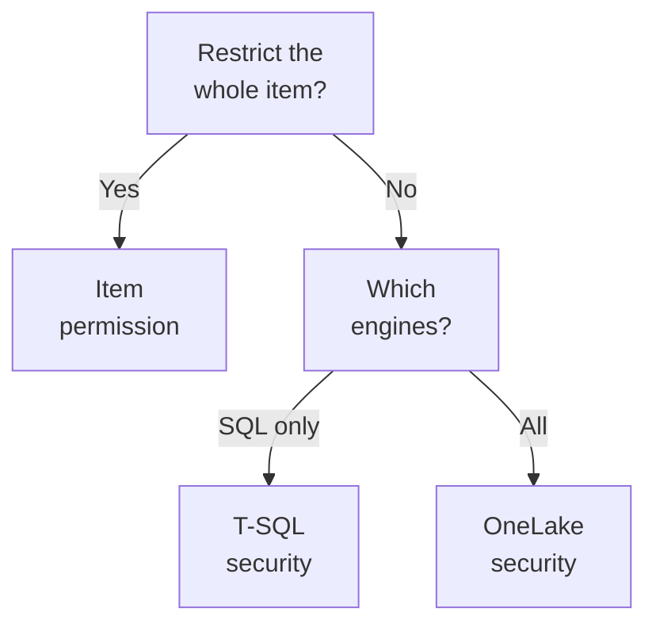

# Domain 1 — Maintain a data analytics solution

Microsoft publishes this skill area at 25–30 percent of the exam. It covers two things that look unrelated and are not: who can reach your data, and how a change reaches production safely.

Most of the exam's governance vocabulary lives here. If a term in another domain confuses you — endorsement, a sensitivity label, a workspace role — this is where it was defined. It is also the domain where candidates report the questions feel clearest, because the boundaries are crisp once you know them. That makes it the cheapest place on the exam to pick up marks.

---

## What this domain actually asks

The first objective is security and governance. The second is the analytics development lifecycle.

Both reward the same habit: knowing which mechanism owns a problem. Fabric gives you several controls that all sound like access control and several that all sound like deployment. The exam is almost always asking you to pick the right one rather than to configure it, and the wrong options are usually things that would work in some other scenario.

Two boundaries decide most questions.

The first is that a workspace role is scoped to one workspace. It does not reach another workspace, the capacity the workspace runs on, or the tenant. Grant somebody Admin here and you have changed nothing anywhere else. That sounds obvious written down, and it is still the assumption a badly-read stem will punish.

The second is that version control and deployment are different tools. Git integration gives you history, branches and rollback, and it is configured for a workspace. Deployment pipelines move content between stages so it can be tested before users see it. A requirement mentioning branches, review or a rollback wants the first. A requirement mentioning development, test and production wants the second. Candidates blur these constantly, and the exam knows it.

Keep both boundaries in mind as you read. Almost everything below is a refinement of one or the other.

---

## Access is four layers, not one

The single most useful thing you can carry into this exam is that access in Fabric is layered, and the layers are independent of each other.

| Layer | What it controls | Where you set it | Who it bites |
|---|---|---|---|
| Workspace role | Every item in one workspace | Workspace access | Everyone |
| Item permission | One item | Sharing that item | Anyone without a role |
| Compute permission | Queries through one engine | Endpoint or semantic model | Mainly viewers |
| OneLake security | The data itself, any engine | Roles on the item | Mainly viewers |

There are four workspace roles and they apply to every item in the workspace. A user holding none of them cannot access the workspace at all. That is workspace-level access control, and it is the blunt instrument: it is how you give a team standing access to everything they work on.

Item permissions are the fine instrument. They are confined to a single item, and they exist so you can give somebody access to one thing inside a workspace they otherwise cannot enter. When a stem says *one report*, *one warehouse* or *an external reviewer*, it is describing item-level access control, and a workspace role would be the disproportionate answer.

Now the part that costs people marks. **Sharing an item grants Read by default, and Read is not data access.** It lets the recipient see the item's metadata and open reports built on it. It does not let them reach the underlying data in SQL or OneLake. Microsoft gives its own worked example: share a Power BI report that uses Direct Lake mode, and the recipient can view the report but still needs OneLake data permissions before they can query the Delta tables directly.

That gap is why the third and fourth layers exist.

Compute permissions are set inside an engine — the SQL analytics endpoint, or a semantic model — and they are what provide granular controls such as table-level and row-level security. The catch is that each is scoped to its own engine. Permissions on the SQL analytics endpoint apply only to queries made through SQL. Security defined on a semantic model is written in Data Analysis Expressions (DAX) and restricts people querying through that model or through reports built on it. Neither has any effect on somebody reading the same files by another route.

OneLake security is the layer underneath all of them. It governs the data wherever it is read from, it is deny-by-default, and a user has no access until a role explicitly grants it. Some items ship with a default role so that newly created content is usable. A lakehouse gets one that lets users with read-all permission see its data. Those default roles apply only to viewers, because Admin, Member and Contributor already hold elevated access — which means the default role is the mechanism by which a viewer *can* get data, not a guarantee that any viewer already has it.

So when a requirement arrives, the question is which layer owns it:

The tree is deliberately shallow. In practice you are choosing between giving somebody a whole item, filtering what one engine returns, or filtering the data itself for every engine at once. Almost every access question on this exam is one of those three, and the second question — which engines must obey the rule — is the one candidates skip.

<b>Self-check.</b> A colleague shares a Direct Lake report with a contractor, who can open it but sees an error where the data should be. What happened?

The contractor has the item permission and not the data permission. Sharing granted Read on the report, which shows metadata and lets them open it. Querying the underlying Delta tables needs OneLake data permissions as well. Add the contractor to a OneLake security role on the lakehouse. Do not raise their workspace role — that would grant far more than the requirement asked for, and disproportionate answers are usually the distractor.

---

## Inside a OneLake security role

A OneLake security role is a small four-part object, and most questions about one are really asking which part is doing the work.

| Part | What it holds |
|---|---|
| Scope | The tables, folders or schemas the role grants |
| Permission | Read, or Read together with ReadWrite |
| Row and column rules | Filters on tables inside that scope |
| Members | Users, or a Microsoft Entra group |

Read is the permission that carries the weight, and Microsoft gives an equivalence for anyone who already knows T-SQL: it grants the ability to read a table's data and to view table and column metadata, which is `VIEW_DEFINITION` and `SELECT` together. ReadWrite adds writing, but only for people whose access came from holding Read on the item — viewers, in practice. Assign ReadWrite to an Admin, a Member or a Contributor and nothing at all changes, because those roles already write. A configuration that provably does nothing is a favourite wrong answer, because it looks decisive.

Writing carries one more asymmetry worth remembering. Reads are enforced consistently by every engine that queries the data, while writes go through OneLake alone, because Fabric supports single-engine writes. So "the team can also write to the table through the warehouse" is wrong however the role is configured.

Two further rules settle most role questions. A role that grants ReadWrite cannot also carry row-level or column-level rules, so a requirement for filtered write access needs two roles rather than one. And assigning a Microsoft Entra group to a role grants that role to every member of the group, which is the maintainable answer whenever people arrive and leave in numbers.

Be precise about what "two roles" buys you, because this is where a plausible answer goes wrong. OneLake resolves each role on its own and then combines them as a union — the least-restrictive model — so access granted by any role becomes part of the effective role. Two roles scoped to two different tables therefore work: the write grant lands on one table and the filter on the other, and neither reaches the other's data. Two roles on the *same* table do not work, because the unfiltered write grant unions with the filtered read and the filter stops meaning anything. Microsoft is direct about the general form of this: keep rules that must apply together in the same role. So when a stem wants filtered writes on one table for one group, the honest answer is that no role arrangement delivers it, and the requirement has to move somewhere else in the stack.

**Default roles** are ordinary roles that Fabric creates automatically with every new item, so new content is usable before anyone configures anything — a lakehouse gets a `DefaultReader` that lets users holding the read-all permission see its data. Their membership is virtualized: the members are whoever currently holds the required permission rather than a list you edit. That is why you cannot take one person out of a default role. You change that person's workspace permission, or you modify or remove the role itself.

Folders run in two directions and only one of them is obvious. Permissions inherit downward, so a grant on a folder covers the files and subfolders beneath it. Upward, somebody with permission on one file may list and traverse the folders above it in order to reach it — but traversal grants nothing over the siblings sitting in those folders. Seeing that a folder exists is not being able to open what is inside it.

One last rule catches people out. A folder under Tables counts as a table only when it looks like one. Put a row or column rule on a folder that does not qualify and OneLake denies access outright; leave the rule off and the same folder is treated as a folder, governed by folder-level security.

<b>Self-check.</b> A group needs write access to a staging table and a regional row filter on a reference table, both in the same lakehouse. A colleague writes one role granting ReadWrite with the filter attached. What is wrong, and what should they do?

A role that grants ReadWrite cannot carry row-level or column-level rules, so that definition cannot stand. Split it: one role scoped to the staging table with ReadWrite, and a second role scoped to the reference table carrying the filter. Note also that the write itself will go through OneLake and not through the warehouse, whatever the role says.

---

## Where to put the boundary: rows, columns, objects and files

One objective bullet names row-level, column-level, object-level and file-level access control in a single line. Those four granularities live in three different engines, and the engine decides the answer far more often than the granularity does.

| Control | What it hides | Where it is defined | What it binds |
|---|---|---|---|
| Row-level security | Rows | T-SQL policy, or model roles | Warehouse queries, or the model |
| Column-level security | Column values | T-SQL | Warehouse and endpoint queries |
| Object-level security | The object's existence | Model roles | Semantic model queries |
| OneLake security | Tables, folders, rows, columns | Roles on the item | Every engine |

In a warehouse, row-level security is implemented with the `CREATE SECURITY POLICY` statement and predicates written as inline table-valued functions. The restriction logic sits in the database tier rather than in an application, so it applies every time data is accessed, from any application or reporting platform including Power BI. Column-level security works the same way for columns, and the two are worth learning as one rule with two subjects.

But read the limit carefully. Row-level security applies only to queries on a Warehouse or SQL analytics endpoint. It is database-tier enforcement within that engine, not across the whole platform. If somebody reads the same Delta files from a notebook, a T-SQL policy has no opinion about it. That is what OneLake security is for, and it is the single most common reason a security answer that looks right is wrong.

On a semantic model, row-level security is filters defined inside roles using DAX. **It restricts viewers only.** Microsoft states plainly that it does not apply to workspace Admin, Member or Contributor roles. This is why an administrator investigating a complaint cannot reproduce the filtered view from their own account, and it is why the Test as role feature exists. The workflow is worth memorising as four steps: define roles and rules in Power BI Desktop, publish, add members to the roles in the service, then validate with Test as role. Rules are authored in one place and membership is assigned in another.

Object-level security is the one worth knowing precisely, because it is stronger than it sounds. It secures tables or columns from report viewers and also restricts object names and metadata, so that for a viewer without permission it is as if the object does not exist. Column-level security does not promise that: Microsoft says outright that it does not guarantee a table's metadata is inaccessible, and that certain error messages might still show column names. If a requirement is that nobody may learn a column exists, only object-level security delivers it. Both object-level and row-level security are defined inside model roles, which is why one role can carry both.

Two rules about OneLake security are worth memorising because they are absolute. **There are no deny roles.** OneLake security supports only grant roles, and to restrict access you remove or narrow the grant rather than adding a rule that takes it away. Anyone arriving from file-system permissions or database roles expects a deny to exist, and it does not. And a role granting write access cannot also carry row or column filters — the two are mutually exclusive within one role, so a requirement for filtered write access cannot be met with a single OneLake role.

One cross-domain fact you will meet again in the semantic models domain: a Power BI query against a warehouse in Direct Lake mode falls back to DirectQuery mode in order to honour row-level security, and the same is true for column-level security. Security wins and performance gives way. Fallback is never a security hole.

<b>Self-check.</b> Analysts must not see the salary column, and must not be able to tell that a salary column exists. Which control?

Object-level security on the semantic model. It restricts object names and metadata, so the column is invisible rather than merely unreadable. Column-level security would block the values, but Microsoft does not guarantee the metadata is hidden and error messages can still surface column names. Had the requirement been only that analysts cannot read the values, column-level security would have been enough — and on a warehouse it would have been the cheaper answer.

---

## Workspace roles, and the two rules people get wrong

The four roles form a ladder. A Viewer can view all content but cannot modify it. A Contributor can view and modify. A Member adds sharing. An Admin adds managing, including managing permissions.

| Role | View | Modify | Share and manage |
|---|---|---|---|
| Viewer | Yes | No | No |
| Contributor | Yes | Yes | No |
| Member | Yes | Yes | Share |
| Admin | Yes | Yes | Share and manage permissions |

Two rules break the tidy picture, and both are examinable.

**Highest permission wins.** If somebody belongs to several groups, they get the highest level of permission any of their roles provides, and users inside nested groups inherit the role given to the parent group. This is the opposite of the most-restrictive-wins instinct people bring from file systems. Removing somebody's access means auditing every group they belong to, and there is no deny rule to fall back on.

**Reshare breaks the Member-only story.** Contributors and Viewers can also share items if they have been granted Reshare permission. So a stem offering "grant Member" and "grant Reshare" is asking whether you know the second exists. Reshare is the smaller change and usually the better answer, because it grants exactly the capability the requirement named and nothing else.

Roles can be assigned to individuals, to security groups, to Microsoft 365 groups and distribution lists, and to service principals, which inherit the same permissions as users for programmatic operations. Group-based assignment is the maintainable answer in any onboarding or offboarding scenario, and it is usually the keyed one. The service principal case matters for the lifecycle objective too: automation that deploys or commits on your behalf needs a role like any other identity.

One qualifier on "a Viewer cannot read the data", because you can open two Microsoft pages during the exam and read them as though they disagree. Item Read is not data access — that rule holds and it is the one to answer from. But access through the SQL analytics endpoint additionally depends on the endpoint's mode, and depending on that mode a user may need SQL permissions or the ReadData item permission on top of Read. The workspace capability table reflects that by ticking Viewer for reads over T-SQL, while the OneLake and Spark path stays closed to them. So read the path the stem names. "Cannot open the report's underlying Delta files through OneLake or Spark" is a Viewer. "Cannot run any query against the tables at all" is not a workspace role question, and the answer lives in the endpoint's mode or in SQL permissions.

Workspaces sit on top of OneLake and divide the data lake into separately securable containers. That is the reason the workspace is a security boundary rather than an organisational folder, and it is worth saying to yourself once: the workspace is not a folder.

A last note on scope, because it catches people who reason from other platforms. A role here says nothing about the capacity the workspace runs on. Capacity governs how much compute the workspace can consume, not who may open what, and the two are administered separately. If a stem mixes a permissions requirement with a capacity symptom, they are almost certainly two different problems wearing one scenario.

---

## Telling people what to trust

Two mechanisms label items, and neither changes who can open them. Getting that straight is worth a mark or two on its own.

A sensitivity label comes from Microsoft Purview Information Protection and exists to guard content against unauthorised access and leakage. Labels are defined in Purview and applied in Fabric — so "create a new sensitivity label in Fabric" is always wrong. If the label a user needs is greyed out in the menu, Microsoft's explanation is that they may not have permission to use that label, which points at Purview configuration rather than at anything in the workspace.

Sensitivity labels travel. Downstream inheritance means a label applied to a semantic model or report flows to content built from it: for a semantic model, to other semantic models, reports and dashboards; for a report, to dashboards. **It flows downstream only.** Labelling a report does nothing to the model it came from, which is why the model is usually the right place to apply the label. Downstream inheritance sits alongside several other propagation mechanisms — inheritance from data sources, inheritance upon update and relationship changes, inheritance upon creation of new content, and inheritance upon export to file. Any of those makes a plausible wrong answer when the stem is really about downstream inheritance, so read which direction the data is moving.

Endorsement is the other mechanism, and it is a recommendation rather than a protection. Endorsed items carry a badge and in some lists are given precedence and listed first. There are three badges, not two, and material written before the third arrived will tell you otherwise.

| Badge | What it means | Who can apply it |
|---|---|---|
| Promoted | The creators think it is ready for reuse | Anyone with write permission on the item |
| Certified | An authorised reviewer judged it reliable | Only users a Fabric administrator specifies |
| Master data | The single source of truth for a data category | Only users the administrator specifies |

Promoted and Certified work on any Fabric or Power BI item except Power BI dashboards. Master data is narrower still: it can only be applied to items that contain data, such as a lakehouse or a semantic model. A report can be Certified and can never be Master data.

The separation between requesting and granting is the detail to hold. Any user can request certification, but only users a Fabric administrator has specified can actually certify. An item owner can promote their own work; they cannot certify it. That separation is the whole point of the badge — somebody other than the author vouched for it.

| Question | Sensitivity label | Endorsement badge |
|---|---|---|
| What is it for | Protection | Recommendation |
| Where is it defined | Microsoft Purview | Fabric |
| Does it change access | No | No |

<b>Self-check.</b> Teams keep building reports on an outdated copy of a semantic model instead of the sanctioned one. What do you do?

Endorse the sanctioned model — Certified if your organisation has authorised reviewers, Promoted if not. The problem is discovery, not permission, so nothing about access needs to change. Applying a sensitivity label would not help, because a label protects content rather than recommending it, and neither mechanism stops anybody opening the old copy. If the old copy must actually become unreachable, that is a permissions question and a different answer.

---

## Version control for a workspace

Git integration connects a workspace to a repository so you can back up and version work, revert to earlier states, and collaborate on branches. The integration is at workspace level, and the workspace structure including its subfolders is preserved in the repository.

Three providers are supported, all cloud-based only: Azure DevOps, GitHub and GitHub Enterprise. A self-hosted server is not supported, and that qualifier is worth remembering because it is easy to key against.

Setting it up needs the organisation's administrator to enable Git integration first. If the workspace and an Azure repository sit in different regions, the tenant administrator must also enable cross-geo export — a restriction that does not apply to GitHub. When the Git controls are missing entirely rather than merely disabled, suspect one of these tenant-level prerequisites rather than the user's role.

Then two permission systems compose, and the more restrictive one wins.

An Admin can perform any Git operation on the workspace, limited only by their role in the repository itself. So a Fabric Admin with read-only access in Azure DevOps still cannot commit, and that is a perfectly good answer to "why can this person not push". Members and Contributors can commit and update once connected, again depending on their repository role. Switching or checking out branches needs more: the workspace setting that allows Contributors to change Git branch must be enabled, and the user must have write access to all items. Connecting or disconnecting the workspace is an Admin action, and Members are told to ask an Admin for it.

A Viewer can do nothing here, and cannot even see Git-related information in the workspace. That matters for a troubleshooting stem: the user is not blocked by an error, the controls are simply absent.

> **Currency note.** From December 1, 2026, users without read-write permissions on workspace items cannot use Git integration at all. The exam answer is unchanged, because a Viewer could never use Git integration anyway and the role table still describes what each role can do. Keep answering role questions from the current table.

What makes version control worth doing is the project format. Saving work as a Power BI Desktop project writes the report and the semantic model into separate folders as human-readable text files, which is what makes a difference meaningful and a code review possible. Those files are publicly documented and are best edited in a code editor rather than a plain text editor. The separate folders also make it straightforward to copy semantic model tables between projects or reuse report pages, which is why the format doubles as a way to build development templates.

> **Currency note.** The Power BI Desktop project format carries a preview notice. The exam answer is unchanged: the guide names the format in this objective, and it permits questions on preview features that are commonly used. When a stem asks for source control over both a report and its semantic model, pick the project format.

<b>Self-check.</b> A workspace Admin connected the workspace to Azure DevOps but cannot commit her changes. Why?

Her Git role, not her Fabric role. An Admin can perform any operation on the workspace limited only by their role in the repository, so read-only access in Azure DevOps stops the commit regardless of what Fabric allows. Two permission systems compose here and the more restrictive one wins. Check her repository permissions — raising her Fabric role would change nothing.

---

## Moving change through stages

Deployment pipelines give content creators a production environment where they can develop and test content in the service before it reaches users. Deploying clones content from one stage to the next — typically development to test, then test to production.

Clone, not move. The content remains in the source stage. During deployment, Fabric copies content to the target stage, keeps the connections between the copied items, and applies the configured deployment rules to the updated content in the target stage. While that runs you can go elsewhere in the portal, but you cannot use the content in the target stage, which is worth knowing for any question about what users experience during a release.

Two facts decide most pipeline questions.

**Deployment rules are defined on the target stage.** Microsoft's own example defines the rule in the production stage, under the appropriate semantic model, and content deployed from test into production then inherits the rule's value. Defining the rule where the content came from is the classic near miss, and it will be sitting in the options looking reasonable.

Rules exist so stages can keep different configurations — a development stage querying sample data while production points at the real database. That is the scenario, almost every time, and it is what makes a pipeline more than a copy button. Without rules, promoting content would carry the development connection into production along with everything else.

**The pipeline's shape is permanent.** The number of stages and their names cannot be changed after the pipeline is created. Only a stage's public status can be changed later. So the answer to "we need a fourth stage" is a new pipeline, not an edit — which makes the initial design decision unusually consequential for something that otherwise looks reconfigurable.

Content reaches a stage in one of two ways: you assign a workspace to it, or you deploy into it from the stage before. Assignment is how a pipeline gets its starting content; deployment is how that content moves onward. A stem describing a team that already has a development workspace and wants to add test and production is describing assignment followed by two deployments.

Deployment can also be driven programmatically through the deployment pipelines programming interface, which is the answer whenever a stem asks for release automation rather than a person clicking Deploy. That matters because the two lifecycle tools overlap here: Git integration gives you the history of what changed, and the pipeline gives you the promotion, and a mature process usually wants both rather than a choice between them.

One practical point about what actually moves. The copy keeps the connections between copied items, so a report that pointed at a semantic model in the source stage points at the corresponding model in the target stage rather than reaching back across the boundary. That behaviour is what makes stage isolation real, and it is worth stating because a plausible distractor will claim the deployed report still queries the development model.

| Property | Fixed at creation | Changeable later |
|---|---|---|
| Number of stages | Yes | No |
| Stage names | Yes | No |
| Public status of a stage | No | Yes |
| Deployment rules | No | Yes, on the target |

| Question | Git integration | Deployment pipelines |
|---|---|---|
| What it gives you | History and branches | Promotion between stages |
| Scope | A workspace | A set of stages |
| Typical trigger word | Rollback, branch, review | Development, test, production |

<b>Self-check.</b> After deploying to production, the semantic model still points at the test database. Where is the mistake?

The deployment rule was almost certainly defined on the test stage rather than the production stage. Rules belong on the stage content is going to, under the item they apply to, and content deployed into that stage then inherits the value. Define the rule in production under that semantic model, then redeploy. Nothing about the source stage needs to change.

---

## Assets other people reuse

The guide names three reusable assets here, and they are three different answers to "how do I stop the next person starting from nothing".

A Power BI template file gives somebody a starting point for a new report: it carries the report pages, visuals and the data model definition including schema, relationships and measures. **It does not carry the data.** That omission is the point, and it is the distinction the exam keys on — a template standardises how something is built without distributing what it contains.

A Power BI data source file goes one step earlier and hands over the *connection* instead. It is a Power BI Desktop file with a defined structure and a `.pbids` extension, made to streamline Get Data for new or beginner report creators. You export one from a report already pointed at the right place, and everyone who opens it lands on that source instead of hunting for a server name. Three properties decide every question about it. It holds **one data source per file**, and a file naming more than one produces an error. It carries **no authentication information and no table or schema information**, so opening one prompts for credentials and then for which tables to load; sharing the file shares a pointer, never a password and never rows. And the connection **mode is optional** — set `DirectQuery` or `Import` in the file and the author gets it, leave it out and the author is asked to choose. Leaving it out is a legal file, not a broken one.

Three extensions, three jobs, and the exam is entitled to ask you which is which. A project is for source control, a template is for a starting layout and model, a data source file is for a starting connection.

A shared semantic model lets several reports sit on one model. Sharing one requires Reshare permission on it, the same permission that lets a Contributor share anything else, which is a neat example of one permission serving two objectives. You can share a semantic model from the OneLake catalog or from its own details page — a useful reminder that the catalog is somewhere you act, not only somewhere you browse.

The XMLA endpoint is how external tools reach a semantic model. The XML for Analysis protocol carries communication between client applications and the Analysis Services engine that runs Power BI's semantic modelling, governance, lifecycle and data management, and data sent over it is fully encrypted. That is why tools built for Analysis Services work against Power BI at all, and it is the bridge for anyone arriving from that world.

The constraint to remember is licensing. The XMLA endpoint belongs to Power BI Premium, Premium Per User and Power BI Embedded workspaces. A workspace on shared capacity has no endpoint for a tool to attach to, so the blocker is capability rather than tooling. Enabling read-write on the endpoint adds semantic model management, governance, advanced modelling, debugging and monitoring, bringing models closer to parity with Analysis Services. Connectivity is read-only by default for the semantic models workload in a capacity, and read-write is something somebody turns on — so "the tool connects but the deployment fails" is usually that setting rather than a licence.

Do not read "Premium, Premium Per User and Power BI Embedded" as ruling out Fabric capacity. Microsoft names Fabric capacity in the same story: a personal workspace can be reached through the endpoint when it is assigned to a Premium Per User, Premium or Fabric capacity. A workspace on a Fabric capacity is not the shared capacity the licensing rule is about. What the rule excludes is a workspace with no capacity behind it at all.

| Asset | What it carries | Reach for it when |
|---|---|---|
| Project format | Report and model as text files | You need source control |
| Template file | Layout, model and queries, no data | Somebody needs a starting point |
| Data source file | One connection, no credentials, no data | Somebody needs to reach the right source |
| Shared semantic model | One model, many reports | Several reports need one truth |

---

## Knowing what your change will break

Before you change an item, impact analysis tells you what depends on it. It shows the workspaces and items that might be affected, and lets you see either only direct children or all affected downstream items and workspaces. It can display them by type or by workspace, and it offers a way to notify the people who own them — it is a communication tool as much as a discovery one, and the notify step is the part candidates forget.

You open it from an item's card in lineage view, or from the Lineage option on the item's details page. Lineage view draws the relationships between items; impact analysis answers the narrower question of what breaks if you change this one.

One exception is worth carrying. **For data sources, impact analysis shows only direct children.** To see further down the chain you run impact analysis again on those direct children. The correct action is to repeat the analysis one level down, not to reach for a different tool, and an option offering a different tool is the distractor.

The objective mentions performing impact analysis of downstream dependencies from lakehouses, warehouses, dataflows and semantic models, so expect any of those four as the starting item in a stem.

It is worth being clear about why this objective sits beside version control and deployment rather than beside security. All three answer the same question from different angles: what happens when something changes. Git integration records what changed, a deployment pipeline controls where the change lands, and impact analysis tells you who it lands on. A team that has the first two and not the third can promote a breaking change perfectly and still surprise half the organisation.

For data sources, impact analysis also shows the connection string used to reach the source, which is a small detail with a practical use — it tells you which environment a dependency is actually pointing at before you change anything.

---

## Traps worth carrying into the exam

**"Viewer means they can read the data."** It means they can see the item. Data access is a separate layer, and Microsoft's own role table answers "can read data in OneLake" with No for a Viewer. You *give* a Viewer data with a OneLake security role — often the default role, which admits whoever holds the matching permission rather than everyone with the Viewer role.

**"Add a rule that denies them access."** There is no such rule. Only grant roles exist, so you remove or narrow the grant instead.

**"Row-level security on the semantic model protects everybody's view."** It restricts viewers only, and does not apply to Admin, Member or Contributor.

**"The owner can certify their own model."** They can promote it. Certification is restricted to users a Fabric administrator has named, and any other user can only request it.

**"The deployment rule goes on the stage the content comes from."** It goes on the stage the content is going to.

**"Endorsing an item restricts who can open it."** It changes discovery, not permission. A badge makes good content easier to find and gives it precedence in some lists, and that is all it does.

**"A sensitivity label applied to the report protects the model it came from."** Inheritance runs downstream only. Label the model if you want the reports built on it to carry the label.

**"Most restrictive permission wins when somebody is in several groups."** The highest wins, and there is no deny rule to reach for.

One habit to finish with, because it is worth more than any single fact here: when a question offers several controls that would all work, pick the one whose scope matches the requirement. One report for one contractor is an item permission, not a workspace role. One column hidden from one group is a security control on the engine they query, not a new workspace. The exam consistently rewards the proportionate answer, and the oversized one is consistently in the options.
