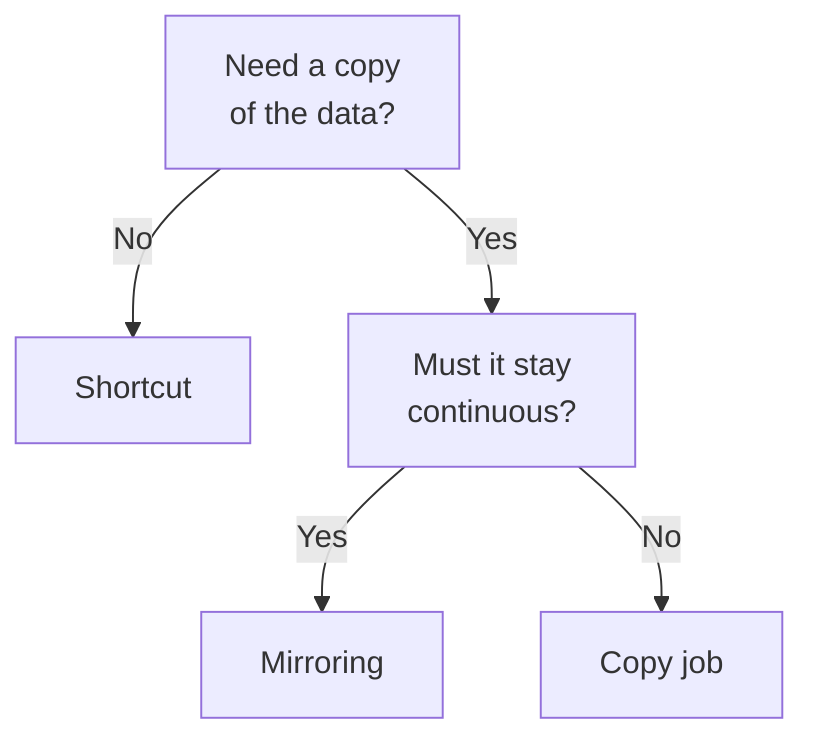

# Domain 2 — Prepare data

Microsoft publishes this skill area at 45–50 percent of the exam. That is close to half the questions, and more than the other two skill areas put together. If you have limited study time, it belongs here.

The domain covers three things in the order the work actually happens: getting data into Fabric, shaping it, and querying it. Eighteen objective sub-bullets sit under those three headings, which is more than any other domain carries.

One scope warning before anything else, because it saves people weeks. **This exam does not test PySpark or notebook authoring.** Those moved to the data engineering exam in November 2024. The languages measured here are Structured Query Language (SQL), Kusto Query Language (KQL) and Data Analysis Expressions (DAX).

---

## What this domain actually asks

Objective one is getting data: creating a data connection, discovering what already exists, bringing data in or reaching it where it sits, choosing a store, and making an eventhouse readable from elsewhere.

Objective two is transforming: views, functions and stored procedures, enrichment, star schemas, denormalizing, aggregating, joining, cleaning and converting data types.

Objective three is querying, in four named surfaces.

Underneath all of it is one fact about Microsoft Fabric worth establishing immediately. **Every Fabric data store is available in OneLake in open table format by default**, and a lakehouse and a warehouse share the same SQL engine. So the choice between stores is a choice about the experience you want and the guarantees you need — not a choice that locks your data anywhere. That is why "land it in a lakehouse with Spark, expose it through a warehouse for reporting" is a supported pattern rather than a migration, and why so many questions in this domain are about fit rather than capability.

---

## Choosing where data lives

Microsoft publishes a decision guide for this, and it routes five ways.

| Store | Reach for it when | Query it with |
|---|---|---|
| Lakehouse | Big data, machine learning, unstructured or semi-structured data | Spark or SQL |
| Warehouse | Enterprise warehousing, SQL-based reporting, full transactions | T-SQL |
| Eventhouse | Streaming events, high-granularity interactive analytics | KQL or SQL |
| SQL database in Fabric | Operational transactional workloads | T-SQL |
| Cosmos DB in Fabric | AI, NoSQL and vector search | Its own interfaces |

> **Currency note.** Until July 2026 this objective named three stores: lakehouse, warehouse or eventhouse. It now says "Choose between different data stores" and names none. The exam answer is unchanged for those three, and two more are now fair game. Read what the requirement actually needs rather than assuming the answer must be one of the original three — a stem mentioning vector search or row-level application writes has an answer outside them.

Most questions, though, are the lakehouse-versus-warehouse decision, and Microsoft names its own two decision points: **the team's available skill set, and whether multi-table transactions are needed.**

| Question | Lakehouse | Warehouse |
|---|---|---|
| Primary development style | Spark | T-SQL |
| Multi-table transactions | No | Yes |
| Data types handled | Structured and unstructured | Structured |
| Who writes to it | Engineers | Anyone with T-SQL |

Take the skill-set point first. A warehouse lets a team interact primarily with T-SQL while still allowing Spark users in the organisation to reach the same data — choosing it does not lock anyone out. A lakehouse suits a team with mixed skills **where the T-SQL users are consumers**, meaning they do not need to write `INSERT`, `UPDATE` or `DELETE` statements. That condition is the hinge. If analysts must modify rows with T-SQL, the lakehouse route is closed and a warehouse is the answer.

Now the transactions point. A warehouse provides data loading and transforms at scale with full multi-table transactional guarantees supplied by the SQL engine. A lakehouse stores data in Delta Lake format, which gives atomicity, consistency, isolation and durability (ACID) transactions, schema enforcement and time travel — but that is per table. Collapsing this into "lakehouses have no transactions" will lose you marks in both directions. The precise difference is multi-table.

Two more properties worth carrying. A warehouse needs no configuration of compute or storage — Microsoft calls it no-knobs performance — so an option asking you to size compute for a warehouse is wrong. And warehouses support cross-database querying, which is what lets a query reach other warehouses and lakehouse Delta tables using three-part names.

From the lakehouse side, the case is breadth rather than guarantees. A lakehouse combines the scalability of a data lake with the querying capability of a warehouse: structured and unstructured data in one location, managed with Delta Lake, analysed with both Apache Spark and SQL. It ingests from many different sources and converts what arrives into a unified Delta format, which is why it is the natural landing zone when the incoming data is messy or varied. And with shortcuts and cross-tenant sharing it can reach governed data held elsewhere without duplicating it at all.

The other three stores are narrower and easier to recognise. An eventhouse is for time-based streaming events and is Microsoft's preferred engine for semistructured and free text analysis — it queries billions of events in seconds. SQL database in Fabric is for operational transactional workloads, which means row-level application writes rather than analytics. Cosmos DB in Fabric is for AI, NoSQL and vector search. Each has a give-away in the stem, and none of them is a lakehouse or a warehouse wearing a different name.

A last structural point about eventhouses, because the vocabulary trips people. An eventhouse is a **container** that can hold several databases, which share capacity and resources and are monitored both together and individually. The KQL database is what sits inside it. Decisions about shared capacity and project grouping are eventhouse decisions; decisions about tables are database decisions.

<b>Self-check.</b> A team of five analysts, all fluent in T-SQL, need to load and correct records in a nightly process where several tables must update together or not at all. Which store?

A warehouse. Two of Microsoft's decision points point the same way: the skill set is T-SQL, and the requirement for several tables to update together is precisely the multi-table transactional guarantee that a warehouse provides and a lakehouse does not. Delta's ACID transactions would cover each table individually, which is not what the requirement asked for.

---

## Copy it, mirror it, or point at it

Having chosen a store, you have to get data to it — and the most common mistake in this objective is assuming that means copying.

Before any of that, though, something has to know how to reach the source, and this is the sub-bullet people skim past. Fabric works with many data sources both on-premises and in the cloud, and each has its own setup requirements. You create the connection itself in one place: **Manage connections and gateways**, reached from the Settings icon in the header. Shortcuts, Copy jobs and dataflows all *consume* a connection; none of them is where you make one, and an option that says otherwise is answering a different question.

What decides the shape of the work is where the source sits. A public cloud endpoint needs the connection and nothing more. A source inside a local network needs an **on-premises data gateway** as well — software you install within that network so it can reach out to the cloud. A source secured by a virtual network needs a **virtual network data gateway** instead, which is a Microsoft managed service and needs no installation at all. Both are gateways and only one of them is something you install, which is exactly the pair a stem will put in front of you.

A shortcut points at data without moving it. Shortcuts unify data across domains, clouds and accounts, letting Fabric engines reach existing sources including Azure, Amazon Web Services and OneLake through one namespace. OneLake manages the permissions and credentials, so each workload does not need configuring separately against each source.

Three properties make shortcuts the right answer when a stem rules out duplication. They eliminate edge copies and reduce the latency copying adds. They stay synchronized with the source, **including automatic schema updates** for shortcut tables. And they appear as folders, so any workload with access to OneLake can use them — which is why a shortcut-backed table is queryable from SQL, Spark and Power BI alike.

Shortcuts behave like symbolic links and are independent objects from their target. Delete the shortcut and the target is untouched. Move, rename or delete the target and the shortcut can break. The damage runs one way only, so a stem about a shortcut that stopped working is pointing at the target, never at the shortcut.

Mirroring is the opposite trade. It continuously replicates an existing data estate into OneLake from Azure databases and external sources, producing an actual replica in Delta format that every Fabric service can query. It is described as low-cost, low-latency and turnkey. Use it when the source is an operational database that must stay current in analytics without anyone building a pipeline.

| Mechanism | Copies the data | Stays current |
|---|---|---|
| Shortcut | No | Yes, automatically |
| Mirroring | Yes, continuously | Yes |
| Copy job | Yes, per run | Only when it runs |

When a copy is genuinely needed, Fabric's ingestion decision guide names five options: pipeline copy activity, Copy job, dataflow, Eventstream and Spark.

Copy job moves data from many sources to many destinations **with no pipeline required** — that is its stated point. It supports bulk copy, incremental copy and change data capture replication natively, and it can copy only new or changed data since its last run without hand-built watermark logic.

Pipeline copy activity is the low-code, high-scale option. It handles petabyte-scale movement into lakehouses and warehouses, works against databases, file systems and APIs both on-premises and in the cloud, and spares you writing and maintaining code for each connector. The pattern covers both historical and incremental refresh. Reach for it when the copy is one step inside a larger orchestrated flow.

| Question | Dataflow Gen2 | Copy activity |
|---|---|---|
| What it does | Ingests and transforms | Moves only |
| Interface | Low-code Power Query | Low-code pipeline |
| Typical trigger | Clean, reshape, business logic | Raw ingestion at volume |

The distinction in that table is the one to hold, because both options will appear together. A dataflow changes the data on its way through. Copy activity does not — it moves bytes at scale and leaves the shaping to something else. So a stem describing cleaning, reshaping or business logic wants a dataflow, and one describing raw ingestion into a landing layer wants copy activity.

Where does Copy job sit against those two? It is the simplest of the three: no pipeline to build, no transformation step, and incremental behaviour without hand-written logic. The overlap worth watching is with mirroring, because both can do change data capture. The separator is what you are operating: mirroring is a continuous, turnkey replica of a whole estate, while a Copy job is a job that runs. If the stem describes an operational database that must simply stay current in analytics, that is mirroring. If it describes a repeatable movement someone schedules or triggers, that is a Copy job.

<b>Self-check.</b> A lakehouse in another tenant already holds the reference data you need, and it must never be duplicated or go stale. What do you build?

A shortcut. It creates no copy at all, eliminates the edge copies and staging latency that any copy mechanism would add, and stays synchronized with the source including automatic schema updates. Mirroring would satisfy the freshness requirement and violate the no-duplication one, because mirroring produces a replica.

---

## Finding what already exists

Two discovery surfaces are named in one objective bullet, and they answer different questions.

The OneLake catalog is the centralized place to find, explore and use Fabric items and govern the data you own. You reach it from the Fabric navigation pane, and it is also embedded in Microsoft Teams, Microsoft Excel and Microsoft Copilot Studio so people can discover and act on items without leaving those applications. Catalog metadata can also be discovered programmatically across workspaces through the Fabric catalog search interface, which is the answer whenever a stem asks for discovery at scale rather than by hand.

The catalog has three tabs and opens on Explore, which pairs an items list with an in-context details view plus selectors and filters for narrowing the list.

Real-Time hub is the other one, and it is the tenant-wide place for streaming data — data that flows continuously rather than sitting in a fixed location. You use it to discover, ingest, manage and consume that data, and what it lists is the streams and Kusto Query Language tables you can act on directly. It also carries out-of-box connectors for pulling those sources into Fabric, which is why the guide files it under getting data rather than under governance.

Two things about the hub are worth keying. The first is what it lists, because that is the whole discriminator against the catalog. The second is that **you do not set it up**: every Fabric tenant is automatically provisioned with the hub, with no extra steps to configure or manage it. An option that starts by enabling or creating the hub is wrong before it reaches the rest of its sentence.

| Looking for | Surface | What it lists |
|---|---|---|
| A semantic model, lakehouse or warehouse | OneLake catalog | Fabric items you can find, explore, use and govern |
| A live event stream | Real-Time hub | Streams and Kusto Query Language tables |

So a stem about finding an existing semantic model, lakehouse or warehouse is catalog work; one about finding a live event stream is hub work.

Discovery matters more here than it first appears, and it connects back to the governance domain. The reason organisations end up with six copies of the same dataset is that nobody could find the first one. A catalog that surfaces endorsed items, embedded where people already work, is the mechanism for stopping that — which is why this bullet sits in the objective about getting data rather than in a separate administrative corner.

Worth noting, because it is easy to treat the catalog as read-only: you can share a semantic model directly from the OneLake catalog as well as from its details page. The catalog is somewhere you act, not only somewhere you browse.

---

## The shape the data needs

Star schema is a dimensional modeling technique adopted by relational data warehouses, and Microsoft calls it the recommended design approach when creating a Fabric warehouse. It comprises fact tables and dimension tables, and it is worth learning properly here because the semantic models domain assumes it.

| Aspect | Fact table | Dimension table |
|---|---|---|
| Holds | Measurements from events | The entities being measured |
| Columns | Dimension keys and numeric measures | A unique key and descriptive columns |
| Primary key | Typically none | Yes |
| Named like | Prefixed f_ or Fact_ | The entity it describes |

Dimension tables describe the business entities relevant to your organisation — products, people, places, and concepts including time itself. Fact tables store measurements associated with observations or events: sales orders, stock balances, exchange rates, temperature readings. A fact table contains dimension keys together with granular values that can be aggregated.

A star schema design is optimized for analytic query workloads, and Microsoft goes further than recommending it — it calls the design **a prerequisite for enterprise Power BI semantic models**. Analytic queries filter, group, sort and summarize, and fact data is summarized within the context of filters and groupings of the related dimension tables. That sentence is the whole mechanism.

The name comes from the shape: a fact table forms the centre of a star and the dimension tables form its points. A schema often contains several fact tables and therefore several stars, sharing dimensions between them.

Why denormalize into this shape at all? Because a well-designed star schema delivers high performance relational queries through fewer table joins and a higher likelihood of useful indexes. It also stays cheap to maintain as the design evolves: adding a column to a dimension to support a new attribute is a simple task. For analytics, the fewer-joins argument beats the no-redundancy argument, which is the reverse of transactional design instinct.

Two details the exam likes.

**A fact table typically has no primary key.** Microsoft's guidance is that one serves no useful purpose and unnecessarily increases storage size, and that a primary key is implied by the set of dimension keys anyway. Anyone reasoning from transactional design will reach for one, which makes it a convincing wrong answer.

**Granularity is a one-way decision.** Dimension key values determine the grain at which facts are stored. Facts can be stored at a higher granularity, but splitting measure values back down to lower levels is not easy. Volume and analytic requirements can justify a coarser grain, at the expense of detailed analysis you cannot recover without reloading.

Tables in a dimensional model are updated and loaded periodically, perhaps daily, by an extract, transform and load process — which is where the ingestion mechanisms from the previous section land.

Two smaller conventions are worth carrying because they let you read a schema at a glance. Fact tables are conventionally prefixed `f_` or `Fact_`, so a table's name usually tells you which side of the model it sits on. And dimension key columns in a fact table determine its dimensionality, while the values in those keys determine its grain — an order-date key sets the grain at date level, a target-date key might set it at quarter level.

It is worth being explicit about what denormalizing actually buys, since the objective names it as its own bullet. In a transactional design you split data apart to avoid storing anything twice, because the cost you are managing is update anomalies. In an analytic design you deliberately fold descriptive attributes back into dimension tables, because the cost you are managing is join work at query time. Both designs are correct for their purpose, and the exam is always asking about the second one. A stem proposing a fully normalized design for reporting is offering you the right answer to the wrong question.

The payoff comes twice. A star schema is what makes analytic queries fast here, and it is also what the semantic models domain assumes you have already built. Effort spent on this bullet is effort spent on two skill areas.

<b>Self-check.</b> A team stored sales facts at monthly grain to save space. The business now wants daily analysis. What has to happen?

Reload the fact table at daily grain from the source. Microsoft states that while facts can be stored at a higher granularity, splitting measure values out to lower levels is not easy — the detail is gone, not hidden. No query, aggregation or model change recovers it. This is why grain is treated as a design decision rather than a tuning knob.

---

## Transforming: where the work belongs

The objective lists nine transformation operations, and almost none of the exam's difficulty is in the operations themselves. It is in deciding **where** the work belongs.

| Requirement | Do the work in | Why |
|---|---|---|
| Three reports need the same logic | A view in the store | Written once, read by all |
| The source cannot be changed | A dataflow or a view | Neither touches the source |
| Large volumes, advanced patterns | A warehouse, loaded by a process | Power Query strains at scale |
| Business logic reused by queries | A function or stored procedure | Encapsulated and callable |

You can create views, functions and stored procedures on the SQL analytics endpoint, which is a useful surprise: the endpoint is read-only over the data, yet these are metadata operations rather than data writes, so they are permitted. A warehouse goes further and supports the full range of table creation and data management, giving you complete control over building and loading dimensional model tables.

Dataflows are the low-code path. They prepare and transform data without writing code, ingesting from hundreds of sources, applying more than 300 transformations and loading the result into multiple destinations. Dataflow Gen2 is built on the Power Query experience familiar from Excel, Power BI, Power Platform and Dynamics 365, and adds better performance and fast copy. The original Power BI dataflow still exists and is now called Gen1, which is why it remains a plausible wrong answer — Microsoft recommends Gen2 for anything new.

The objective's cleaning operations — identifying and resolving duplicate data, missing data or null values, merging or joining, aggregating, filtering, enriching with new columns — are Power Query and T-SQL work respectively, depending on which surface you chose above. What the exam tests is whether you put them in the right layer, not whether you can spell the operator.

Converting data types deserves its own warning. Tables in Fabric support **a subset** of T-SQL data types for persisted storage, and that subset is not the same as the set usable in queries, variables, parameters or expressions. Each supported type is based on the SQL Server type of the same name, so behaviour carries over and availability is what narrows. Worse for a migration scenario: the types supported by a warehouse differ from those supported by SQL database in Fabric, so the store you chose changes the type catalogue available to you.

That is a genuinely practical trap. Lifting a table definition straight out of SQL Server can fail not because the syntax is wrong but because the type is not offered for persisted storage here. When a stem describes a migration that failed at table creation, the type catalogue is the first place to look, and "convert the column to a supported type" is usually the keyed action rather than anything about permissions or capacity.

Four of those operations carry a specific trap worth knowing by name.

**Merge and append are not the same operation.** A merge joins two tables on matching values from
one or more columns and widens the result with columns. An append stacks tables and lengthens the
result with rows, aggregating every column header into one schema. Twelve monthly files becoming one
table is an append; bringing a country name onto a sales row is a merge.

**Appending mismatched schemas manufactures nulls.** When appended tables do not share the same
column headers, all headers appear in the result and any table missing one shows null there. So a
crop of nulls after combining files is usually a schema mismatch rather than missing source data,
and the fix is upstream rather than a replace-values step.

**A merge that returns wrong answers is usually a type problem, not a key problem.** Column headers
do not need to match between the two tables — but the columns must be of the same data type, or
Microsoft warns the merge might not yield correct results. Note *might*: it can return something
plausible rather than failing.

**Removing duplicates is case-sensitive.** Power Query considers the case of the text, so rows
differing only in case are not duplicates to it. The documented workaround is to apply an uppercase
or lowercase transform first. Duplicates are also defined by the columns you selected, not by the
whole row.

One performance idea underlies all of this. Query folding translates supported transformations into
operations the data source runs itself, and only steps that cannot fold run in the Power Query
engine. Folding is a property of each step rather than of the query, so one badly placed step stops
everything after it folding — and Microsoft warns that removing duplicates in particular can
significantly increase memory consumption when it cannot be offloaded to the source.

The remaining cleaning operations in this objective — resolving duplicate rows, handling missing data and null values, merging or joining, aggregating, filtering, and enriching with new columns or tables — are the ordinary work of either Power Query or T-SQL. The exam is not testing whether you can name the operator. It is testing whether you put the work in the layer that makes it reusable and keeps it out of every individual report. When several reports need the same treatment, the answer is upstream; when one report needs a presentation tweak, it is not.

<b>Self-check.</b> Analysts keep rewriting the same revenue calculation slightly differently in their own queries. Where does the fix belong?

In a view, function or stored procedure in the store — written once and read by everyone. That is exactly what the objective's "create views, functions, and stored procedures" bullet is for, and it works even on a read-only SQL analytics endpoint because creating one is a metadata operation. Fixing it in each report, or in a dataflow feeding each report, reproduces the original problem one layer down.

---

## Working in the editor: the parts that decide the answer

Most of the objective 2.2 traps are not about which transformation to choose. They are about what the editor is doing while you choose it.

**Every query is a script.** The applied steps pane shows every step or transform used in a query, and each one is a line in an underlying M script — whether Power Query generated it from the ribbon, you typed it in the advanced editor, or it began as a blank query. There is no such thing as a query without a script behind it, which is what makes a review of somebody else's work possible.

**A merge has a left table and a right table, and you chose them by clicking.** The left is whichever was selected first, from top to bottom of the screen. That is worth knowing because the join type is expressed relative to those sides, so a left outer join on the wrong left table quietly returns the wrong set of rows and no error. When the key spans two columns, hold Ctrl while selecting them; the selection order appears as small numbers beside the column headings, and the numbers on both tables have to line up.

**Duplicates can be kept rather than removed.** Power Query can filter the data to show only duplicates, which is how you hand the business a list of what is wrong before anything is deleted.

| What you want to see | What to do |
|---|---|
| The type the editor inferred | Read the icon left of the column heading |
| Whether a column is filtered | Look for the filter icon in its heading |
| Only the repeated rows | Filter the data to show duplicates |
| Where a step runs | Read its query folding indicator |

The icon beside a column heading is not decoration: the editor offers contextual transformations based on the type it shows, so a column typed as text offers different options from the same column typed as a date.

**Folding indicators are the performance tool.** They show which steps fold and which do not, which makes it visible when a change breaks folding — the step that used to be answered by the source and is now being answered by your machine. Microsoft is unusually frank about why they exist: in many cases whether a step folds is not obvious. Do not try to infer it from the step's name.

<b>Self-check.</b> A merge between two tables returns the wrong rows, though the columns added are the ones expected. The author selected the sales table and then the customer table, and chose a left outer join. What are the two things to check?

First, which table became the left one: it is whichever was selected first from top to bottom, so here the sales table is the left and the join keeps all of its rows. If the author meant to keep all customers, the sides are the wrong way round. Second, the join columns' data types: headers do not need to match between the tables, but the columns must be of the same data type or the merge might not yield correct results — which produces wrong matches rather than an error.

---

## Four ways to ask the same question

Objective 2.3 has four sub-bullets and each names a surface: select, filter and aggregate using the Visual Query Editor, using SQL, using KQL, and using DAX. The exam expects you to choose between them.

| Surface | Language | Use it when |
|---|---|---|
| Visual Query Editor | None, it is no-code | The person does not write code |
| SQL query editor | T-SQL | Querying a warehouse or endpoint |
| KQL queryset | KQL, plus many SQL functions | Querying an eventhouse |
| DAX query view | DAX | Querying a semantic model |

The Visual Query Editor is an explicitly no-code experience available for the SQL analytics endpoint, warehouse and mirrored database. You build a query by dragging tables from the object explorer onto a canvas. When a stem describes an analyst who does not write SQL, this is the keyed answer — not a simplified query.

Alongside it, the SQL query editor writes T-SQL in the portal, external tools connect over a SQL connection string, and the data preview shows content quickly. Three surfaces over one store, which is why the objective asks you to pick.

A KQL queryset runs queries against an eventhouse or KQL database, and here is the detail people miss: **it uses Kusto Query Language and also supports many SQL functions.** A SQL-literate team is not locked out of an eventhouse. A queryset can also run cross-service queries against Azure Monitor Log Analytics or Application Insights, and because queries run in the context of a data source that can be changed at any time, one queryset is reusable across environments.

DAX is the semantic model language, and its query form is precise enough to be worth memorising.

| Element | Rule |
|---|---|
| Required keyword | `EVALUATE`, at least one, any number allowed |
| What follows it | A table expression, never a bare scalar |
| Scalar values | Wrap in curly braces, a table constructor |
| Optional keywords | `ORDER BY`, `START AT`, `DEFINE`, `MEASURE`, `VAR`, `TABLE`, `COLUMN` |

Table-returning functions such as `SUMMARIZE`, `SUMMARIZECOLUMNS`, `SELECTCOLUMNS`, `FILTER`, `UNION`, `TOPN`, `ADDCOLUMNS` and `DATATABLE` work directly after `EVALUATE`, as does a table referenced by name. A measure or any scalar formula works only inside curly braces. Putting a bare `SUM` or `CALCULATE` after `EVALUATE` is wrong for a nameable reason, and that is exactly the kind of near-miss a code question is built from.

DAX queries return results as a table inside the tool, which lets you test a measure's performance rather than guess at it. They run in DAX query view in Power BI Desktop and in the service, and also from notebooks through semantic link, from the query execution interface, and from external tools. Reporting clients execute DAX queries whenever a visual displays or a filter changes, which is why DAX performance and report performance are the same subject — every visual on a page is a query.

That last point is the bridge into the semantic models domain. The performance analyzer in Power BI Desktop can show you the DAX a report generates and run it in DAX query view, so a slow visual becomes a query you can inspect rather than a mystery. There are also DAX functions that report on the model itself rather than on the data in it, returning listings of tables, columns and measures — useful when a stem asks how to inventory a model without reaching for an external tool.

Two practical notes on choosing between the four surfaces. First, the store usually decides for you: an eventhouse means a KQL queryset, a semantic model means DAX, a warehouse or endpoint means T-SQL or the visual editor. Second, where a store offers more than one surface, the stem's description of the person is the discriminator. "A business analyst who does not write code" and "a data engineer comfortable in T-SQL" point at different answers over exactly the same data.

> **Currency note.** PySpark and notebook authoring moved to the data engineering exam in November 2024. The exam answer is unchanged, because the audience profile names the languages this exam measures and they are SQL, KQL and DAX. Treat a Spark or notebook option as a distractor — unless the stem is about ingestion mechanisms, where Spark is one of five listed choices.

<b>Self-check.</b> A stem shows four DAX snippets and asks which runs as a query. One begins with `EVALUATE` `SUM`(Sales[Amount]). Is it correct?

No. `SUM` returns a scalar, and `EVALUATE` must be followed by a table expression. To return that value as a query result it has to be wrapped in curly braces as a table constructor. This is the single most reliable near-miss in DAX query questions: the function is real, the syntax is almost right, and the reason it fails is nameable.

---

## One surface over every store

Two features in this domain exist to make data readable from somewhere other than where it lives.

The SQL analytics endpoint gives a read-only T-SQL query surface over the Delta tables in a lakehouse. **Every lakehouse provisions one automatically when it is created.** There is nothing to set up, so "create a SQL analytics endpoint" is never a valid step in an ordering question. Behind the scenes it runs on the same engine as the Fabric warehouse, so T-SQL behaves the same in both places.

It is not unique to lakehouses either. Warehouses, mirrored databases, SQL databases and Azure Cosmos DB all auto-provision an endpoint, with the same experience and limitations. So "the team must be able to query it with T-SQL" is satisfied by nearly every store and does not, on its own, discriminate between them.

| Operation | SQL analytics endpoint | Warehouse |
|---|---|---|
| `SELECT` | Yes | Yes |
| `INSERT`, `UPDATE`, `DELETE` | No | Yes |
| Create views and procedures | Yes | Yes |
| Modify data | Switch to Spark | Directly |

The endpoint can query any Delta table in the lakehouse, including tables exposed through shortcuts to external storage such as Azure Data Lake Storage or Amazon S3 — so shortcut-backed data is queryable in T-SQL without ever being copied.

OneLake integration for an eventhouse works from the other direction. Turning on OneLake availability creates a **logical** copy of KQL database data, which other engines — Direct Lake in Power BI, warehouse, lakehouse, notebooks — can then query in Delta Lake format. Delta Lake is the unified format that makes this work across every compute engine in Fabric.

One detail is a reliable trap. OneLake availability can be turned on at database or table level, and enabling it at database level makes all **new** tables available. Existing tables are included only if you explicitly choose that option when turning the feature on.

The word doing the work in all of this is *logical*. Nothing is physically duplicated and there is no second store to keep in step. That is why the feature costs so little. It is the right answer whenever a stem wants eventhouse data available to Power BI or a warehouse without building a pipeline to move it.

The two features in this section point in opposite directions and it is worth naming which is which. The SQL analytics endpoint is created *on* a store and lets T-SQL reach in. OneLake availability is configured *inside* an eventhouse and pushes its data out as Delta for other engines to read. Both avoid a physical copy; they differ in which item you configure and which way visibility flows. A stem describing a KQL database that Power BI must report on is describing the second, not the first.

<b>Self-check.</b> A team enabled OneLake availability on their eventhouse database last week, but a table created six months ago is still not visible in the lakehouse. Why?

Enabling at database level covers new tables. Existing tables are only included if that option was explicitly selected when the feature was turned on, and it was not. The fix is to apply availability to the existing table rather than to re-enable the database setting — and this is worth remembering because everything about the configuration looks correct.

---

## Traps worth carrying into the exam

**"A shortcut copies the data."** It points at it. Nothing is duplicated, and it stays in step with the source automatically.

**"You can update data through the SQL analytics endpoint."** It is read-only over the data. To modify, use the lakehouse and Spark, or choose a warehouse instead.

**"You must create the SQL analytics endpoint first."** Every lakehouse provisions one automatically. So do warehouses, mirrored databases, SQL databases and Cosmos DB.

**"The store choice is lakehouse, warehouse or eventhouse."** Since July 2026 the objective names no stores at all, and SQL database in Fabric and Cosmos DB in Fabric are both legitimate answers.

**"Mirroring and shortcuts are interchangeable."** Mirroring replicates continuously; a shortcut never copies. Choose by whether a replica is wanted.

**"Enabling OneLake availability covers the tables already there."** It covers new ones unless you say otherwise.

**"A fact table should have a primary key."** It typically should not, and adding one costs storage for no benefit.

**"An eventhouse and a KQL database are the same thing."** The eventhouse is the container; the database sits inside it and is what a queryset queries.

**"A team that only knows SQL cannot use an eventhouse."** A KQL queryset supports many SQL functions, and OneLake availability opens the same data to other engines entirely.

**"Warehouse supports the T-SQL types I already use."** It supports a subset, and that subset differs from the one SQL database in Fabric offers.

A closing habit, and it is the same one that pays in every domain: read what the requirement forbids, not only what it asks for. "Without duplicating the data" rules out every copy mechanism. "Analysts must be able to update rows" rules out the lakehouse route. "The team does not write code" rules out three of the four query surfaces. The constraint is usually doing more work than the goal.
