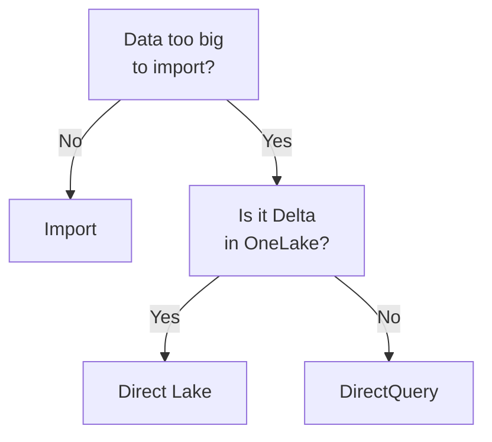

# Domain 3 — Implement and manage semantic models

Microsoft publishes this skill area at 25–30 percent of the exam, the same band as the governance domain. Twelve objective sub-bullets sit under two headings: designing and building semantic models, and optimizing them at enterprise scale.

One reframing makes the whole domain tractable, and it is worth reading twice. **Storage mode is a property of a table, not a setting on the model.** Almost everything else here — composite models, Direct Lake behaviour, the large model format — is a consequence of that one fact.

---

## What this domain actually asks

The first objective is design: pick a storage mode, build a star schema, wire up relationships including bridge tables and many-to-many, write calculations, use calculation groups, dynamic format strings and field parameters, configure the large storage format, and build composite models.

The second is optimization: improve queries and report visuals, improve calculation performance, configure Direct Lake including fallback and refresh, choose between the two Direct Lake flavours, and implement incremental refresh.

Read that list again and a pattern appears. Most of these features are answers to a scale problem. Direct Lake exists because the data is too big to import. Incremental refresh exists because refreshing everything takes too long. The large storage format exists because the model outgrew a limit. Composite models exist because one source was not enough. Calculation groups exist because twenty measures times six variants is a hundred and twenty measures.

So when a stem describes something that works fine at small scale and breaks at large scale, this domain holds the answer — and the question is usually which kind of "too big" you are looking at.

The other thing to notice is how much of this domain assumes the previous one. A semantic model is built on a shape that the data preparation domain produced, and several objectives here only make sense if that shape is a star. If the schema material felt abstract there, it becomes concrete here.

---

## Storage mode is a table property

A table's storage mode depends on its data source, and it controls whether Power BI holds that table's data in memory or queries the source when visuals load.

| Mode | Where the data is | Freshness |
|---|---|---|
| Import | Cached in the model | As of the last refresh |
| Direct Lake on OneLake | Scanned from Delta tables | Latest by default |
| Direct Lake on SQL | Scanned from Delta tables | Latest, with fallback |
| DirectQuery | Left at the source | Live at query time |
| Dual | Both, chosen per query | Depends which is used |
| Hybrid | Import plus a live partition | Historical plus live |
| On a semantic model | Queries the source model | As the source model |

Import stores a compressed snapshot in native storage for quick loading, and getting newer data means refreshing the model or table. DirectQuery keeps nothing in the model and queries the source as visuals load, translating the query into the source's native language — which is why DirectQuery performance is really source performance.

Dual is the interesting one, because it exists to solve a problem rather than to offer a choice. Relationships between DirectQuery and Import tables are limited, and switching a table from DirectQuery to Dual helps keep those relationships regular. If a stem describes a relationship behaving oddly across a mixed model, Dual is the cure.

Hybrid tables belong to incremental refresh: the latest partition of an Import table can be left in DirectQuery mode so the newest data is available between refreshes. That is the answer whenever a requirement wants historical scale and near-real-time recency at once.

Two more modes are easy to misread. DirectQuery on a semantic model is how you make a small change to somebody else's published model for one report. Queries run against the source model and measures from both are available. A few column properties, such as format strings and display names, can be overridden locally. And the mode you pick governs one table, so a model can mix several.

Two rules about the choice itself.

**It is close to irreversible.** For most tables, storage mode can only be set when the table is added. It can be changed afterwards only if the table is in DirectQuery mode or Direct Lake on OneLake. So the practical answer to "we chose wrong" is usually to re-add the table, and a stem describing an existing Import model is describing a decision already made.

**A composite model is simply a model with tables in more than one mode.** That follows directly from mode being a table property. There is nothing to switch on.

One more term to recognise without confusing it for a storage mode. A live connection report has no local semantic model and is sometimes called a thin report; the remote model it connects to can use any table storage mode, and measures the report author creates are stored in the report rather than in the model. The distinction matters because a thin report is often the right answer when the requirement is "reuse the sanctioned model without forking it" — and it is not a composite model, because nothing is being extended.

> **Currency note.** Two current Microsoft pages disagree here. The optimization guidance names three modes — Import, DirectQuery and Composite — while the storage mode reference names seven and treats composite as a property of a model rather than a table mode. The exam answer follows the reference page. Answer storage mode questions from the seven-mode list, and treat "there are three storage modes" as the stale statement it is.

<b>Self-check.</b> A model was built in Import mode a year ago. The data has grown past what the capacity can hold. Can you switch the tables to Direct Lake?

Not directly. Storage mode can only be changed after the fact for tables already in DirectQuery or Direct Lake on OneLake; an Import table cannot simply be flipped. The tables have to be re-added in the mode you want. That is why the choice is treated as a design decision rather than a tuning knob, and why a stem describing an existing Import model is usually steering you toward rebuild or toward the large storage format instead.

---

## Direct Lake, and when it stops being Direct Lake

Direct Lake is a table storage mode optimized for loading large volumes quickly into memory from Delta tables in OneLake. Once loaded, the model supports high-performance interactive analysis.

The reason it matters is a performance argument with a specific shape. Direct Lake and Import queries are both processed by the same in-memory engine, while DirectQuery federates each query out to the source. So Direct Lake and Import normally outperform DirectQuery when loading and interacting with visuals. Microsoft's own phrasing is that Direct Lake delivers query performance **comparable to Import mode**, without the refresh cycle that loads the whole data volume.

That is because a Direct Lake refresh is not a data load at all.

| Operation | Import refresh | Direct Lake refresh |
|---|---|---|
| What moves | The data | Metadata only |
| What it produces | An entire cached copy | Updated file references |
| Typical duration | Considerable | Seconds |
| Resource cost | Significant memory and processor | Low |

Microsoft calls the Direct Lake operation **framing** — the storage mode article calls the same thing reframing, and both spellings are current, so do not key on one word. It analyses the metadata of the latest version of the Delta tables and updates references to the latest files in OneLake.

By default Direct Lake on OneLake loads the latest data. To take manual control you turn off automatic sync in the scheduled refresh settings and refresh by hand.

Now the part the exam actually asks about. **Direct Lake on SQL falls back to DirectQuery in three stated cases:** when a view is used, when granular SQL access is enabled, and when a Direct Lake guardrail is reached. Those are the three cases Microsoft documents, and they are the substance of choosing between the two flavours. Learn them as the documented set rather than inventing a fourth: an option naming one of the three is defensible, and one naming a condition Microsoft does not list is not.

| Aspect | Direct Lake on OneLake | Direct Lake on SQL |
|---|---|---|
| Created from | The OneLake catalog | A SQL analytics endpoint |
| Documented fallback | Not listed | Three stated conditions |
| Mode changeable later | Yes | No |

Fallback is a performance event, never a security hole. A query that falls back still honours row-level security — the governance domain makes the same point from the other side, where a Direct Lake query against a warehouse deliberately falls back in order to obey a security policy.

Two more things worth carrying. Direct Lake suits models over large lakehouses and warehouses, and is especially useful where importing the whole volume is impractical or impossible. And it moves data preparation upstream into OneLake, where the full range of Fabric tooling can do it — which is exactly the boundary the data preparation domain describes from its own side.

That upstream shift has a practical consequence worth stating. If the model is Direct Lake, fixing a data problem means fixing it in the lakehouse or warehouse, not in the model. There is no import step in which to quietly correct something, so the discipline the preparation domain teaches about views and transformations stops being optional. Microsoft names Direct Lake as an ideal choice for the curated layer of a medallion architecture for exactly this reason: the model reads a shape somebody has already finished.

> **Currency note.** The objective's wording changed in July 2026 from "Direct Lake on SQL endpoints" to "Direct Lake on SQL analytics endpoint". The exam answer is unchanged, because the behaviour and the three fallback conditions are the same. Expect the current singular wording in the stem.

<b>Self-check.</b> A Direct Lake model was fast last month and is slow now. Nothing about the data volume changed, but a developer added a view. What happened?

If it is Direct Lake on SQL, adding a view is one of the three documented conditions that make queries fall back to DirectQuery mode. Nothing is broken and no security was bypassed — the model is simply federating queries to the source instead of scanning Delta files in memory. The fix is to remove the dependency on the view, or to accept the fallback knowingly.

---

## Relationships are filter conduits

A relationship is not a join and it does not enforce anything. **A model relationship propagates filters** applied on a column of one table to another, and filters keep propagating as long as there is a relationship path to follow, possibly across several tables.

Those paths are deterministic: filters always propagate the same way, without variation. They can be disabled, or have their filter context changed by particular calculation functions, which is the mechanism behind inactive relationships.

Three rules do most of the work.

**Relationships do not enforce data integrity.** Microsoft says so in an explicit callout. Anyone reasoning from foreign keys expects otherwise, which makes "add a relationship" a convincing wrong answer to a data quality problem. Orphaned keys are fixed upstream, in the preparation domain's territory.

**Multiple filters on a table combine with `AND`.** All conditions must be true. That single semantic explains most "why is this visual empty" questions.

**Filter the dimension, let it reach the fact.** Microsoft recommends star schema design principles and describes the common setup as rules that filter dimension tables, with relationships propagating those filters efficiently to fact tables. Direction of travel is the whole design.

| Property | Active relationship | Inactive relationship |
|---|---|---|
| Propagates filters | By default | Only when activated |
| How it is activated | Not needed | A calculation function |
| Typical use | The normal path | A second path between the same tables |

Microsoft recommends defining active relationships wherever possible, because they widen what report authors and natural-language question tools can do. The standard reason to make one inactive is a second relationship between the same pair of tables — a date dimension serving both an order date and a ship date, for instance. Only one relationship between a given pair can be active, which is what forces the second one into an inactive role rather than being a stylistic choice.

Bi-directional filtering deserves care. A bi-directional relationship filters in both directions, and Microsoft recommends minimizing it because it can hurt query performance and deliver confusing experiences for report users. It is not forbidden: three scenarios justify it — special model relationships, slicer options with data, and dimension-to-dimension analysis. Outside those, fix the model shape instead.

Then the objective's explicit mention: bridge tables and many-to-many. Microsoft describes three scenarios, and most candidates know only the first.

| Many-to-many scenario | What is being related |
|---|---|
| Two dimension tables | Customers and accounts, say |
| Two fact tables | Sales and targets |
| Higher-grain fact table | Facts coarser than the dimension |

The classic is the first: bank customers and bank accounts, where a customer can have several accounts and an account can have several customers.

Modelling that needs a third table, commonly called a bridging table, holding one row per association. And when that table contains nothing but identifier columns, it earns a name of its own: a factless fact table.

A last shape worth recognising. A table related to nothing else is a disconnected table, and it is not a mistake. It is not there to propagate filters; it accepts user input through a slicer so that calculations can use the chosen value. Currency conversion rates and what-if parameters are the standard cases, and a stem describing readers choosing a value that changes a calculation rather than filtering data is describing one.

<b>Self-check.</b> Sales has both an order date and a ship date, and the model has one date table. Reports need to slice by either. What do you build?

Two relationships from the date table to Sales, one active and one inactive, with calculations activating the inactive path when ship-date analysis is wanted. Two active relationships between the same pair of tables are not possible, and duplicating the date table is the answer people reach for that the objective is steering them away from — though a second date table is a legitimate design in other circumstances.

---

## Star schema, seen from the model

The preparation domain built the shape. What this domain adds is why the model wants it.

Star schema requires modelers to classify every model table as either a dimension or a fact. A fact table contains dimension key columns that relate to dimension tables, plus numeric measure columns. A dimension table contains a key column acting as a unique identifier plus other columns supporting filtering and grouping — and the most consistent table you will find in any star schema is a date dimension.

That classification is not bookkeeping. It is what lets filters flow the way the previous section described, and it is why Microsoft calls star schema a prerequisite for enterprise semantic models rather than a recommendation.

One boundary rule is worth memorising, because it decides where work belongs. Semantic models depend on Power Query to import or connect to data, so the source data must be transformed and prepared there — and that can be challenging with large volumes or with advanced patterns such as slowly changing dimensions. When you hit those, Microsoft's advice is to build a warehouse with a loading process first and connect the model to it.

That sentence is the clearest statement of the line between this domain and the data preparation one. Heavy preparation belongs upstream. The model consumes a shape that somebody else has already made.

In practice that means two things for an exam question. When a stem describes reshaping, deduplicating or slowly changing dimensions, the answer is usually a warehouse and a loading process, not a clever step in Power Query. And when a stem describes a model that is slow because its tables are the wrong shape, the fix is the schema rather than the storage mode. Swapping to Direct Lake will not rescue a design that makes the engine work harder than it should.

---

## Calculations that scale

Three features in objective 3.1 exist because writing calculations one at a time does not scale.

**Calculation groups** let you define formulas as calculation items that apply to existing measures, which significantly reduces the number of redundant measures you have to create. The scenario is combinatorial: twenty measures each needing the same six time variants is a hundred and twenty measures by hand, and twenty-six with a calculation group.

You add one by editing the semantic model, going to Model view and selecting the Calculation group button in the ribbon — a modelling object, in the view where the model is drawn.

There is a precondition with a reason behind it. Calculation items only apply to explicit measures — the ones defined in the model — and not to implicit measures, which appear when somebody drags a column onto a visual and lets it aggregate. That is why the discourage implicit measures property must be enabled before a calculation group can be created. The requirement is a consequence, not a formality.

When a calculation group is added, the summation symbol disappears from data columns and columns can no longer be dropped straight onto visuals as values. **Implicit measures already in existing visuals continue to work**, so adding a calculation group does not break published reports. That detail makes the scaremongering distractor wrong.

**Dynamic format strings** let a measure's formatting respond to context rather than being fixed, which matters when one measure serves several currencies or units. A separate DAX formula supplies the format string, and the format applied depends on the context the measure is evaluated in. They are listed in the same objective bullet as calculation groups and field parameters, and they belong there: all three exist so one definition can serve many situations instead of being copied.

The reason they exist is worth knowing on its own, because it is the trap. The obvious way to change how a measure displays is to wrap it in `FORMAT` — and `FORMAT` returns every result as a string, even for numeric data types, which breaks visuals such as charts that need a number to plot. **A dynamic format string keeps the measure's data type.** So the symptom to recognise is a measure that displays exactly as intended and then refuses to chart, and the fix is the format string rather than a second measure or a text column.

Scope is what separates them from calculation groups, and the two can be used together with the same DAX patterns. A calculation item's format string reaches the measures across the model; a dynamic format string set on a measure reaches that one measure only.

**Field parameters** let report readers change which measure or dimension a visual is analyzing, by selecting from a slicer. They move a decision from the author to the reader, which is why they reduce the number of near-identical report pages an organisation ends up maintaining.

| Feature | What it changes | Reach for it when |
|---|---|---|
| Calculation group | How a measure is computed | Many measures need the same variants |
| Field parameter | Which field is displayed | Readers should choose the subject |
| Dynamic format string | How a result is displayed | One measure, several formats |

The calculation group versus field parameter distinction is the one an exam item will test. Swapping the subject is a field parameter. Transforming the calculation is a calculation group. A stem describing users choosing between revenue and margin wants the first; one describing the same six time calculations across twenty measures wants the second.

<b>Self-check.</b> A modeller reports that the option to create a calculation group is prompting them to change a model property first. Why, and does it matter?

The discourage implicit measures property has to be enabled, because calculation items only apply to explicit measures. It matters in one visible way: afterwards, columns can no longer be dropped directly onto visuals as values and the summation symbol disappears. Implicit measures already present in existing visuals keep working, so nothing published breaks.

---

## The DAX the objective names

Objective 3.1 names specific functions, so it is worth knowing what each one is for rather than only recognising it.

**`VAR` stores a result and then stops changing.** It holds the value of an expression under a name you can pass to the rest of the expression, and once DAX has calculated that value it does not change, even where the variable is referenced further down. Three rules come with it, and all three surprise people:

| Rule | What it means in practice |
|---|---|
| Scope is the expression | A measure cannot refer to a variable declared in another measure |
| Inside is fine | It can refer to variables declared within itself, to measures, and to variables defined before it |
| Table variables are different | Their columns cannot be referenced with the `TableName[ColumnName]` syntax |

A variable's own expression may declare another variable inside it, so nesting is legal when a calculation genuinely has two stages.

**`CALCULATE` evaluates an expression in a modified filter context**, and `CALCULATETABLE` does the same job for an expression that returns a table. The filters you pass it can take three forms — a Boolean filter expression, a table filter expression, or a filter modification function — and where you pass more than one, they are evaluated with the logical `AND` operator. All the conditions must be met, which is the same rule two slicers on a page follow.

**`SUMX` is an iterator.** It returns the sum of an expression evaluated for each row in a table, which is what makes it the answer when the thing you need to add up does not exist as a column. Its first argument is a table, or an expression returning one; its second is a column of numbers, or an expression that evaluates to one. `SUM` adds a column that is already there; `SUMX` computes a value per row and then adds those.

**`WINDOW` and `OFFSET` position rows relative to the current one.** `WINDOW` returns multiple rows within a given interval, and `OFFSET` returns a single row positioned before or after the current row in the same table. The exception is worth carrying: `OFFSET` may return more than one row when the current row cannot be deduced to a single row, which is what happens on a visual whose rows are not grouped down far enough.

**`ISBLANK` checks whether a value is blank** and returns `TRUE` or `FALSE`. It tests; it does not substitute. Turning a blank into a zero is the surrounding expression's job.

<b>Self-check.</b> A measure declares a table variable and then tries to read one of its columns with the usual table-and-column syntax. It will not validate. What is wrong, and what else about variables is worth remembering here?

Columns in table variables cannot be referenced using the `TableName[ColumnName]` syntax, so that line cannot work however the variable is named. Two neighbouring rules matter for the rewrite: a measure can refer only to variables declared inside its own expression — never to one declared in another measure — and a variable's value is fixed once DAX has calculated it, so referencing it later in the same expression does not recompute it.

---

## When the model outgrows the default

A semantic model stores data in a highly compressed in-memory cache. **The default size limit is 1 GB.**

With Fabric capacities that limit lifts when the large semantic model storage format is enabled, after which the ceiling is the capacity size or whatever maximum the capacity administrator has set. The setting is required for a model to grow beyond 10 GB. It can be enabled on Fabric and Premium capacities, on Embedded, and on Premium Per User and Pro workspaces assigned to reserved capacity — but for those Pro workspaces the limit stays at 1 GB regardless.

Before reasoning from a source dataset's size, remember the compression. Microsoft says tenfold compression is possible, so it is reasonable to expect 10 GB of source data to compress to about 1 GB in the model, with a further 20 percent reduction when persisted to disk. A 10 GB source is therefore near the default limit, not past the 10 GB threshold — those are two very different amounts of data and confusing them is the trap.

Size is not the only reason to turn the setting on. Microsoft advises enabling it for anyone planning to use external tools for semantic model write operations, even for models nobody would call large. That connects straight back to the governance domain's endpoint material: a deployment scenario can key on this setting with no size limit in sight. It is the kind of non-obvious dependency exams like, because reasoning from the feature's name gets you the wrong answer.

**Composite models** answer a different kind of outgrowing: one source was not enough.

A composite model combines multiple source groups, where a source group is either imported data or a connection to a source queried live. That live source can be a relational database or another tabular model — a semantic model or an Analysis Services model. When a model connects to another model this way, it is called chaining.

Two boundaries define what counts.

| Situation | Composite model |
|---|---|
| Tables in more than one storage mode | Yes |
| At least one live source group | Required |
| Import tables from many sources | No |
| Connects to a model without extending it | No, that is a live connection |

That last row is Microsoft's own negative definition, and negative definitions make good exam questions: a model that connects to another model without adding data to it is explicitly not composite.

Chaining is worth taking seriously for a governance reason as well as a technical one. A model built on another model inherits that model's shape and its refresh behaviour, and it shows up in lineage as a dependency. That is exactly the situation the governance domain's impact analysis exists to make visible, before somebody changes the model underneath it.

<b>Self-check.</b> A source dataset is 9 GB. Does the model need the large semantic model storage format?

Probably not. At the tenfold compression Microsoft says is achievable, 9 GB of source lands near 0.9 GB in the model — inside the 1 GB default. The setting is required to exceed 10 GB of model size, which would be closer to 100 GB of source. Reasoning straight from source size to the setting skips the compression step, and that is the intended mistake.

---

## Making it fast

Optimization in Power BI happens at four architectural layers: the data sources, the data model, the visualizations including dashboards and reports, and the environment of capacities, gateways and network. Naming the layer a problem lives in is most of the diagnosis.

The objective names improving DAX performance as its own piece of work, and it is worth separating from diagnosis. Performance Analyzer tells you which visual is slow and hands you the query it generated; it does not make the measure faster. The rewrite is the other half, and the cheapest one to know is the variable. A formula that repeats an expression makes the engine evaluate that expression twice — a year-over-year measure that computes last year's sales once in the numerator and again in the denominator is doing the work twice for one number. Assign it to a `VAR` once and use the variable in both places. Microsoft documents variables as improving performance, reliability and readability together, so the same habit that makes a measure readable is the one that makes it quicker. You have met `VAR` already as a scope rule; this is the same keyword doing the job this objective actually names.

**Incremental refresh** is the headline mechanism for the refresh layer. It extends scheduled refresh with automated partition creation and management for tables that frequently load new and updated data — typically a fact table holding transaction data that changes often and grows. Dimension tables are small and stable and are usually refreshed whole.

The policy partitions the table and refreshes only the most recent Import partitions, optionally keeping a further live partition for real-time data. That optional partition is the hybrid table from the storage mode section, seen from the refresh side rather than the model side.

Three benefits, and it is worth knowing all three because the exam tends to key the less obvious ones:

| Benefit | Why it happens |
|---|---|
| Fewer refresh cycles needed | The live partition carries the newest data |
| Refreshes are faster | Only recently changed data is processed |
| Refreshes are more reliable | No long connections to volatile sources |

That third one is the answer whenever a stem describes refreshes that fail intermittently on a large table.

For report visuals and queries, two diagnostic tools cover different layers, and picking the wrong one is the mistake a good question punishes.

| Tool | What it inspects | Use it when |
|---|---|---|
| Performance Analyzer | Visuals and their queries | A report or visual is slow |
| Query Diagnostics | What Power Query is doing | Preview or apply is slow |

Performance Analyzer monitors report performance in Power BI Desktop and shows where the bottlenecks are. It is relevant when an Import refresh is slow, when live-connected reports are slow, or when model calculations are slow, and slow queries and visuals are where continued optimization should focus.

One stated limitation is worth memorising because Microsoft puts it in a callout: **Performance Analyzer cannot be used to monitor Premium Per User activities or capacity.** A stem that places the workload on Premium Per User has taken the obvious tool off the table.

Improving calculation performance is its own objective bullet, and the practical entry point is that every visual on a page issues a query. Reporting clients run those queries whenever a visual displays or a filter changes. Performance Analyzer can surface the generated query and run it in the query view, which turns a vague complaint about a slow page into a specific expression you can inspect and rewrite.

Two model-shape decisions from earlier in this domain are also performance decisions, and the exam treats them that way. Bi-directional filtering is discouraged partly because it can hurt query performance. And storage mode determines which engine answers a query at all: the same visual is fast against an in-memory table and dependent on the source against a live one. So a question about a slow report can be answered from the relationships section or the storage mode section as easily as from this one — which is why naming the layer first is worth the few seconds it takes.

<b>Self-check.</b> Reports on a Premium Per User workspace are slow and the team wants to find the offending visual. What do you tell them?

Performance Analyzer is not available for Premium Per User activities or capacity, so the usual first move is closed off. Diagnosis has to come from elsewhere — the capacity metrics available for that workspace, or reproducing the model in an environment where the analyzer does run. The point of the question is recognising the stated limitation rather than reaching for the familiar tool.

---

## Traps worth carrying into the exam

**"Storage mode is a setting on the model."** It is a property of each table. That is exactly why composite models exist.

**"A Direct Lake model always uses Direct Lake."** Direct Lake on SQL falls back to DirectQuery when a view is used, when granular SQL access is enabled, or when a guardrail is reached.

**"Refreshing a Direct Lake model reloads the data."** It copies metadata only, in seconds. Import refresh is the one that produces a full cached copy.

**"Relationships enforce referential integrity."** They propagate filters. They enforce nothing.

**"Adding a calculation group breaks existing reports."** Implicit measures already in visuals keep working.

**"The large storage format is only about size."** It is also advised for external-tool write operations, whatever the model's size.

**"A 10 GB source needs the large storage format."** Compression of the order Microsoft describes puts that near 1 GB in the model — at the default limit, not past the 10 GB threshold.

A closing thought that ties the domain together. Nearly every feature here is a response to scale, so when a stem describes a symptom, ask which scale broke: the data volume, the refresh window, the model size, or the number of measures. Each has its own answer, and the options will usually offer you one of each.
