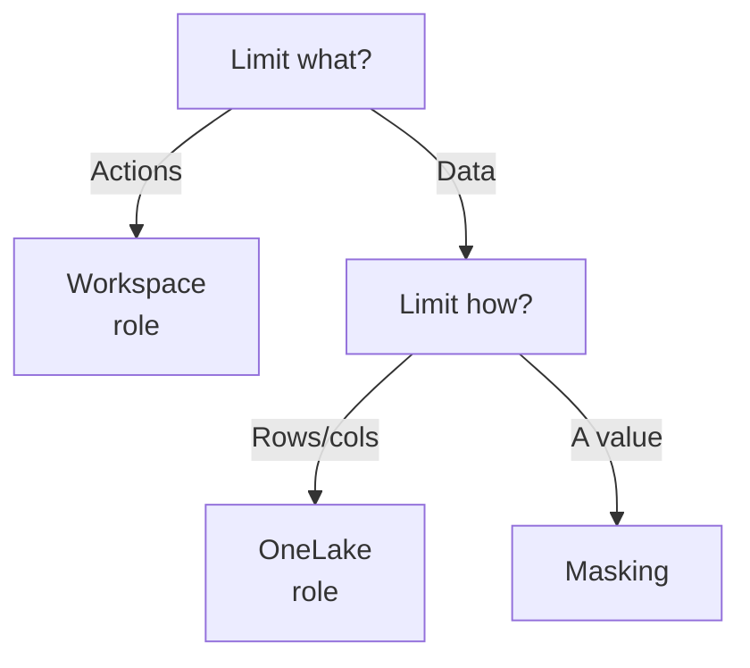
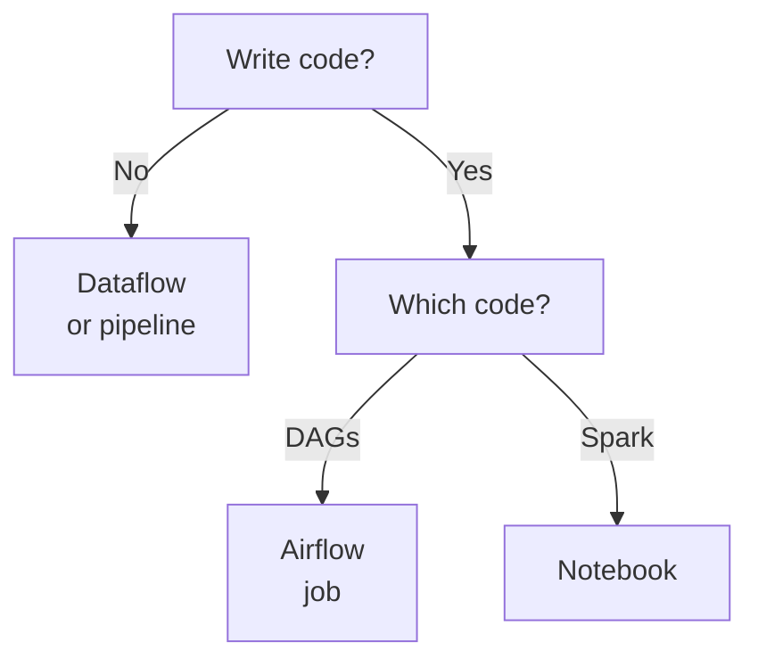

# Domain 1 — Implement and manage an analytics solution

Microsoft weights this skill area at 30–35% of the exam, the same as the other two. It is the
governance domain: who may do what, how change reaches production, and what starts a job. Almost
nothing here is about moving data. Almost everything is about the boundary between two things that
look similar and behave differently.

These notes do not follow the order the exam outline publishes. Security comes first, because the
workspace role model is the vocabulary the rest of the domain assumes. Connecting a workspace to a
repository is an Admin action, changing a Spark pool is an Admin action, setting a schedule is a
Contributor action, and none of those sentences mean anything until the roles exist. Orchestration
comes last, because choosing between a Dataflow, a pipeline and a notebook is the only decision here
that depends on all the others.

---

## What this domain actually asks

Three habits carry most of the marks.

**Ask which plane the question is on before you look at the options.** Fabric separates what you can
*do* to an item from what *data* you can see. Almost every access question in this domain is decided
by that split, and the wrong-plane answer is always among the options.

**Read the requirement sentence, not the scenario.** A stem that says the solution must use the
principle of least privilege, or must not duplicate data, or must not affect existing consumers, has
told you which option survives. Several of the others usually work.

**Prefer the mechanism Microsoft names for the job.** In real projects there is often more than one
defensible way. In the exam there is one keyed answer, and it is normally the purpose-built feature
rather than the clever reuse of a general one.

---

## Two planes, and everything follows from which one you are on

OneLake enforces security on two planes, and Microsoft's own summary is the shortest route into the
whole domain: to control what someone can do, use the control plane; to control which specific data
someone sees, use the data plane.

The **control plane** governs management actions on an item — creating it, configuring it, sharing
it, deleting it. You set it with workspace roles and with item sharing. The **data plane** governs
access to the data itself. You set it with OneLake security roles, defined on an item and scoped
down to folders, tables, schemas, rows and columns.

| | Control plane | Data plane |
|---|---|---|
| Governs | Management actions on items | Read and write on the data |
| Set with | Workspace roles, item sharing | OneLake security roles |
| Granularity | Item-level capabilities | Down to rows and columns |
| Mainly affects | Everyone in the workspace | Viewers and users with Read |

That last row is the one that catches people. Data plane controls mainly bite on Viewers and users
holding Read, because Admins, Members and Contributors already have data access through Write. In the
ordinary case you can tighten a OneLake role all you like and a Contributor still sees everything —
though there are documented exceptions, and the section on OneLake security names them.

The hierarchy the two planes apply to is worth holding in your head. Items always live within
workspaces, and workspaces always live directly under the OneLake namespace. So the levels run
OneLake, then workspace, then item, then folders and everything below them.

Read the left branch as workspace roles *and* item sharing, which is the next section but one.
The right branch is warehouse-only where it ends in masking.

---

## Workspace roles, and exactly where each one stops

A workspace grants access through one of four roles: Admin, Member, Contributor, or Viewer. You can
assign them to individuals, to security groups, to Microsoft 365 groups and to distribution lists.
Microsoft Entra ID service principals can hold them too, and inherit the same permissions as users
for API-based operations — the Items and Job Scheduler APIs. It is the API surface that inherits,
not the portal.

Two rules about assignment matter more than the role list.

**Highest permission wins.** Someone in several groups gets the highest level of permission any of
their assigned roles provides. Nesting groups does not dilute this. You achieve least privilege by
not granting the higher role, never by adding a lower one alongside it.

**The Viewer boundary is about the path to the data, not the data.** Two different questions get
confused here, and Microsoft answers them in two different places.

Ask whether a Viewer can read Lakehouse and Warehouse data with Transact-SQL (T-SQL) through the SQL
analytics endpoint, and the workspace roles table says yes. That is the permission called ReadData,
and all four roles hold it. Ask whether a Viewer can read data *in OneLake*, and the security
documentation says no — with a footnote saying Viewers can be given that access through OneLake
security roles. That is a different permission, ReadAll, reached through OneLake application
programming interfaces and Apache Spark, and only Admin, Member and Contributor hold it by default.

Both answers are correct. The path decides which one you are being asked about.

| Capability | Admin | Member | Contributor |
|---|---|---|---|
| Update or delete the workspace | Yes | No | No |
| Add or remove admins | Yes | No | No |
| Connect the workspace to a repository | Yes | No | No |
| Write or delete items, run them | Yes | Yes | Yes |

A Viewer holds none of those. What a Viewer does hold is the ReadData path above and the ability to
see existing schedules. No workspace write, no management permission, and no data access in OneLake
unless a role grants it.

So a scenario where an analyst must query a lakehouse with T-SQL is satisfied by Viewer. A scenario
where the same analyst must run a notebook against it is not, and the answer is a OneLake security
role rather than a bigger workspace role.

<b>Self-check — roles and planes</b>

1. A user is in two security groups, one granted Contributor and one granted Viewer. What can they
   do?
2. A Viewer must read a lakehouse table from a Spark notebook. Which of the two planes are you
   changing, and with what?
3. Which single workspace role can connect a workspace to a repository?

Answers: they get Contributor, because the highest permission wins. You are changing the data plane,
with a OneLake security role, because ReadAll is what a notebook needs. Admin only.

---

## Sharing one item without giving away the workspace

Item sharing exists for two situations: collaborating with someone who has no role in the workspace,
and granting extra permissions to someone who already has one.

The scope is exactly what a least-privilege requirement asks for. A user given access to a single
item by sharing cannot see the other items in the workspace and is not a member of any workspace
role. Item permissions grant access to connect to that item and to the endpoints they can reach
through it.

That makes the choice mechanical. If the requirement names one lakehouse, one warehouse or one
semantic model and says nothing about the rest, item sharing is the answer and a workspace role is
the over-grant.

---

## OneLake security: objects, columns and rows

Start with the rule that decides whether any of this section applies at all.

**OneLake security roles use a grant model.** They give access. They cannot deny access that has
already been granted through a different role or permission model, so Admin, Member and Contributor
retain their elevated access — Microsoft's own phrasing is that they are "not the primary target" of
OneLake security enforcement. In the ordinary case, if a stem asks you to stop a Contributor seeing a
column, the answer is not a row filter; it is to stop them being a Contributor.

Read Microsoft's hedge, though. "Primarily" and "not the primary target" are not "never", and the
documentation lists three exceptions of its own.

| Exception | What happens |
|---|---|
| Row-level security in user identity mode | Enforced for all users, Admin, Member and Contributor included |
| Shortcut-backed tables | Enforcement can deny those roles in specific cases |
| Security sync failure | Members of affected roles may find access restricted |

The first is the one that changes how you answer. **Row-level security configured in user identity
mode on a SQL analytics endpoint is enforced for everyone**, whatever their workspace role. So the
question a scenario is really asking is not which role the user holds but which mechanism is in
force — and that is decided by the endpoint's access mode, which the next section covers. Carry
"a Contributor is not bound by a OneLake role" as the ordinary case, never as a law.

Underneath that, OneLake security is deny-by-default: a user starts with no access to data unless a
role explicitly grants it. The exception is the **default role**, which Fabric creates automatically
with every new item and which applies only to Viewers, since the other three roles already have
elevated access through Write. A lakehouse, for example, gets a DefaultReader role that lets users
holding ReadAll see its data.

> **Trap.** Building a restricted role does not remove anyone from DefaultReader. Microsoft's own
> instruction is blunt: when you add a user to a OneLake security role, remove them from
> DefaultReader, or they keep full access to the data. Nothing errors, nothing is hidden, and the
> restricted role you carefully scoped does nothing — because the grant model means one role cannot
> deny what another role allows, and DefaultReader is another role. Check it before you add anyone
> to a restricted role.

Within a role you can refine access at three levels of granularity.

| Control | What it decides | Applies to |
|---|---|---|
| Object-level security (OLS) | Whether you see the table or folder at all | Tables, schemas, folders |
| Column-level security (CLS) | Which columns of that table you see | Tables |
| Row-level security (RLS) | Which rows come back | Tabular data only |

Object-level security covers tables and folders with one mechanism, because Delta Parquet tables in
OneLake are represented as folders and so are schemas. That is why the exam outline lists object-level
and folder-level security in the same breath. It also explains the limit on row-level security: rows
are a concept relevant only to tabular data, so RLS cannot be defined for non-table folders or
unstructured data. Files under a Files folder are secured by object-level security instead.

Three constraints are worth memorising because each one invalidates an otherwise sensible design.

- Row-level and column-level security may be combined, but only inside a **single** role. Combining
  one role carrying RLS with another carrying CLS is unsupported, and users hitting that combination
  get query errors.
- A role granting ReadWrite **cannot** contain row-level or column-level constraints at all.
- Column-level security behaves differently by engine. A `select *` against a table where you can see
  only some columns succeeds in a Spark notebook and returns the allowed columns, but returns an
  error through the SQL analytics endpoint and in semantic models.

Folder permissions move in two directions with different rules. Permissions granted on a folder
inherit downward to its files and subfolders. Traversal works upward and is navigational only: when a
user has permission on a child item, OneLake lets them list and traverse the parent folders so they
can reach it, and traversal does not grant access to sibling files or folders.

<b>Self-check — OneLake security</b>

1. You add a row-level rule to a OneLake security role under the ordinary grant model. Which users
   can that role restrict?
2. A SQL analytics endpoint is in user identity mode and row-level security is configured. Can a
   Contributor be subject to it?
3. You need a role that can write to a table and see only European rows. Can you build it?
4. A user runs `select *` and gets an error on one engine and a filtered result on another. What is
   configured?

Answers: Viewers and users holding Read — Admin, Member and Contributor keep broader access through
Write, so the role does not reduce it. Yes: user identity mode enforces row-level security for all
users, including those three roles, and this is the documented exception to the rule in question one.
No — a role granting ReadWrite cannot carry row-level or column-level constraints. Column-level
security, which errors through the SQL analytics endpoint and filters in a Spark notebook.

---

## Warehouse security is a different mechanism

A Fabric Warehouse and a SQL analytics endpoint have their own access control, and it is ordinary
T-SQL. Object-level security there is managed with the `GRANT`, `REVOKE` and `DENY` statements, and
users can be assigned to custom and built-in database roles.

### Which mechanism is actually in force

The two mechanisms are not parallel. On a SQL analytics endpoint the **access mode** decides which
one applies, and only one of them is in force at a time.

| | User identity mode | Delegated identity mode |
|---|---|---|
| Connects as | The signed-in user | The workspace or item owner |
| Tables governed by | OneLake security roles | SQL permissions |
| `GRANT` and `REVOKE` on tables | Not allowed | This is the mechanism |

Row-level security in T-SQL, custom database roles and dynamic data masking all live in delegated
identity mode. OneLake security roles live in user identity mode.

The default is the part worth remembering: **newly created SQL analytics endpoints start in delegated
identity mode**, and an Admin or Member must switch an endpoint to user identity mode once before
OneLake security applies to it at all. A team that builds careful OneLake security roles and then
queries through an untouched endpoint will find the roles are not being evaluated.

Two details separate a right-looking answer from the key.

**SQL permissions layer on top of Fabric permissions; they do not replace them.** A user must hold a
workspace role or the item Read permission before they can connect at all, and without at least Read
the connection fails. Granting `SELECT` to someone with no workspace access achieves nothing.
Microsoft's recommended order is to define the SQL permissions first, then grant the access that lets
the user in.

**You cannot run `CREATE USER` explicitly.** Running `GRANT` or `DENY` creates the database user
automatically, and that user still cannot connect until they have sufficient workspace-level rights.
This is the place where habit from SQL Server produces a confidently wrong answer.

**Dynamic data masking** is the other warehouse-only control, and it is a presentation control. It
limits exposure by masking values to non-privileged users, and the data in the database is not
changed — which is exactly why existing applications keep working without modification. A central
masking policy acts directly on the sensitive fields, privileged users can be designated to see
through it, and the masks are defined with ordinary T-SQL. Four types of mask are available.

| Mask | What it does |
|---|---|
| Default | Full masking, according to the field's data type |
| Email | Reveals the first letter and the domain suffix |
| Random | Substitutes a random value, for numeric types |
| Custom string | Reveals a chosen prefix and suffix, pads the middle |

Its limitation is the examinable part. Masking does not prevent a user connecting directly and
running exhaustive queries that expose pieces of the sensitive data, so Microsoft's own advice is to
use it together with column-level and row-level security rather than instead of them. Read a stem
carefully here: "the value must not be readable by support staff" is a masking requirement, while
"support staff must not see rows for other regions" is a row-level one, and "the column must not
appear at all" is column-level.

<b>Self-check — warehouse security</b>

1. You grant `SELECT` on a table to a colleague who has no workspace role. What happens?
2. What is the difference in outcome between masking a column and applying column-level security to
   it?

Answers: nothing useful — the connection fails, because item Read or a workspace role is needed
first. Masking returns the row with the value obscured; column-level security removes the column from
what the user can see, and can fail the query outright on some engines.

---

## Labels, endorsement and the audit trail

This part of the objective is governance rather than access: it is about what data is, who vouches
for it, and what was done to it.

**Sensitivity labels** come from Microsoft Purview Information Protection. Applying one to a Fabric
item needs a Power BI Pro or Premium Per User licence and edit permissions on the item — so labelling
is an edit action, not an administrator one, and a Contributor can do it.

The caveat matters more than the mechanism. Labels and the access control they carry travel with
exports to Excel, PDF and PowerPoint, and with Analyze in Excel. Microsoft states that access control
in all other scenarios is unsupported, naming cross-tenant sharing and other export paths such as CSV
and text files. A label is a strong control on the paths it covers and no control at all on the ones
it does not.

**Endorsement** marks quality. There are three badges, and the difference between them is authority
rather than quality.

| Badge | Who can apply it | What it can be applied to |
|---|---|---|
| Promoted | Any user with write permissions | Any item except Power BI dashboards |
| Certified | Only users a Fabric administrator specifies | Any item except Power BI dashboards |
| Master data | Only users a Fabric administrator specifies | Only items that contain data |

Promotion is self-service. Certification means an organisation-authorised reviewer has confirmed the
item meets the organisation's standards, and anyone else can only request it. Both certification and
master data have to be enabled by a Fabric administrator before they appear at all, and certification
enablement can be delegated to domain administrators so each business area has its own reviewers.

**Auditing** answers what happened. Reading the activity log requires the Fabric administrator role.
Most audit events show up within 30 minutes, and retrieval can lag by up to 60 — so a query run
immediately after an incident can legitimately return nothing, and that is not a fault.

Exporting is shaped by two limits. The activity events interface supports at most one day of data per
request, so a month is a loop over days. Within a day, a large result set comes back as several
thousand entries plus a continuation token that you pass back to fetch the next batch.

<b>Self-check — governance</b>

1. A Contributor wants to certify a semantic model they built. Can they?
2. A labelled report is exported to a CSV file. Is the label's protection still enforced?

Answers: no — they can promote it if they have write permissions, and can request certification, but
only administrator-specified users certify. No; CSV is named as an unsupported path.

---

## Workspace settings: compute, domains, Airflow and OneLake

Now that the roles exist, "Admin only" means something.

**Spark compute.** Every new workspace is created with a **starter pool** already associated with it,
sized behind the scenes from the capacity licence that was purchased. Starter pools are prehydrated
and medium-sized, which is why a session starts in roughly five to ten seconds. A **custom Spark
pool** lets you size nodes, autoscale and allocate executors for the job, at a session start nearer
three minutes.

Changing any Spark setting in a workspace requires the Admin role. Creating a custom pool needs one
thing more: the capacity admin must have enabled customised workspace pools in the capacity's Spark
compute settings. So a scenario where a workspace Admin cannot create the pool they need is usually a
capacity-level switch, not a role problem.

**Domains** group workspaces logically — by business area, usually — and support Fabric's federated
governance model, in which some governance controlled at tenant level is delegated to domain-level
control. Workspaces are associated with domains, and every item in an associated workspace picks up a
domain attribute in its metadata. You can create a subdomain under a domain to refine the grouping.

The trap is immediate and worth stating flatly: **domain assignment does not affect item visibility
or accessibility.** Discovery, visibility and access still depend on workspace role and item
permissions. Every user in the tenant can see every domain that exists, whatever their domain role.
Domains are for finding and governing content, not for hiding it.

Three roles govern domains, and they differ in reach rather than in kind.

| Role | Can create a domain | Sees |
|---|---|---|
| Fabric admin or higher | Yes | Every domain in the tenant |
| Domain admin | No | Only the domains they administer |
| Domain contributor | No | The domains they contribute to |

A Fabric admin creates and edits domains, names the domain admins and contributors, and associates
workspaces. A domain admin sees and edits only their own domains, where they can update the
description, define contributors, associate workspaces and override some tenant settings. That
override is the whole point of the model: it is federated governance in practice rather than in
principle, and endorsement is the worked example — certification enablement can be handed to domain
administrators so each business area certifies its own content.

**Apache Airflow jobs** are the newest thing in this objective, and they replaced Dataflow Gen2
workspace settings in the current exam outline. An Apache Airflow job is the next generation of Azure
Data Factory's Workflow Orchestration Manager. It is a managed service for building and running
Python-based Directed Acyclic Graphs (DAGs), and Microsoft's framing is plain: take it if you like
Airflow or prefer writing code, and take pipelines if you would rather not.

> **Currency note.** Fabric Apache Airflow jobs do not currently support private networks or virtual
> networks. **This does not change the exam answer** to a question about choosing Airflow over
> pipelines, which turns on code versus no code. Pick on that basis unless the stem names a network
> requirement.

**Airflow pools** are the settings half of that bullet, and they are where a good memory can hurt
you. An **Airflow starter pool** uses small nodes and shuts down automatically after a period of
inactivity, so you pay nothing while it sleeps and you wait for it while it wakes. An
**Airflow custom pool** stays on, so jobs start right away, and that is the production choice.

Read that against the Spark pools above and the collision is plain. For **Spark**, the starter pool
is the fast one and the custom pool is the slow one to start. For **Airflow**, it is the other way
round. Same adjective, opposite trade. When a stem says "starter pool", settle which product it is
talking about before you reach for a number.

**The OneLake tab** is the last of the four settings bullets, and it is easy to miss because OneLake
is otherwise a security topic. Open workspace settings, go to the **OneLake settings tab**, and two
controls live there.

The first is **diagnostics**. Turning on *Add diagnostic events to a lakehouse* streams data access
events as JSON logs into a lakehouse you choose in the same capacity. It needs two permissions on two
different objects: workspace admin on the workspace, and contributor on the destination lakehouse.
Being workspace admin is not enough on its own, and that is the half people forget.

The second is the **shortcut cache**. When OneLake reads a file through an external shortcut it can
keep a copy for the workspace, so later reads are served from the cache rather than the remote
provider — which is what reduces cross-cloud egress cost. You set a retention period in days, within
a bounded range, and a file nobody reads inside that period is purged. Learn that retention is a
workspace setting with a ceiling rather than the two ends of the range.

---

## Getting changes into production

Two mechanisms, and the exam separates them constantly. **Git integration is version control.
Deployment pipelines are promotion.** Microsoft's own documentation sends you from one to the other
in a single line. A team with only deployment pipelines has environments and no history.

### Version control

Before anything else, the organisation's administrator must enable Git integration at the tenant.
Then the workspace roles decide what happens.

| Operation | Who |
|---|---|
| Connect, sync or disconnect the workspace | Admin |
| Switch branch | Admin always; Contributor only when the workspace setting allows it |
| Commit and update | Contributor with write on all items, plus ownership where required |
| Anything at all | Not a Viewer |

A Viewer can take no action and does not even see Git information in the workspace. Committing and
updating need three things together, not any one of them: Contributor with write permission on all
items, ownership of the item where a tenant switch blocks non-owners, and build permission on
external dependencies where they apply.

One provider difference is examinable. If the workspace and an Azure repository sit in different
regions, the tenant admin must enable **cross-geo export**. That restriction does not apply to
GitHub.

### Promotion

Deployment pipelines give creators somewhere to develop and test content in the service before users
see it, and move that content between stages. **Deployment rules** change content as it moves, and
the rule is defined in the stage the content is going *to*, not the one it comes from. Define the
rule in production, and content deployed from test inherits the value.

| Rule type | Typical use |
|---|---|
| Data source rule | Point a semantic model at the production database |
| Parameter rule | Set a stage-specific parameter value |
| Default lakehouse rule | Point a promoted notebook at the production lakehouse |

A data source rule only works when the new source is the same type as the old one, which quietly
invalidates a plausible design.

### Schema as code

A **database project** holds a warehouse's schema objects outside the portal, in Visual Studio Code,
where it is built and validated before being published back to the warehouse. That build step is the
point: schema errors surface before deployment rather than after. You need Visual Studio Code, the
.NET software development kit, and two extensions — SQL Database Projects and SQL Server — plus
Contributor or higher on the warehouse item.

> **Currency note.** Fabric warehouse database projects carry a preview notice. **This does not
> change the exam answer.** The guide's own policy admits preview features where they are commonly
> used, and this one is named by an objective. Pick the database project when the requirement is a
> source-controlled schema definition.

<b>Self-check — lifecycle</b>

1. A Contributor needs to connect the workspace to a repository. What do you tell them?
2. Where do you define the rule that points a promoted notebook at the production lakehouse?
3. A team commits from Fabric to an Azure repository in another region and it fails. What is missing?

Answers: they cannot — connect, sync and disconnect are Admin only. In the production stage, as a
default lakehouse rule. Cross-geo export has not been enabled at the tenant.

---

## Orchestration: which engine, and what starts it

### Choosing the engine

The exam objective asks you to choose between a Dataflow Gen2, a pipeline and a notebook. Microsoft's
own decision guide is wider: it compares copy activity, Copy job, Dataflow Gen2, Eventstream and
Spark, and writes the third of those as "Dataflow Gen 2" in its column heading. Read the two extra
entries as mechanisms that sit inside or beside the objective's three rather than as equal
alternatives — copy activity and Copy job are how a pipeline moves data, and Eventstream belongs to
streaming rather than to this decision. The comparison that decides most questions is skills and
interface, not capability, because several of them handle low to high data volumes.

Dataflow Gen2 is developed in Power Query and reaches 150-plus source connectors, where the pipeline
copy activity and Copy job each reach 50-plus. Spark — the notebook and the Spark job definition — is
the one option the guide describes as code rather than no code or low code, and it expects Scala,
Python, Spark SQL or R.

### What starts the job

The **job scheduler** runs an item at times you specify. Setting up or modifying a schedule needs at
least Contributor in the workspace or Write on the item; a Viewer can see existing schedules but
cannot change them.

The floor is the useful figure.

| Recurrence | Range |
|---|---|
| Minute-based | Every 1 to 720 minutes |
| Hourly | Every 1 to 72 hours |
| Daily | Up to 10 times per day |
| Weekly | Up to 10 times per week, on chosen weekdays |

Anything that must happen faster than a minute, or in response to something rather than at a time, is
not a scheduling problem. The scheduler also skips a run outright when the configured time is not
valid, so a schedule with an end time before its start time simply never fires.

Two limits explain a class of failure. Fabric caps each item at 100 concurrent jobs and fails
anything submitted beyond that, counting a job as active from starting through queueing to running.
And a schedule expires if its owner does not sign in to Fabric for 90 consecutive days — so a
pipeline can stop running with nothing about the pipeline having changed.

**Activator** covers the other half of the objective. Its rules start jobs on Fabric items when a
condition is met: running a pipeline or dataflow when new files land in an Azure storage account,
running a notebook when a data quality issue appears in a report. If the requirement names a clock it
is a schedule; if it names something happening, it is a rule.

### Parameters and dynamic expressions

A **parameter** passes an external value into a pipeline and keeps that value for the whole run,
which is what lets one pipeline be reused with different inputs. A **dynamic expression** is
evaluated as the pipeline runs. Expressions are introduced with `@`, can sit anywhere in a string
value, and always return a string. A literal string that has to begin with `@` is escaped by doubling
it to `@@`.

<b>Self-check — orchestration</b>

1. Data must be loaded within seconds of a file arriving. Schedule or Activator rule?
2. A scheduled pipeline stopped running last week and nobody edited it. What would you check first?
3. What does a parameter's value do partway through a pipeline run?

Answers: an Activator rule — the scheduler's floor is one minute and this is event-driven. Whether
the schedule's owner has signed in to Fabric in the last 90 days. Nothing; it stays the same for the
whole run.

---

## Traps worth carrying into the exam

> **Trap.** A OneLake security role usually hides nothing from a Contributor, because the grant model
> cannot take back access another model already gave. But row-level security in user identity mode is
> enforced for Admin, Member and Contributor too. The portable rule: work out which mechanism is in
> force before you reason about the role, and never assume the workspace role alone decides whether
> a filter applies.

> **Trap.** Domains do not restrict access. The portable rule: if a requirement is about who can see
> data, the answer is never a domain.

> **Trap.** Two group memberships give the higher role, not the lower. The portable rule: in Fabric
> you subtract privilege by removing a grant, never by adding a restriction beside it.

> **Trap.** `CREATE USER` does not run in a Fabric warehouse; `GRANT` creates the user for you. The
> portable rule: when an option looks like ordinary SQL Server administration, check whether Fabric
> does it implicitly.

> **Trap.** A pipeline that stopped running may have an expired schedule rather than a broken
> definition. The portable rule: before debugging the item, check whether anything about the item
> actually changed.

> **Trap.** A restricted OneLake security role changes nothing while the user is still in
> DefaultReader, and a OneLake security role changes nothing on a SQL analytics endpoint still in
> delegated identity mode. The portable rule: when a control appears to have no effect, look for the
> broader grant or the mode that is overriding it rather than for a mistake in the control.

---

*Checked against Microsoft's documentation on 10 September 2026, for the skills-measured version
dated 21 July 2026. Fabric ships monthly and licence names, published limits and engine behaviour all
move; where the live documentation and this page disagree, the documentation is newer.*
