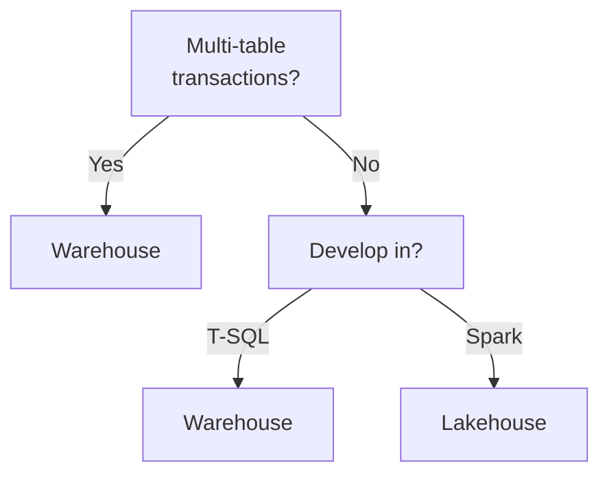
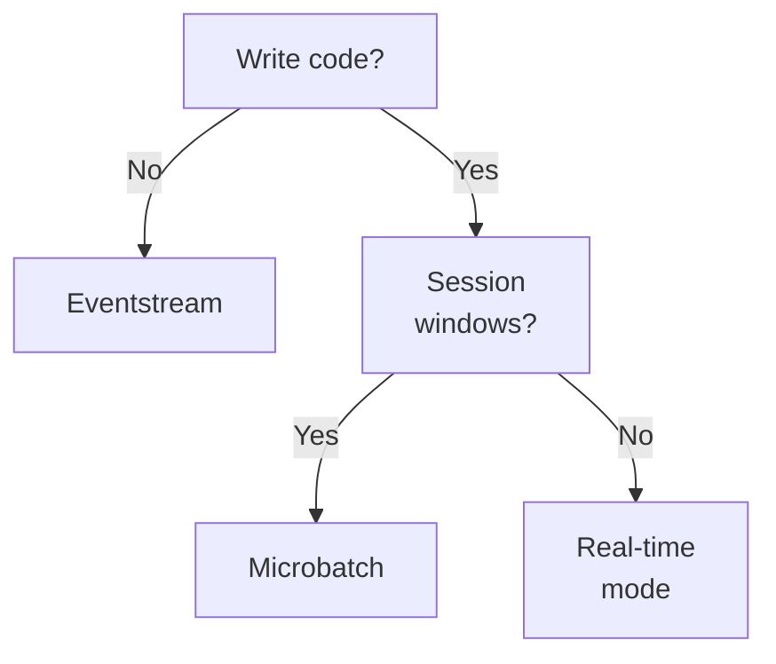

# Domain 2 — Ingest and transform data

Microsoft weights this skill area at 30–35% of the exam, the same as the other two. It is the
engineering domain: how data arrives, what shape it takes when it lands, and which engine does the
work. It is also where the exam puts code on the screen — Transact-SQL (T-SQL), PySpark and Kusto
Query Language (KQL) all appear here, and the objectives name all three.

These notes do not follow the guide's order. **Where the data lives comes first**, because every
other decision is downstream of it: a shortcut, a mirror and a pipeline are three answers to a
question about a store, and the streaming engines differ mainly in which store they can write to.
Loading patterns then follow the two ways data arrives — by reference and by copy. Streaming is
last, because it depends on everything before it.

---

## What this domain actually asks

**Read the requirement, then ask what it forbids.** "Must not duplicate the data" rules out a copy.
"Must survive a deleted row" rules out a watermark. "The team writes no code" rules out a notebook.
Most questions here have two or three options that work and one that satisfies the sentence.

**The source usually decides, not you.** Whether an incremental load can use change data capture is
a property of the source database. Whether real-time mode is available is a property of the sink.
Look at what the scenario already has before you look at the options.

**Know which layer a mechanism belongs to.** Change data capture and change data feed sound alike
and sit at opposite ends of the pipeline. A shortcut in a Kusto Query Language database and OneLake
availability point in opposite directions. Getting the layer right eliminates half the options
before you read them properly.

---

## Where the data should live

Fabric offers two enterprise-scale, open-standard-format storage workloads: the **Warehouse** and
the **Lakehouse**. Both store data in OneLake in open Delta format, so **the file format decides
nothing**. Microsoft's own decision guide turns on three questions.

| Question | Answer | Store |
|---|---|---|
| How do you want to develop? | Spark | Lakehouse |
| How do you want to develop? | T-SQL | Warehouse |
| Do you need multi-table transactions? | Yes | Warehouse |
| What type of data? | Unstructured, or don't know | Lakehouse |

The multi-table transactions row is the sharpest, because it is a capability rather than a
preference. The Warehouse provides full multi-table transactional guarantees through the SQL engine;
the Lakehouse does not. Notice too that the guide treats **not knowing the shape of the data** as a
reason to choose the Lakehouse — an unusually candid thing for a vendor to publish, and a useful
heuristic when a stem describes an exploratory workload.

The Warehouse is also the "no knobs" option: no configuration of compute or storage. The Lakehouse
stores and analyses structured and unstructured data in one place.



---

## Getting data in without copying it

A **OneLake shortcut** is an object in OneLake that points at another storage location, internal or
external. It behaves like a symbolic link: the location it points at is the target path, the place
it appears is the shortcut path, and the shortcut is an independent object from its target.

That independence is asymmetric, and the asymmetry is examinable. **Deleting the shortcut leaves the
target untouched. Moving, renaming or deleting the target can break the shortcut.** Damage runs one
way only, which is what makes a shortcut a low-risk way to expose somebody else's data.

Shortcuts eliminate edge copies and stay synchronised with the source, including automatic schema
updates for shortcut tables — new and existing. So a requirement that says the data must not be
duplicated has already chosen a shortcut.

Two structural rules matter.

| Where | Rule |
|---|---|
| Lakehouse, Tables folder | Top level only; no shortcuts in subdirectories |
| Lakehouse, Files folder | Any level, but no table discovery happens |
| Item types | Lakehouses and Kusto Query Language databases only |

The last row rules out a plausible wrong answer: you cannot create a shortcut in a Warehouse.

> **Trap.** The Delta format does not support tables with a space in the name, and OneLake does not
> recognise a shortcut whose name contains a space as a Delta table in the lakehouse. The shortcut
> is created, the folder appears, nothing errors — and no table shows up. If a shortcut "worked" but
> produced no table, read the name first.

<details>
<summary><b>Self-check — stores and shortcuts</b></summary>

1. A team develops in Spark, has structured and unstructured data, and needs no multi-table
   transactions. Which store?
2. You need to expose an Amazon Simple Storage Service bucket in a lakehouse without duplicating it.
   Where in the lakehouse can the shortcut go?
3. Someone deletes a shortcut by accident. What happened to the source data?

Answers: Lakehouse, on all three counts. The Files folder at any level, or the Tables folder only at
the top level — and only the Tables folder gives table discovery. Nothing; the shortcut is an
independent object and the target is unaffected.

</details>

---

## Bringing a whole database or catalog across

**Mirroring** makes an external database or catalog available in Fabric under managed
synchronisation. You enable it by creating a secure connection to the source and choosing whether to
bring across a whole database or named tables. It is a managed capability: you do not build and
operate a traditional ETL pipeline for the synchronisation itself, and no compute is separately
allocated to it. For database and open mirroring, what lands is converted to Parquet in an
analytics-ready format, so nothing has to be reshaped before it is queried — metadata mirroring
moves no data at all, so nothing lands for it to convert.

**What mirroring does to the data depends on the source**, and this is the part worth getting right.
Fabric has three approaches.

| Approach | What it does |
|---|---|
| Database mirroring | Replicates entire databases and tables into OneLake |
| Metadata mirroring | Synchronises catalog names, schemas and tables; references data in place |
| Open mirroring | An application writes its own change data into a mirrored item |

Metadata mirroring **does not replicate data**. It relies on OneLake shortcuts to reference the
source in place, so its latency reflects source access time and shortcut performance rather than
replication speed. Mirroring an Azure Databricks Unity Catalog is the worked example: no data
movement and no replication, only the catalog structure mirrored, with the underlying data reached
through shortcuts. Because it rests on shortcuts, metadata mirroring also supports cross-tenant
sharing — live governed data from another tenant, without copies and without pipelines.

So the shortcut-versus-mirroring line is not "reference against copy".

| | Shortcut | Mirroring |
|---|---|---|
| What it brings across | Selected data, by path | A whole database or catalog |
| Copies the underlying data | No | Depends on the approach |
| Stays current | By reference | By replication or by reference |
| Reach for it when | Exposing one folder or table | An external database must become analysable |

**Pipelines** are the third route, and the one to reach for when the arrival needs orchestrating
rather than just connecting: pipelines build workflows, can execute SQL scripts and stored
procedures, and are what a scheduled ETL process is built from. A shortcut and a mirror are both
standing arrangements — you set them up once and they keep themselves current. A pipeline is a job
that runs, which is why it is the answer whenever the requirement involves steps in an order,
conditional logic, or anything that has to happen *around* the data movement rather than to it.

Three routes, one question:

| If the requirement says | Reach for |
|---|---|
| Expose one folder or table without moving it | A OneLake shortcut |
| An external database or catalog must become analysable, with no pipeline to build | Mirroring |
| Steps must run in order, or on a schedule, or conditionally | A pipeline |

---

## Full loads, incremental loads, and what the source decides

A full load re-reads everything. An **incremental** load reads only what changed — and which
incremental method is available is decided by the source, not by preference.

| Method | When it applies | Handles deletes |
|---|---|---|
| Change data capture | Source database has it enabled | Yes |
| **Watermark-based** incremental copy | Source does not | No |

A Copy job detects which source tables have change data capture enabled and lets the method be
chosen **per table**, not per job. There is a documented limit on that, and it is the kind of
detail an exam question is built from: **select tables that have change data capture alongside
tables that do not, and the job treats every one of them as watermark-based.** So a mixed
selection does not run both methods — it quietly drops to the weaker one, and the tables that
could have tracked deletes stop doing so.

The discriminator is deletes. Change data capture replicates inserts, updates and deletes exactly.
A watermark compares an incremental column such as a timestamp or an identifier against the last
run, so a row that has been deleted simply stops appearing at the source and is never deleted
downstream. If a stem mentions removed records having to propagate, a watermark cannot be the
answer.

The write side maps to dimensional patterns: the update method chosen corresponds to the **slowly
changing dimension** patterns, with type 1 applied as a merge.

**Change data feed** is a different thing that sounds the same. Change data capture is a property of
the *source system* a Copy job reads from. Change data feed is a property of a *Delta table already
in OneLake*, recording row-level changes as insert, update or delete events so a downstream consumer
can read only what changed since a tracked version or timestamp.

> **Trap.** Enabling change data feed does not backfill. Delta writes change information only for
> write operations after the feature is turned on, so a pipeline built on it cannot recover anything
> that happened before. The feed exists and is simply empty, which is a silent failure.

<details>
<summary><b>Self-check — incremental loads</b></summary>

1. A source has no change tracking and rows are never deleted. Which incremental method?
2. Where does change data capture sit relative to change data feed?
3. You enable change data feed today and ask for last month's changes. What comes back?

Answers: watermark-based incremental copy, comparing an incremental column against the last run.
Change data capture is at the source system; change data feed is on a Delta table already in
OneLake. Nothing — change information is written only for operations after the feature was enabled.

</details>

---

## Loading a dimensional model

Loading a dimensional model is an Extract, Transform and Load (ETL) process that stages source data,
synchronises dimension data, inserts fact rows, and records auditing data and errors. The auditing
half is the one designs leave out. Microsoft puts this process at an estimated 60 to 80 percent of
a data warehouse development effort, which is worth knowing when it is
budgeted as an afterthought.

**Order is the answer.** The documented sequence is: optional staging, then dimension tables, then
fact tables, then optional post-processing such as refreshing a dependent semantic model. Fact rows
carry dimension keys, so a fact load that runs first cannot resolve them.

Microsoft's guidance on shape is blunt: dimension tables "should be denormalized". Denormalisation
stores precomputed redundant data, typically by flattening hierarchies — a product dimension
carrying its subcategory and category attributes directly rather than joining out to them. Because
dimensions are small compared with fact tables, the storage cost is almost always outweighed by
query performance and usability.

The exception is a **snowflake dimension**, which is normalised and spreads the dimension across
several related tables.

| Concept | What it is |
|---|---|
| Denormalised dimension | Flattened hierarchy, redundant data, the default |
| Snowflake dimension | Normalised across related tables, the exception |
| Slowly changing dimension | How historical change is stored |
| Inferred member | A dimension row the fact load inserted |

That last row carries a genuinely good distinction. A dimension row inserted by a fact load process
is an **inferred member** — the fact arrived before its dimension did. When the real details turn
up, they are treated as *late arriving dimension details*, not as a slowly changing dimension
change: the attributes are updated in place and the inferred member flag is set to false. Treating
them as a dimension change would write a history row for something that never happened. The same
update means two different things depending only on how the row got there.

One dimension can support type 1 and type 2 changes together; they are not exclusive.

<details>
<summary><b>Self-check — dimensional loading</b></summary>

1. Staging, facts, dimensions, semantic model refresh. What is wrong with that order?
2. A dimension row's attributes change. When is that not a slowly changing dimension change?
3. Why are dimension tables denormalised when the same redundancy would be unacceptable in a fact
   table?

Answers: dimensions must load before facts, because fact rows carry dimension keys. When the row is
an inferred member — the change is late arriving detail, so update in place and clear the flag. The
argument is about size: dimensions are small, so the redundancy is cheap and buys query performance.

</details>

---

## Choosing a transformation engine

The objective asks you to choose between Dataflows Gen2, notebooks, Kusto Query Language and T-SQL.
The axis is the same one that ran through domain 1: **who is meant to build it**, plus where the
data already lives.

| Engine | Built in | Reach for it when |
|---|---|---|
| Dataflow Gen2 | Power Query | Low-code work, many sources, analyst-shaped team |
| Notebook | PySpark or Spark SQL | Complex logic, unstructured data, Spark team |
| T-SQL | The Warehouse | The data is already in a Warehouse |
| Kusto Query Language | An Eventhouse | The data is telemetry in a Kusto database |

Dataflows combine data from multiple sources, transform it and load it to a destination, and they
are built in Power Query — which is their whole identity. If a stem names Power Query, or a team
with no code skills, the answer is a dataflow.

The two engine choices that look like preferences and are not: T-SQL and Kusto Query Language are
each tied to a store. You do not choose Kusto Query Language for a lakehouse table.

---

## Streaming: which engine

The same code-or-no-code split decides the streaming engine.

An **Eventstream** brings real-time events into Fabric, transforms them and sends them to
destinations **without writing any code**. You add sources, optionally add transformations, and send
to supported destinations — the transform step being optional means pure routing is a legitimate
use. Source connectors include Azure Event Hubs, Azure Event Grid, Azure Service Bus and Azure IoT
Hub, plus a custom endpoint that applications or Kafka clients reach with a connection string.
Eventstreams also expose Apache Kafka endpoints, so an existing producer can send events without
being rewritten.

**Spark structured streaming** is a code-based streaming query, with triggers and output modes.
Stateful queries add a state store and checkpoints; a stateless one needs neither. Choose it for
logic an eventstream cannot express.



<details>
<summary><b>Self-check — engines</b></summary>

1. An existing Kafka producer must send events to Fabric with no change to the producer. What do you
   use?
2. A team of analysts must transform data from twelve sources with no code. Which engine?

Answers: an eventstream, which exposes Kafka endpoints — or its custom endpoint if the producer is
an application. A Dataflow Gen2, built in Power Query.

</details>

---

## Structured streaming: triggers, state and windows

Structured streaming runs a query as a series of incremental executions. **Triggers control when
data is processed; output modes control what rows are written to the sink.** They are orthogonal and
are used together. Fabric supports three trigger types.

| Trigger | Behaviour |
|---|---|
| Processing time | Continuous microbatches, as fast as possible or at a fixed interval |
| Available now | Processes what exists at start, then stops |
| Real-time mode | Low-latency long-running batches, restricted support |

A processing-time interval of `"0 seconds"` starts each microbatch as soon as the last finishes —
**and omitting the trigger does the same thing**. That is the lowest latency standard microbatch
execution sustains, and its cost is many small writes when input is sparse. A fixed interval batches
events into larger writes.

**Available now** processes everything present when the query starts and stops. Reusing one
checkpoint across scheduled runs gives incremental, stateful processing without a long-running
application — offset tracking, deduplication state and aggregation state all come free. Microsoft
prefers it over the legacy once trigger, because it can split a backlog across several microbatches
and advance the watermark after each one.

```python
(events.writeStream
    .option("checkpointLocation", checkpoint_path)
    .trigger(availableNow=True)
    .toTable("silver_events"))
```

### State

Stateless operations — `map`, `filter`, `select` — process each row independently. Stateful
operations — aggregations, joins, deduplication — remember information across microbatches, so only
the second kind needs state management at all. Checkpointing persists query progress and that state
for recovery.

A **watermark is not required by every stateful operation.** Microsoft names three things that keep
state size bounded — watermarks, time to live, and carefully chosen keys — and they do not work the
same way. Keys decide how much state accumulates in the first place, by deciding how many distinct
things Spark is tracking. Watermarks and time to live are what actually **remove** state that is no
longer needed. A watermark does that by fixing how late an event may arrive and still be counted,
which is why it belongs to windowing and deduplication in particular.

The checkpoint tracks offsets, query progress and state store data, and a restart against the same
checkpoint location reloads state and resumes from the last committed progress. Point a query at a
new checkpoint and it silently reprocesses from the beginning. Checkpoints must be durable and must
not be shared between queries, and because the state schema and query plan are checkpointed, a major
change to stateful logic often needs a new one.

State grows with every key, window and buffered join row, which is what the three tools above are
for. Left unbounded, the checkpoint grows without limit.

Where state runs to millions of keys, the store holding it becomes the bottleneck. RocksDB is the
alternative provider, selected through the `spark.sql.streaming.stateStore.providerClass` Spark
configuration property — and it has to be set **before the query's first run**, because the store
is not something a later restart can swap.

### Windows

Windowed aggregations group events by **event time**, not processing time. Three shapes:

```python
# tumbling — fixed size, no overlap
.withWatermark("event_time", "10 minutes")
.groupBy(F.window("event_time", "5 minutes"))

# sliding — a third argument is the slide interval
F.window("event_time", "10 minutes", "1 minute")

# session — a different function, closing after a gap
F.session_window("event_time", "15 minutes")
```

**Two arguments is tumbling, three is sliding.** A session window is a different function
altogether, grouping events that arrive close together for one key. Note the ordering in the chain:
the watermark is declared before the grouping.

Real-time mode does not support **session** windows — the documented remedy is to run the query on a
microbatch trigger — and it supports neither Delta and lakehouse tables nor file-based formats as
source or sink. Any requirement naming a lakehouse table has ruled real-time mode out before the
window type is even considered.

| Operation | Real-time mode |
|---|---|
| Stateless work: select, filter, cast | Supported, and the preferred path |
| Aggregations, tumbling or sliding windows | Supported, with a watermark to bound state |
| Deduplication within a watermark | Supported |
| Session windows | Not supported — use a microbatch trigger |

### Duplicates, missing values and late arrivals

Three problems the objective names together, and structured streaming answers all three with the
same machinery.

**Late arrivals** are what event-time windowing exists for. Because a window groups by event time
rather than processing time, an event that arrives ten minutes late still lands in the window it
belongs to — as long as the watermark has not yet closed that window. The watermark duration is
therefore a deliberate statement of how late an event may be and still be counted.

**Duplicates** are handled by deduplication within a watermark, which is a stateful operation: Spark
remembers the keys it has already seen, and the watermark is what stops that memory growing without
limit. Choosing keys that identify a logical event, rather than a physical delivery, is the part
that needs thought.

**Missing values** are ordinary transformation and data-quality work — `fillna`, `dropna`, or a join
against a reference set. Nothing streaming-specific about them.

Do not confuse that with an **inferred member**, which is a dimensional-loading pattern and a
different problem entirely: there the value is not missing from a row, the whole dimension row is
missing because a fact arrived before its details did. One is a null in a column; the other is an
absent row in another table.

<details>
<summary><b>Self-check — structured streaming</b></summary>

1. What does omitting `.trigger(...)` do?
2. A query must aggregate into fifteen-minute session windows and write to a lakehouse table. Can
   real-time mode do it?
3. What is the difference between `F.window("t", "10 minutes")` and
   `F.window("t", "10 minutes", "1 minute")`?

Answers: the same as a processing-time interval of zero seconds — continuous microbatches, each
starting as the previous finishes. No, twice over: real-time mode supports neither session windows
nor lakehouse tables as a sink. The first is a tumbling window, the second a sliding window with a
one-minute slide interval.

</details>

---

## Real-Time Intelligence: three ways to reach the same data

An Eventhouse can reach data three ways, and the objective asks you to choose between them.

| Route | What it is | Cost |
|---|---|---|
| Native table | Data ingested into the Eventhouse | Ingestion to manage |
| OneLake shortcut | A reference, queried with `external_table()` | Slower queries |
| Accelerated shortcut | A shortcut with a caching policy | Storage and solid-state |

A **OneLake shortcut** in a Kusto Query Language database queries data in internal Fabric items and
external storage without moving it, appearing under Shortcuts and queried as an external table
through the `external_table()` function. If a query in a stem calls it, the data is a shortcut and
not a native table. Two small limits rule out plausible answers: these shortcuts cannot be renamed,
and only one can be created at a time.

Queries over shortcuts can be slower than over ingested data — network calls to storage, no indexes.
**Query acceleration** is the middle route: a policy on an external delta table naming how many days
to cache, controlled by the **Hot** property. It gives performance comparable to ingestion without
managing an ingestion pipeline or keeping duplicate copies.

> **Currency note.** Accelerated external tables add to storage cost and solid-state consumption,
> support neither materialized views nor update policies, cannot exceed 900 columns, and do not
> cache Parquet files above 6 GB compressed. **This does not change the exam answer** to a question
> about when to accelerate, which turns on cost against query speed. Do not reject acceleration
> because of a column ceiling the scenario will never reach.

**OneLake availability** points the other way. Turning it on creates a logical copy of the Kusto
database's own data in Delta Lake format, so other Fabric engines can read it — Direct Lake mode in
Power BI, the Warehouse, the Lakehouse, notebooks. A shortcut is an inbound reference; OneLake
availability is outbound exposure. Candidates reverse these.

<details>
<summary><b>Self-check — Real-Time Intelligence</b></summary>

1. A KQL query calls `external_table()`. What does that tell you about the data?
2. Power BI must read Eventhouse data in Direct Lake mode. Shortcut or OneLake availability?

Answers: it is a shortcut, not ingested data — so expect slower queries unless acceleration is on.
OneLake availability, which exposes the database's own data outward as Delta.

</details>

---

## Traps worth carrying into the exam

> **Trap.** Change data feed records nothing from before it was enabled. The portable rule: a
> feature that starts recording when you switch it on cannot answer questions about the past.

> **Trap.** A shortcut with a space in its name never becomes a table. The portable rule: when
> something is created successfully and simply does not appear, suspect a naming rule before a
> permissions one.

> **Trap.** Updating an inferred member is late arriving detail, not a dimension change. The
> portable rule: how a row got there decides how a change to it is handled.

> **Trap.** Real-time mode cannot write to a lakehouse table. The portable rule: check what the sink
> supports before choosing the trigger.

> **Trap.** Mirroring does not always copy. The portable rule: identify the source type first —
> database mirroring replicates, metadata mirroring references through shortcuts, and open mirroring
> has the application push. "Reference against copy" separates a shortcut from *database* mirroring
> and nothing else.

> **Currency note.** Real-time mode's supported sources, sinks and operators are tied to the Spark
> runtime version and are narrower than standard microbatch execution. **This does not change the
> exam answer** to a question about which trigger fits a requirement — the reasoning above holds —
> but check the live documentation before treating any single entry in that support matrix as
> permanent.

---

*Checked against Microsoft's documentation on 10 September 2026, for the skills-measured version
dated 21 July 2026. Fabric ships monthly and published limits move; where the live documentation and
this page disagree, the documentation is newer.*
