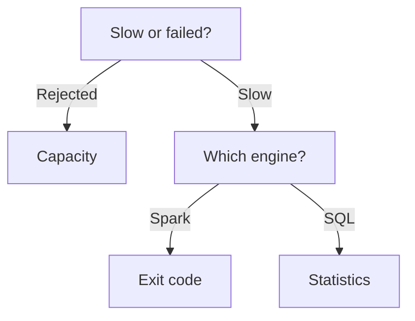
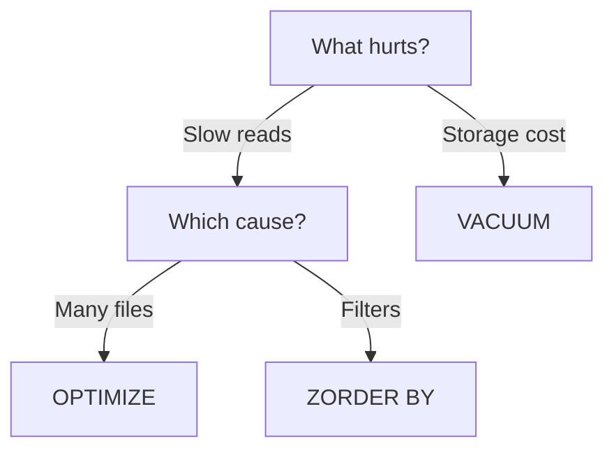

# Domain 3 — Monitor and optimize an analytics solution

Microsoft weights this skill area at 30–35% of the exam, the same as the other two. It is the
diagnosis domain: something is slow, something failed, and you have to say what to change. Many
questions give you a symptom and ask you to identify the cause, the surface that would show it, or
the corrective action — and others simply ask you to choose the right monitoring or optimisation
mechanism for a requirement.

These notes keep monitoring first but then put **capacity** before the per-item error paths, because
capacity is the cause that masquerades as every other symptom. A slow notebook, a queued pipeline and
a rejected submission can all be one overloaded capacity, and a candidate who does not know the
throttling stages will spend the question debugging the item. Optimisation comes last and is
organised by *what is being optimised* — files, then queries, then aggregations — rather than by the
guide's per-product list, because the same few mechanisms recur across products.

---

## What this domain actually asks

**Separate the symptom from the cause.** Microsoft says of one Spark error that it is "always a
symptom, not the root cause", and that instruction generalises. A failure count, a queue, a slow
query: each is a signal pointing somewhere else. The option that fixes the signal is nearly always
wrong.

**Check the capacity before the item.** Throttling is applied at the capacity level and its
behaviour is stage-based, so the same job can run fine, run slowly, or be rejected outright
depending on nothing but recent consumption elsewhere.

**Know which tool answers which layer.** Job execution is the monitoring hub. Query execution is
query insights. Executor failure is the Spark interface. Reaching for the wrong surface is how a
question gets lost before the options are read.



---

## Where to look

Two surfaces, two layers.

| | Monitoring hub | Query insights |
|---|---|---|
| Layer | Job execution across items | SQL query execution |
| Scope | Items you have permission to view | Warehouse or SQL analytics endpoint |
| History | 30 days | 30 days |
| Answers | Did it run, where did it fail | Which query was slow, and why |

The **monitoring hub** is Fabric's centralised view of job execution health, progress and outcomes.
Any Fabric user can open it, but sees only activities for items they have permission to view — so a
colleague who cannot find a failed run has an item-permission problem rather than a monitoring one.
It answers whether a job is running, succeeded or failed, where it failed and with what error
details, whether it has failed before in the last 30 days, and which scheduled items have failure
notifications configured.

**Query insights** holds 30 days of historic query data for a Warehouse or SQL analytics endpoint.
Two boundaries matter. It covers queries run in a user's context only — system queries are not
stored — and complete query text is visible to the Admin, Member and Contributor roles, so a Viewer
sees the insight without the text. Its aggregations group by **query shape**, which is why two
queries differing only in a literal value are reported as one. For the health of the warehouse
itself rather than of a query, the `sql_pool_insights` view gives pool-level metrics and pressure
indicators.

---

## Watching the things that run

A **Dataflow Gen2 refresh** runs on demand or on a schedule, and the schedule allows at most 48 runs
a day — a floor of half an hour, much coarser than the one-minute floor of the job scheduler. Do not
confuse that with the separate cap on how many refreshes a dataflow may actually perform in a rolling
day, which counts on-demand and publish-triggered runs as well and sits far above 48. The one a
cadence question turns on is the schedule ceiling. It is
also stricter about who: the user who triggers a refresh needs **Member or higher** on the workspace
plus access to every connection the dataflow uses, so a Contributor who can edit the dataflow may
still be unable to refresh it.

Two things start a refresh without anyone scheduling or clicking one: a successful publish, and a
pipeline containing a dataflow activity. That explains most unexplained runs in a refresh history.

One rule explains most unexplained slowness. **If even one query in a dataflow is configured to use
a gateway, every query in that dataflow uses that gateway for data movement.** A single on-premises
source therefore drags the whole dataflow through it, and nothing in the other queries shows why.

A refresh can be cancelled mid-run, and Microsoft frames cancellation as a capacity remedy — stop a
refresh during peak time, or when a capacity is nearing its limits. Which is the next section but
one.

### Semantic model refresh

Refreshes have their own admin surface. The **refresh summary** page shows a capacity's refresh
history, exports it, and exists to investigate refresh errors and work out a sensible refresh
schedule for the Power BI items on that capacity. It has two tabs and they differ in width.

| Tab | Shows |
|---|---|
| Schedule | Refreshes for one capacity, chosen from a dropdown |
| History | Refreshes across every capacity you administer |

Both are capacity-scoped admin surfaces, which is what separates them from the per-item refresh
history an item's owner sees.

### Configuring alerts

Four routes, and they watch different things. Choosing the wrong one is a common way to answer a
monitoring question incorrectly while naming a real feature.

| Route | Watches | Set up |
|---|---|---|
| Outlook or Teams activity | One activity's outcome | As an activity in the pipeline |
| Pipeline-level alert | The run outcome | On the pipeline |
| Failure notifications | Scheduled run failures | Under the pipeline's Schedule settings |
| Activator rule | The data itself | As a rule on an object |

The activity-level route is the one that surprises people: the alert *is* an activity, an Outlook or
Teams step placed after whatever you want to know about. **Failure notifications** email named users
or groups when a **scheduled** run fails — so a manually triggered failure sends nothing, which is a
good distractor.

An **Activator rule** is different in kind. It watches the data rather than the job, evaluating
conditions continuously on objects. Rules can be simple comparisons, or stateful expressions such as
`BECOMES`, `DECREASES`, `INCREASES` and `EXIT RANGE`, or the *absence* of data as a heartbeat.
"Tell me when the load fails" is a notification. "Tell me when nothing has arrived by nine" is a
rule, and none of the first three routes can answer it.

<details>
<summary><b>Self-check — where to look</b></summary>

1. A colleague says a pipeline run is missing from the monitoring hub. What do you check?
2. A Viewer can see that a query was slow but not what it was. Is that a fault?
3. A dataflow refresh is slow and none of its queries look expensive. What would you check first?

Answers: their permission on the item — the hub shows only items you may view. No; complete query
text is available to Admin, Member and Contributor. Whether any one query uses a gateway, because
that forces every query in the dataflow through it.

</details>

---

## Capacity is the cause that looks like everything else

Throttling happens when operations consume more **capacity unit** seconds than the capacity licence
allows. Fabric applies it **at the capacity level**, so one capacity can be degraded while others run
normally — which is why moving a workspace to another capacity is a legitimate remedy.

Two features exist so that ordinary spikes do not cause it.

- **Bursting** lets an operation temporarily use more compute than the capacity licence provides, so
  a large job finishes fast on a small capacity.
- **Smoothing** averages that consumption over a longer window, so the burst does not immediately
  trigger throttling. Interactive operations are smoothed over five to 64 minutes; background
  operations over 24 hours.

The 24-hour window is why every scheduled job can start at once without spiking — and also why a
capacity can be throttled today by work that finished yesterday.

The accounting underneath is finer than either window suggests. Fabric divides time into
**timepoints of 30 seconds**, which puts 2,880 of them in the next 24 hours, and smoothing
spreads an operation's consumed capacity units across those future timepoints rather than
charging them where the work happened. That is the mechanism to picture when you are trying to
predict whether a particular load will tip a capacity over.

> **Currency note.** Fabric does **not** support bursting and smoothing when a capacity admin has
> enabled Autoscale Billing for Spark. In that mode Spark usage is pay-as-you-go and neither concept
> applies. If a scenario mentions autoscale billing, the mechanism this section describes is switched
> off.

### The stages

Throttling is progressive, and the order is the part worth memorising.

| Usage borrowed | Stage | What happens |
|---|---|---|
| Up to 10 minutes | Overage protection | Nothing; the job runs |
| 10 to 60 minutes | Interactive delay | User-requested jobs delayed 20 seconds |
| 60 minutes to 24 hours | Interactive rejection | User jobs rejected; background jobs still run |
| Over 24 hours | Background rejection | Everything rejected |

**Interactive work degrades first and background work survives longest**, by design, so that data
refreshes keep running while a capacity recovers. Most people assume the opposite.

That table is the default experience, not a universal rule, and the same page lists workloads that
behave differently. An **eventstream** is not rejected — an operation that is meant to run for years
gains nothing from being refused, so Fabric starves it instead, reducing the capacity units keeping
the stream open until the capacity recovers. **Real-Time Intelligence** skips the delay stage
altogether, because a product whose name promises real time cannot answer by pausing, and it is
throttled only once the rejection phase is reached. Learn the two shapes rather than a list: a
stream is starved, and real-time work is never merely slowed.

> **Currency note.** Microsoft states on that page that it might change or update the throttling
> policy. **This does not change the exam answer.** The order of the stages is what a question turns
> on; treat the minute figures as current rather than permanent.

### When Spark jobs queue

A queued or rejected Spark job has three possible causes, with three different remedies.

| Cause | What it means |
|---|---|
| Maximum compute limits | The capacity licence, or the autoscale ceiling |
| Capacity saturation | Active jobs in *your* workspace |
| Capacity contention | Other workspaces on the same capacity |

Contention is the one people miss, because it is invisible from the workspace-level view — Fabric
provides a capacity-level view precisely for it. And a submission that hits the compute limit comes
back as `HTTP 429 Too many requests`, which is the most recognisable symptom in the domain: that
response has already told you the problem is capacity and not code.

<details>
<summary><b>Self-check — capacity</b></summary>

1. Interactive queries are being rejected but the overnight pipelines still run. Which stage?
2. A notebook submission returns `HTTP 429`. Where is the problem?
3. A capacity admin enabled autoscale billing for Spark. What stops applying?

Answers: interactive rejection — between 60 minutes and 24 hours of borrowed capacity. In the
capacity, not the notebook: it has hit a maximum compute limit. Bursting and smoothing both stop
applying; Spark usage becomes pay-as-you-go.

</details>

---

## Reading a Spark failure

A `MaxExecutorFailures` error means Spark aborted the application because too many executor processes
crashed. Microsoft is explicit that this is **always a symptom, not the root cause** — so an option
that raises the failure threshold is answering the wrong question.

The diagnosis is the executor exit code, read from the Executors tab of the Spark interface.

| Exit code | Meaning | Most likely cause |
|---|---|---|
| `137` | Killed by the operating system | Container exceeded its memory limit |
| `143` | Terminated | Timeout, preemption, node decommission |
| `134` | Aborted | Java virtual machine crash |
| `1` | General error | User code exception or misconfiguration |

`137` is the one to recognise. It means the data an executor processed exceeded its heap and overhead
together. Microsoft names six common triggers, and each has a different fix — so the exit code
narrows the question rather than answering it.

| Trigger | What it means |
|---|---|
| Data skew | One partition holds far more rows than the others |
| Large partitions | Every partition is too big for the executor |
| Excessive caching | Cached data is competing with working memory |
| Broadcast join against a large table | The "small" side is not small |
| Python user-defined functions | Serialisation overhead per row |
| Insufficient disk for shuffle spill | Nowhere to put what will not fit in memory |

Skew and the oversized broadcast are the two an exam scenario is most likely to describe, because
both look like a working design until the data grows.

One failure has no exit code and no bad data behind it. An
`INCONSISTENT_BEHAVIOR_CROSS_VERSION` error means the same code and the same data now behave
differently after a **runtime version change** — different results, new failures, or degraded
performance. Fabric runtimes pin their components, so moving between them moves the Apache Spark
version underneath the notebook. This is the domain 1 workspace Spark setting surfacing here: an
administrator changed the pool or the runtime, and the notebook is where it showed up.

<details>
<summary><b>Self-check — Spark failures</b></summary>

1. A job fails with `MaxExecutorFailures`. What is your next step?
2. Executors are exiting with `137`. What class of fix are you looking for?
3. A notebook that ran last month now returns different numbers, unchanged. What do you suspect?

Answers: read the exit codes on the Executors tab — the error itself is a symptom. Memory: reduce
what an executor holds, whether by fixing skew, shrinking partitions, caching less, or avoiding a
large broadcast join. A runtime version change under the workspace.

</details>

---

## Optimising files

Delta table files fragment over time. Fragmentation increases file-operation overhead, reduces
compression efficiency and can limit reader parallelism — which is the answer to "the table got
slower and nobody changed it".

Four operations, and they are not alternatives to one another.

| Operation | What it does | Reach for it when |
|---|---|---|
| `OPTIMIZE` | Rewrites small files into right-sized ones | Reads have slowed as the table grew |
| `ZORDER BY` | Colocates similar values in the same files | Queries filter on two or more columns |
| V-Order | Reorganises the Parquet file's internals | Reads are heavy and writes can pay 15 percent |
| `VACUUM` | Deletes unreferenced files past retention | Storage cost, never query speed |



**OPTIMIZE** is the primary compaction operation: it groups small files into bins targeting an ideal
file size and rewrites them. In Spark SQL it is one statement; through the Delta table interface it
is a call.

```sql
OPTIMIZE dbo.table_name
```

```python
from delta.tables import *
deltaTable = DeltaTable.forName(spark, "dbo.table_name")
deltaTable.optimize().executeCompaction()
```

**ZORDER BY** is a clause on the same command. It rewrites active files so rows with similar values
are colocated, which improves file skipping for selective filters. Use it when queries frequently
filter on two or more columns together and those predicates are selective enough to matter.

```sql
OPTIMIZE dbo.table_name ZORDER BY (order_date, customer_id)
```

OPTIMIZE is idempotent, but an oversized `minFileSize` increases write amplification: with the
threshold at 1 GB, a 900 MB file can be rewritten after a small extra write, again and again. Tuning
it upward to get bigger files can make the maintenance job the cost.

### V-Order

**V-Order** is a write-time optimization of the Parquet file's internals — row-group distribution,
encoding, compression — improving read efficiency across Fabric engines. Its typical cost is around
15 percent longer writes. It is a trade, not a free win: read-heavy dashboarding benefits, a
write-heavy ingestion pipeline pays for nothing.

Files stay open-source Parquet compliant, V-Order works at file level, and compaction, vacuum and
time travel all work alongside it. It is compatible with Z-Order, which is the point most often
missed — the two solve different problems.

| | V-Order | Z-Order |
|---|---|---|
| Rearranges | The file's internals | Which rows share a file |
| Applied | At write time | By OPTIMIZE |
| Helps | Read efficiency generally | File skipping on selective filters |

> **Currency note.** V-Order is **disabled by default for all newly created workspaces**, to favour
> write-heavy data engineering. Older material says the opposite, and much of it is still in
> circulation. Answer what the current documentation says. A candidate who remembers the old default
> will mark the right option wrong.

It can be switched on at three scopes: for a session with `spark.sql.parquet.vorder.default`, for a
table with the `delta.parquet.vorder.enabled` table property, or for a single write with the
`parquet.vorder.enabled` writer option.

```python
df.write.mode("overwrite") \
  .option("parquet.vorder.enabled","true") \
  .saveAsTable("myschema.mytable")
```

### VACUUM

**VACUUM** permanently removes data files that are both no longer referenced by the Delta log **and**
older than the retention threshold. Both conditions, not either — which is why a vacuum can appear to
free nothing.

Two things about it are examinable. It **does not improve query performance** the way compaction or
file-layout optimization does; its purpose is storage cleanup. And because it deletes permanently
from OneLake, it removes the ability to time travel to the versions whose files it cleaned, so
retention is a design decision rather than a housekeeping setting.

It is a Spark command, and **must not be run in the SQL analytics endpoint or the warehouse SQL
editor** — those experiences do not support Spark Delta maintenance commands. It runs in notebooks,
Spark job definitions, or the Lakehouse Maintenance interface and pipeline-based maintenance
workflows. The Maintenance interface is the answer whenever a stem says the team writes no code.

<details>
<summary><b>Self-check — file optimisation</b></summary>

1. Queries against a streaming sink have slowed steadily. Which operation, and why?
2. A team runs VACUUM weekly and query times have not improved. What did they expect wrongly?
3. Where can you not run VACUUM?

Answers: OPTIMIZE — frequent small writes fragment the table, and compaction rewrites the small files
into right-sized ones. That VACUUM speeds up reads; it is storage cleanup and Microsoft says so
outright. In the SQL analytics endpoint or the warehouse SQL editor.

</details>

---

## Optimising queries

In a Warehouse, the usual answer to a slow query is **statistics**. Statistics are objects describing
the data that let the query optimizer estimate how much work each candidate plan would take, so it
can choose the cheapest. When they are stale, the optimizer costs plans against data that no longer
exists and picks badly — which is the mechanism behind "the query got slow and nothing changed".

Fabric offers two paths, and an option claiming statistics must be created by hand is wrong.

| Path | Who maintains them |
|---|---|
| Automatic statistics | The engine, at query time |
| User-defined statistics | You, with data definition language |

Manual statistics are managed with `CREATE STATISTICS`, `UPDATE STATISTICS` and `DROP STATISTICS`,
and inspected with `DBCC SHOW_STATISTICS`. They are worth the effort on columns heavily used in the
query workload — specifically in `GROUP BY`, `ORDER BY`, filters and joins — and worth refreshing
after data changes that significantly alter row count or distribution.

<details>
<summary><b>Self-check — query optimisation</b></summary>

1. A warehouse query that was fast last quarter is now slow, and the query is unchanged. First
   suspicion?
2. On which columns is manual statistics maintenance worth the effort?

Answers: stale statistics, so the optimizer is costing plans against a data distribution that has
moved. Those used in `GROUP BY`, `ORDER BY`, filters and joins.

</details>

---

## Optimising aggregations

In an Eventhouse, a repeated expensive aggregation is answered by a **materialized view** — an
aggregation query over a source table or over another materialized view, representing a single
summarize statement, created with the `.create materialized-view` command in Kusto Query Language.

Choose the creation mode deliberately; they trade in opposite directions.

| Creation mode | Available | Contains |
|---|---|---|
| Empty | Immediately | Only records ingested after creation |
| Over existing records | After a build that can take a long while | Everything in the source table |

So an empty view suits a stream you are about to start aggregating, and a backfilled one suits a
table you already have and cannot afford to query repeatedly. Precomputing is the Eventhouse
counterpart to compaction on the lakehouse side: rather than rearranging the data so the query is
cheaper, you run the query once and keep the answer.

---

## Traps worth carrying into the exam

> **Trap.** V-Order is disabled by default in new workspaces. The portable rule: when a default has
> changed recently, the confident answer is the outdated one.

> **Trap.** VACUUM does not speed up queries. The portable rule: match the operation to the symptom
> — compaction for slow reads, vacuum for storage cost.

> **Trap.** `MaxExecutorFailures` is a symptom. The portable rule: when an error reports that
> something failed too many times, the question is why it failed once.

> **Trap.** Interactive work is throttled before background work. The portable rule: the refresh
> keeps running while the user-facing query is rejected, which is the opposite of what the complaint
> will tell you.

---

*Checked against Microsoft's documentation on 10 September 2026, for the skills-measured version
dated 21 July 2026. Fabric ships monthly and published limits, defaults and runtime versions all
move; where the live documentation and this page disagree, the documentation is newer.*
